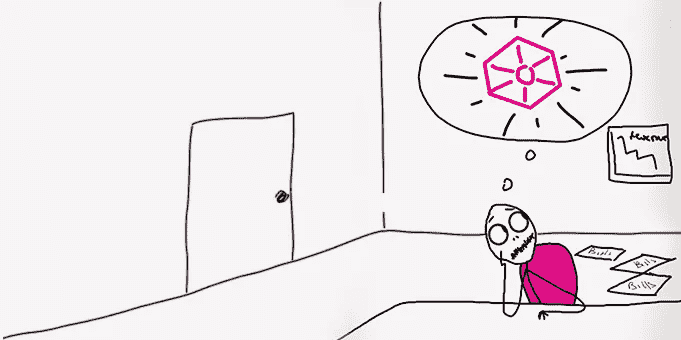

# 真正的品牌价值&分享它意味着什么

> 原文：<https://medium.datadriveninvestor.com/real-brand-value-what-it-means-to-share-it-7ed6ef7787e0?source=collection_archive---------7----------------------->

As business owners, we should all be seeking to become red beryls to our clients!

曾经有一个年轻人遇见了一位美丽的年轻女子，并爱上了她。但是在新婚之夜，这个年轻人发现他的岳父对他开了一个邪恶的玩笑，让他娶了他未来新娘的姐姐。

经询问，作出了新的安排。在一个遥远的地方为他工作了 7 年零 7 天之后，他就可以自由地娶她了。自然地，因为他对她的爱，这个年轻人为他一生的爱等待了大约 14 年零一周。

**实值的两个特征**
R+W=B

你以前可能听说过或使用过“像稀有的宝石”这个短语，用来表达有价值的东西是多么稀少。据了解，有价值的东西被认为是有价值的，通过这一点，我们能够将**真正的价值**与**稀有的东西**联系起来。这就是为什么有人可以投入时间，怀着更大的期望等待一个特定的机会，不管它需要多长时间。这种行为是每一个盈利品牌的核心。

背后的科学是，我们的大脑倾向于把更大的价值放在我们不能立即得到的东西上；使可能导致实际成就的过程更加值得。这种策略在商业界的术语叫做供给和需求。一个人越不容易接近我们，我们就越需要他的时间。这些是帮助我们对碧昂斯这样的人或苹果这样的企业在我们心目中的价值进行实际定位的活动部分。

**品牌价值**

所有品牌都努力让自己有一些值得注意的地方，这样他们才能在市场上脱颖而出。不这样做，会让你对客户来说显得没什么特别的，普通的，一般的。大多数顾客买东西是为了获得一种体验，感觉自己属于精英阶层，拥有别人没有的东西。这也解释了定价。当我们来到这里，只有非常认真的客户才会真正投资。

因此，如果你的价值与让你的品牌脱颖而出的因素有关，那么当我们分享我们品牌的价值时，这难道不是有意义的吗？这将是让我们在行业中与众不同的东西。一些服务企业无法成功做到这一点的原因是，他们没有花时间将他们的**价值**从他们的客户需要他们的**情况**中分离出来。

我见过一些人把分享价值的对话简化为可以使用的方法，但从来没有真正说出品牌的价值是什么。如果我能在谷歌上找到它，它不能算作你品牌的真正价值。

没有它你什么都不是！

当潜在客户发现你的业务没有任何价值可提供给他们，或者没有他们可以轻易找到的差异化因素时，你可以告别推荐，因为价值是创建可推荐品牌的必要组成部分。万一你真的提供了什么东西，如果你的烟枪只是由溢价构成的，那就很难推销了。你还能如何解释以 300 美元的价格提供价值 30，000 美元的东西？

好消息是，这一切都可以通过专注的品牌和清晰的信息来避免。有时候，最简单的事情也能改变一切。我的一位客户在她的品牌中获得了金牌，当时我能够清楚地找出她在行业中最具颠覆性的地方。由于这个关键时刻，她明白了许多事情。现在，我经常在电话中醒来，因为这个启示，她的信息传递变得更加有效。这几乎在一夜之间让她的主打产品变得更有吸引力。

能够用自己喜欢做的事情来帮助别人做他们喜欢做的事情，这确实是一种令人满足的感觉。如果你正在读这篇文章，而我说的一些话并没有引起你的共鸣，**安排一个 15 分钟的电话**可以消除你的顾虑。然而，如果它确实引起了你的共鸣，那么这可能是你通过这两个选项扭转你的业务的机会。

我是 [**、品牌桶**](http://bit.ly/TheBrandTUB) 的创始人和视觉品牌策略师