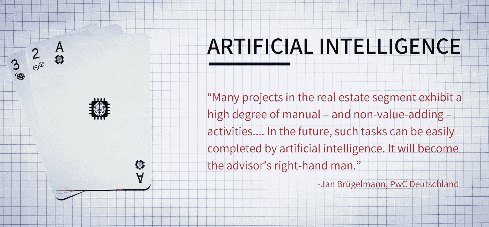
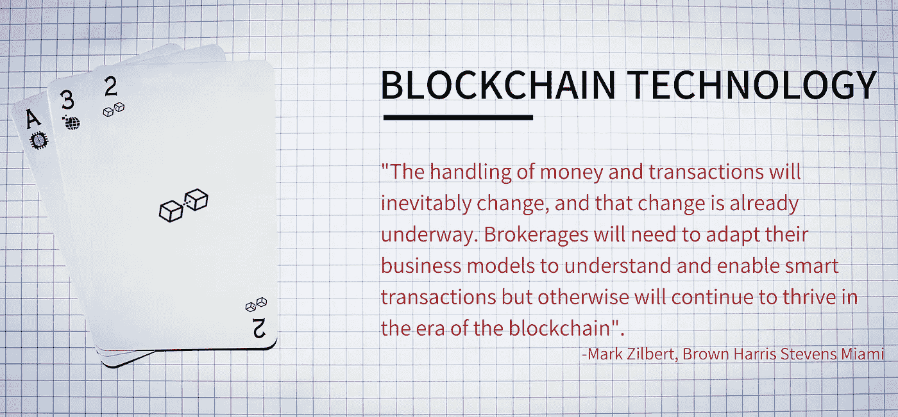
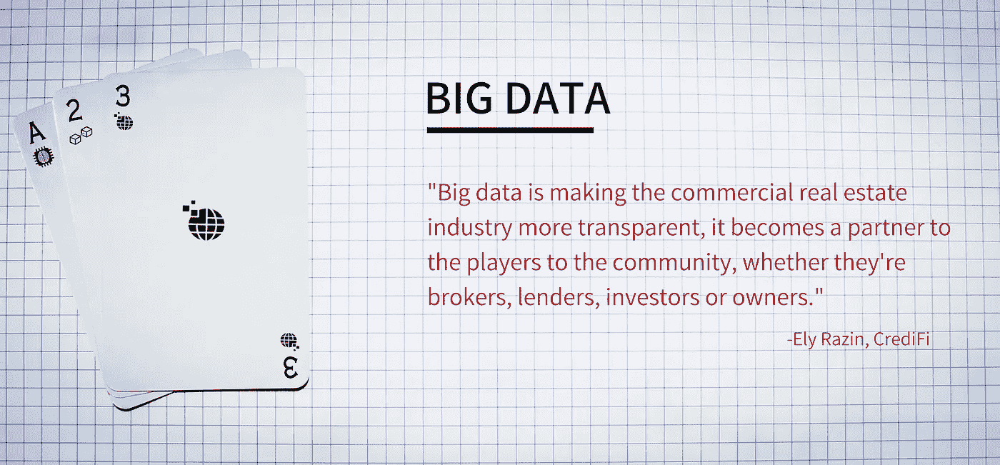

# 房地产未来技术和明天的房地产市场

> 原文：<https://medium.datadriveninvestor.com/real-estate-future-tech-and-the-property-market-of-tomorrow-e3fa5937adce?source=collection_archive---------22----------------------->

随着未来十年新时代技术的迅猛发展，房地产行业正处于一场巨大变革的边缘。随着变革性的商业模式完全重新定义了房地产投资和管理的概念，机构简单地采用创新是不够的。

The Property Market House of Cards Primed For Restructuring

随着人工智能和区块链的颠覆性创新浪潮为进入下一个十年数字化进步的行业注入新的活力，房地产市场可以被视为在采用和整合此类技术方面的落后者。随着人工智能、区块链和大数据的日益便捷和可用，房地产行业的采用可能会大幅增加，这将彻底改变我们今天看到的房地产管理的根本。

通过人工智能和复杂的机器学习算法实现的自动化正逐渐进入房地产专业人员工作的关键方面，通过在给定房地产的整个价值链中使用人工智能，仅自动化的潜力估计就有 40%左右(普华永道，2018 年)。

这些软件算法将越来越多地适应和交织到更复杂的领域，包括语音识别，预算和规划，以及决策过程。从根本上说，房地产行业是一个以知识为基础的行业，因此人工智能将很快成为收集和分析客户信息的一个不可或缺的组成部分。

许多关键领域可以通过人工智能的集成直接受益；即增加高度个性化的酒店推荐，考虑客户数据和消费者趋势，并通过基于人工智能的客户关系管理(CRM)系统发展长期关系。

然而，出售房产仍然需要“人情味”，这是任何人工智能都不可能做到的(至少在不久的将来)。维安·钦纳补充说

> *“最终，人工智能将给予房地产经纪人时间的礼物，这将使他们能够花更多的精力做他们最擅长的事情——达成交易。”*

人工智能在房地产领域的应用仍处于初级阶段，只有少数可行的初创企业朝着主流房地产技术的方向发展。然而，由于其广泛的使用案例，房地产行业将很快在未来几年内看到人工智能的快速和破坏性集成。

房地产等高价值资产的交易一直是数字平台的缓慢采纳者，房地产收购通常是通过与各方面对面的接触进行的。然而，由区块链支持的智能合同为购买和出售财产创建了一个高度安全和高效的交易系统，并创建了一个完全透明的数据账本。

> *“区块链技术在房地产领域的应用有很多方式:购买房地产，管理房地产；将房地产所有权的转移记录到区块链上……”*

根据 Ragnar Lifthrasir 概述的用例，中介的分解和交易的分散化将降低成本并提高安全性，补充流动性的增加并开启部分所有权的潜力(投资者可以借此汇集资金共同拥有房地产)，从而极大地提高便利性并降低进入壁垒。

最终，区块链技术将成为代理人保护交易和利用智能合约功能的更有效工具。

在房地产领域，越来越多的代理交易依赖于智能数据收集和分析，以实现更快、更准确的评估和预测。

随着物联网的日益普及以及用户和业主需求的不断增加，个人和建筑相关数据将快速积累。以有利可图的方式利用这些数据的房地产公司将为自己的适应性和未来的商业实践定位。

然而，尽管大数据被视为对房地产市场周围的行业具有最大的潜在影响，但它也面临着许多严峻的挑战，这些挑战可能会阻止其最大限度地发挥效用。

访问数据就是这样一个问题，各方通过隐私门声称他们有权访问“他们的”数据，这不仅限制了他们的竞争对手，也限制了整个行业访问这一有价值的信息来源。

其次，对数据收集和使用的严格监管将对未来房地产商业模式的成功产生决定性影响，政府将通过消费者数据收集收紧数字化进程。

> *“当今行业产生的大量用户数据激起了国际科技公司和其他新市场参与者的兴趣。目前，数字重量级企业在数字技能和数据应用方面占据优势。然而，数据的货币化可以克服低利润率，并将这些科技公司吸引到房地产领域。”*(德勤，2018 年)

大数据对房地产行业有着深远的影响，通过建筑管理技术、生活质量生态因素优化以及通过更明智的决策形成更健康的买卖习惯，大数据带来的好处远远超过了对消费者的好处。

未来的房地产市场可能会由人工智能共同统治，由区块链驱动，并通过大数据分析丰富。第四次工业革命将见证许多行业的兴衰，那些更有效采用的行业将占据主导地位。问题依然存在；面对人工智能自动化，房地产公司会成为过去的遗迹、代理的勒德分子吗？或者，他们能重新发明他们的价值主张吗？

也在这里发表[。](https://amrank.info/2019/01/15/real-estate-future-tech-and-the-property-market-of-tomorrow/)