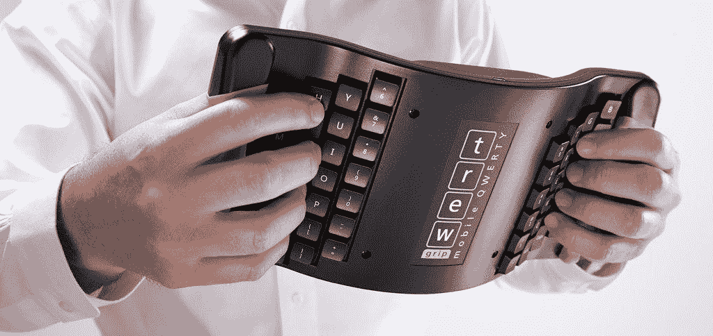
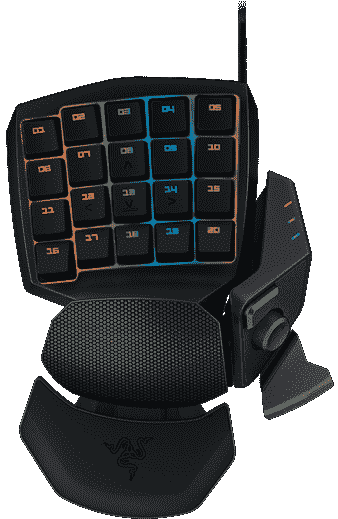
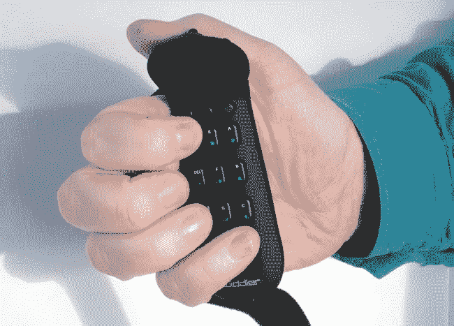

# 虚拟现实/增强现实输入接口的未来

> 原文：<https://medium.datadriveninvestor.com/real-future-of-vr-ar-input-interfaces-6ee46c06b99d?source=collection_archive---------4----------------------->

在过去的几年里，虚拟现实领域一直在稳步成熟。我们可能已经过了大肆宣传的高峰期，但我们还没有达到良好实际应用的理想状态。让我来做一些预测，当我们最终到达那里时，界面会是什么样子。当完整的虚拟世界到来时，我们将使用什么工具与计算机和其他人进行交互？键盘？触觉手套？语音识别？让我们一起探索吧！

首先，说几句术语:

 [## 人工智能和虚拟现实的融合-你能期待什么|数据驱动的投资者

### 在技术领域，融合是合乎逻辑的一步。就在几十年前，你可能需要一个专门的…

www.datadriveninvestor.com](https://www.datadriveninvestor.com/2018/08/30/the-convergence-of-ai-rv-what-you-can-expect/) 

虚拟现实(VR) —这是一种你作为用户完全被传送的体验。你戴上虚拟现实护目镜(或其他一些类似功能的设备)，你会发现自己在另一个世界。你可以用多种方式与它互动——你可以触摸物体，你可以行走，你可以与他人交谈。在虚拟现实的完美执行中，你所有的感官都被刺激，包括触觉和嗅觉。

**【增强现实(AR)**——这意味着你没有被传送到任何地方，相反，你继续在正常的环境中生活和工作，但有一个虚拟的叠加层，可以注释现实生活中的物体或事件。在电影和书籍中，通常通过内置摄像头和透明屏幕的眼镜来实现——通过隐形眼镜或植入物。在最原始的实现中，它是使用电话屏幕来传递的。就像口袋妖怪 Go 一样。

**混合现实(MR)**——有时这个术语被用来描述虚拟现实和增强现实之间更深层次的混合。它允许虚拟物体嵌入到现实世界中。例如，一些虚拟怪物躲在椅子后面，桌子挡住了它的一半，使它看不见。但从另一个角度看，它是完全可见的。而几个人从不同的角度能看到同一个怪物的不同，它在这个混合现实的世界里是执着的。

那里有不同的现实。主要用于初创企业的宣传资料，其他方面还不多见。虚拟现实大多被视为一种娱乐设备，他们的机会是无限的，从游戏到篮球比赛中的远程呈现。而公司应用程序最有可能集中在虚拟会议和共同创作上。AR 总能抓住营销人员的想象力，但在通过手机屏幕观看现实世界的依赖性消除之前，注释现实世界的能力不会非常有用。我们将需要下一个谷歌眼镜类设备的出现，以使 AR 成为我们日常生活的一部分。而 MR 会一直留在科幻作家的想象中，直到 AR 被完全解决。

所以你正在使用全虚拟现实，你正坐在充满虚拟显示器的虚拟房间里，以以前只在电影中看到的惊人方式围绕着你。但是你如何与这些辉煌的数据互动呢？通常表现为大量的手工编织和捏缩放大物体。这对于消费信息或者仅仅是娱乐来说可能很有效。但是怎么创造东西呢？如何做任何复杂的编程？还是写作？或者只是在 photoshop 里编辑一张图片？

# 点击式照相机。游戏控制器。

所以，当你第一次进入虚拟现实的时候，你可能会有一些游戏控制器在手。你可以用它来指东西并点击它们。但这并不是很高的数据吞吐量，问问任何试图在智能电视上输入密码的人就知道了。即使遥控器和 apple tv 自带的一样好，它仍然是一种痛苦的缓慢体验。点击器被**淘汰**。

Controller and Swiping

# **打手势和挥手。触觉手套。**

如果你有一个擅长动作感应的控制器，你能做的不仅仅是指向和点击。你可以使用更高级的手势组合来让事情发生。智能手机制造商一直在发明惊人的技术，向我们展示简单的滑动或挤压手势如何改变整个用户体验。在三维空间中，可能会有另一个指数级的手势出现。

尤其是如果我们可以从不得不拿着一个设备发展到只是挥动我们的手。某种手套，或者是一个传感器，当你移动它们的时候，它可以检测你的手的运动。

当然，手机屏幕和电脑触摸板工作得很好，因为有一个特定的表面我们可以触摸。它有边框，很容易理解**哪里需要滑动**才能让事情发生。在一个充满虚拟物品的房间里，还需要有一个指定的 3d 空间来“滑动”。

我可以想象在我面前有一个红色半透明的立方体，我必须把它当作三维触摸板来操作，以改变我周围墙壁大小的显示器。但是我无法想象直接触摸这些墙壁大小的显示器。要想做大，它们需要“位于”我够不到的地方，即使那纯粹是虚拟的位置。

举个我的想法的例子——在手机中，你总是使用触摸屏，在有触摸屏的笔记本电脑中，你有时会使用它，主要还是使用触摸板或鼠标。而如果你的电视有触摸屏，你永远不会使用它。

此外，还有一个问题是，我们刚刚发明的红色半透明 touch-cube 不会像手机屏幕或笔记本电脑触摸板那样有良好的触觉反馈，所以它可能很难感知在哪里以及如何准确地做出手势。但是，如果用户拥有基于虚拟位置提供触觉反馈的手套，这种情况可能会得到改善。

所有这些美妙的设置仍然有两个主要问题:

你不能用那种方式输入数据。除了触摸板，我们每台笔记本电脑上都有一个键盘，这是有原因的。以及为什么我们在每部手机上都有微小的屏幕键盘——除了信息消费和作为操纵已经创建的数据的辅助工具，手势还不足以做任何事情。(撇开纯艺术用例不谈)

**你不能举起手太久。**这是一个相当简单的问题，但在所有制作过这种全息或虚拟显示器的电影或电视节目中，它都被忽略了。如果我们的手必须在我们面前举起超过几分钟，我们的手确实会累。我们在键盘前放扶手是有原因的，也是为什么我们在使用手机时会将手放在胸前或腿上——让手得到支撑是很重要的。在全息立方体中做手势的时候用手支撑是不可行的。

# 口头命令。助手。

有一个巨大的推动力来建立越来越智能的助理服务，你可以用你的声音进行交互。这在某些情况下肯定是有帮助的，但可悲的是，这些情况大多仅限于你在广告中看到的——查看约会和播放一些音乐。

好吧，我可能有点夸张，但是确实有一个互动的层次还没有达到。当使用任何数据输入工具时，我想确保我要给出的命令会被 100%地解释为我想要的。这当然很大程度上取决于任务。有许多任务不需要这样做，甚至可能有一些任务需要口头输入。

但当我进行编程、写作或 excel 计算时，我从来不想回去修复一些东西，因为一些人工智能助手误解了我在说什么。

虽然对于相对线性的过程，如写电子邮件或文章，将它口述给语音识别引擎可能是可以接受的，但对于任何更复杂的情况，当您不断地在不同的窗口、文本行和单元格之间移动焦点时，语音识别会失败，而且会很快失败。

当然，它的声音也很大，缺乏隐私，这使得它几乎不可能在办公室使用。

虽然随着时间的推移，某些方面无疑会得到改善，因为识别越来越好，甚至可能有一些次发声的可能性，使这种数据输入更加隐私，但我们是否会将它用于当今有创造力的人使用计算机的大多数任务，这是值得怀疑的。

虽然未来可能会有全新的任务、工作和表达方式使用 Alexas 和 Siris 蓬勃发展。

# 键盘。虚拟的，没有那么多。

戴着 VR 头戴式设备时，可以使用一些键盘。你可以一直打字而不用真的看到它。当然，这不是完美的解决方案。

当然，也可以有完全“在屏幕上”的虚拟键盘。但是这些只能用一些触觉反馈系统来实现。但是，如果没有什么可以让你休息的东西，你会很快感到疲劳。

我也看过一些视频，里面的人正在剪切掉一部分 VR 视野，以便能够看到他们真正的键盘。这有一个明显的打破 VR 沉浸感的问题。

目前，最可行的键盘方法是由罗技公司首创的想法，即物理键盘被精确地映射到虚拟现实中出现的虚拟键盘。正如下面的视频所示，这可能是一个好的解决方案。

# 还剩下什么？跳出框框思考。

我们理想的输入设备解决方案需要具备以下功能:

*   站着输入，不需要在前面放扶手
*   自然的 3D 指针输入(考虑三维鼠标)
*   完整的 104+键大小的输入种类，无需跳圈
*   为盲人触摸打字提供良好的按键触觉反馈

有几种键盘是为更多的移动使用而设计的。比如下图这个手持键盘。

[https://askergoworks.com/products/trewgrip-wireless-handheld-keyboard](https://askergoworks.com/products/trewgrip-wireless-handheld-keyboard)

但是这个特殊的例子并没有勾掉我们列表中的前两点。也有单手键盘，这可能是有趣的研究。比如下面这个由 Razr 为游戏制作的:

[https://www.razer.com/gaming-keyboards-keypads/razer-orbweaver-chroma](https://www.razer.com/gaming-keyboards-keypads/razer-orbweaver-chroma)

但是它的用途似乎是有限的，而且它也没有在我们的清单上勾掉很多点。尽管它看起来很酷。

我们必须寻找真正的掌上电脑。类似于 Twiddler。尽管它看起来并不吸引人，名字也很奇怪，但它在我们的列表中有几点值得一提。虽然这不是一个答案。

[https://twiddler.tekgear.com](https://twiddler.tekgear.com/)

我们需要的是将上述所有产品混合起来，并以某种方式满足所有要求的东西。

我的想法如下——两个手持键盘，一只手一个，更类似于 Razr 设备，而不是 Twiddler。每一个键盘都将附在手腕上。在它的下面，所以手掌可以放在设备上，手指可以接触到每只手的 40 多个按键。

每个拇指将操作触摸区域(就像最初的蒸汽控制器原型)和几个功能键。每个触摸区域都可以像任何触摸板一样进行 2d 操作。这将包括在虚拟现实中操纵二维表面上的数据。电子表格、文本编辑器等等。

输入控制器通常在静止状态下运行，不需要任何额外的动作或摆动。站着、坐在椅子上或舒适地躺在沙发上。但是当需要时，仍然可以将整个控制器用作 3d 定位设备。通过按压触摸区域或单独的功能键，输入将被修改以操纵三维空间中的屏幕或对象。再加上同时使用按键的可能性，它将允许多种技术快捷方式。同时用两只手工作，仍然有可能有更多的组合和选择。

未来将是惊人的！