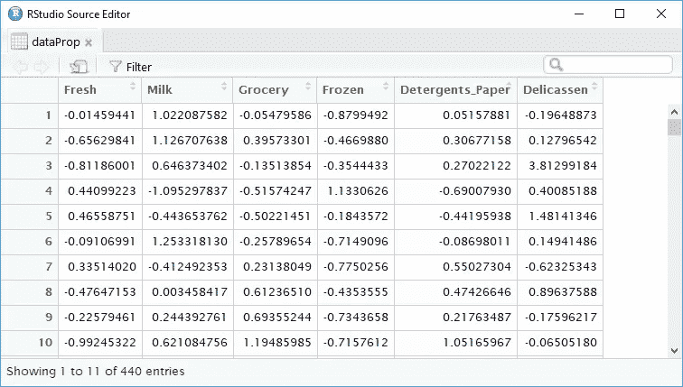

# 用 R Magrttr 包重构的一个简单例子

> 原文：<https://medium.datadriveninvestor.com/real-life-refactoring-with-the-r-magrttr-ef131123ae82?source=collection_archive---------8----------------------->

[](http://www.track.datadriveninvestor.com/1B9E)

Photo by [Lidya Nada](https://unsplash.com/@lidyanada?utm_source=medium&utm_medium=referral) on [Unsplash](https://unsplash.com?utm_source=medium&utm_medium=referral)

告白时间。我曾经是一个有点教程迷。如果上面写着“入门”，我会去的。然而教程的问题是它们不断地告诉你下一步该做什么。当然，一个人首先需要这样做(我假设)，但是真正的学习发生在当你拿起你自己的项目并尝试在没有指导的情况下应用教程中的概念的时候。

出于这个原因，当我发现现实世界的情况允许我小心翼翼地将我最近在网上课堂上学到的点点滴滴联系起来时，我感到很高兴。像大多数 R 程序员一样，我尽职尽责地下载了 magritter 包，并承诺提供语法上高效的代码链。我复制并粘贴了几十个“ ***% > %*** ”管道，然后我才真正想到要利用一个预先写好的练习之外的管道。

我发现了一个小型的批发客户数据数据集，我认为用 **factoextra** 包进行聚类分析是完美的。数据集是最小的；它列出了来自六个不同部门的每个批发客户的收入:新鲜食品、牛奶、杂货、冷冻食品、洗涤剂 _ 纸和 Delicassen。在这个想象的世界里，我是一个国际杂货商。很好。

为了分析得到的聚类的特征，我需要具有一些比较值的值。显而易见的解决方案是计算每个客户在每个行业的收入比例。将数据放入 data.frame 后，我最初编写了以下代码。

```
data2 <- mutate(data1,totalSpend =    (Fresh+Milk+Grocery+Frozen+Detergents_Paper+Delicassen),
  FreshSpend = (Fresh/totalSpend),
  MilkSpend = (Milk/totalSpend),
  GrocerySpend = (Grocery/totalSpend),
  FrozenSpend = (Frozen/totalSpend),
  DPSpend = (Detergents_Paper/totalSpend),
  DelicassenSpend = (Delicassen/totalSpend))
# View(data2)
dataX <- scale(data2[9:15])
```

是的，当我写下这几行时，我知道我犯了重复我自己的基本编码错误。以进步的名义，我做了那一刻想到的事，然后我就后悔了。上面的代码使用 **tidyverse** 包的 *mutate* 函数向数据集添加列。然后我对数据进行了分析。见下面的结果数据表。


几天后，我在阅读一些技术文章时，偶然发现了 *prop.table* 函数。我有一个荷马辛普森的时刻，并着手重构我的代码。这时后面的脑细胞醒了，告诉我用管子。你知道接下来发生了什么。十行代码变成了两行。

```
dataProp <- prop.table(as.matrix(data1[3:8]), 1) %>%scale()
```

我创建了一个名为 dataProp 的新表对象来保存 *prop.table* 的输出。 *prop.table* 函数创建一个表格，其中每个单元格对应于每个原始单元格的某个值的比例。添加“1”参数后， *prop.table* 计算每个单元格占该行总数的比例。在这种情况下，它会计算每个顾客在每个杂货类别中的支出百分比。深入探究*道具表*功能可以在[这里](https://thomasleeper.com/Rcourse/Tutorials/tables.html)找到。

*道具表*对我的数据框不满意，在我添加 *as.matrix* 函数之前给了我一个非常严重的错误:

```
Error in margin.table(x, margin) : 'x' is not an array
```

在使用*作为. matrix* 后，该行运行没有错误，我得到了与第一个表相同的结果。



又一次表白。最初，涉及到更多的代码，但我意识到我不需要其中的一半。我想无论如何我会和你分享我的小胜利，并在另一个时间讨论所有其他的事情。其他人有过这样的时刻吗？当你真的记起一些事情的时候，你自己都感到惊讶。那可能只是老年人的事情。