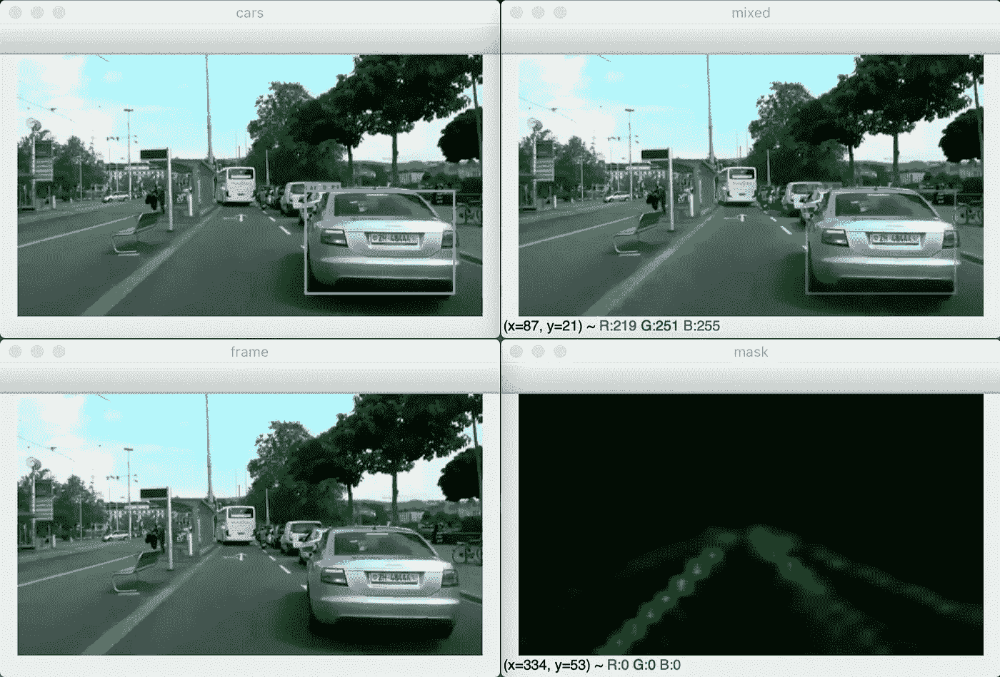
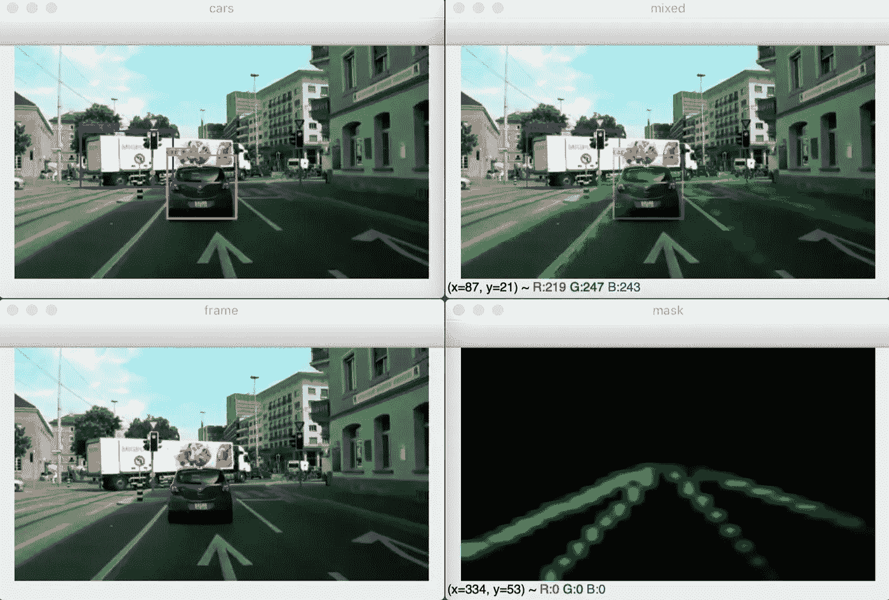
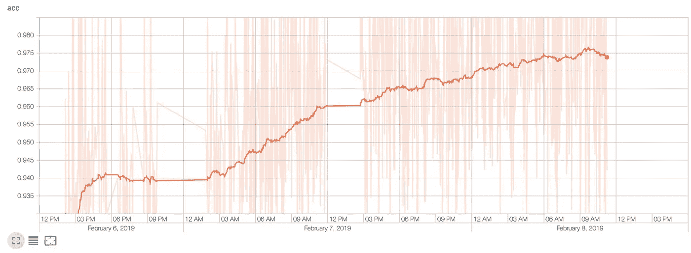
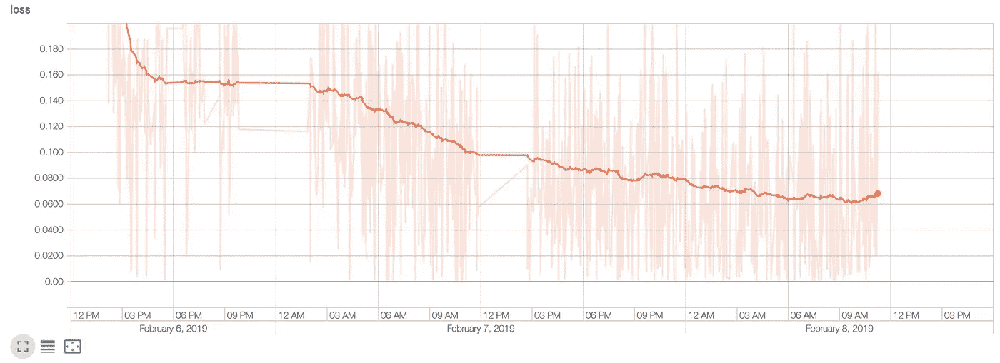

# 我为自动驾驶建立了一个强大的实时车道检测网络

> 原文：<https://medium.datadriveninvestor.com/real-time-lane-detection-network-for-autonomous-driving-7e668ce944ab?source=collection_archive---------2----------------------->

## 关于制造无人驾驶汽车的个人笔记

## 问题是

检测道路标记的精确位置和形状是实现现代自动驾驶系统的关键技术之一。本文将分享开发道路标记检测深度学习模型的进展。

## 数据集和训练过程

模型训练是在一台搭载 AMD 镭龙 Pro 555 的苹果 MacBook 2017 Pro 上完成的。这个过程需要大约 24 个小时，并且需要持续的监控，以确保笔记本电脑不会过热。硬件冷却设置包括设置在笔记本电脑边缘下的啤酒瓶盖，以提供冷空气入口。

 [## 在自动驾驶汽车发生事故的情况下，谁应该承担法律责任？-数据驱动型投资者

### 我仍然认为自动驾驶汽车是一种奢侈品，而不是必需品…

www.datadriveninvestor.com](https://www.datadriveninvestor.com/2018/11/02/who-is-legally-accountable-in-the-case-of-an-autonomous-vehicle-accident/) 

训练是在镭龙 Pro 555 上进行的，由于显而易见的原因，它不支持 CUDA。所以用了 PlaidML Keras Backend 代替 Tensorflow。但是，模型不需要任何更改就可以切换到 Tensorflow。

已经使用 [CULane 数据集](https://xingangpan.github.io/projects/CULane.html)进行了初始训练。

> CULane 是一个大规模的具有挑战性的数据集，用于车道检测的学术研究。它是由安装在北京不同司机驾驶的六辆不同车辆上的摄像机采集的。采集了超过 55 小时的视频，提取了 133235 帧。数据示例如上所示。我们将数据集分为 88880 个用于训练集，9675 个用于验证集，34680 个用于测试集。测试集分为正常和 8 个挑战类别，对应于上面的 9 个例子。
> 
> (CULane 数据集【https://xingangpan.github.io/projects/CULane.html )

## 深度学习模型

直奔主题。我知道你来这里的目的。

稍后我会给出一个奇特的图表。

## 结果

模型输出是一个 30 乘 30 的矩阵，其中每个值对应于一个图像片段，并指示标记是否存在于其中。

为了方便起见，输出被缩放并覆盖在原始图像上。

将来，这一层的输出将被提供给上采样网络，以获得更高分辨率的图像。

Markup detection results

Markup detection results

Training accuracy

Binary cross-entropy loss

## 结论

模型的当前状态需要大量的调整、细化和超参数优化。未来的计划包括使用自定义损失函数和添加上采样网络来获得高分辨率图像。到目前为止取得的结果是一个小成功，它带来了很多经验，并教会了我将深度学习卷积神经网络应用于现实生活中的问题。