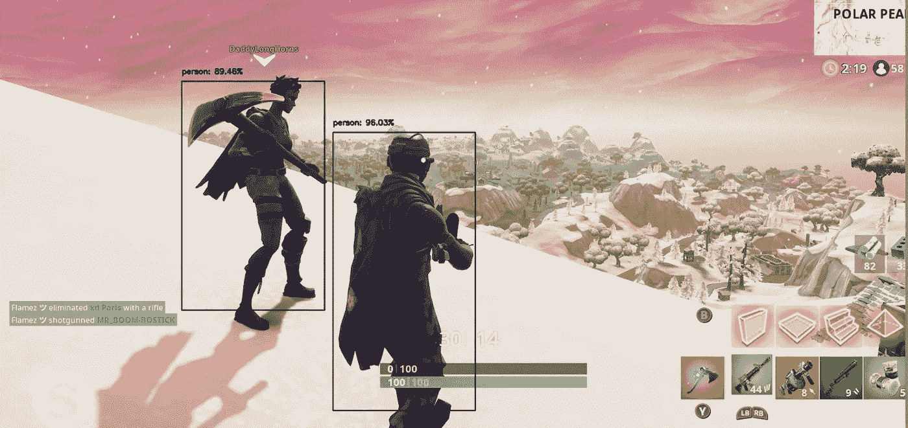
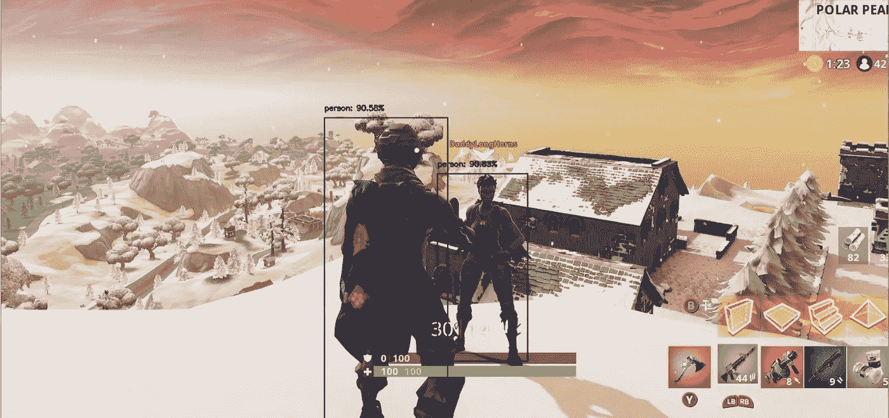

# 堡垒之夜的实时物体识别

> 原文：<https://medium.datadriveninvestor.com/real-time-object-recognition-on-fortnite-e8e041b5d49b?source=collection_archive---------4----------------------->

[](http://www.track.datadriveninvestor.com/J12U)

ortnite 由位于北卡罗来纳州的工作室 Epic Games 发行，并作为一个开放的玩家沙盒发布。《皇家堡垒之战》是一个免费模式，100 个人在一场生存战中互相对抗，最后一个活着的玩家成为胜利者。对于本教程，我们将使用 OpenCV 库和 MobileNet 来实现堡垒之夜中的实时对象识别。如果你对我们的结果感兴趣，请向下滚动。如果你是来学习的，那就继续读下去。

# **让我们开始吧！**

我从克隆 MobileNet repo 开始，我已经将它包含在[项目 repo](https://github.com/foundationai/Realtime-Object-Recognition.git) 中。对于这个项目，我在 windows 10，Anaconda 3，Python 3.7 上，我们将使用 Caffe 模型。MobileNets 基于一种流线型架构，使用深度方向可分离的卷积来构建轻量级深度神经网络。这些神经网络引入了两个简单的全局超参数，有效地在延迟和准确性之间进行权衡。

*   安装 [Python3](https://www.python.org/downloads/) 并添加到 PATH。
*   使用 pip(最新版本)安装 OpenCV 的最新版本时，安装所需的库，例如枕头、键盘等。

> pip 安装-r 要求. txt

```
import win32api
import keyboard as keyboard
import pygame as pygame
import pythoncom
import win32con
from PIL import ImageGrab
from imutils.video import VideoStream
from imutils.video import FPS
import numpy as np
import argparse
import imutils
import time
import cv2
import pyautogui
from keyboard._mouse_event import RIGHT
```

# 流式传输时的对象识别

*   打开一个网站或任何你想检测物体的视频。对于这个具体的例子，我们关注的是 Fornite 中的对象识别。
*   运行脚本，它应该产生一个可以检测对象的 python 框架。

> python script.py

在我们的代码中，我们为 prototxt 和 caffemodel 传递参数。我们标记我们的类，并从均匀分布中抽取样本。

```
 prott1 = "MobileNet_deploy.prototxt"
prott2 = "MobileNetSSD_deploy.caffemodel"# initialize the list of class labels MobileNet SSD was trained to
# detect, then generate a set of bounding box colors for each class
CLASSES = ["background", "aeroplane", "person"]COLORS = np.random.uniform(0, 255, size=(len(CLASSES), 3))

# load our serialized model from disk
print("Model Loading....")
net = cv2.dnn.readNetFromCaffe(prott1, prott2)
```

当我们从屏幕上接收视频流时，我们将帧发送到我们的网络。我们循环检测并检索与预测相关的概率。

```
while True:

    frame = np.array(ImageGrab.grab(bbox=(0, 40, 1820, 1240)))

    # grab the frame dimensions and convert it to a blob
    (h, w) = frame.shape[:2]
    blob = cv2.dnn.blobFromImage(cv2.resize(frame, (300, 300)),
                                 0.007843, (300, 300), 127.5)

    # pass the blob through the network and obtain the detections 
    # and predictions
    net.setInput(blob)
    detections = net.forward()
```

# **总结和未来计划**

当我们在一个有对象(堡垒之夜)的窗口中时，我们的 MobileNet 可以准确地识别对象。当玩家在范围内时，我们的模型检测玩家，并给我们一个“人”的标签我们的模型对新增加的飞机进行分类，但是不检测物体，除非它们足够近。我们计划通过严格针对堡垒之夜培训 MobileNet 来改进这一模式。**多安 AI** 为全球客户提供**机器学习咨询**。如果您对实施人工智能感兴趣，请不要犹豫[联系](http://www.dogan.ai)我们。

网址: [https://www.dogan.ai](http://www.dogan.ai)

推特:[https://twitter.com/dogan_ai](https://twitter.com/dogan_ai)

领英:【https://www.linkedin.com/in/john-dogan/ 

完整代码:【https://github.com/doganai/Realtime-Object-Recognition 

