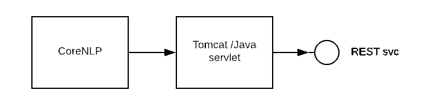
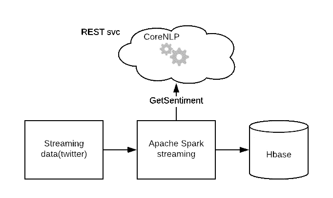
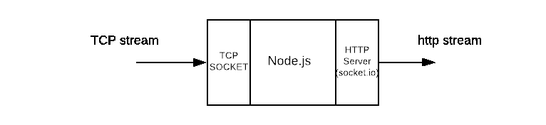
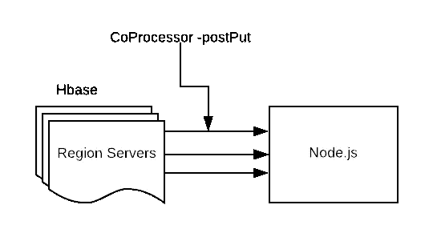
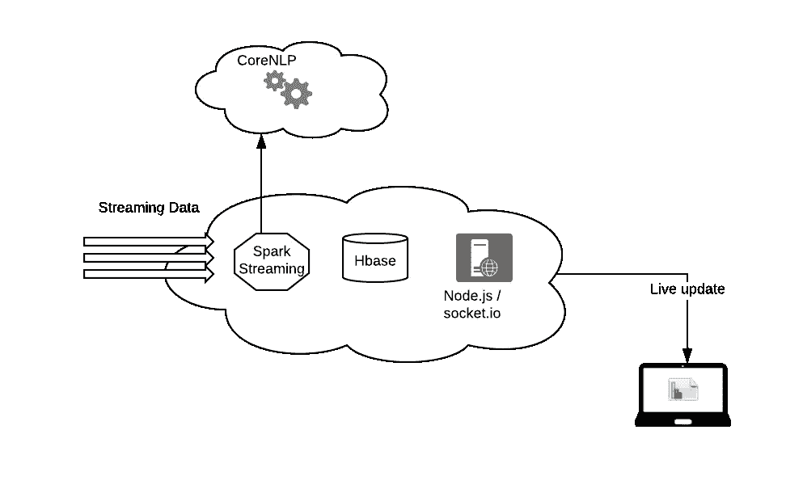

# 端到端的实时文本分析

> 原文：<https://medium.datadriveninvestor.com/real-time-text-analytics-end-to-end-7f7b1ad9eedd?source=collection_archive---------29----------------------->

使用[斯坦福 CoreNLP](https://stanfordnlp.github.io/CoreNLP/) 、Apache spark streaming、Hbase、node.js 和 d3.js 进行端到端的实时情绪分析。

[什么是情感分析？](https://www.lexalytics.com/technology/sentiment)情感分析是确定一篇文章是正面、负面还是中性的过程。

在这篇博客中，我们来看看如何对 twitter 数据进行实时情感分析。使用任何你感兴趣的关键词(例如。大数据、IOT、机器学习)，用于使用 twitter API 过滤流数据，为此需要分析情感。这里涉及的各种组件有

1.  CoreNLP
2.  流处理
3.  储存；储备
4.  数据传送
5.  形象化

**我们将使用[斯坦福 CoreNLP](https://stanfordnlp.github.io/CoreNLP/) 软件包进行情感分析。这里的假设是，如果文本包含多个句子，则最长句子的情感被认为是给定文本的情感。这个包通过 web 服务器(tomcat)作为 REST 服务公开。**

**使用方法**rnncoreanotations . getpredictedclass(tree)检索情感；**返回一个整数作为输出，需要解释如下。**

**0:“非常负面”1:“负面”2:“中性”3:“正面”4:“非常正面”**

****

**这样，对于给定的文本，使用 HTTP 方法返回情感得分。**

****流处理:****

**使用 [Apache Spark 流](https://spark.apache.org/docs/2.2.0/streaming-programming-guide.html)处理 Twitter 流数据。步骤包括**

*   **从 Twitter 流中检索数据。**
*   **对于每条推文，将它发送到托管在 tomcat 上的 coreNLP REST 服务，以获取该推文的情感。**
*   **将推文文本和相关情感保存到 Hbase 表中。**

****

****存储:**
将流数据存储到 hadoop 集群上的 Hbase 中([示例](https://mapr.com/blog/spark-streaming-hbase))。**

****数据传输:****

**现在我们有了 Hbase 中的数据，我们可以从 Hbase 中查询数据并以图表的形式呈现，每隔几秒钟刷新一次客户端，使其成为实时图表。我们不会使用这种技术，相反，我们将使用推送模型，每当新数据到达 Hbase 时，它就会被推送到客户端(在本例中为 web 浏览器),从而真正实现实时性。让我们有一个服务将 Hbase 中的数据连接到客户端 web 浏览器中的图表。我们将数据输入到 Hbase 表中，将图表加载到客户端 web 浏览器中，等待更新。**

****

**Socket.io 拯救了我们:我们的编排服务器构建在 node.js 上，它监控特定端口的传入消息，并将其发送给使用 socket.io 订阅它的浏览器客户端。**

****

**现在，我们只需要将数据推送到 node.js 服务器，该服务器监听一个特定的端口， [Hbase 协处理器](https://hbase.apache.org/apidocs/org/apache/hadoop/hbase/coprocessor/package-summary.html)会这样做。每当有数据操作(get、put、delete)时就会触发协处理器，这里我们使用 postPut 事件，它是在 Hbase insert 之后触发的。协处理器类似于 RDBMS 中的触发器。**

****

**我们的 node.js 进程有两个端口，tcp 用于传入数据，http 用于传出数据。Hbase 协处理器将数据推送到 tcp 端口，然后推送到客户端([示例](https://stackoverflow.com/questions/33282327/using-socket-io-with-net-socket-in-nodejs))。来自 TCP 流的数据被传递给 http 服务器，后者使用套接字将数据推送到客户端。io。这是可能的，因为 tcp 服务器和 http 服务器运行在同一个 node.js 进程中。**

****

****可视化:**
使用 d3.js 创建图表([示例](https://bl.ocks.org/pjsier/fbf9317b31f070fd540c5523fef167ac))。使用 [socket.io.js](https://socket.io/docs/) 在浏览器和服务器之间进行实时通信。每当数据到达服务器时，Socket.io 在浏览器中使用这个方法发出数据。**

***socket . on(' emit _ from _ server '，function(data){ …..…..***

***})***

**每当发出数据时更新图表，从而使其实时化。因此，每当一个流数据进入系统时，它的情感都会从 CoreNLP REST 服务中检索出来，并存储在 Hbase 中。从那里，Node.js 服务器使用 socket.io 将数据推送到客户端浏览器，web 浏览器上的 d3.js 处理传入的数据，并根据需要将其显示为实时图表或表格。现在就把这些点连接起来:**

****

**基本上提供了一种技术，可以用于不限于情感分析的任何实时处理。这个想法怎么样？**

***原载于*[*tech Mano . in*](http://techmano.in/blog/realtime.aspx)*。***