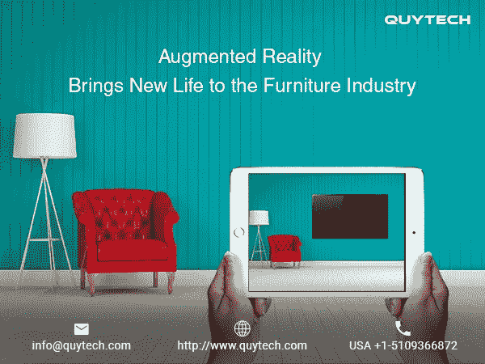
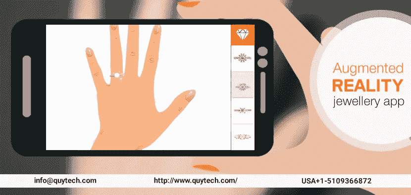

# 增强现实的真实例子证明了市场营销的先进水平

> 原文：<https://medium.datadriveninvestor.com/real-word-example-of-augmented-reality-that-proves-the-advanced-level-of-marketing-137f414c65c7?source=collection_archive---------18----------------------->

一项真正改变营销格局的技术是增强现实(AR)。它将图像叠加到用户的真实世界视图上，增强了用户的整体体验。

事实上，AR 正在定义营销策略的新定义。随着消费者越来越容易接受 AR 体验，组织也在试图提出适当的用例。

AR 将用户投射到一个沉浸式 AR 环境中，激发多种人类感官。因此，用户获得了无与伦比的参与度。这是不同行业中许多基于产品的公司吸引用户的关键。

## **为什么 AR 会改变游戏规则**

AR 具有一种独特的能力，可以将数字对象插入到真实世界的相机视图中。这是最有效的消费者参与型技术。它提供复杂的[增强现实解决方案](http://www.quytech.com/augmented-reality.php)，致力于工业中的各种应用。根据调查报告，AR 可以吸引人们的注意力超过 85 秒，将互动率提高 20%，将点击率提高 33%。

## **增强现实示例**

**1。AR 房地产应用**

这款 App 是 ar 房产营销中最常用的工具。增强真的不仅仅是投射数据，而且把事情带到了另一个层次。

客户可以看到打印在屏幕图标上的 3D 模型。应用程序扫描地图的那一刻，它会触发一个覆盖在现实世界上的视频或 3D 模型。从各方面来看，Augment 的执行都是完美而有效的。

因此，客户可以使用该平台完成作业。它足够灵活，允许他们跟踪打印目录中的工作流程。

例子:[商业地产 AR](https://www.youtube.com/watch?v=iQnxVPYNUGc&t=3s)

## 2.AR 家具 App

通过 AR 应用程序在线检查家居家具是一种出色的体验。如果你正在寻找家具，想知道它实际上是否适合，那么这个 AR 应用程序就在这里。如果你选择的餐桌不像你希望的那样完全适合你的客厅，该怎么办？AR 应用程序向用户展示他们家中的家具是什么样的。

这个 AR 应用程序考虑到了房间的色调和颜色，从而投影出在你房间里看起来真实的家具。测量单元是为必须位于房间中的特定对象提供的。因此，向用户提供了选项。

例子:[亚马逊](https://www.youtube.com/watch?v=77ZJ3jw6EkA)

## 3.虚拟试衣 App

这款虚拟试衣应用只需几秒钟就能完成用户的测量。它采用跨多个产品线转换的测量数据。因此，它被用来制作定制服装。这个 AR 应用程序可以根据任何身高、体重或体型的男女进行定制。

一旦设备根据测量确定了距离和相对角度，它就投射图像。这整个过程都是关于利用复杂的学习算法。

该设备的摄像头将图像转化为测量数据。然后，该应用程序会记录几个关键的测量值，并应用到服装样板上。

例子:[天伯伦](https://www.youtube.com/watch?v=5TZmQPdhpak)

## 4.AR 广告 App

一家澳大利亚葡萄酒品牌 19 Crimes 的公司推出了一款名为“活葡萄酒标签”的新应用，你可以通过 Play Store 下载。这个应用程序展示了罪犯的故事和他们的罪行。当谈到市场广告时，增强现实正在打破每一个参数。

在使用这款 AR 应用时，用户可以听到被放逐的暗红和詹姆士·威尔森讲述他们那个时代“战斗到底”的信条。

使用这个应用程序，这些酒瓶在你的智能手机下变得栩栩如生。使用这个 AR 应用程序，罪犯的整个故事可以直接从瓶子上可视化。要体验这种感觉，你可以看看这个 AR 应用程序，其中一个小偷团伙的头目 Jane Castings 讲述了关于第一杯白葡萄酒的 19 起犯罪。

例如: [19 犯罪 App](http://www.quytech.com/blog/how-much-does-it-cost-to-develop-an-ar-app-like-19-crimes-wine/)

## 5.AR 珠宝 App

在这个科技世界，每三个人就有一部智能手机，这就是电子商务蓬勃发展的原因。随着时间的推移，技术将战胜市场的各个领域，其中之一就是珠宝。珠宝也有很高的需求，因为它们反映了全球不同的文化区域。根据不同的传统和文化信仰，珠宝被认为是一种独特、奢华和昂贵的物品。

为了赶上潮流，品牌在其营销策略中集成了 AR 珠宝应用程序。包括珠宝在内的所有行业都在努力跟上步伐，突出自己的品牌。

迄今为止，珠宝营销方法往往依赖于昂贵的营销与完美的图像目录。但增强现实珠宝应用程序为客户提供了一种方法，通过这种方法，他们可以生动地体验珠宝。通过这种方式，用户可以在购买之前了解适合自己的珠宝设计理念。

例子:[试音](https://www.youtube.com/watch?v=evqfZ8iNn4w)

正在总结…

虽然 AR 仍处于早期阶段，但我们相信 AR 有一天会改变世界。今天，AR 已经嵌入到公司和消费者经常使用的许多产品中。因此，这表明我们已经采用了这项技术，并将其融入到我们的日常生活中。

这也是增强现实(AR)这种多样化但相关的技术在商业和消费者媒体中流行的原因。