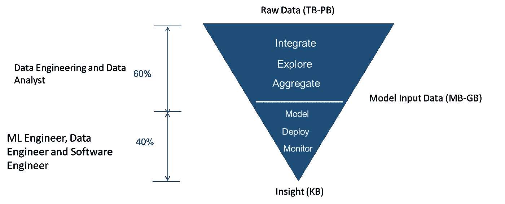
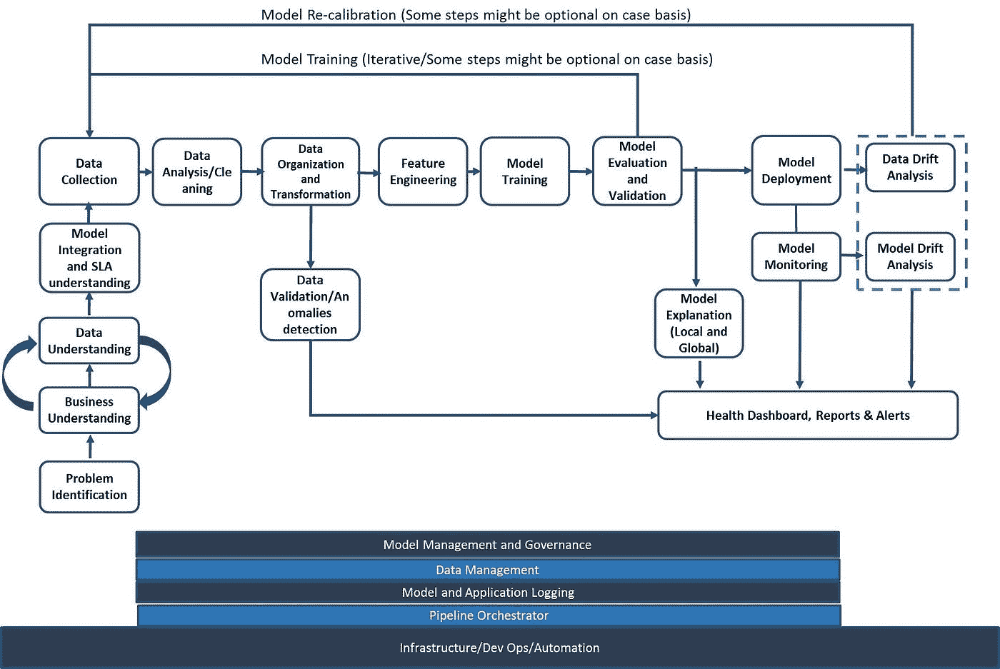

# 真实世界机器学习管道(ML 工程)

> 原文：<https://medium.datadriveninvestor.com/real-world-machine-learning-pipeline-ml-engineering-fc16e995250d?source=collection_archive---------2----------------------->

几个月前，我做了一个演示，强调了机器学习领域的学术/热门课程和企业之间的脱节。

长话短说对于大多数机构来说，数据科学都是关于最大似然算法和一些数据分析。数据工程在少数几所大学中很少涉及。

但是对于实施机器学习解决方案的企业来说，大部分时间和金钱都花在了数据收集、数据清洗、数据工程、模型部署、模型监控、开发运营、利益相关者沟通上。ML 算法是整个生命周期的一小部分。

 [## 金融中的机器学习|数据驱动的投资者

### 在我们讲述一些机器学习金融应用之前，我们先来了解一下什么是机器学习。机器…

www.datadriveninvestor.com](https://www.datadriveninvestor.com/2019/02/08/machine-learning-in-finance/) 

60%的机器学习工作实际上是为 ML 算法的工作准备数据(数据收集、数据分析、来自领域理解的特征工程), 25%的时间用于构建模型部署、模型监控等框架。不到 15%的时间花在编写包括特性选择、超参数调整、模型选择等的 ML 代码上。

有趣的是，在执行最后 15%时，我们也有 AutoML 框架来帮助我们完成部分或大部分工作。

企业面临的 5 大挑战也证实了 ML 代码(学术界关注的 15%的工作)虽然非常重要，但从来不是一个大挑战(感谢学术界对它的关注)。ML 实施面临的主要挑战包括

*   数据收集
*   在生产中部署和复制模型
*   模型监控
*   通过适应不断变化的业务场景来保持模型的相关性
*   向各种利益相关者传达和解释模型输出

虽然有很多内容，但这篇文章是为了**巩固我多年来为大型企业从事机器学习和数据工程项目的经验，并帮助学生、研究人员和该领域的新人了解真实世界的 ML 管道在典型企业中是什么样子的。**

我一直在发布关于这个主题的视频，涵盖现实世界机器学习的各个组成部分，并将继续这样做几个月。下面是如何在企业执行机器学习和人工智能项目的典型管道和视频中解释 ML 的组件

你也可以关注我的 YouTube 频道( [AIEngineering](https://www.youtube.com/channel/UCwBs8TLOogwyGd0GxHCp-Dw) )，在那里我一直在创作关于端到端机器学习生命周期的视频。

目前，业务理解、数据理解、数据收集和数据分析视频已经推出，并将于 2020 年 1 月上传其他组件。你可以查看我的 YouTube 播放列表中的大部分视频。

[结束 2 结束机器学习播放列表](https://www.youtube.com/playlist?list=PL3N9eeOlCrP6Y73-dOA5Meso7Dv7qYiUU)

 [## 人工智能工程

### 这个频道将发布“所有数据”的信息..我将通过该频道讨论的主题是机器…

www.youtube.com](https://www.youtube.com/channel/UCwBs8TLOogwyGd0GxHCp-Dw) 

要订阅我的频道，您可以使用上面的链接或点击链接— [AIEngineering](https://www.youtube.com/channel/UCwBs8TLOogwyGd0GxHCp-Dw?sub_confirmation=1) 。