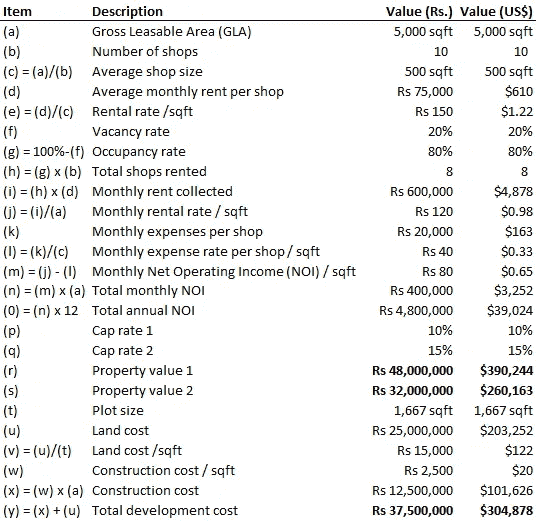

# 房地产现实核查——高估房地产回报

> 原文：<https://medium.datadriveninvestor.com/realty-reality-check-overestimating-property-returns-f06f5bb84fd9?source=collection_archive---------33----------------------->

在一次研讨会或讨论会上，我经常会提出十几个商业想法，这些想法都在寻求资金、员工资源和制造指南方面的建议，但我经常发现，这些想法甚至没有经过适当的基础审查。快速的信封背面分析通常表明，这些想法并不像他们可能假设的那样可行，而且创始人经常没有想清楚就开始比赛。一个人不能也不应该仅仅因为另一个企业家在执行这个想法时取得了财务上的成功，就想当然地认为一个复制并经过测试的想法对一个企业家来说是可行的。

最近，我与一家房地产初创公司进行了交谈，我发现他们明显高估了其商业模式的财务可行性，我在不到 10 分钟的问答中得出了这一结论。本文的目的是分享一些基本技术和步骤，介绍如何快速评估一个想法的财务可行性，并使接下来的讨论更接近现实和相关风险。从长远来看，这为每个人节省了大量的时间、精力甚至金钱。

**商业开发商**

我们如此习惯于将初创公司与移动应用开发者联系在一起，以至于当开发更加传统、更加实体的时候，我们有时会暂停一秒钟。在巴基斯坦，随着城市化、移民和中等收入家庭整体增加带来的人口增长，房地产繁荣已经持续了近十年。乘着房地产开发的浪潮，这家由四位年轻企业家和朋友组成的创业公司决定投身其中。当我听到他们在执行商业模式方面的需求和请求时，我意识到我并不完全确定基础商业模式本身是否会承诺年轻团队所期望的不成比例的高回报。我改变话题，首先测试商业模式假设。

讨论是这样进行的:

初创公司(SU):我们想建一个 3 层的商业广场，总可出租面积约 5000 平方英尺(GLA)。我们想租下这些店铺，然后可能卖掉它们。

沙特·马苏德(SM):大约有 8-10 家商店吗？

苏:准确地说是 10 家店。

SM:你认为整个房产每年能产生多少租金？

苏:卢比左右。一年一千万。

SM:好的。你对出售房产有什么期望？

苏:任何广场发电 Rs。每年 1000 万英镑的保证租金现金流，至少应该是年租金的 8 到 10 倍，不是吗？也许我们会在上市几年后出售它。

SM:让我们一步一步来。每平方英尺的预期月租金是多少？

苏:我们还没有计算每平方英尺。是关于 Rs 的。相邻广场类似规模的店铺每月 75，000 英镑。

SM:假设你的店铺平均面积为 500 平方英尺(5000 平方英尺除以 10 个店铺)，平均月租金为卢比。75，000，你的租金是卢比。每平方英尺 150 卢比。75，000 除以 500 平方英尺)。

苏:这样好吗？

SM:没有好坏之分。它的市场。你的入住率预期是多少？

苏:100%。需求稳定。

SM:只看你家附近的两个广场和“出租商店”的招牌，空置率似乎在 10%左右，甚至可能是 20%。

苏:*沉默*

SM:我建议我们假设 20%的空置率(即 80%的入住率)，这意味着一年内 10 个商铺中只有 8 个可以出租。这意味着你的整个财产将产生卢比。每月租金 600，000 英镑(8 间店铺 x 卢比。150/平方英尺 x 500 平方英尺)或每月租金卢比。120 英镑/平方英尺(卢比 600000 除以 5000 平方英尺)。所以你对 Rs 的假设。年租金 1000 万可能有点乐观。它更接近 Rs。按照我们的方法是 720 万。

苏:好吧，不激动但是还好。

你估计每个商店每月的平均开支是多少？

苏:大概 Rs。20,000.这包括所有运营费用，包括维护、维修、门卫、营销、公用事业等。

SM:好的。翻译成 Rs。每月费用为 40 英镑/平方英尺。记住你的平均月租金是卢比。120 英镑/平方英尺。这给你留下每月税前 [NOI(净营业收入)](https://www.thebalancesmb.com/calculate-net-operating-income-2866795)卢比。80 英镑/平方英尺。换句话说，你每月的总收入是卢比。40 万，每年的 NOI 是卢比。4,800,000.

苏:坦率地说，我们原指望能有更多的收入。

SM:很公平。让我们继续前进。对于像巴基斯这样的市场，为了达到财产价值(NOI/上限比率)，我们通常应该采用 10%到 15%之间的高[资本化比率](https://www.investopedia.com/terms/c/capitalizationrate.asp)(上限比率)。假设下限税率为 10%，该物业的估计市场价值为卢比。4800 万卢比。4，800，000 除以 10%)，而较高的上限税率会导致卢比的市场价值较低。3200 万卢比。480 万除以 15%)。

苏:*沉默*

SM:你建议了一个产生 Rs 的属性。1000 万英镑的租金应该是年租金的 8 到 10 倍。这将使你的财产价值预期在卢比。八千万到一亿。相反，我们到达了 Rs。这里有 3200 万到 4800 万。请注意，该价值是基于 8–10 倍的年 NOI，而不是租金。

苏:*沉默*

SM:土地收购费用总共是多少？

苏:Rs。1667 平方英尺面积 2500 万英镑。我们将在这里建 3 层楼，总面积为 5000 平方英尺。

SM:你应该假设在 Rs 左右。总建筑成本为 2500 卢比/平方英尺。1250 万卢比。2500/平方英尺 x 5,000 平方英尺)。这大概会使房地产开发总成本增加到 100 万卢比。3750 万卢比。2500 万卢比以上。12,500,000).

苏:所以你是说我们的总投资是 400 万卢比.3750 万卢比可能会产生一个价值之间的财产。三千二百万卢比。4800 万？我们真的会赔钱吗？

SM:正是如此！信封背面显示，你的月租金预期相差超过 100 卢比。230，000 英镑，即上涨近 30%，房产估价上涨近 50%。你可以通过提高入住率和租金，同时协商更好的建筑材料和劳动力来源，明显改善这些初步估计。

苏:**这与我们计划的回报相差甚远。我们认为，在最初几年，我们可能会获得 2-3 倍的投资回报。**

*该机会的逐步高级评估详情如下:*

by Saud Masud, Vector Partners

**灵敏度**

假设主要模型输入驱动因素在 10%范围内进行测试:

*   在其他条件相同的情况下，入住率增加 10 个百分点，即从 80%增加到 90%,将增加卢比的年 NOI。480 万卢比。570 万 **(+19%)** 。同样，入住率下降 10%将导致年度 NOI 下降 19%。
*   在其他条件相同的情况下，平均月租金上涨 10%，即从卢比。75000 卢比。82，500 卢比将增加每年的 NOI。480 万卢比。552 万 **(+15%)** 。类似地，月平均租金下降 10%会导致年 NOI 下降 15%。
*   在其他条件相同的情况下，每月运营费用增加 10%，即从 Rs。两万卢比。22，000 卢比将使每年的 NOI 从 480 万卢比减少到 100 万卢比。456 万 **(-5%)** 。同样，每月运营费用减少 10%会导致年度 NOI 增加 5%。

理论上，这三个杠杆应该同时推动，即在降低费用的同时提高入住率和月租金。现实世界的挑战是入住率对租金高度敏感，可能需要比预期更高的广告和营销费用才能达到最佳水平。为了更好地理解这些价值驱动因素的交叉敏感性，必须进行详细的可行性研究。

**相同的模式，不同的投资风险**

当我进一步询问苏团队最初为何如此急切地追求这种商业模式时，他们的回答是“因为某某之前通过出租和出售大楼赚了大钱——他获得了 10 倍的投资。”他们没有提到的是，执行这项业务的开发商潘不久前就这样做了，他有三个优势:

1.  他已经以低得多的价格拥有了这块土地，只是在他看到周围的商业建设势头加快时，才开始开发。那是七年前的事了。现在，这个街区已经人满为患，坦率地说，令人窒息。
2.  他有筹码。他利用低贷款利率抵押了他的其他财产，并借了高达 80%的总开发成本。
3.  可能是最重要的因素——时机。鉴于商业地产需求的上升，他能够在开业的第一年内实现 90%的入住率。一条主要的高速公路也连接到这个地区，这有助于提高房地产价值和租金。

因此，是的，鉴于低资本投资、杠杆和近乎完美的市场时机，这个鼓舞人心的案例研究可能会为他自己做得非常好。但当低挂的水果都被拿走时，这对第二、第三和第四个市场推动者来说是一个挑战。

因此，所有的商业模式，尤其是那些有意进入饱和空间的商业模式，必须谨慎行事。并不意味着没有一个可行的机会，但很可能它并不像你想象的那么光明灿烂。快速走一走——尽管如上所述，应该可以揭示现实检查的一瞥，这可能有助于在卷起袖子投入机会之前重新校准预期。