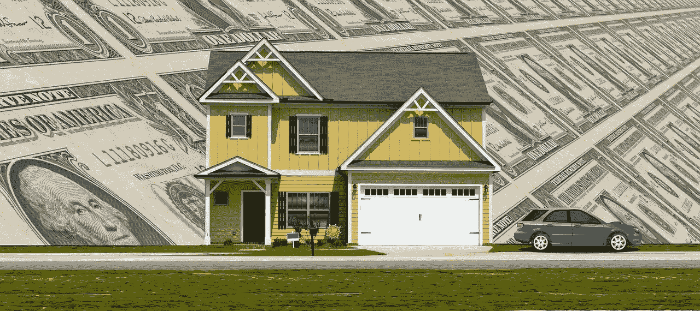
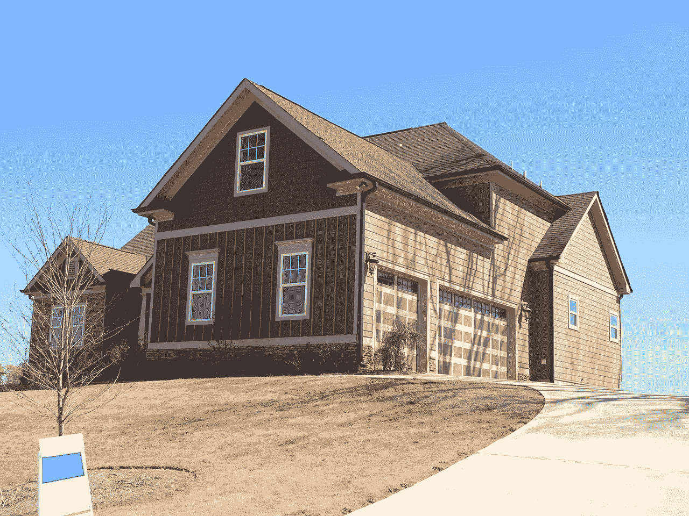
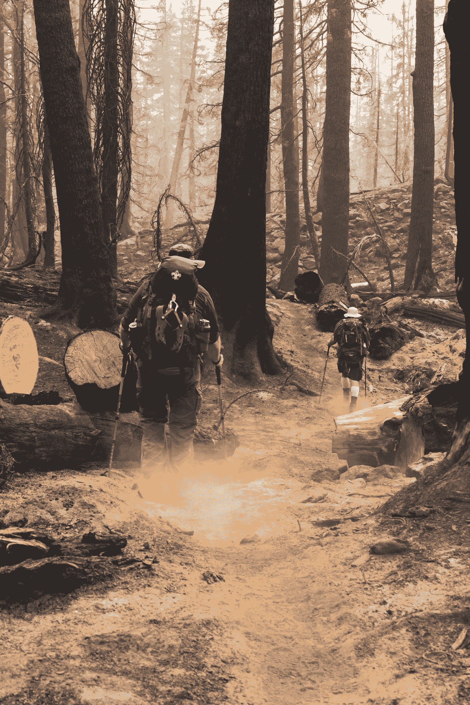

# 害怕房地产的理由

> 原文：<https://medium.datadriveninvestor.com/reasons-to-be-afraid-of-real-estate-9adde6276870?source=collection_archive---------9----------------------->

未来十年，每个人都有很多理由害怕房地产。事实上，房地产市场的风险威胁着整个经济和大多数其他投资。

你应该害怕房地产的几个最好的理由包括:

# 1.由于住房成本高得离谱，经济活动减少

例如，2019 年 1 月旧金山的平均公寓租金为每月 3772 美元，租金丛林[估计](https://www.rentjungle.com/average-rent-in-san-francisco-rent-trends/)。

在这种情况下，许多租房者几乎没有钱购买汽车和电子产品。因此，经济活动和就业机会将会减少。

其他影响包括劳动力短缺；更少的年轻人有孩子，这会降低长期的经济增长。具体来说，年轻人没有孩子是因为他们买不起房子。如果一对年轻夫妇买不起房子，他们会买所有的家具，导致经济增长更慢。

# 2.僵尸房产和抵押贷款

僵尸房产空置是因为租金或购买价格太高，没人买得起。

一只[丧尸的数量](https://www.thebalance.com/what-is-a-zombie-mortgage-4171885)；或水下抵押，超过了财产的价值。因此，业主不能通过出售房产收回他或她的投资。

不足为奇的是，许多僵尸房产最终都被止赎。事实上，僵尸房地产是 2008 年止赎危机的最大原因之一。

此外，许多僵尸财产最终被遗弃，这降低了财产价值。僵尸房产的长期影响包括财产税收入减少和政府成本增加。

# 3.零售业的末日

由于在线零售的繁荣，零售商店大量关闭，这对商业房地产是一个越来越大的威胁。例如，Douglas Elliman 的商业房地产经纪人计算，2018 年曼哈顿 20%的店面都是空的。

相应地，曼哈顿的租金也在下降，房东拒绝签署长期租约， *The Real Deal* [报道](https://therealdeal.com/2018/09/09/why-one-fifth-of-manhattan-storefronts-are-vacant/)。纽约市长比尔·白思豪非常担心，他正在考虑征收空置税，以迫使房东出租房屋。

此外，开发商将很快在城市市场上推出大量新的零售空间；像纽约、洛杉矶和丹佛，因为最近的建筑热潮。因此，商业地产崩溃可能即将来临。

# 4.老龄化的婴儿潮一代

美国婴儿潮一代；两党政策中心预计，1945 年至 1964 年间出生的人到 2030 年将出售 2600 万套住房。这可能会导致房地产市场崩溃，因为许多这样的房子将没有买家。

贫困将迫使许多婴儿潮一代卖掉他们的房子，*市场疯人院*T4 报道。解释一下，56 岁至 61 岁的人的家庭在 2018 年只有 17，000 美元的退休储蓄。

因此，许多人在退休后会很快花光所有的钱。因此，除了社会保障，他们将一无所有。然而，平均社会保障金额为每月 1，350 美元；或者一年 16000 美元。

令人不安的是，这些婴儿潮一代中的许多人将最终葬身水下；或者丧失抵押品赎回权，因为他们还没有还清抵押贷款。事实上，58%的最年轻的婴儿潮一代(1961 年至 1965 年出生的人)在 2018 年仍在支付抵押贷款。

此外，在 1945 年至 1951 年出生的最老的婴儿潮一代中，有近一半(49.4%)在 2018 年仍在支付抵押贷款， [*Market Mad House*](https://marketmadhouse.com/be-afraid-baby-boomers-have-not-paid-off-the-mortgage-yet/) 估计。显然，这些人中的许多人无法支付抵押贷款，不得不在某个时候卖掉房子。然而，由于房地产价格高，他们可能找不到买家。

# 5.气候变化

美国国家航空航天局和美国国家海洋和大气管理局(NOAA)估计，全球气温现在比 1951 年至 1980 年间高 1.5 度。此外，2018 年是有记录以来第四热的一年，*卫报* [计算](https://www.theguardian.com/environment/2019/feb/06/global-temperatures-2018-record-climate-change-global-warming)。

因此，像飓风、洪水和天堂大火这样的气候变化灾难将变得更加常见。这种灾难会降低沿岸、河边和森林地区的财产价值。

此外，“气候变化中产阶级化”已经在改变迈阿密和迈阿密海滩等城市的房地产价值。为了澄清这一点，气候变化中产阶级化发生在当富裕的人为了逃避海岸的洪水而搬到内陆的时候，市场疯人院报道。

此外，经济学家 [预测](https://riskybusiness.org/report/national/)到 2050 年，气候变化可能会淹没美国价值 230 亿美元的房地产。未来十年更有可能发生的情况是气候变化引发的超级风暴、洪水和火灾导致的区域性房地产崩盘。

相应地，20 世纪 20 年代佛罗里达州的[大崩盘](http://floridahistory.org/landboom.htm)部分是由 1926 年的迈阿密飓风引发的。具体来说，土地泡沫使佛罗里达州比全国其他地区更早陷入萧条。因此，气候变化可能导致真正的国家破产和地区萧条。

最后，这些风险只是冰山一角。房地产还有许多其他威胁，包括:收入不平等、经济适用房短缺、工资停滞、学生债务、通货膨胀、通货紧缩、零工经济、中产阶级化、住房危机、传统工作的消失、滞胀、技术性失业、利率上升、增税以及租金控制等政府行为。

在这种情况下，每个人都会害怕房地产。因此，在未来十年，投资房地产以外的东西将是一个明智的策略。