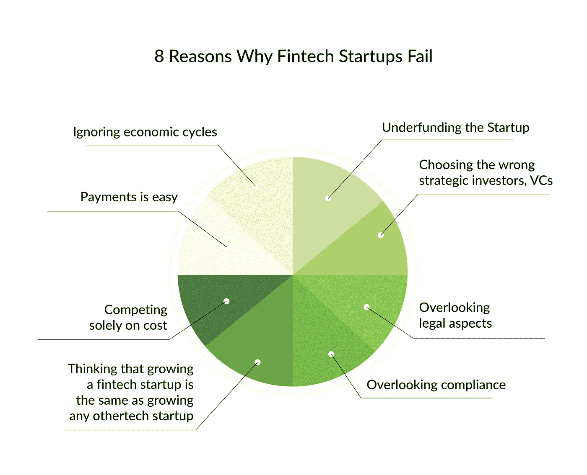
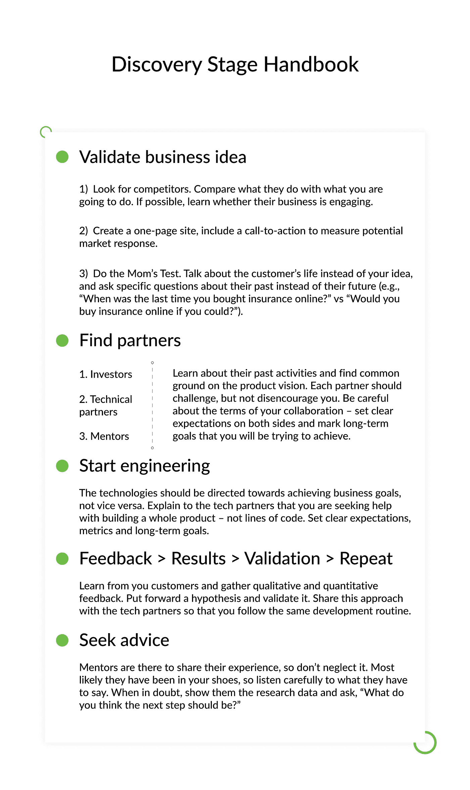
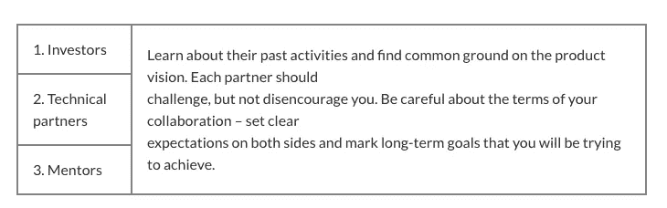

# 金融科技初创公司失败的原因以及如何在一年内不失败

> 原文：<https://medium.datadriveninvestor.com/reasons-why-fintech-startups-fail-and-how-not-to-fail-in-one-year-2f77b6018ce6?source=collection_archive---------3----------------------->

2019 年 1 月，一家名为 Small Biz Trends 的小型研究公司——以调查数字业务中最臭名昭著的营销活动背后的趋势和推理而闻名——发布了他们最近关于创业公司失败原因的研究结果。主要的教训是，10 个创业公司中有 9 个失败了，遗憾的是，原因并不完全清楚。

我对这类研究的钦佩之处在于，它没有专注于为年轻人和有抱负的人提供建议，也没有透露如何建立一家金融科技公司的秘密。相反，它是对那些决定涉足(或已经涉足)通常麻烦不断的创业领域的大胆者的一种预防措施。

[*在 Django Stars 博客上阅读原文。*](https://djangostars.com/blog/fintech-startup-handbook-not-fail-one-year/?utm_source=medium&utm_medium=medium.com%2Fdatadriveninvestor&utm_campaign=why%20fintech%20startups%20fail&utm_content=read%20original)

尽管试图抓住早期崩溃的十分之一的真正原因本身就是一个荒谬的想法(因为没有人真正了解它们)，但知情的观察家——如小企业趋势——知道一些创业成功的预测因素。这里就说 fintech 吧。如果你仔细想想，金融科技初创公司更像孩子——他们非常脆弱，不成熟，需要持续的关注和支持。就像对待孩子一样，你只有一两次成功的机会，行为不端(不遵守监管规定)的惩罚会毁掉你的未来。

 [## 分散金融的出现|数据驱动的投资者

### 当前的全球金融体系为拥有资源、知识和财富的人创造了巨大的财富

www.datadriveninvestor.com](https://www.datadriveninvestor.com/2019/03/14/the-emergence-of-decentralized-finance/) 

另一方面，对于大多数人来说，尝试立刻实现一个聪明的想法是值得的，但是即使是最好的想法，它也不是成功的主要预测因素。那是什么？已知的因素包括合适的市场适合度、有能力的技术团队、充足的资金和创始人的年龄。

惊讶吗？并不是所有的预测都可以归结为新产品的成功上市。小商业趋势指出:

> 首席执行官和董事缺乏经验会导致糟糕的决策，通常与快速扩张、雇佣不称职的员工以及建立成功文化的问题有关

麻省理工学院另一项著名的[研究是关于创业创始人的年龄和创业成功率之间的关系，该研究在年龄这个话题上得出了更激进的结论。成功的初创企业创始人的平均年龄似乎是 45 岁。“知识来自经验，”他们说。](https://hbr.org/2018/07/research-the-average-age-of-a-successful-startup-founder-is-45)

有趣的是，当一个人获得大学学位或辍学时——回想一下史蒂夫·乔布斯和比尔·盖茨的著名故事——他大约 22-24 岁，可能对商业一无所知。但创办公司并跻身 30 岁以下人群的愿望比研究数据显示的更强烈。还有很多类似的因素，有明显的也有不明显的。

这篇文章就是关于这些因素的。

# 市场因素

金融科技初创公司的成功——在没有外部投资的情况下执行业务功能的能力——只有通过所有业务部门的优质表现，在正确的时间针对正确的受众执行，才有可能实现。

实现市场适应性可以防止公司出现许多问题。一个问题导致另一个问题。当创始人有了一个想法，想要创建一个金融科技平台，但无法为初创公司提供资金时，他会寻找投资。投资促进快速发展。在发展过程中，营销可以忽略不计。没有营销导致错过市场契合度。没有市场契合度就意味着没有用户。没有收入导致资金不足。资金不足导致整个公司倒闭。

> 不幸的是，我们又一次犯了把重点放在工程第一，客户开发第二的错误。我们发布了第一个版本，取得了一定的成功，然后在不了解客户需求的情况下继续大量生产新功能。只是后来，在最终吸引潜在客户后，我们才意识到市场太小，价格太低，无法让 Caliper 独自支撑我们的公司。
> –***艾米·克尼斯***

那么，为什么一些初创公司一个接一个地获得了新一轮投资，而另一些却没有呢？

# 上市时间

金融科技初创公司发展的一个重要阶段是 MVP 向市场发布，早期采用者(第一批活跃用户)提供反馈并与社区分享的时期。之后根据反馈对产品进行改进，下一个版本是更适合用户的。

简而言之，专注于 MVP，找到利基，然后确定它，验证你的商业想法。你是怎么做到的？根据我的经验，我建议持续进行这些活动:

**1。市场调研。**谷歌一下竞争对手，看看是否有人已经在做你想做的事情。如果是这样，试试他们的产品，找出它的缺点。了解竞争对手是否抢手。如果没有，为什么？这要么是因为他们的服务解决了一个问题，但做得很差(对你来说是绿灯)，要么是不需要这样的产品(红灯——该转向了！).

**2。客户开发。**在你研究了你的竞争对手之后，你会有一套关于你的产品会引起人们兴趣的假设。客户开发是发现、测试和验证你的业务假设的活动。简而言之，你与你的客户交谈，看看你的业务是否朝着正确的方向发展，这个方向就是市场契合度。不要认为如果“他们就是不明白”，你就可以教育你的客户。下面的链接深入探讨了客户开发的细节。目前，请记住，您将会经常这样做。

[**产品经理客户开发指南**](https://producttribe.com/product-management/customer-development-guide?utm_source=medium&utm_medium=medium.com%2Fdatadriveninvestor&utm_campaign=why%20fintech%20startups%20fail&utm_content=read%20also%20customer%20dev%20guide)

**3。保持开发/营销平衡。对于每一个新版本，你都必须得到反馈。不管是积极的还是消极的，争取反馈。事实是，人们并不期望得到一个解决所有问题的产品。他们也不期望它在技术上是完美的。在早期阶段，你应该保持它足够好。花费预算来获得最好的 IT 产品会导致高端应用程序的出现，并且没有意识到它的存在，这反过来又会导致零投资回报。**

**4。准备好旋转。转向需要很大的勇气和金钱——也就是说，改变你的产品开发过程以满足客户的需求。畅销书《精益创业》(Lean Startup)的作者埃里克·赖斯(Eric Reis)创造了“pivot”一词，并将其推广开来。赖斯说，以下几个原因应该表明是时候转向了:**

*   竞争太激烈了
*   你不能按时生产产品
*   你得到的反馈很少甚至没有
*   你太专注于*那个改变游戏规则的功能*

这四种活动被认为是普遍的。在大约 20 年的时间里，它们在成功公司的高层管理者之间引发了各种各样的谈话、讲座和讨论，这些成功公司中的每一家都曾是初创公司。处理市场研究、客户开发、开发/营销平衡和准备转向增加了你运送人们可能发现有用的产品的机会。这将证明盈利能力，并吸引更多的投资，直到你的初创企业成为一个成熟、独立的企业。

如果你重新计划包括一个上市时间阶段(我希望我已经说服了你)，你会希望你的 MVP 尽快准备好。这取决于您选择的技术合作伙伴以及他们使用的技术组合。第二部分会详细介绍。

# 伙伴关系因素

当你想到一个绝妙的主意时，你可能独自一人。如果你幸运的话，你有一个和你一样热衷于此的合伙人(联合创始人)。但是，当你开始阐述这个想法时，你会发现自己获得了越来越多的合作伙伴——技术合作伙伴、投资者、导师等等。

金融服务业是一个非常特殊的行业，经验非常重要。哈佛商学院教授诺姆·乏色曼发现，65%的金融科技初创公司因联合创始人冲突而失败。下面是对合作伙伴的简要概述。

# 投资者

寻求融资的金融科技初创公司必须选择既有经验又了解这个领域的人。如果你决定选择网上银行或保险合作伙伴，考虑如何从受监管的金融服务机构筹集资金是至关重要的。金融科技初创公司必须询问是否需要监管机构的批准，并做出相应的计划。

在完成与现任者的投资之前，他们必须询问他们将需要什么类型的报告、什么类型的治理以及他们将需要什么类型的持续信息。这些组织在不同的规则和文化下工作。

# 技术合作伙伴

至于技术伙伴关系，你们必须有共同的长远眼光，以避免仓促决策。技术团队应该更加积极地参与创建金融科技应用程序，以满足上市时间的要求。上市时间版本是你的 MVP，足够好，市场足够好，可以获得第一批活跃用户。如果有的话，询问推荐人或作品集。

伟大的想法需要伟大的措施。无论你的想法有多棒，或者你是一个多么伟大的专业人士，你都不能自己做所有的事情。你不想在你的产品上市前就完全耗尽，对吗？此外，你应该能够退一步，从远处看你的产品，以看到更大的画面。这就是为什么你需要…

一个成熟的技术提供商可以用以前开发的金融科技应用程序和客户记录的成功故事来支持他们的说法。小心技术优先的方法。有时候，为了使用技术而使用技术。永远记住，技术只是实现业务目标的一种手段。对于面向市场的产品和快速 MVP 开发的共同态度和方法是一个伟大的技术合作伙伴的基础。

Django Stars 已经开发 Python/Django fintech 产品十年了，我们对这项技术的全面参与帮助我们变得精通并专注于快速营销 MVP。

我们已经为初创公司编写了一个关于[使用 Python/Django 的单独指南，所以如果你正在选择这项技术，你可能会发现它很有用。](https://djangostars.com/blog/python-best-programming-language-for-startup/?utm_source=medium&utm_medium=medium.com%2Fdatadriveninvestor&utm_campaign=why%20fintech%20startups%20fail&utm_content=using%20Python%2FDjango%20for%20startups)

## 您可能还喜欢:

 [## 构建金融科技产品之前你需要考虑的问题

### 我喜欢金融的一点是，这个行业和时间一样古老——然而，很少有人敢进入它。幸运的是…

djangostars.com](https://djangostars.com/blog/what-you-need-to-consider-before-building-a-fintech-product/?utm_source=medium&utm_medium=medium.com%2Fdatadriveninvestor&utm_campaign=why%20fintech%20startups%20fail&utm_content=you%20may%20also%20like) 

# 导师

有一个创业导师[会让你的晋升机会增加五倍](http://archive.fortune.com/2007/03/12/news/economy/mentoring.fortune/index.htm)。与其他合作关系一样，选择这个合作伙伴时，你必须小心谨慎。仅仅找到一个更有经验的经理是行不通的。相反，起作用的是找出你的差距，并找到能帮你弥补这些差距的人。像拼图一样。导师与联合创始人的不同之处在于，导师会挑战你的想法、观点和商业决策，让你考虑其他观点，同时用他们自己的经验来指导你。不过，他们不应该每天都拒绝你的建议。选择一个可信的、有同情心的、在经验方面比你高几级的人。你的观点也应该一致，因为导师不仅会对金融科技软件开发做出贡献，也会对公司文化做出贡献。

# 探索阶段手册

**验证商业理念**

1.  寻找竞争对手。将他们所做的与你将要做的进行比较。如果可能的话，了解他们的业务是否吸引人。
2.  创建一个单页网站，包括行动号召，以衡量潜在的市场反应。
3.  做[妈妈的测试](http://momtestbook.com/)。谈论客户的生活而不是你的想法，询问关于他们的过去而不是未来的具体问题(例如，“你最后一次在网上购买保险是什么时候？”vs“如果可以，你会在网上购买保险吗？”).

**寻找合作伙伴**

**反馈>结果>验证>重复。**向客户学习，收集定性和定量反馈。提出一个假设并验证它。与技术合作伙伴分享这种方法，以便您遵循相同的开发程序。

**开始工程。**技术应该指向实现业务目标，而不是相反。向技术合作伙伴解释你正在寻求帮助来构建一个完整的**产品**——而不是几行代码。设定明确的期望、衡量标准和长期目标。

**求教。**导师是来分享经验的，所以不要忽视。很有可能他们曾经和你一样，所以仔细听听他们要说什么。有疑问的时候，给他们看研究数据，问“你觉得下一步应该怎么做？”

我希望你从这篇文章中得出的结论是，你计划得越多，你以后遭受的痛苦就越少。这需要时间和努力，这也是为什么不是每个企业家都超越想法阶段的一个原因。即使在那之后，大多数创业公司还是会失败，而且失败得很惨。专注于市场适应性会减少你构建一个简洁但低需求的应用程序的机会。我经常提醒我的同事们的一件事是，尽管我们与计算机、代码和数据打交道，但我们是为了人而工作的。这就把工程师的重心从写代码转移到了回答人们的需求上。因此，越来越少的公司成为失败创业公司新闻报道的主题。

> 这篇关于 [**为什么金融科技创业公司失败**](https://djangostars.com/blog/fintech-startup-handbook-not-fail-one-year/?utm_source=medium&utm_medium=medium.com%2Fdatadriveninvestor&utm_campaign=why%20fintech%20startups%20fail&utm_content=originally%20posted) 的文章最初发表在 **Django Stars 博客上。**