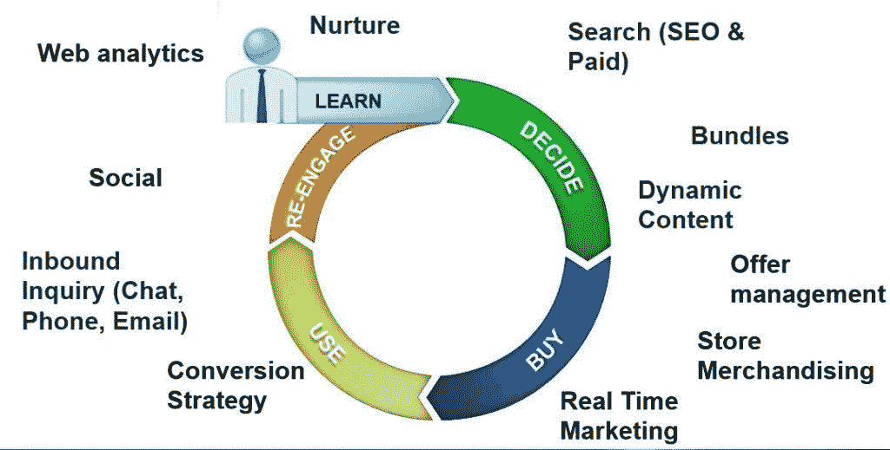
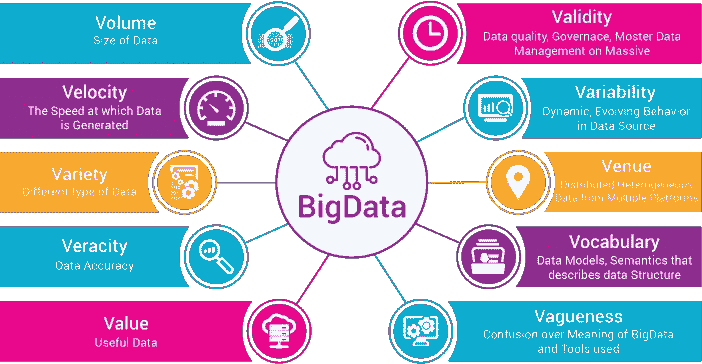

# 您应该在数字营销中采用大数据分析的原因

> 原文：<https://medium.datadriveninvestor.com/reasons-you-should-embrace-big-data-analytics-when-doing-digital-marketing-in-singapore-8d3a837a61dd?source=collection_archive---------4----------------------->

新加坡拥有全球最高的数字消费率。83%居住在该国的新加坡人是活跃的社交媒体用户，随着越来越多的人和企业接受网络平台，这一数字预计将继续增加。

基于这些统计数据，不难看出为什么企业和个人营销者热衷于利用[最佳数字营销策略](https://mediaonemarketing.com.sg/digital-marketing-services/)来联系潜在客户。在本文中，我们将讨论在新加坡进行数字营销时，为什么您应该采用新兴技术之一，即大数据分析。

# 实时获得消费者洞察

一些数字营销活动未能达到预期效果的原因之一是，它们没有考虑到消费者的需求。[大数据分析](https://www.searchenginejournal.com/big-data-and-the-new-limits-of-google-analytics/66642/)可以帮助营销人员清楚地了解他们的目标受众。

 [## 为什么数据将改变投资管理|数据驱动的投资者

### 有人称之为“新石油”虽然它与黑金没有什么相似之处，但它的不断商品化…

www.datadriveninvestor.com](https://www.datadriveninvestor.com/2019/01/25/why-data-will-transform-investment-management/) 

识别和了解目标受众有助于他们在竞争中领先，因为他们能够准确友好地满足潜在客户的需求和期望。情感分析广泛用于分析顾客对品牌、产品和服务的感受。这种分析也被称为意见挖掘。

情感分析主要依靠自然语言处理和文本分析来理解目标消费者的态度、观点和感受。下面是这种形式的分析所带来的好处的总结。

*   根据客户的意见帮助优化营销策略
*   Pin 指出了品牌的优势和劣势
*   帮助改善客户服务
*   在产品创造和质量评估过程中提供见解
*   发现新的商业机会

# 个性化定位

成功的数字营销活动的关键是个性化。你需要在正确的时间吸引客户，并使用正确的信息。得益于大数据，现在您可以[为目标客户的每个细分市场](https://www.forbes.com/sites/lilachbullock/2018/12/28/5-brands-taking-personalized-marketing-to-the-next-level/)创建有针对性的个性化营销活动。

简而言之，个性化营销是基于数据分析报告创建并向受众传递信息的过程。浏览历史、购买历史、地理位置和点击流行为等消费者数据决定了信息和信息传递给受众的时间。

下面是一些个性化营销的例子。

1.  **产品推荐:**通过分析客户的购买行为，营销人员能够理解他们的意图，并提供相关的产品推荐。亚马逊是精通这一艺术的电子商务公司之一。它利用以前的购买历史、搜索和兴趣来决定推荐哪些产品。
2.  **定向电子邮件:**通过使用大数据，营销人员能够个性化电子邮件营销活动。也就是说，他们能够在正确的时间向正确的人发送正确的电子邮件。个性化信息有助于与客户建立个人联系，进而鼓励潜在客户点击 CTA 按钮。
3.  **定向广告:**浏览历史等所有收集到的数据均可用于创建定向广告。此类广告通过确保广告只展示给已经处于购买周期的潜在客户，对广告活动产生了重大影响。

# 增加销售额

大数据分析有助于公司收集更多关于现有和潜在客户的信息。诸如他们购买特定产品的频率和首选支付方案等信息使他们能够在正确的时间向他们提供正确的报价。事实证明，这种准确性在增加销售额方面非常有效。

# 产品需求预测

当离线或在线经营企业时，确保有足够的股票满足市场需求是至关重要的。不幸的是，传统的数据分析方法不准确，并且总是会导致损失。大数据分析与众不同，它通过使用预测性和规定性分析来准确监控市场和预测需求。

有了这些有价值的信息，您可以决定生产哪种产品，何时生产，在哪里销售，以及生产多少。

# 什么是预测分析

预测分析着眼于市场未来的动向。

# 什么是规定性分析

[说明性分析](https://www.predictiveanalyticstoday.com/what-is-predictive-analytics/)根据预测提供建议或建议。

两种分析方法共同降低了库存耗尽的风险。它们还能提高生产效率，并将损失降至最低。

# 价格优化

知道如何给产品定价是数字营销人员面临的一个主要挑战。大数据分析通过帮助公司基于以下因素了解每种产品的最佳价格来解决这一问题:

*   季节性价格
*   商品成本
*   变量成本
*   竞争对手价格

简而言之，价格优化有能力最大限度地提高收入和销售额。

# 预算优化

预算优化是新加坡数字营销人员面临的主要挑战之一。你应该问的一个问题是，客户是否直接访问网站并下订单？这种情况很少发生。在当前的数字时代，大多数在线客户使用社交媒体等各种在线平台和 Yelp 等网站上发布的评论来确定特定产品是否值得他们花钱，是否能够满足他们的需求。

通过采用大数据分析，您可以在客户准确购买之前监控他们的动向。您还将确定转化路径中的接触点，并相应地优化它们，以获得最大的投资回报。

更重要的是，您将能够持续监控每个活动的表现。因此，你会知道哪个渠道应该分配更多的钱，哪个渠道应该靠边站或者完全取消。

# 结束语

任何想要在竞争中领先的数字营销人员都应该考虑利用大数据分析。该报告不仅会对数字营销活动产生积极影响，还会通过识别大多数人用来在线查找产品和网站的短语来影响搜索引擎优化活动。