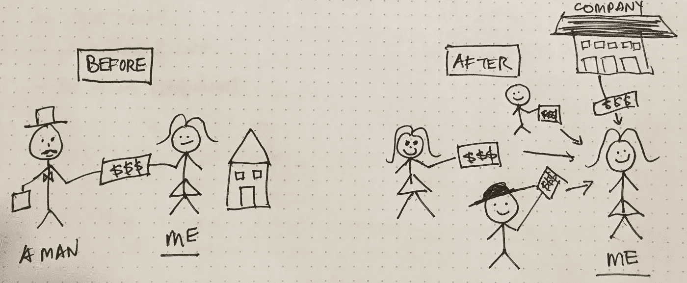
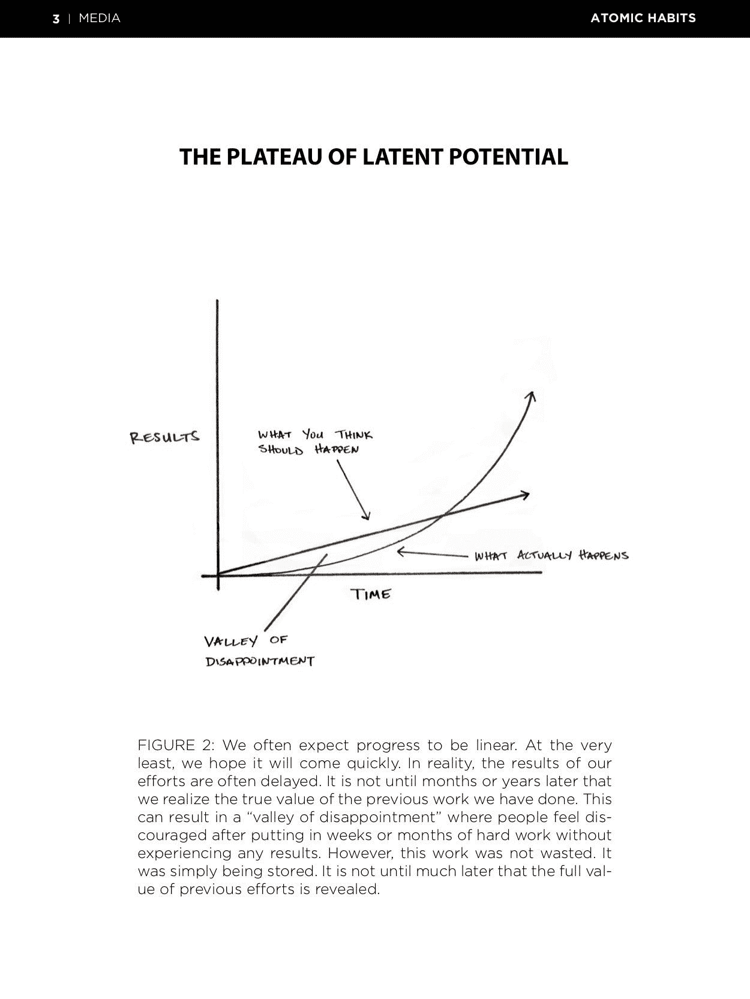
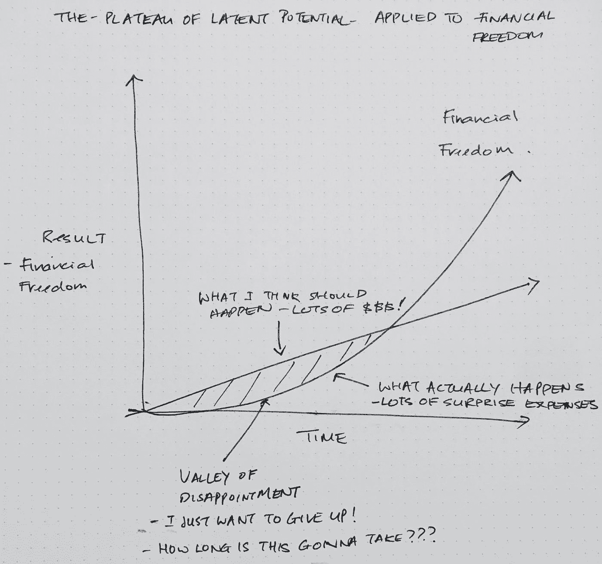
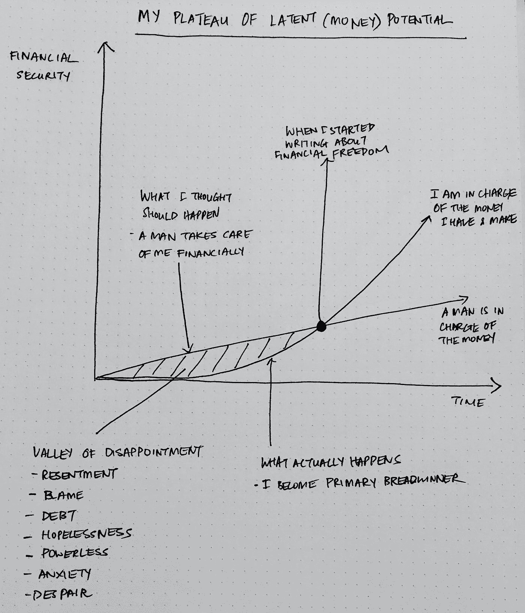

# 重建你的身份以获得财务自由

> 原文：<https://medium.datadriveninvestor.com/rebuild-your-identity-to-become-financially-free-388826a8ba7d?source=collection_archive---------7----------------------->

我只是不擅长理财。

他处理所有的钱的事情。

“是的，他可能是个风流鬼，但他会照顾好这个家，”

我总是没有足够的钱，我宁愿不去想它，也不去看我的银行账户。

当涉及到钱的时候，我真的听到女人们告诉我这些话，包括我自己。

两年前，当我发现自己陷入债务和痛苦时，我决定必须改变一些事情。

# 潜在潜力的平稳期

在他的《原子习惯》一书中，詹姆斯清楚地谈到了潜在的高原:

虽然詹姆斯在建立习惯的背景下谈到了潜在潜力的高原，但这也适用于建立财务自由的生活:

这种潜在潜力概念的高原帮助我意识到，我持有的金钱脚本阻碍了我过上我想要的生活。

它看起来像这样:

# 我的资金脚本—之前…

我生长在一个典型的中上阶层家庭。

爸爸是唯一养家糊口的人，妈妈照顾我们。

他们都努力工作，给我们一个良好的，舒适的生活，完成了大学教育，完全支付生活的开端。

如果没有他们为我们牺牲的一切，我不会有今天。

我们的环境和成长决定了我们成为什么样的人。

在我的成长过程中，我从来不需要担心钱。

总有人为此做准备。

这是我成年后的金钱故事。

不幸的是，它让我陷入了失望的深渊。

在我的失望之谷，伴随我的是怨恨、责备、债务、绝望、无力、焦虑和绝望。

没有人教我如何从心理上管理我的钱，也没有人教我如何意识到我无意识地告诉自己的钱的故事，这些故事是随着时间的推移积累起来的。

直到很久以后，当它表现为生活中的不快乐、压力、怨恨、债务和不快乐时，我才意识到有些不对劲。

我知道有些事情必须改变。

# …之后呢

我寻找幸福和财务自由的旅程让我想到了[布拉德&泰德·克隆兹](https://amzn.to/2R92M8Q)、[凯伦·麦考尔](https://amzn.to/2SigoM8)以及金钱不仅仅是储蓄、投资和股票市场的想法。那只是冰山一角。

在表象之下，有很大一部分与围绕金钱的心理和成瘾行为有关。

我们都知道储蓄和投资的基本知识。

但是为什么我们更多的人不去做呢？

当我继续寻找时，我发现了詹姆斯·克利尔。他的书[原子习惯](https://amzn.to/2BzPHvx)帮我理清了这个问题。

更重要的是，它就如何改变我们有时不健康的行为给出了实用的建议——就我而言，就是围绕金钱。

詹姆斯认为，我们大多数人没有做我们需要做的事情，不是因为我们不够聪明或不够好。

这是因为我们没有合适的系统。

系统区分赢家和输家，富人和穷人，成功者和失败者。

我意识到一些找到成功和人生意义的人也在说类似的话。

Jocko Willink 在 Jordan Harbinger show 中谈到了这一点，他们讨论了在通往成功的道路上，纪律如何比(短暂的和暂时的)动机更重要和更持久。

那么，我们如何做我们需要做的事情，尤其是当我们不喜欢它的时候？

# 爱上无聊

是啊。听起来很无聊。

詹姆斯·克利尔建议，爱上无聊才能获得持久的结果。

不仅仅是我们*做了*才能得到结果。当然，行动很重要。行动让我们到达我们想去的地方。

但是成功的关键在于我们有能力爱上日复一日长期执行这些行动所带来的无聊。

然而，这不是我们想听到的。

我们想要快速致富的故事，一夜成功的故事。

我们大多数人没有听说过的是，那些“一夜之间”的成功是几个月甚至几年持续而乏味的努力和工作的积累。

让我们面对现实吧，日复一日地做同样的事情，真是…无聊。

然而，这是通往精通的道路——做太多的事情就成了第二天性。

因为正是这种每天都在努力的一致性，特别是当我们不喜欢它的时候，它会随着时间的推移而储存和积累，成为“一夜成功”背后的努力和辛勤工作。

> *习惯是个人发展的复利。~詹姆斯清楚，原子习惯*

在我们的习惯系统中加入定期反思和微调，我们就能达到精通，达到我们游戏的顶端。

# 重建我的金钱身份

当我开始大声疾呼女性需要掌管自己的钱以获得经济独立和自由时，我也在围绕金钱重建自己的身份，尽管当时我并不知道。

以下是我赚钱前后的身份:

I relate better visually. Although I’m a terrible artist, this picture helps me keep my purpose — to create value for others and make my own money — front and centre in my mind’s eye.

大多数人决定改变他们的行为，但没有改变导致我们过去行为的潜在信念。

虽然我们有了新的计划(变得财务自由)，但我们并没有改变我们是谁(相信一个男人会支持我)。

当我决定在经济上独立和自由时，我也采取措施改变我对金钱的基本信念和认同:

1.  接受并为自己是主要的养家糊口者而自豪——这是最难的，但是和其他挣得比她们男人多的女人在一起对我有很大的帮助。
2.  大声说出我作为主要养家糊口者的角色，而不是为此感到羞愧。这是我博客存在的全部理由。
3.  采取小而具体的行动来获得赚钱和增加财富的知识。这让我写了一些关于[阻止我的钱泄露](http://www.sharonrajsingh.com/stop-your-money-leaks/)，[减少利息支付](http://www.sharonrajsingh.com/take-advantage-of-balance-transfers-to-kill-debt/)，让[对金钱有正确的心态](http://www.sharonrajsingh.com/how-to-become-financially-free/)，[积累储蓄](http://www.sharonrajsingh.com/forget-saving-for-emergency-funds-do-this-instead-to-be-debt-free/)，[协商更高的工资](http://www.mommymakesthemoney.com/negotiate-your-salary/)，[过上富裕的生活](http://www.sharonrajsingh.com/what-seeing-the-northern-lights-taught-me-about-living-a-rich-life/)以及更多我将继续谈论的内容。

有时候我觉得我的失望之谷永远不会结束。然后，我会对我写的一篇文章投入很多，鼓励我，也许我说的话有一些价值。

不管怎样，至少现在我知道成功不是线性的，可能比我希望的要长。

我只能继续前进。

你也是。

你的成功之旅是怎样的？我很想听听。如果和你预想的不太一样，无论好坏，请在下面的评论中分享吧！

*原载于 2018 年 12 月 24 日*[*www.sharonrajsingh.com*](http://www.sharonrajsingh.com/rebuild-your-identity-to-become-financially-free/)*。*

*下载我的* [*免费分步指南 14 天掌控你的钱*](http://www.mommymakesthemoney.com/financial-freedom-roadmap/) *。*