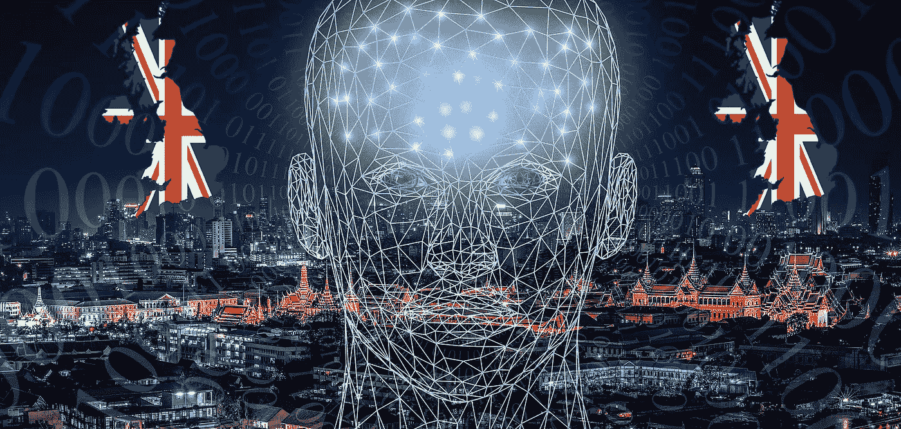

# 最近关于人工智能的 ICO 指南草案

> 原文：<https://medium.datadriveninvestor.com/recent-draft-ico-guide-on-artificial-intelligence-588b8cb063f6?source=collection_archive---------8----------------------->

人工智能的现象无疑正在增长:它的使用“自动化”了一系列活动，在此之前，这是人类手臂和大脑的独有特权。

我们必须关注的不是担心人类会被思维机器立即取代，而是有意识地、负责任地使用数据，这些数据用于思维机器的操作和互动。

我们已经在工作访谈中分析了与人工智能系统的交互，在伊利诺伊州受到监管(你可以在这里阅读我的深入介绍)，以及由挪威数据保护局(Norwegian Authority for Data Protection)做出的第一个“监管者”和澄清者干预，关于遵守 GDPR 的主要紧张关系(我的另一个深入介绍在这里)。

显然，没有一个国家能够幸免于对这一现象的分析和研究，这一现象与其他技术创新一道，代表着从社会到经济各个部门的未来。

最近的讲话来自*英国信息专员办公室(“ICO”)*与*艾伦图灵研究所*的会议，该会议导致了一个由三部分组成的磋商，以解释人工智能所做的决定，名为**“项目解释”**。这一举措诞生于 2018 年年中，由于英国在人工智能发展方面的优先承诺，它不是《数据保护法》的必然结果，而只是一个最佳实践指南，用于向人工智能决策系统的参与者解释数据处理。

第一部分是针对个人数据领域的专业人士(DPO)，即那些直接参与该现象发展的人，他们必须能够确保适当的隐私和合规性，将一切都铭记在*可解释的概念上*。

第二部分主要集中在实践和经验方面，向个人解释人工智能技术的功能。

 [## 挑战你对人工智能和社会看法的 4 本书|数据驱动的投资者

### 深度学习、像人类一样思考的机器人、人工智能、神经网络——这些技术引发了…

www.datadriveninvestor.com](https://www.datadriveninvestor.com/2019/02/28/4-books-on-ai/) 

第三部分旨在创建一个关于角色、流程和文档的指南，每个公司都必须准备这些指南，以便详尽地向利益相关者提供答案。

《GDPR》和《数据保护法》都已经包括了关于个人数据的特征描述、自动化处理和自动化大规模决策的具体规定，从而也规范了人工智能的使用，使其尊重 GDPR 规定的公平、透明和问责原则。

《GDPR》第 13 条第 2 款 f)项明确要求数据控制者就以下方面主动与数据主体进行沟通:"*是否存在第 22 条第(1)款和第(4)款提及的自动决策，包括特征分析，以及至少在这些情况下，有关所涉逻辑的有意义的信息，以及这种处理对数据主体*的意义和预期后果"。

第 15 条第 1 款 h)项还规定:"*数据主体应有权从控制者处获得关于其个人数据是否正在被处理的确认，如果是，有权查阅个人数据和以下信息*(同上)。

在该文件中，ICO 列出了一系列原则来帮助解释这种情况，确切地说是六个原则，如下所示:

- *基本原理解释*:以简单且非技术性的方式解释导致决策的原因，这也有助于公司遵守 GDPR。

- *职责解释*:谁参与了人工智能系统的开发、管理和实施，如果有的话，联系谁对决策进行“人工”审查。

- *数据解释*:在特定决策中使用了哪些数据，如何使用；使用了哪些数据来训练和测试人工智能模型，以及如何进行。

- *公平性解释*:在设计和实现一个 AI 系统时所采取的措施，以确保其决策总体上是公正和公平的，以及一个人是否得到了公平的对待。

- *安全和性能解释*:人工智能系统的设计和实现阶段，以最大限度地提高其决策和行为的准确性、可靠性、安全性和合理性。

- *影响解释*:人工智能系统的使用及其决策对个人和整个社会已经或可能产生的影响。

ICO 不止于此，还为公司制定了四项指导原则:

I .透明:使模型输出的技术逻辑易于理解，并提供有关个人易于评估的简单动机；

二。负责任:考虑 IA 系统的设计和实施的每个阶段的责任，以及设计和实施过程是否对于整个项目是可追踪和可验证的；

三。考虑公司运营的背景；

四。反思公司的人工智能对相关个人和整个社会的影响，例如，模型是否经过设计、验证和确认，以确保其安全性、准确性、可靠性和鲁棒性。

根据这些“建议”，数据控制者有责任确保任何人工智能系统(其开发已委托给外部机构)都是可适当解释的，如果存在人类理解不了的“不透明”算法技术，公司将有义务提供额外的风险预防措施，并且任何类型的“异常”都可以预测、分析、评估和缓解(可能通过可能包括决策树或规则列表、线性回归、基于特定案例的推理或逻辑回归的技术)。在这里，该文档进入了更纯技术用例的优点，例如黑盒人工智能系统的情况，包括神经网络和随机森林，只有在仔细考虑了它们的潜在影响和风险后，才应该使用它们；并根据决策过程是否可分解为几个阶段，或者相反由于其复杂性内部逻辑完全无法访问，如黑盒系统，区分了人工智能模型的单个结果的解释(定义为“局部解释”)和它如何通过所有结果工作的解释(所谓的“全局解释”)，以及内在和外在解释。

最后，ICO 警告称，在人工智能的帮助下，未能解释决策的公司可能会面临监管行动、声誉受损和公众回避。

在指南草案的附录中，ICO 为技术人员指出了正确实施自动化系统的一些关键步骤，该附录的答复将很快提交，不迟于 2020 年 1 月 24 日；它们可以被总结为两种类型的行为:对人工智能系统的解释，这表明在设计和使用过程中遵循了最佳治理实践；用简单的语言阐明结果的解释，以及人类判断有用性背后的原因，由人工智能系统的输出“增加”。

版权所有

***拉斐尔·阿格莫，律师***