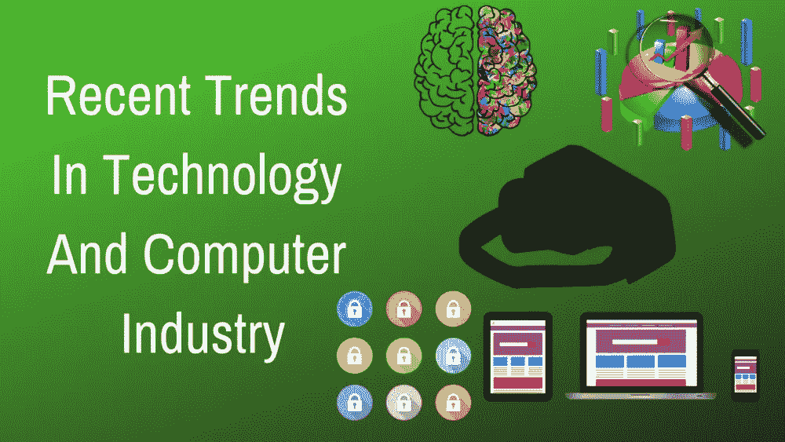

# 技术和计算机工业的最新趋势

> 原文：<https://medium.datadriveninvestor.com/recent-trends-in-technology-and-computer-industry-a96ed434ae4?source=collection_archive---------30----------------------->

2018 年，技术和计算机行业取得了巨大的进步。先前的一些趋势开始迅速赶上，许多新的趋势也出现了。这些技术趋势在 2019 年会变得更大。让我们来看看这些新兴趋势，以及今年将会发生什么。

# 人工智能和机器学习

人工智能(AI)和机器学习(ML)都不是什么闻所未闻的东西。然而，每当讨论未来技术的话题时，这两个话题突然变成了强制性的话题。这两个趋势已经不在研究阶段了。他们已经从 2018 年开始了他们的工业化之旅，并且正在快速增长。

2019 年，人工智能和人工智能将覆盖更广泛的受众，我所说的受众不仅指开发人员和程序员，还包括普通公众。 ***如何？*** 你可能会问！嗯，AI 和 ML 将广泛用于移动应用程序和 web 应用程序/网站。这当然意味着开发者和营销人员的生意会更好，但它也可以通过提供更好的体验来让消费者或应用程序用户受益。

这些并不是我们在 2019 年将要看到的全部。这个领域还会有更多的东西出现，从机器人技术，语音助手，甚至医疗保健。更详细的阅读可以参考我关于 [**人工智能的文章**](https://debuggercafe.com/artificial-intelligencene-in-2019/) 。

# 大数据分析

如果 ML 和 AI 要走在计算机行业的最前沿，那么就应该有东西推动这两种技术向前发展。这就是数据分析或大数据发挥作用的地方。

机器学习和人工智能的进步只有通过提取、处理和分析每天产生的大量数据才有可能实现。必须考虑到这一点，我们谈论的是从每个领域和领域产生的数据，而不仅仅是任何特定的行业。

事实上，几乎每一个连接到互联网的设备都会产生数据，这就增加了数据量。这也包括网络、手机和物联网设备。即便如此，我们还可以更深入地研究某个特定的行业，比如股票市场。从股票市场互动中产生的数据使得对它们进行分析并做出正确的未来预测变得更加困难和紧迫。

不仅如此。大数据的市场也在逐年增长。你可以看看下面的静态数据:

根据这一数据，到 2026 年，大数据市场将价值 950 亿美元。你可以访问这篇 [**福布斯**](https://www.forbes.com/sites/louiscolumbus/2018/05/23/10-charts-that-will-change-your-perspective-of-big-datas-growth/#486038f62926) 的帖子，了解更多信息。如果你想更深入地了解统计数据，你可以访问 [**Statista**](https://www.statista.com/statistics/255970/global-big-data-market-forecast-by-segment/) 。

这些预测只是针对未来 8 年的。想象一下我们在未来 20 年或者 50 年将会遇到的增长吧！

# 增强现实和虚拟现实

增强现实和虚拟现实通常简称为 AR 和 VR，它们也在迅速发展。

这两个听起来非常相似，但在许多方面彼此不同。虚拟现实最常见的体验是通过虚拟现实头戴式耳机，这些头戴式耳机通常模拟真实世界或虚拟环境，用户可以通过几乎逼真的视觉和视野来体验。基于虚拟现实的视频游戏是最常见的例子。

另一方面，AR 模拟真实世界环境中的虚拟对象。如今，AR 最常用于医疗保健、导航、建筑等领域。还有更多的例子。更详细的阅读，你可以参考这篇**文章 [**这里**](https://www.wareable.com/ar/real-world-ar-uses-6382) 。**

**AR 和 VR 真的会改变我们体验事物的方式。他们只是被推动去做几乎所有需要测试的，可能对人类造成危害的事情。视频游戏、电影、飞机测试、医疗都是最常见的例子。也许 AR 和 VR 最深刻的影响会在未来的教育行业看到。这两项技术将使学习成为完全沉浸式的逼真体验。**

**显然，它们也将在其他领域产生同样的影响。这些技术能走多远，这些想法能多快实现，还有待观察。**

# **网络安全**

**大多数经常关注科技的人都会熟悉网络安全。还是来个正式的介绍， ***什么是网络安全？*****

**网络安全是保护计算机系统及其数据免受未经授权的访问、攻击和破坏。好吧，我们大多数人可能会想， ***我们这么做已经很多年了，2019 年会有什么变化？*** 其实，这个领域里很多东西都要发生变化。甚至可以说，2018 年以来的大部分变化都是可以观察到的。**

**到目前为止，我们大多数人都意识到了人工智能在计算机行业的发展。现在，人工智能也被用于网络安全。显然，更多的增长仍有待观察。但是，人工智能将如何在这一领域提供帮助呢？**

**与传统方法相比，人工智能可以更好、更快地检测出计算机网络中的漏洞。许多新的科技创业公司正在关注这一领域，投资者也在向这些领域投入资金。这不应该让人感到意外。毕竟，安全是每个人的，无论是小型创业公司还是大型现有组织。**

**那么，这是否意味着我们都不会受到类似 [**网络恐怖主义**](https://en.wikipedia.org/wiki/Cyberterrorism) 和 [**网络战**](https://en.wikipedia.org/wiki/Cyberwarfare) 的威胁。在一定程度上可以肯定。如果安全标准正在得到提高，那么这些所谓的网络攻击者的攻击方法也在提高。据预测，黑客和网络攻击者也将为自己的目的使用人工智能。这使得提高赌注变得更加困难。在一个非常简单(但也很复杂)的场景中，这可以从字面上称为人工智能对人工智能。**

**那么，它真的在这里吗？每个人都害怕的事情是，我们将在战争中使用人工智能。也许网络战只是个开始，很快我们就会在真正的战场上使用它们。这种想法可能令人望而生畏，但也许我们正在朝着这个方向前进。我们只能希望 ***这场战斗只留在网络世界*** 。**

**无论如何，看起来我们将在 2019 年对网络安全的处理方式进行一些彻底的改变。如果你真的想进入主题，你可以阅读文章—[**2019 年 60 个网络安全预测**](https://www.forbes.com/sites/gilpress/2018/12/03/60-cybersecurity-predictions-for-2019/#4baa75db4352) 。**

# **网络和手机**

**Web 开发一直是发展最快的技术之一，像 2019 年的每一年一样，也会有一堆新的新框架、设计元素和新工具。以下是网络发展的一些趋势:**

# **单页应用程序(SPA)**

**随着时间的推移，单页应用程序变得越来越普遍。这是因为在 SPAs 中，内容只从服务器端提取一次，而会话的其余部分继续进行，无论用户如何与网页进行交互。**

**有了像[**【Vue】**](https://vuejs.org/)[**React**](https://reactjs.org/)和 [**Angular**](https://angularjs.org/) 这样的新框架和库，我们将在今年和未来经历 spa 的巨大增长。**

# **渐进式网络应用(PWA)**

**最近，我们很多人都听说过艾滋病毒/艾滋病，但什么是艾滋病毒/艾滋病呢？渐进式 Web 应用程序实际上是网页，但它们的行为类似于本机应用程序，并试图像本机应用程序一样给用户提供体验。**

**pwa 在大小(移动)屏幕上提供相同的体验。他们真的很快，甚至可以在不稳定的互联网连接下很好地工作。用户也可以将它们安装到自己的主屏幕上。体验它们的最好方式是尝试一个。**

# **用户界面和设计**

**用户界面和网页设计一年比一年好。Web 开发人员正朝着简单和可重用的设计组件发展，这些组件在美学上更令人愉快，也更用户友好。**

**材质 UI 是简单而有效的设计技术的最好例子。从这个简单的网站上，你可以找到几乎任何口味的网站设计和颜色。每个 web 开发人员都应该至少尝试一次。**

**再往前，我们有了移动平台。如今，大多数人通过智能手机与任何形式的技术进行互动。总之，这个平台不可忽视。因此，让我们来看看 2019 年值得关注的趋势:**

# **即时应用**

**即时应用变得越来越普遍，因为它们不需要安装在用户的手机上，仍然像本地应用一样工作。最好的事情是用户不需要下载它们，因此，它们不会消耗任何手机内存。**

**当然，原生应用有其不可替代的优势，但如果你只是想尝试一个应用呢？在这种情况下，即时应用程序可以派上用场。由于谷歌越来越多的支持，我们将在这一领域看到巨大的增长。**

# **阿肯色州**

**2019 年，智能手机和 AR 将齐头并进。这在移动领域并不是一件新鲜事，但 AR 在移动领域的全面应用还有待观察。**

**即使是现在，手机屏幕上导航和地图的虚拟图标也很常见。Pokemon Go 是移动平台 AR 技术的最佳例子之一。**

**尽管如此，我们还没有看到 AR 在这个领域的一些严肃而非常有用的应用。希望 2019 年是。**

# **具有单一代码库的原生应用**

**很可能这将成为 2019 年智能手机最热门的趋势。显然，我们在 2019 年看到了这一领域的巨大崛起，但仍有越来越多的开发者转向像**和 [**这样的技术，以构建原生移动应用。**](https://facebook.github.io/react-native/)****

****主要原因是这些应用程序可以在 Android 和 iOS 上运行，只需一个代码库。此外，与用 Java、Kotlin 或 Swift 构建应用程序相比，cherry 的开发时间大幅减少。因此，这是另一个将会看到大量改进和增长的领域。****

****以上是 2019 年将遭遇巨大增长的一些趋势。科技行业今年将会经历一些真正的大变化，而且会持续更久。请在下面的评论区告诉我你的想法。另外，如果你喜欢这篇文章，请分享。****

****如需进一步讨论，您可以随时 [**联系**](https://debuggercafe.com/contact-us/) 我，我将很乐意回答您的问题。****

****标签: [AI](https://debuggercafe.com/tag/ai/) ， [Android](https://debuggercafe.com/tag/android/) ，[人工智能](https://debuggercafe.com/tag/artificial-inteliigence/)，[增强现实](https://debuggercafe.com/tag/augmented-reality/)，[网络安全](https://debuggercafe.com/tag/cyber-security/)，[数据分析](https://debuggercafe.com/tag/data-analytics/)，[机器学习](https://debuggercafe.com/tag/machine-learning/)，[虚拟现实](https://debuggercafe.com/tag/virtual-reality/)， [Web](https://debuggercafe.com/tag/web/)****

*****原载于 2019 年 1 月 20 日 debuggercafe.com***。******