# 衰退恐惧？

> 原文：<https://medium.datadriveninvestor.com/recession-fears-dc04da483a60?source=collection_archive---------3----------------------->

*   截至 2019 年 10 月中旬，金融市场和金融指标仍指出，12 个月内可能会出现衰退，与过去几个月的报告类似。事实上，美国收益率曲线的某些部分仍然是倒置的:见下面 10 年期——3 个月到期的美国国债曲线。

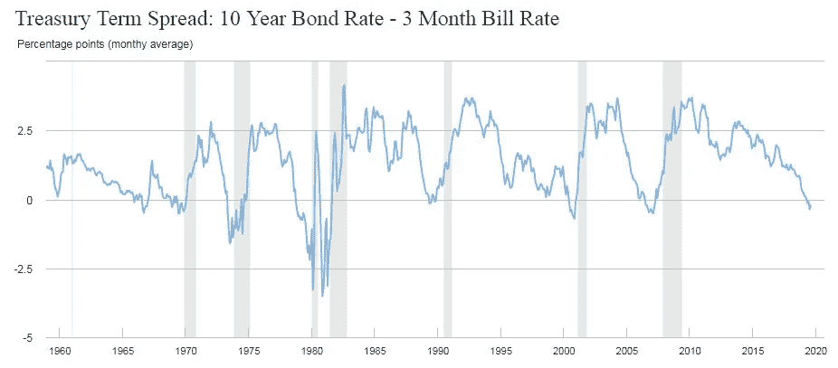

Source: NY Fed, 14 October 2019

*   基于上述情况，纽约联邦储备银行的衰退模型仍然认为 12 个月内有 34%的衰退风险。

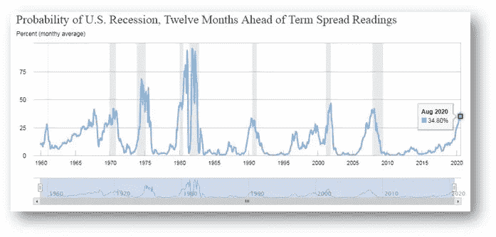

Source: NY Fed, 14 October 2019

*   不仅仅是美国有反向曲线，世界上很多地方都有。这意味着，明天的世界可能会比今天慢得多的观点广为流传。

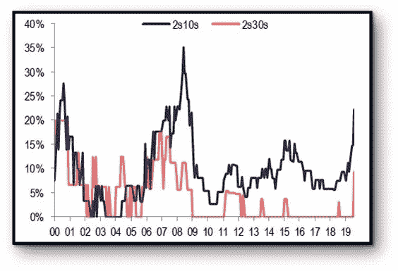

Source: BAML, September 2019

*   虽然一些金融指标(见上文)显示出有问题的迹象，但经济指标状况较好，包括美国就业(下降 3.5%)，假设衰退概率为 0%。然而，这种势头正在减弱。例如，非农就业人数(按周计算)的增长比以前少得多。

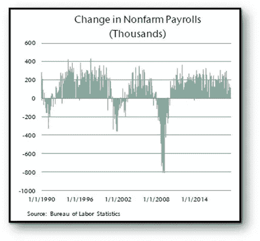

Source: BLS, September 2019

*   那么，全球增长将何去何从？它正在放缓，而且根据全球和美国的采购经理人指数，它将继续进一步放缓。如果你看到右边的黄线，不仅制造业表现不佳，服务业也是如此。

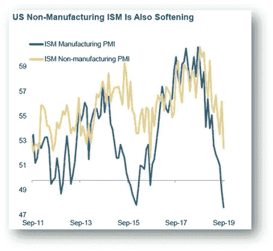

Source: Morgan Stanley, 4 October 2019

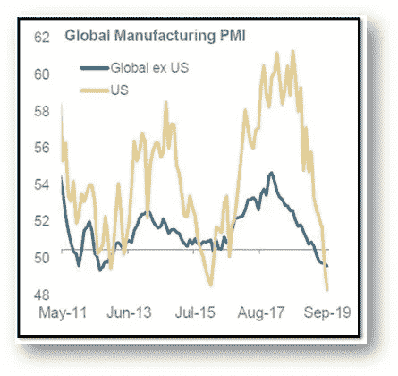

Source: Morgan Stanley, 4 October 2019

*   减速背后的主要原因是什么？除了经济周期结束之外，还有来自贸易冲突和地缘政治问题的不确定性(第一张图显示了全球增长与贸易的关系，而第二张图显示了摩根士丹利在有和没有贸易问题的情况下的增长估计)

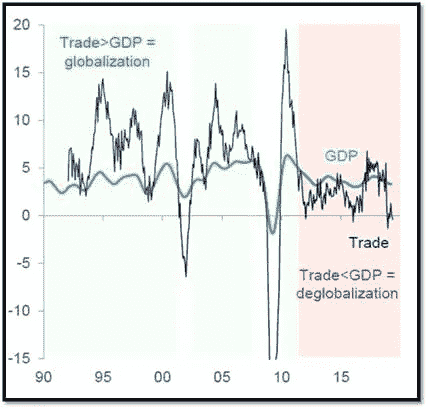

Source: Citigroup, 1 October 2019

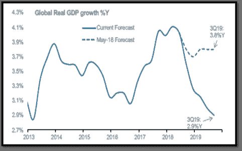

Source: Morgan Stanley, 1 October 2019

*   金融市场对经济放缓的反应如何？他们在 2019 年的 YTD 表现令人惊讶。哇:一切都战胜了通货膨胀(尽管去年通货膨胀非常低，但什么都没有)。怎么可能呢？

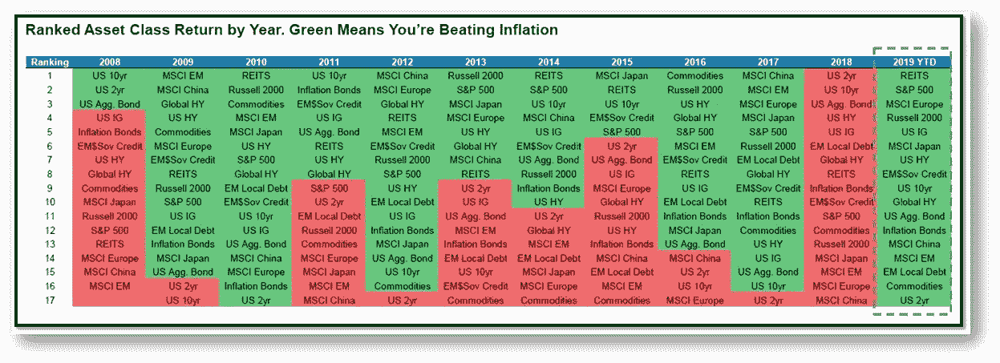

Souce: BAML, 1 October 2019

*   为什么市场表现如此之好？我们必须感谢支持性的货币政策，自危机以来，2019 年的全球央行从未如此温和(右侧最后一张图表是新兴市场的平均区域利率，预计未来将下降)。

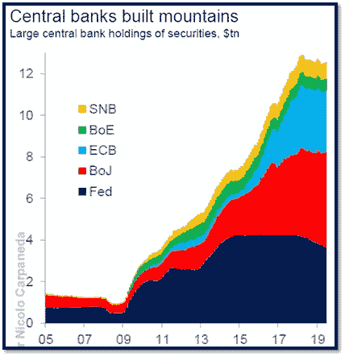

Source: Citigroup, October 2019

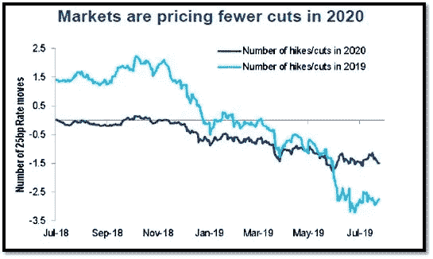

Source: Citigroup, October 2019

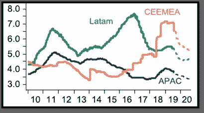

Source: BNP Paribas, October 2019

*   结果是大量负收益率债务(价格上涨和/或推动投资者购买其他地方的收益率)，但也使市场非常平静，金融环境更加宽松。

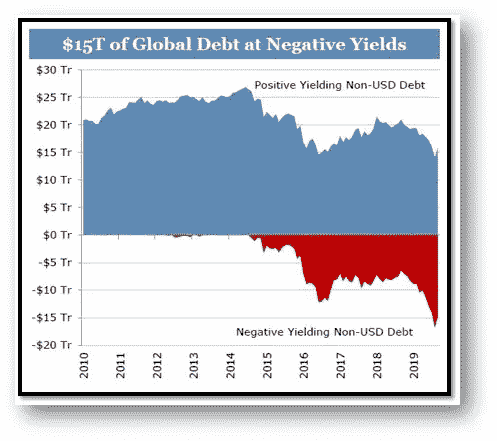

Source: Wells Fargo, October 2019

Source: Citigroup, October 2019

*   虽然政府债券看起来很贵，但固定收益公司债券(IG 和 HY)最近都遭到抛售，并牢牢处于公允价值区，这可能使它们对合适的投资者具有吸引力，因为没有迹象表明，央行压低收益率并在总体上支持固定收益市场的这一重要技术压力会中断。

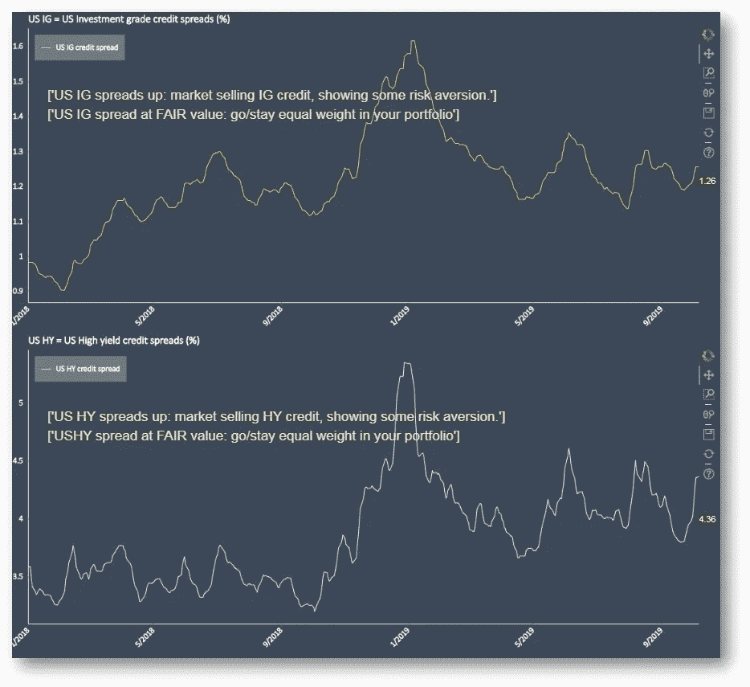

Source: Monetharia ([www.monetharia.io),](http://www.monetharia.io,) 10 October 2019

*   结论是什么？简而言之，我们有:1)全球层面的经济基本面正在走弱，但目前尚未进入衰退……以及……2)较低的增长和较低的通胀正在让各地的利率降低(=更宽松的货币政策),因此资产价格已经(并可能继续)得到令人难以置信的良好支撑。

未来情景

*   **1。较低增长(中部)**:在没有衰退的缓慢增长情景下，一个好的投资组合可能通过美国国债和德国国债的长期头寸，以及优质投资级(IG)信用，混合股票市场和对冲。新兴市场债券可能仍然有意义，因为美国利率较低，美元未来可能走低。
*   **2。更高的增长(尾部)**:如果 2020 年美国大选将让特朗普在明年平静下来，那么贸易不确定性将会消退，那会怎样？更高比例的普通股票投资组合以及更多新兴市场和风险更高的高收益(HY)公司债券应该表现良好——特别是在浮动利率的情况下，因为我们假设在这种环境下利率可能会上升。
*   **3。衰退(尾部)**:如果我们距离衰退真的还有 12 个月，那么更长/灵活的期限(即使购买成本很高)、有限的 HY 和 EM 风险，以及更优质的公司债券(IG)和非常低的股票配置似乎是一个合理的组合。