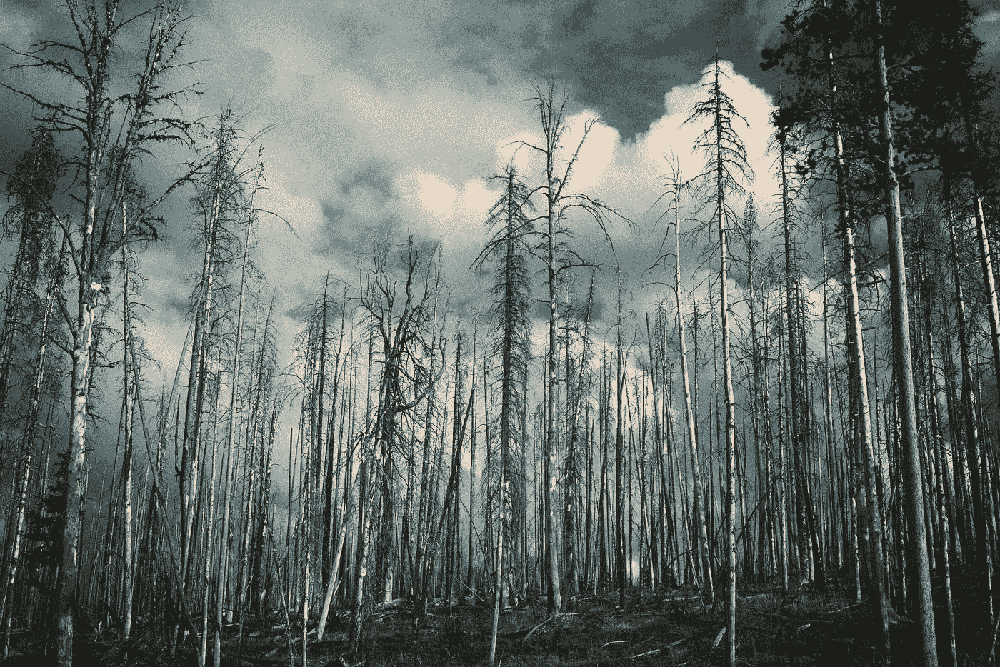

# 衰退是世界经济的野火

> 原文：<https://medium.datadriveninvestor.com/recessions-are-the-wildfires-of-the-world-economy-98a5739fbcde?source=collection_archive---------9----------------------->

## 判断失误的货币政策会导致衰退，判断失误的森林火灾会引发野火。无论多么具有破坏性，两者都推动着进步。

Photo by [Casey Fyfe](https://unsplash.com/@caseyfyfe?utm_source=medium&utm_medium=referral) on [Unsplash](https://unsplash.com?utm_source=medium&utm_medium=referral)

[美国总审计局后来报告](https://www.gao.gov/assets/110/108587.pdf)这一切都是从正常的森林管理开始的。枯叶和掉落的树枝无情地堆积起来，吸收养分，抑制生长。塞罗格兰德的森林树冠层囤积了光线，杂草威胁着林地。

在人类出现之前，大自然会自己照顾自己。杂散的闪电会点燃干燥的火种。由此引发的大火会烧毁腐烂的树叶，释放出原本被封存多年的养分。老树会被烧掉，被大自然牺牲，让新树生长。

人类改变了这一切。定居者不想冒他们的农场和村庄被烧毁的风险。他们扑灭或控制了大火，却不知道它们在森林生活中的重要作用。

 [## 为什么包容性财富指数比 GDP 更能衡量社会进步？|数据驱动…

### 你不需要成为一个经济奇才或金融大师就能知道 GDP 的定义。即使你从未拿过 ECON 奖…

www.datadriveninvestor.com](https://www.datadriveninvestor.com/2019/03/08/why-inclusive-wealth-index-is-a-better-measure-of-societal-progress-than-gdp/) 

当他们认识到自己的错误并知道森林的必要性时，他们任命了森林经理。他们会计划有利于定居的燃烧，但有很多要考虑的。

太阳太热了吗？

风太大太干燥了吗？

失算或意外事件会使生命和财产处于危险之中。

塞罗格朗德本来是有计划的火灾，但是太阳变得很热，风出乎意料地大，所以火势失去了控制。干旱让事情变得更糟。

一场灾难性的野火袭击了新墨西哥，而不是烧掉旧木头和树叶，让森林焕然一新。洛斯阿拉莫斯有 400 多个家庭失去了家园，超过 15 万英亩的土地被荒废。

幸运的是，没有人死亡，更幸运的是，存放核废料的建筑没有被触动。

# 森林燃烧对生长至关重要。

[国家地理报道](http://www.nationalgeographic.org/encyclopedia/controlled-burning/)森林火灾是林地生活中的正常现象，但并不常见。他们培养长期增长。火是这个生态系统的固有属性，某些松果只有在着火时才能发芽。

不正常的是野火。野火是一场失去控制的森林大火，突然之间，什么是严酷的，但更新成为毁灭性的，吞噬一切。

衰退和野火有很多共同点，因为两者都是事件失控的结果。有时决策者低估了经济的脆弱性，就像森林管理者错误估计了阳光和风力一样。

当一场野火在塞罗格兰德燃烧时，全球经济也失去了控制。那是 2000 年，互联网泡沫正在破裂。

# 互联网泡沫破裂。

1999 年末，大企业开始意识到互联网的机遇和威胁。稳定、成熟的零售市场感受到了新技术的破坏性危险。

互联网促成了一种新型的全球化。国际公司已经存在，但规模经济仅限于国家。一些公司机构可以跨越国界共享，但许多必须复制。

例如，布鲁明戴尔在纽约的一家分店原则上可以向伦敦的某个人出售商品，但现实是伦敦人不知道有什么商品出售，也不能随便逛逛商店。

互联网技术改变了这一切。如果布鲁明戴尔公司建立了一个网站，任何能上网的人都可以享受特别优惠。布鲁明戴尔没有必要在伦敦或其他任何地方开业。

如果商业模式正确，真正的全球市场将会开放。这就是技术的作用。它扰乱了疲惫、陈旧的市场，创造了新的机会。就像引发森林大火的闪电一样，它劈开树冠，让新的光线照射进来。

# 有一些初期问题。

比尔·盖茨曾经写道:

> 大多数人高估了自己一年能做的事，低估了自己十年能做的事

( [Goodreads](https://www.goodreads.com/quotes/302999-most-people-overestimate-what-they-can-do-in-one-year%0AMost%20people%20overestimate%20what%20they%20can%20do%20in%20one%20year%20and%20underestimate%20what%20they%20can%20do%20in%20ten%20years.)

这在 90 年代末适用于互联网。企业看到了网上销售的可能性，但可行的商业模式需要时间来发展。然而，许多人认为这几乎可以立即实现。

每个人都想分一杯羹，于是大规模资本投资的风吹了起来。

*   [Investopedia 报道](https://www.investopedia.com/terms/d/dotcom-bubble.asp)1999 年，39%的资本投资进入了互联网公司。
*   在 457 宗首次公开招股中，约有 295 宗与互联网有关。
*   [CNN](http://ideas.ted.com/an-eye-opening-look-at-the-dot-com-bubble-of-2000-and-how-it-shapes-our-lives-today/)报道称，在 90 年代末和 21 世纪初，有 7000 到 10000 家在线企业成立。
*   到 2000 年 11 月，摩根士丹利报告称有 4500 亿美元的资本投资于互联网公司。

金融护林员不得不进行干预。 [Investopedia 指出](https://www.investopedia.com/terms/d/dotcom-bubble.asp)美联储最终决定提高利率来抑制网络繁荣的非理性繁荣。美国美联储在 1999 年三次提高利率，2000 年两次。

分析师闻到了烟味，改变了他们的建议。支撑互联网企业家的投资资本突然枯竭了。互联网泡沫不会是一场有计划的燃烧，而是一场全面的野火。

新的互联网公司大多是杂草。[CNN 报道【4,800 家互联网公司倒闭。据](http://ideas.ted.com/an-eye-opening-look-at-the-dot-com-bubble-of-2000-and-how-it-shapes-our-lives-today/)[摩根士丹利](http://ideas.ted.com/an-eye-opening-look-at-the-dot-com-bubble-of-2000-and-how-it-shapes-our-lives-today/)称，他们的销售额只有 210 亿美元，总共亏损 62 亿美元。

有线电视新闻网估计，截至 2000 年 11 月，投资损失总额达 1.7 万亿美元。经济萎缩，到 2003 年 6 月，失业率为 6.3%。

从长远来看，互联网显然是成功的。像易贝、贝宝和亚马逊这样的品牌幸存了下来，并蓬勃发展，像谷歌和脸书这样的公司出现了。所有在全球市场的第一次失败尝试中被锁定的人都被解放出来，去设计一个可行的互联网。

# 历史告诉我们。

不管塞罗格兰德和互联网泡沫有什么相似之处，这种类比总是正确的吗？一段时间的消耗——无论是烧毁森林还是过度激进的货币政策——会导致长期增长吗？

答案是，比你想象的更频繁。想想看，维基百科列出了自 20 世纪 30 年代大萧条以来美国的 14 次衰退。该列表包括:

*   大萧条本身和 1937/38 年的衰退，改变了经济学家处理衰退的方式。
*   1973 年到 1975 年的经济衰退，是由石油输出国组织高油价引起的，这使得美国政府开始关注能源政策。
*   2008/2009 年的金融危机导致银行业和政府对笨拙且危险的不透明金融工具进行改革。
*   很多其他的例子…

课程是否总是被完全学习和记住？不，进化是一场马拉松，不是短跑。

# 经济衰退和野火是不可避免的风险。

Photo by [Tikkho Maciel](https://unsplash.com/@tikkho?utm_source=medium&utm_medium=referral) on [Unsplash](https://unsplash.com?utm_source=medium&utm_medium=referral)

经济衰退和野火都是痛苦的，但却是我们生活的世界不可或缺的一部分。即使一切都开始得很好，衰退也是不可避免的。枯叶和树枝堆积在森林中，考虑不周的商业模式浪费了人力和资金。

尽管存在不可避免的熵，我们的世界和我们的文明仍在成长和繁荣，那么如何解释这个悖论呢？我们宇宙中每一个成功的系统都有修正机制。经济衰退和森林火灾就是两个例子。

让我印象最深的是，我意识到某些种类的松果需要依靠森林大火才能发芽。这种进化需要多长时间，它象征着进步的本质是什么？

这让我认真思考了所有事物是如何发展的。