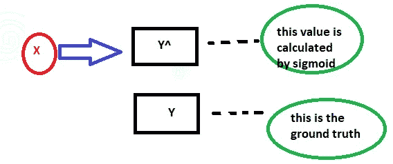
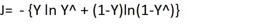

# 二元交叉熵代价函数的配方！(第二部分)

> 原文：<https://medium.datadriveninvestor.com/recipe-of-binary-cross-entropy-cost-function-part-2-711cda5773c4?source=collection_archive---------15----------------------->

这份食谱包括一些烹饪的先决条件！在阅读这篇文章之前，你必须参考我之前关于逻辑回归的博客。

# 成分:

这个食谱的第一个配料是“ *S* IGMOID 函数”——*你必须对乙状结肠函数*有很好的了解

下一个要素是“前馈”模型——你必须知道什么是 sigmoid 函数的前馈模型！

这个食谱的最后一个真正美味的成分是“最小二乘”——你必须知道最小二乘损失函数，它在我的“博客”中有明确提到

# 准备和程序:

对于逻辑回归，前馈模型是 y^= sigmoid(w.x ),其中 w=[w0，w1，w2…..] & x=[x1，x2，x3…]

> [DDI 编辑推荐—数据科学 A-Z:包括真实生活中的数据科学练习](http://go.datadriveninvestor.com/datascience/matf)

如果你是一个初学者，那么你肯定会问自己一个问题:什么是基本事实？？简单地说，事实是真实存在的。基本上，二元熵代价函数是一种损失函数！接下来是下一个问题——已经有一个最小二乘损失函数，那么我们为什么还要寻找一个更好的损失函数呢！

# 为什么不是最小二乘成本函数？？？

为什么不用这个来分类呢？这不是一个好的/最优的成本函数，因为，例如，在癌症的预测中，基本事实是此人没有癌症，即 y=0，但您的模型预测此人患有癌症，即 y^=1，因此存在错误分类，但错误分类导致的成本非常低，因此最小二乘成本函数是一个不好的分类成本函数，我们改为做一些其他事情，称为**【二元成本函数】**

# 二元成本函数:

公式:

成本函数的理想性质:

(1) J=0，如果 y=y^-当您的模型正确分类时会出现这种情况

(2)对于错误分类，J 必须非常高，如果有错误分类，J 趋于无穷大

(3) J≥0 —这意味着一致性！

上面提到的 1 和 3 在最小二乘法成本函数中是相似的属性，但是第 2 点是关于最小二乘法中的错误分类，即使有很高的错误分类，J 的值也非常低，但是在二进制交叉熵的情况下，如果有错误分类，那么成本函数将趋于无穷大，但是当没有错误分类时，J=0。

即使在我忙碌的日程中，写文章也需要很多痛苦…你们的掌声真的会帮助我保持动力，继续写更多的文章！如果你真的欣赏我的作品，请继续关注更多的奇迹！