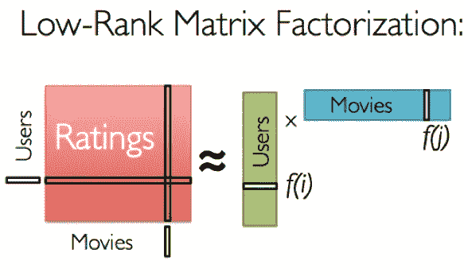
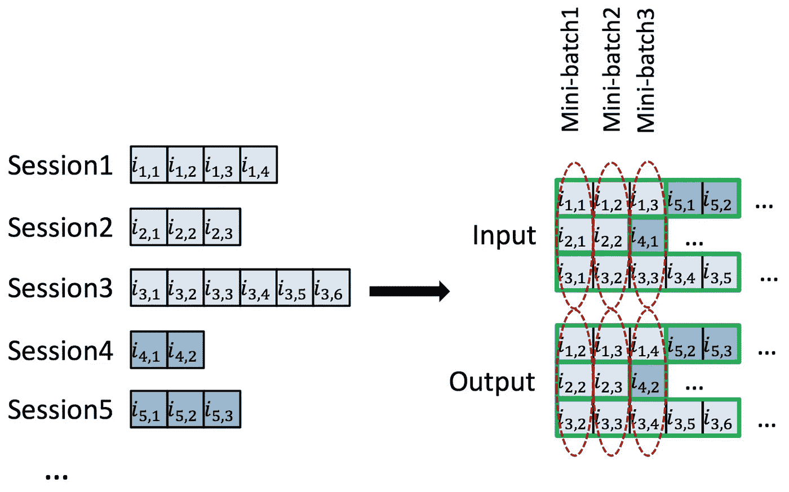

# 推荐系统:问题陈述观点

> 原文：<https://medium.datadriveninvestor.com/recommendation-system-a-problem-statement-view-21efd20f2384?source=collection_archive---------1----------------------->

推荐系统中问题陈述的三种类型。

# 介绍

当我们开始做一个数据科学项目时，我们应该做的第一件事就是定义问题，或者将业务问题转化为数据科学问题。这不仅仅是将大项目分成小部分，还代表了如何思考问题，这可能在我们的最终解决方案中有不同的表现。

推荐系统是因为信息过载，我们可以称之为信息过滤系统。它极大地影响了我们与世界的互动:购物(亚马逊、百思买)、音乐(Spotify)、视频(Youtube、网飞)等。要建立一个推荐系统，向数百万用户提供数百万个项目的推荐，第一件事就是，定义问题。

 [## 金融中的机器学习——数据驱动的投资者

### 在我们讲述一些机器学习金融应用之前，我们先来了解一下什么是机器学习。机器…

www.datadriveninvestor.com](https://www.datadriveninvestor.com/2019/02/08/machine-learning-in-finance/) 

在这篇文章中，我总结了推荐系统中问题陈述的三种方式:评分预测、顺序预测和排名预测。

# 评级预测

给定一个用户和他在项目 1 到项目 n 上的偏好得分，他在项目 n+1 上的偏好得分是多少？

这里的偏好评分可以是显性反馈(评分、评论)，也可以是隐性反馈(点击、浏览、购买)。在建模之前，使用一些技术对反馈进行量化，如文本的 TFIDF，隐式事件的特征重要性，或规范化和标准化。

机器因子分解(MF)是解决这类问题的经典模型。给定一个 MxN 矩阵，其中 M 是#个唯一用户，N 是#个唯一项目，Rij 是用户对项目 j 的评分，MF 可以将 MxN 矩阵分解成两个小矩阵:MxK 和 KxN，其中 K 是#个潜在因素的维数。然而，这样做的一个可能的缺点是矩阵可能非常稀疏，因为一个用户只能与几个项目进行交互。

额外收获:MF 可以实现为因式分解机器(FM)模型。FM 考虑了特征的二阶相互作用。您可以将 MF 视为仅具有用户和项目功能的 FM 模型。但是，您可以向 FM 模型添加更多功能。

matrix factorization

# 序列预测

给定用户在以前的购物历史中交互的一系列商品，他在下次访问时会交互什么？

在我的上一篇文章中，我提到了基于序列的推荐对我们的好处。实际上，在实际工作中，与基于评级预测的模型相比，它表现得非常好。这类问题背后的想法非常简单，从购物序列中学习用户亲和力在时间线上的变化。好消息是，它非常类似于 NLP 任务，我们可以在模型中应用 NLP 技术，如嵌入、注意。基本上，嵌入可以更好地表示模型中的用户或项目信息，并且注意力可以决定先前序列中的什么应该在未来序列中扮演更重要的角色。

一种简单的方法是使用产品嵌入的时间衰减来区分最近事件和以前事件的重要性。然而，如果计算能力足够，基于 RNN(LSTM/GRU)的模型可以做得更好。

[SESSION-BASED RECOMMENDATIONS WITH RECURRENT NEURAL NETWORKS](https://arxiv.org/pdf/1511.06939.pdf)

更准确地说，该序列可以是点击序列或会话序列。我现在正在做一个基于会话的 RS 模型，稍后会有一个关于它的帖子。基于会话的方法可以检测用户的会话内兴趣和跨会话兴趣，这可能更符合现实世界的推荐。

# 排名预测

给定一个项目池，如何对每个用户进行排序？

这个问题的目的是在用户使用网站后，为用户确定一个排序的项目列表。刘铁燕根据输入表示和损失函数将它们分为三类:逐点法、成对法和列表法。在实践中，列表方式通常优于成对方式和逐点方式。

# 结论

评级预测是一个很好的起点:易于实现，有利于解释。

序列预测被积极地研究并且相当有效。然而，它需要一个良好的 ML 系统/管道和大量的数据。

排名预测需要更多的探索。