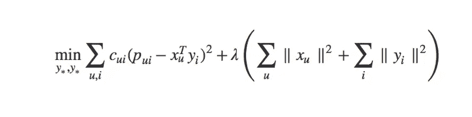
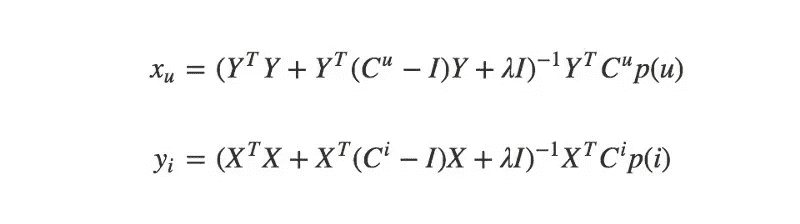

# 推荐系统算法

> 原文：<https://medium.datadriveninvestor.com/recommendation-system-algorithms-55c2ae6c44ce?source=collection_archive---------4----------------------->

[](http://www.track.datadriveninvestor.com/1B9E)

在当今世界，大数据是公司用来向用户提供相关建议以及谈论收入增长的一种手段。在目前各种各样的推荐算法中，我们需要根据业务的限制和要求选择最佳的一个。

## 协同过滤

协同过滤及其改进是推荐系统中使用的少数算法之一。任何人都可以用它来建立自己的个人推荐系统。

现在，当我们想向任何人推荐任何东西时，我们需要找到有相似兴趣、相同行为的人，然后我们会向我们的用户推荐一个项目。或者，我们可以查看用户之前购买的商品，然后向他们推荐具有相似特征的新商品。

协作过滤有两种基本方法:基于用户的方法和基于项目的方法。在这两种情况下，我们的推荐系统必须遵循两个步骤:

*   找出与给定用户/项目相似的用户/项目的数量。
*   判断其他用户/项目，以预测我们会给特定产品的用户评分。

## 矩阵分解

取一个大矩阵，把它分解成原始矩阵的一些更小的表示。我们得到一些低维矩阵，它们的乘积就是原矩阵。现在这里我们固定一个小数字 k，用 k 维向量 x(u)概括每个用户 u，用 k 维向量 y(i)概括每个物品 I。这些向量通常被称为因素，然后我们预测用户 u 对项目 I 的评级。

```
r(ui) = x(u)*y(i) 
And here we multiply y(i) with the transpose of x(u)
```

这个问题可以被公式化为一个优化问题，其中我们需要找到 x 和 y 的最优值。特别地，我们试图优化观察到的评级/数据点的最小平方误差。



这里的术语 P(ui)仅指 r(ui)。

现在我们得到下面的等式来最小化我们用户的损失。


并最大限度地减少我们的产品:


这将是我们最终的用户和项目等式:



*   ***X 和 Y*** 分别是用户矩阵和物品矩阵。
*   ***Cu 和 Ci*** 是置信度值。
*   ***λ*** 是用于减少过拟合的正则化子。(0.1)
*   ***p(u)和 p(i)*** 是对一个项目的二元偏好。
*   ***I*** 是单位矩阵。

ALS:所以 ALS 是一个迭代的优化过程，在每次迭代中，我们都试图接近原始数据的分解形式。

*   我们将首选项(p)设置为:


我们的偏好是反馈数据 r 的二进制表示。

*   **置信度计算如下:**


**α是线性比例因子**，加 1 表示置信度最小。置信度是使用 r 的大小来计算的，每次用户选择特定的商品时，我们的置信度值都会增加。

解决推荐系统问题的另一个类似的算法是**聚类。**

## 使聚集

在此之前，我们试图针对任何推荐系统问题提出一些有监督的机器学习解决方案。但是现在我们将着眼于无监督的方法来解决这个问题。

如果我们正在构建一个大的推荐系统，矩阵分解和协同过滤需要更长的时间，在这种情况下，我们将选择聚类。

我们识别不同的用户组，并向特定组中的每个用户推荐相同的项目。当有大量数据时，选择聚类作为协同过滤中缩小一些相关邻居的第一步总是明智的。它肯定会改进一个非常复杂的推荐系统的工作。

所以这个话题到此为止。 ***快乐编码！！！***