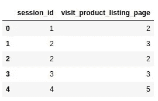
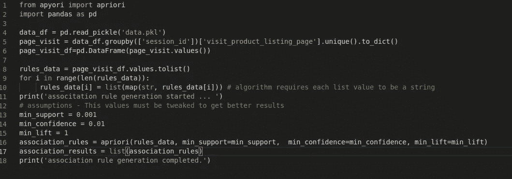

# 基于隐含数据关联规则挖掘的推荐系统

> 原文：<https://medium.datadriveninvestor.com/recommendation-system-using-association-rule-mining-for-implicit-data-6fba0f6c5012?source=collection_archive---------0----------------------->

电子商务平台产生了很大一部分收入，因为它们向用户提供了个性化的推荐。推荐系统的集成在业务改进中起着至关重要的作用，并且有利于用户找到更适合的产品。


# 隐式数据与显式数据

> **显性数据**是用户有意提供的数据，即收视率。**隐性数据**是基于用户在网站上的活动如访问商品列表页面、查看商品、购买商品等产生的数据。

让我们面对现实吧——仅仅依赖显式数据是不现实的，因为生成数据需要用户付出额外的努力。但是隐式数据更容易收集。查看商品或将商品添加到购物车的简单行为可以被视为对该商品的认可。

[](https://www.datadriveninvestor.com/2019/01/23/which-is-more-promising-data-science-or-software-engineering/) [## 数据科学和软件工程哪个更有前途？数据驱动的投资者

### 大约一个月前，当我坐在咖啡馆里为一个客户开发网站时，我发现了这个女人…

www.datadriveninvestor.com](https://www.datadriveninvestor.com/2019/01/23/which-is-more-promising-data-science-or-software-engineering/) 

# 选择算法

**交替最小二乘(ALS)** 是一种流行的隐式数据协同过滤算法。但这里的问题是——如果用户每次访问网站的品味都不一样，那该怎么办？(通常，这种类型的行为出现在用户仅在特定场合或节日访问的礼品网站上)。在这种情况下，ALS 将会失败。为了克服这一点，我们应该更加关注基于会话的推荐算法。

**关联规则挖掘(ARM)** 可用于提供基于会话的推荐，而 **Apriori** 就是这样一种被广泛接受的 ARM 算法。

# 资料组

为了简单起见，我们假设只有 4 个用户活动步骤— *访问 _ 产品 _ 列表 _ 页面、查看 _ 产品、添加 _ 购物车和购买 _ 产品*。

我们将使用 visit_product_listing_page 生成关联规则，并使用其余步骤来计算产品得分，为此，我们可以为每个步骤分配 step_weights，如下所示:

```
view_product: 1
add_to_cart: 2
buy_product: 3
```

我们可以使用产品的步长权重和数量/访问次数轻松计算每个产品的分数。既然我们现在已经准备好了产品池，让我们把注意力集中在关联规则的生成上。

关联规则的已处理数据集必须采用类似于以下的格式



# Apriori 算法背后的一般思想

假设用户 A 在单个会话中访问了 ID 为 1 的产品列表页面，用户 B 在单个会话中访问了 ID 为 1 的产品列表页面，也访问了 ID 为 2 的产品列表页面。因此，将生成一个规则，向用户 A 推荐属于 ID 为 2 的产品列表页面和 ID 为 1 的产品列表页面的产品。

Apriori 算法有 3 个主要部分——

1.  Support 包含 ID 为 1 和 ID 为 2 的产品列表页面的记录的概率。
2.  置信度—在给定 ID 1 的情况下，包含 ID 为 2 的产品列表页面的记录的条件概率。[P(ID2|ID1)]
3.  提升——信心与支持的比率。如果升降机是< 1 then product listing page with ID 1 and ID 2 are negatively correlated (doesn’t belong together in recommendations) else positively correlated.

# Implementation Issues

There are two popular choices for implementation of the Apriori algorithm — [mlxtend](https://pypi.org/project/mlxtend/) 和 [apyori](https://pypi.org/project/apyori/) 。

*   **Mlxtend** 接受数据帧作为输入。这种实现方法的缺点是，对于大型数据集，dataframe 会尝试保留较大的内存块，这对于生产环境来说并不理想。
*   Apyori 接受列表列表作为输入。

*最好使用 Apriori 实现 Apriori 算法，对于大型数据集忽略* ***内存错误*** *或* ***int32 溢出*** *类型错误。*

# 好吧，我们来编码吧！



apriori 的输出格式是—

```
[RelationRecord(items=frozenset({'2', '3'}), support=0.4020899591094957, ordered_statistics=[OrderedStatistic(items_base=frozenset({'2'}), items_add=frozenset({'3'}), confidence=1.0, lift=1.0521032504780115)])
```

# 提供产品推荐

一旦生成了产品池和关联规则，我们就拥有了提供推荐所需的一切。

为了提供推荐，我们可以找到属于关联规则中建议的产品列表页面的产品，并按照产品得分以降序对它们进行排序(当然，我们可以有一个变体，为单个用户生成多个规则。在这种情况下，将产品分数乘以规则的置信度，然后按最终分数排序)。

# 结论

关联规则挖掘是实现基于会话的推荐系统的好方法。当然，算法必须基于用例以及用户的心态来决定。

感谢您的阅读！如果你喜欢这篇文章，请多次鼓掌(你知道你想！)和一个朋友分享。