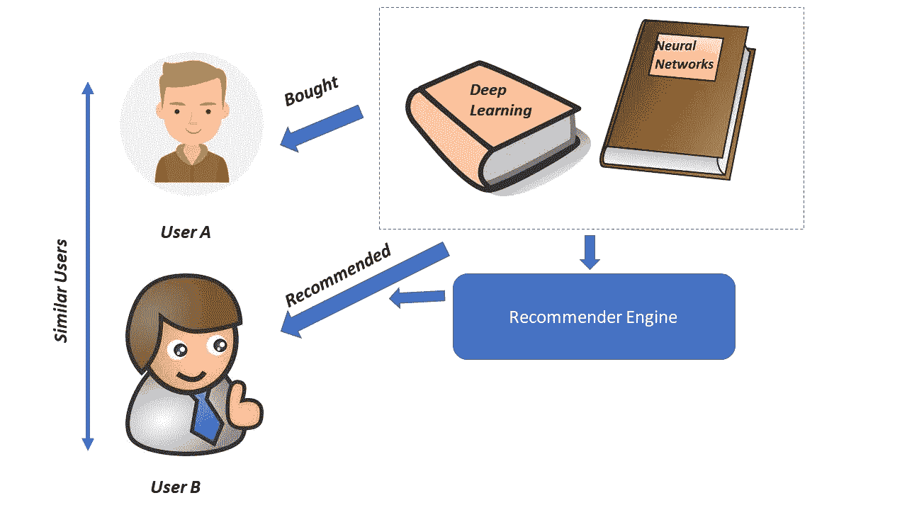
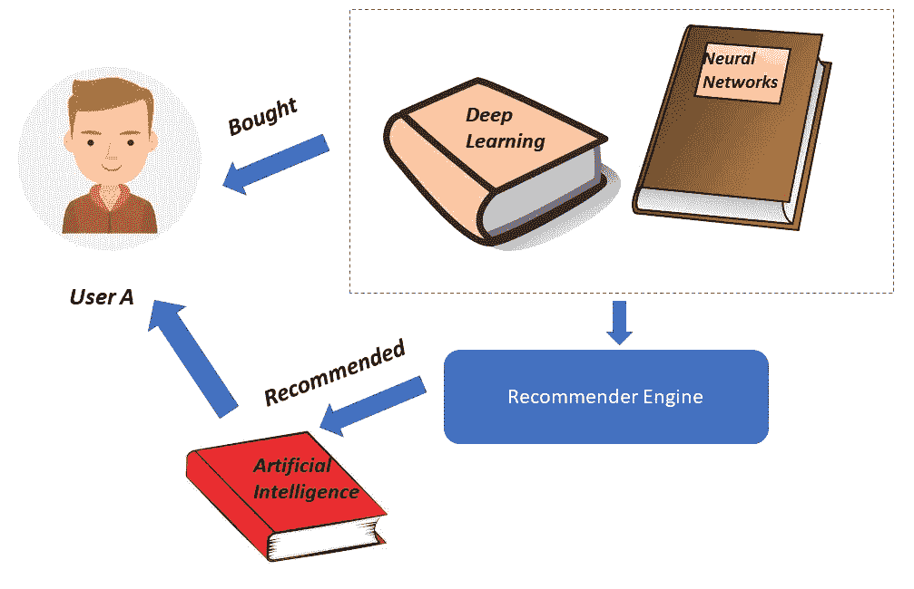
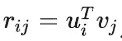
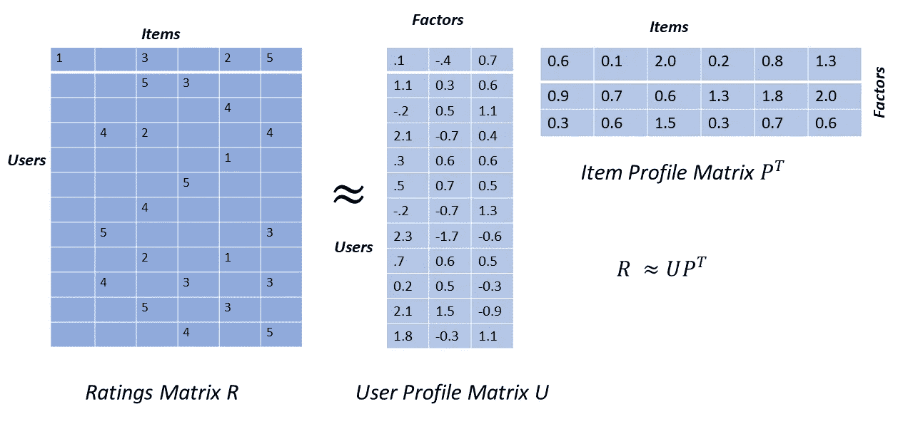
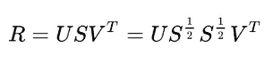
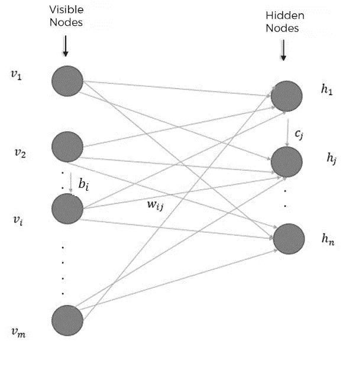

# 使用 RBM 的推荐系统

> 原文：<https://medium.datadriveninvestor.com/recommender-systems-using-rbm-79d65fcadf8f?source=collection_archive---------0----------------------->

# 介绍

在这篇文章中，我将尝试解释如何使用 RBM 建立一个*推荐系统*，这是机器学习最成功的应用之一，被网络零售商广泛用于向客户推荐产品。网飞根据你和其他有相同兴趣的网飞用户看过的内容推荐电视连续剧和电影。Amazon 还根据购买了某个产品的其他客户对该产品感兴趣的情况，向用户推荐该产品。你可以在我以前的帖子[这里](https://medium.com/datadriveninvestor/an-intuitive-introduction-of-restricted-boltzmann-machine-rbm-14f4382a0dbb)和它的一个应用[这里](https://medium.com/datadriveninvestor/dimensionality-reduction-and-feature-extraction-with-rbm-f499965979e9)中读到 RBM。

# 推荐系统

推荐系统有三大类

*   ***协同过滤*推荐系统**
*   ***基于内容的过滤*推荐系统**
*   **基于潜在因素的** ***过滤*推荐系统**

 [## 用 7 个步骤解释深度学习——数据驱动投资者

### 在深度学习的帮助下，自动驾驶汽车、Alexa、医学成像-小工具正在我们周围变得超级智能…

www.datadriveninvestor.com](https://www.datadriveninvestor.com/2019/01/23/deep-learning-explained-in-7-steps/) 

C

这种推荐系统可以预测用户可能感兴趣的项目，即使用户从未明确表示过兴趣。这通常被称为用户-用户协同过滤。

与用户-用户协同过滤相反的是找到与给定项目相似的项目，并将项目推荐给也喜欢、购买或高度评价其他相似项目的用户。这被称为项目-项目协同过滤。

C ***基于内容的过滤*** 依赖于基于内容的项目的手工编码特征。用户如何对现有项目进行评级，用户简档被创建，并且由用户提供的等级被给予那些项目。

基于内容的过滤涉及学习项目的不同属性以推荐具有相似属性的附加项目。在基于内容的过滤中，根据用户的偏好向用户推荐项目。这并不涉及其他用户如何评价这些项目。

L **基于关注因子的** ***过滤*** 推荐方法试图通过分解评级来发现代表用户和项目简档的潜在特征。与基于内容的过滤特征不同，这些潜在特征是不可解释的，并且可以表示复杂的特征。例如，在一个电影推荐系统中，一个潜在特征可能代表幽默、悬疑和浪漫以特定比例的线性组合。

通常，对于已经评级的项目，用户 *i* 对项目 *j* 的评级 *rij* 可以表示为

其中 *ui* 是基于潜在因素的用户简档向量，而 *vi* 是基于相同潜在因素的项目向量

上图是一种基于潜在因素的推荐方法，其中评分矩阵 *Rm x n* 已经分解为用户简档矩阵 *Um x k* 和项目简档矩阵 *Pn x k* 的转置的乘积，其中 *k* 是模型潜在因素的数量。

基于这些简档，我们可以通过计算用户简档和商品简档的内积来推荐到目前为止用户还没有购买的商品。内部产品给出一个试探性的评级，如果用户购买了该产品，他们可能会给出该评级

可以创建这些用户和项目简档的方法之一是，在适当地通过跨用户和项目的某种形式的平均值填充缺失值之后，对评级矩阵执行**奇异值分解** ( **SVD** )。根据奇异值分解，评级矩阵 *R* 可以分解如下:

我们可以将用户简档矩阵作为 *US1/2* ，然后将项目简档矩阵转置为 *S1/2 VT* 来形成潜在因素模型。当评分矩阵中缺少与用户未评分的项目相对应的条目时，您可能会对如何执行 SVD 有疑问。常见的方法是在执行 SVD 之前，通过用户的平均评级或通过全局评级平均值来估算缺失的评级。

# MovieLens 数据集

我将使用一个较小的电影评级数据集，称为 *MovieLens 20M 数据集*，由明尼苏达大学双城分校计算机科学与工程系的研究实验室 GroupLens 提供。该数据包含从 1995 年 1 月 9 日到 2015 年 3 月 31 日由 138，493 个用户创作的 27，278 部电影的 20，000，263 个评级。

# 使用 RBM 的协同过滤

让我们再次回到 RBMs。回想一下，RBM 有两层，输入层也称为**可见**层和**隐藏**层。每层中的神经元与另一层中的神经元通信，但不与同一层中的神经元通信。神经元之间没有层内通讯。

*   在 RBM 中，可见层的神经元与隐藏层的神经元进行交流，然后隐藏层将信息传回可见层。RBM 在可见层和隐藏层之间来回执行几次这种通信，以开发生成模型，使得从隐藏层的输出的重构类似于原始输入。
*   换句话说，RBM 正试图创建一种生成模型，该模型将基于电影与用户已评级的其他电影的相似程度以及用户与已评级该电影的其他用户的相似程度来帮助预测用户是否会喜欢该用户从未看过的电影。
*   可见层将有 X 个神经元，其中 X 是数据集中电影的数量。每个神经元将具有从 0 到 1 的标准化评级值，其中 0 表示用户没有看过该电影。归一化评分值越接近 1，用户越喜欢神经元所代表的电影。
*   可见层中的神经元将与隐藏层中的神经元进行通信，隐藏层将试图学习表征用户电影偏好的潜在特征。

# RBM 网络架构

*   对于我们的电影推荐系统，我们将有一个 *m* x *n* 矩阵，其中有 *m* 个用户和 *n* 部电影。我们将一批 *k* 用户及其 *n* 电影评级传入 RBM 神经网络，并训练一定数量的*时期*。
*   每个传入神经网络的输入代表一个用户对所有 T21 电影的评价。因此，可见层有 *n* 个节点，每个电影一个。
*   我们可以指定隐藏层中的节点数量，该数量通常少于可见层中的节点数量，以迫使隐藏层尽可能有效地学习原始输入的最显著的方面。
*   每个输入 *v0* 乘以其各自的权重 *W* 。通过从可见层到隐藏层的连接来学习权重。然后我们在隐藏层加一个偏置向量叫做 *hb* 。这种偏向确保了至少有一部分神经元激活。这个 *W*v0+hb* 结果通过一个激活函数传递。
*   在此之后，我们将对通过称为*吉布斯采样*的过程生成的输出进行采样。换句话说，隐藏层的激活导致随机生成的最终输出。这种程度的随机性有助于构建一个性能更好、更健壮的生成模型。
*   接下来，吉布斯采样后的输出被称为 *h0* ，以相反的方向传递回可见层，也被称为*反向传递*。在后向通道中，吉布斯采样后的*前向通道*中的激活被送入隐藏层，并与之前的相同权重 *W* 相乘。然后我们在可见层添加一个新的偏置向量，称为 *vb* 。
*   这个 *W_h0+vb* 通过一个激活函数，然后我们进行吉布斯采样。其输出为 *v1* ，然后作为新输入传递到可见层，并作为另一个正向传递通过神经网络。
*   RBM 会像这样向前和向后传递几次，以学习最佳权重，同时尝试构建一个健壮的生成模型。
*   通过迭代调整神经网络的权重，RBM 可以找到输入特征之间的关系，然后确定哪些特征是相关的，RBM 学习尽可能逼近原始数据。
*   有了这个学习到的概率分布，RBM 就能够对以前从未见过的数据做出预测。RBM 将试图基于用户与其他用户的相似性以及其他用户对这些电影的评价来预测用户从未看过的电影的评价。

这篇文章附带的 jupyter 笔记本可以在这里找到[。](https://github.com/nitwmanish/Recommender-Systems-Using-RBM)

# 结论

受限玻尔兹曼机器可以用于建立项目评级的推荐系统。RBM 推荐系统可以在给定用户以前的评级和与他们最相似的用户的评级的情况下，学习用户的项目评级的概率分布。然后，RBM 推荐系统使用学习到的概率分布来预测从未见过的项目的评分。

我希望这篇文章能帮助你对如何使用受限玻尔兹曼机(RBM)作为 ecommender 系统有一个基本的了解。