# 重建国际象棋的位置

> 原文：<https://medium.datadriveninvestor.com/reconstructing-chess-positions-f195fd5944e?source=collection_archive---------2----------------------->

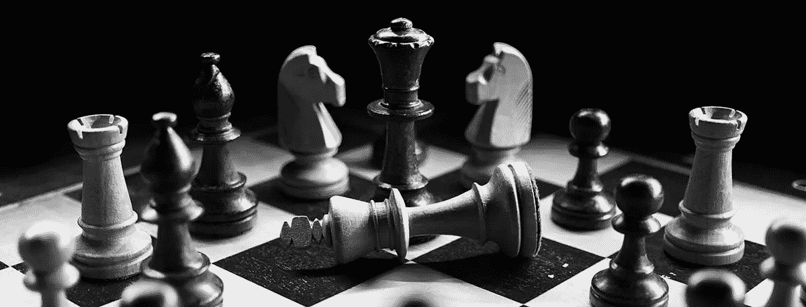

2018 年 12 月，我开始撰写一系列关于国际象棋编程的文章，展示如何[编写一个简单的程序](https://medium.com/@andreasstckl/writing-a-chess-program-in-one-day-30daff4610ec)以及如何[提高其性能](https://medium.com/datadriveninvestor/an-incremental-evaluation-function-and-a-testsuite-for-computer-chess-6fde22aac137)。

在这篇文章中，我将研究如何在有限的空间中存储棋盘表示，然后再进行重建。我将使用板和自动编码器的张量表示来试验不同类型的位置。我会将真实国际象棋游戏中的位置与随机产生的棋子位置进行比较。

 [## DDI 编辑推荐:5 本机器学习书籍，让你从新手变成数据驱动专家…

### 机器学习行业的蓬勃发展重新引起了人们对人工智能的兴趣

go.datadriveninvestor.com](http://go.datadriveninvestor.com/5ML1) 

# 动机

从六十年代开始，人们开始研究棋手如何“看到”一个棋位。德格鲁特[1]发现，发挥实力与一个玩家可以计算的招式数量无关，但更强的玩家善于发现和计算正确的招式。在有趣的实验中，德·格鲁特、蔡斯和西蒙[2]发现了记忆实验中高手和弱手之间的差异。大师们有能力在仅仅观察 5 秒钟后就几乎完美地重建一个国际象棋的位置。但是只有当这个位置来自一个真实的国际象棋游戏，而不是通过在棋盘上随机放置一些棋子来构建时，这才是正确的。

最近，像 Silver 等人[3]和 Lai[4]这样的自学习国际象棋引擎在计算机国际象棋方面取得了重大进展，它们学会了通过自动对弈来评估位置和选择棋步。这些程序学习寻找象棋位置的良好表示和评估。

在文本分析领域，所谓的“word 2 vec ”( miko lov 等人[5])在将单词的语义表示为向量时非常有用。我们试图找到棋盘作为向量的良好表示。

# 棋盘的表示

David 等人[6]在他们的监督方法“DeepChess”中使用了“pos2vec”表示。他们使用具有密集层的自动编码器来表示两个棋盘位置，然后训练一个完全连接的网络来区分好的和坏的棋位。每个位置由长度为 773 的二进制字符串表示。自动编码器使用几个完全连接的层将棋盘的表示压缩为长度为 100 的字符串。这是第一个达到特级大师级别的端到端机器学习国际象棋引擎。

Silver 等人[3]使用了棋盘的 8x8x119 张量表示，其中每种类型的棋子使用了 6 个平面(0 和 1)来表示白棋和黑棋，使用了 8 步历史记录和另外 9 个平面来表示要移动的一方、阉割权、重复次数和移动次数等信息。

在我的实验中，我使用了这个张量表示的一个简化版本，因为我只使用了实际位置和一个额外的平面来移动侧面。零件的平面存储为白色 1，黑色-1。所以我得到一个 8x8x7 的张量。我不关心这些实验中的阉割权、重复次数和移动次数。

这个函数将 FEN 符号中的国际象棋位置数组转换成一个张量，如上所述。

# 数据集

对于来自真实象棋游戏的象棋位置，我使用了 2018 年 1 月平均 ELO 评分大于 2000 的玩家在[免费互联网象棋服务器(FICS)](https://www.freechess.org/) 上进行的 29.169 场游戏。我从 FICS [游戏数据库](https://www.ficsgames.org/)下载了名为 [PGN 文件](http://www.saremba.de/chessgml/standards/pgn/pgn-complete.htm)的游戏。

游戏中的每个位置都用“ [pgn-extract](https://www.cs.kent.ac.uk/people/staff/djb/pgn-extract/) ”命令行工具标记了其 [FEN 描述](https://en.wikipedia.org/wiki/Forsyth%E2%80%93Edwards_Notation)。这给出了一组 2，253，350 个位置，我将其分为 2，048，000 个位置的训练集和 205，350 个位置的测试集。您可以从以下网址下载数据:

 [## FICS 象棋小游戏

### 分数符号中的位置

www.kaggle.com](https://www.kaggle.com/astoeckl/fics-chess-games) 

对于随机棋位的数据集，我使用了一个修改过的[脚本](https://rosettacode.org/wiki/Generate_random_chess_position)来生成 FEN 格式的数据集。棋子在棋盘上的位置并不是完全随机的，它们遵循一些规则来拥有几乎合法的国际象棋位置:

*   每种颜色只有一个国王
*   国王不能放在相邻的方格上
*   晋级广场不能有任何棋子
*   包括国王在内，最多可以放置 32 个任意颜色的棋子

我生成一组随机位置，其数量与真实游戏中的位置相同。

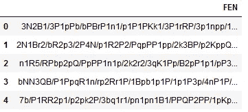

FEN of random positions

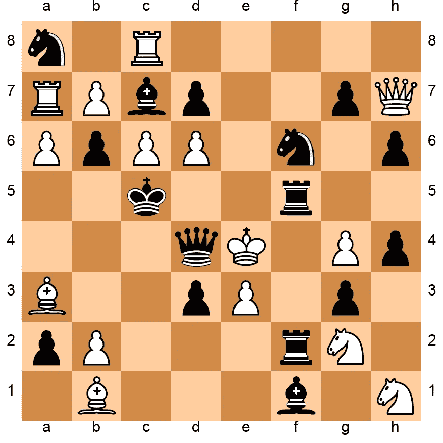

Example of a random position

# 模特们

为了找到代表国际象棋位置的向量，我使用自动编码器并用位置数据训练它们。这些模型是用 [Keras](https://keras.io/) 在 [Tensorflow](https://www.tensorflow.org) 之上构建的。

我尝试了两种不同的深度神经网络架构，一种具有一些密集的层，我将位置张量展平为 448 个值的列表，然后逐层减少神经元的数量。

使用了以下模型:

*   尺寸为 448 的平面输入
*   堆叠的密集层，每层有 300、200、150 和 42 个神经元用于编码
*   堆叠的密集层，每层有 150、200、300 和 448 个神经元用于解码
*   作为激活函数的“tanh”
*   该模型有 463，190 个可训练参数

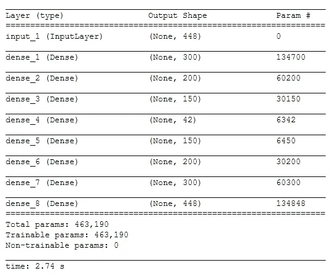

作为第二个模型，我建立了一个更复杂的深度卷积网络:

*   大小为(8，8，7)的输入
*   3 个二维卷积层，采用最大池和批量标准化进行编码
*   3 个二维卷积层，具有用于解码的上采样和批量归一化
*   卷积的滤波器大小为(3，3)
*   池的步幅为(2，2)
*   用于编码的 64*7、32*7、16*7 滤镜
*   用于解码的 16*7、32*7、32*7 过滤器
*   所有层的填充相同
*   作为激活函数的“tanh”
*   该模型有 2，428，839 个可训练参数

# 培养

在两种情况下都使用损失函数均方误差，其使用“Adam”优化器的 AMS-Grad 变体(Reddi 等人，[7])和 128 的批量进行优化。参数 lr=0.001，β1 = 0.9，β2 = 0.999，ε=无，衰减=0.0。

为了了解训练是如何进行的，我们绘制了训练和验证数据的学习曲线。

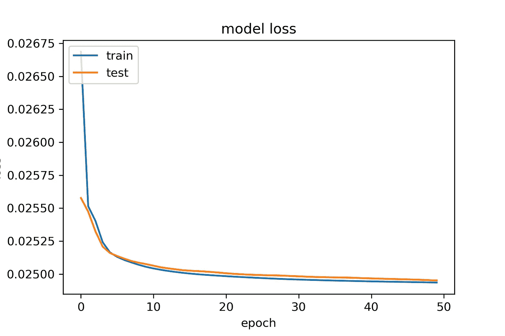

# 测试

为了测试这个模型，我对测试集中的所有位置进行了编码和重构，并计算了出错的次数。例如位置:

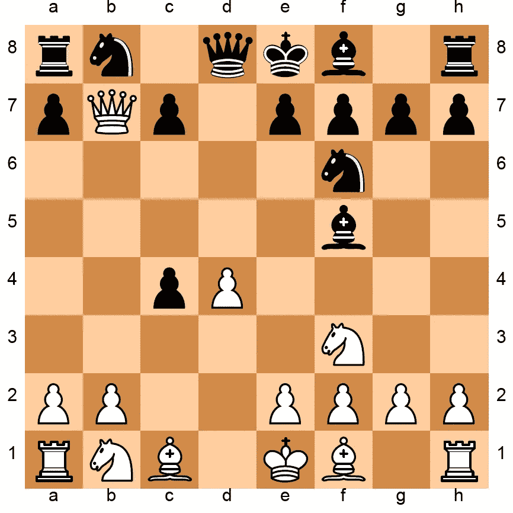

Original position

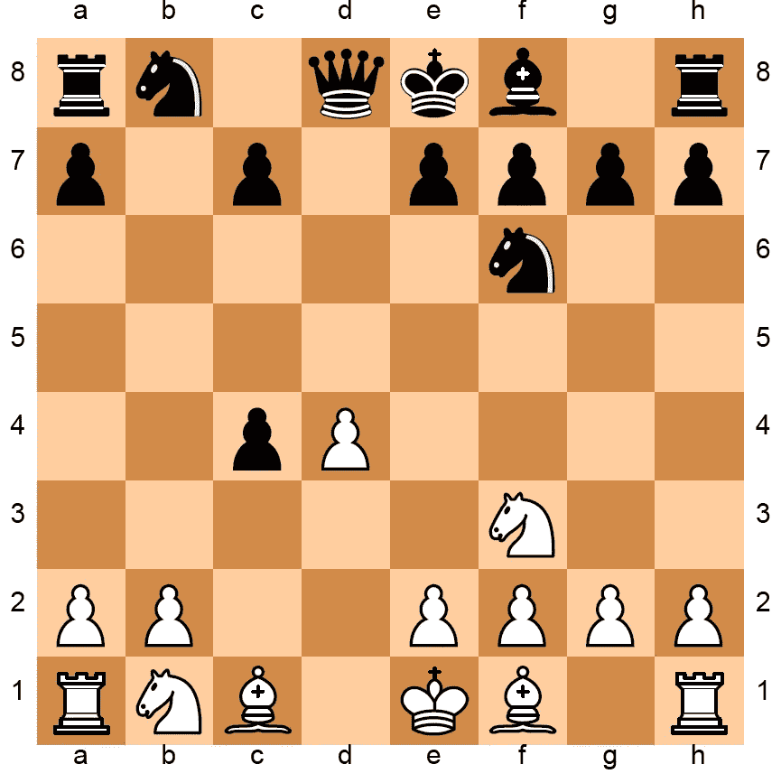

reconstructed position

有两处缺失。这些数字是用 [Python 象棋包](https://github.com/niklasf/python-chess)绘制的。

首先，我们需要一个辅助函数将张量形式的位置转换回 FEN 符号:

我们需要经过训练的自动编码器模型的**编码器**部分:

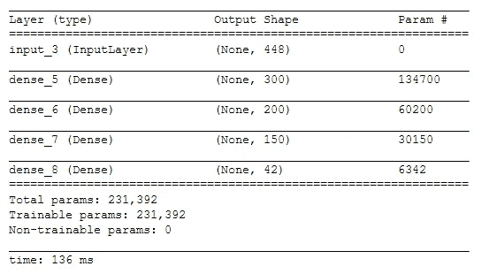

解码器:

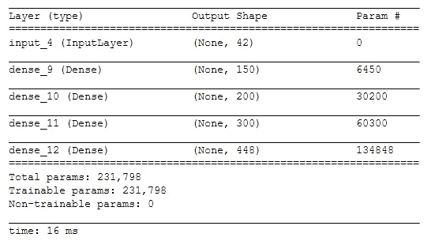

对于整个测试集(“测试输入”)，我对位置进行编码和解码，并计算解码位置与原始位置相比的错误数量。

# 结果

我们用数据集(真实位置和随机位置)训练和评估了这两个模型。在真实象棋数据集上训练编码维数为 42 的密集模型的 100 个时期之后，位置在重构位置中达到 2.8 的平均错误率，并且错误直方图由下式给出:

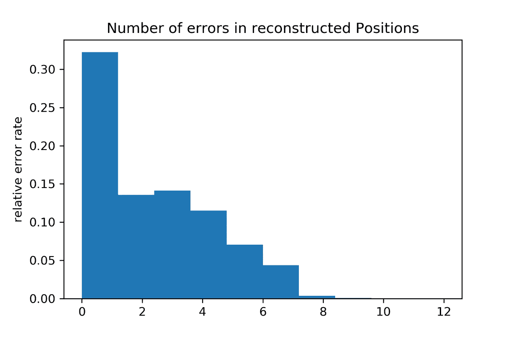

在随机位置的数据集上，编码维数为 42 的模型达到了 15.6 的平均错误率。

自动编码器似乎更难找到随机位置的良好嵌入，而更容易学习真实位置的模式和特征。

我们改变了编码的大小，并观察了真实位置和随机位置的平均错误率:

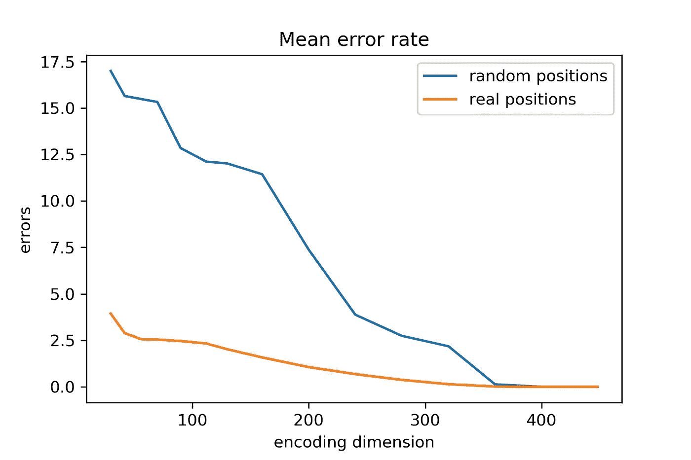

对于小编码维度，自动编码器从真实游戏中重建位置比随机位置要容易得多。似乎编码器可以使用真实位置中的典型模式来更好地压缩数据。

# 参考

[1]阿德里安·德·格鲁特。2014.象棋中的思想和选择，第 4 卷。沃尔特·德格鲁埃特两合公司。

[2]威廉·G·蔡斯和赫伯特·西蒙。1973.象棋中的感知。认知心理学 4(1):55–81。

[3]大卫·西尔弗等，2017。用一般强化学习算法通过自我游戏掌握国际象棋和日本象棋。arXiv 预印本 arXiv:1712.01815

[4]马修·赖。2015.长颈鹿:利用深度强化学习下棋。arXiv 预印本 arXiv:1509.01549

[5]托马斯·米科洛夫等人，2013 年。词和短语的分布式表示及其组合性。神经信息处理系统进展。第 3111–3119 页

[6]奥米德·E·戴维等，2016。Deepchess:用于象棋自动学习的端到端深度神经网络。国际人工神经网络会议。斯普林格，第 88-96 页。

[7]萨尚克·雷迪、萨坦·卡莱和桑基夫·库马尔。2018.亚当和超越的融合。国际学习代表会议。