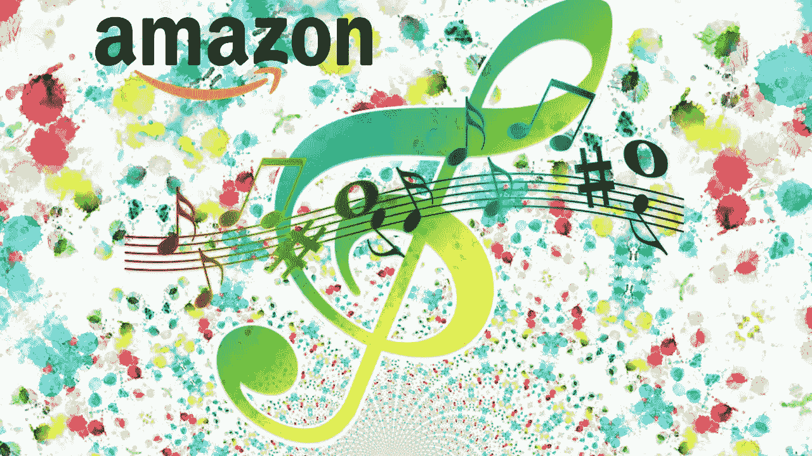

# 亚马逊记录市场复苏和报告

> 原文：<https://medium.datadriveninvestor.com/record-market-recovering-and-reporting-on-amazon-81ec56c27958?source=collection_archive---------10----------------------->

美国唱片业协会的一项研究表明，美国的零售音乐市场可能会成为一个 100 亿美元的市场。毫无疑问，音乐流媒体的激增，艺术家越来越多的可访问性给了 sap 一个自 2007 年以来一直在下滑的市场。嗯，技术创新可能会成为新的市场复兴的主角，也有助于简化收集艺术家权利的方法和相关的合同方面！尽管该立法旨在为唱片业提供一种新的结构，正如 2018 年 10 月 11 日颁布的《音乐现代化法案》或 MAA 首字母缩略词所证明的那样，该法案在三个单独的条款中规定，应建立一个非营利的政府机构，以创建音乐作品的机械许可所有者的数据库，确保歌曲作者按照合同规定的费率，从歌曲的物理或数字复制中获得一部分机械许可费， 尽管有这些良好的意愿，但在对版权费有分歧的情况下，重新启动司法程序，准确地说，缺乏音乐财产信息的中央数据库仍然是一个不容易解决的障碍。
许多音乐公司的主要目标是创建一个分散的登记簿，记录艺术家的权利、可能通过特定智能合同支付的费用以及不断监控经济流量的版税支付。
最近的一个例子就是 Dapper Labs 的 Flow，这是一个针对游戏和数字收藏品等消费应用的区块链，与华纳音乐集团和育碧等出版商合作。
市场正在增长，RIAA 最近的一项调查表明，约 25%的“由亚马逊履行”的 CD(亚马逊计划允许第三方供应商在平台上列出他们的产品，只需收取佣金并管理货物)是假货！
最近的抗议来自汤米男孩唱片公司，他们起诉亚马逊销售假冒商品，因为它们出现在市场上，唱片公司甚至从未在乙烯基上印刷过这些标题。
这已经不足为奇，也很容易让人相信，因为即使在图书市场(见我的深度评论)西雅图的标签也不止一次被掐过！很明显，在线市场不能再像遥远的西方那样任由强者摆布了，但它必须建立一个更加坚实、更加结构化的行为准则。

版权所有

***Raffaella Aghemo，律师***