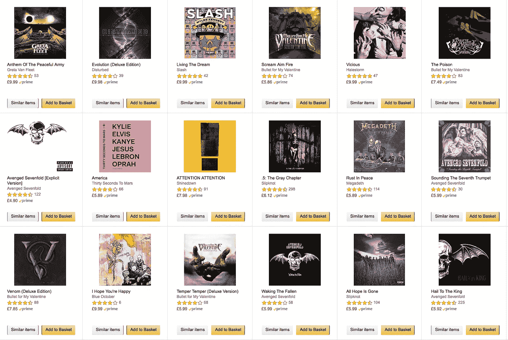

# RecoTour:python 推荐算法教程

> 原文：<https://medium.datadriveninvestor.com/recotour-a-tour-through-recommendation-algorithms-in-python-52d780628ab9?source=collection_archive---------2----------------------->

Some of my current music recommendations in Amazon. Not bad, but not perfect based on the music I have been listening in amazon music and/or purchasing lately in their site.

不久前，我的一个朋友问我优化 GBM 时有用的方法。我在过去被问过几次这个问题，所以我想我可以分享一些代码并写一篇关于它的帖子，以防有人发现它有用。在重写代码的过程中，我想我可以给它一些上下文，并说明如何在构建推荐算法的过程中优化 GBM。然后，我完成了脚本，并认为我还可以包含一些在构建推荐算法时使用的其他算法和技术。一件事导致另一件事，并产生了 [**RecoTour**](https://github.com/jrzaurin/RecoTour) ，这是一个通过 python 中的一些推荐算法的(简陋)旅行。

然后，在最后一次提交后一个多月！(你会读到为什么)我在这里…写这篇文章。在这篇文章中，我将简要介绍回购的内容，这样你就可以选择哪些笔记本可能对你有用(如果有的话)。我简单地说*为*，因为回购包含了**大量的**代码和文本。因此，如果你想知道细节，请看看相应的笔记本，如果你有任何意见，请告诉我。

首先，你会注意到我选择了 Kaggle 的 [Ponpare](https://www.kaggle.com/c/coupon-purchase-prediction) 比赛的数据集。在这场比赛中，我们获得了优惠券购买和浏览行为的历史信息，我们需要预测客户在给定时间段内(例如，未来一周)将购买哪些优惠券/商品。选择这个数据集的主要原因是因为它在预处理和特征工程方面非常丰富。此外，问题的性质允许数据有多种不同的表示方式(表格、矩阵等)，因此可以使用不同的技术。在未来，我将包括一些其他的数据集，这些数据集将更适合我在报告中阐述的一些技术。

正如我之前提到的，有很多代码和内容，所以我决定将回购安排在“章节”中，这些章节是 jupyter 笔记本，代表回购的**核心。这些笔记本所基于的 python 脚本在`py_scripts`目录中。笔记本是独立的，因此会有一些重复。笔记本中的代码当然是“面向笔记本的”。我在目录`final_recommendations`中加入了一个可能的“真实世界解决方案”的更模块化、更美观的版本，在`Chaper16_final_solution_Recommendations.ipynb`中有详细描述。**

这些笔记本有大量的解释和相关论文或软件包的参考资料，其中一些也包括在这里。在整个过程中，我的意图是专注于代码和技术，但你也会发现一些数学。笔记本中的所有代码在运行深度学习算法时都是在 c5.4xlarge 实例或 p2.xlarge 实例上运行的。

这是你将在笔记本中找到的内容:

*   [**第 0 章至第 4 章**](https://github.com/jrzaurin/RecoTour/blob/master/Ponpare/Chapter00_Introduction_and_data_download.ipynb) : **数据下载、预处理和准备**

这些章节包括数据翻译(部分数据集来自日语)、训练/验证/测试分割和用户/项目特征工程。本章中的代码对许多与 ML 相关的问题很有用。有些事情需要注意。例如，我们在这里面临的问题有一个时间成分，所以我们不能随机分割数据。虽然这并不罕见，但它在执行数据分割时增加了一些有趣的考虑因素，可能对一些数据科学家有用。此外，当进行特征工程时，用户和项目信息之间的相互作用允许大量的可能性。值得一提的是，笔记本中所有的特色工程都是手工完成的。通过使用工具，例如[功能工具](https://www.featuretools.com/)，可以缩短一些流程。

*   [**第五章**](https://github.com/jrzaurin/RecoTour/blob/master/Ponpare/Chapter05_Evalutation_Metric.ipynb) **:评估指标**

本章介绍了我们将用来评估性能的指标，即[平均精度](https://en.wikipedia.org/wiki/Evaluation_measures_(information_retrieval)#Mean_average_precision) (MAP)。最后，我决定至少包含另一个推荐算法的评估指标。考虑到这一点，目录`py_scripts`中有一个名为`using_ncdg.py`的脚本，旨在说明如何将[归一化贴现累积收益](https://en.wikipedia.org/wiki/Discounted_cumulative_gain) (NDCG)用于这个特定的项目和数据集。

*   [**第六章**](https://github.com/jrzaurin/RecoTour/blob/master/Ponpare/Chapter06_MostPopular_Recommendations.ipynb) **:最受欢迎** **推荐**

这将是我们的基线。当推荐最受欢迎的项目时，所有下面的算法将与获得的结果进行比较。请注意，“最受欢迎”的定义允许一定的灵活性。考虑到这一点，笔记本中讨论了使用不同定义可能获得的不同结果。

*   [**第七章**](https://github.com/jrzaurin/RecoTour/blob/master/Ponpare/Chapter07_User_Item_Similarity_Recs.ipynb) **:基于用户-项目距离的推荐**。

在这种方法中，用户和项目被投影到相同的特征空间，并且将向用户推荐那些离他们更近的项目。这里有定义特征空间甚至距离度量的所有自由。这个在笔记本里讨论过。

*   [**第八章**](https://github.com/jrzaurin/RecoTour/blob/master/Ponpare/Chapter08_Build_Interactions_Datasets.ipynb) **:建立交互/兴趣数据集。**

对于回购中包含的大多数技术/算法，我们需要一个“*兴趣*”的度量，即用户对一个项目有多感兴趣。和前面几章一样，我们在定义*“兴趣”*时有很大的自由度。例如，我们可能希望将兴趣度量偏向最近的交互。在这种情况下，我们将不得不包括一个因素，增加用户对一个项目的兴趣，如果与该项目的互动是最近发生的。此外，在计算利息时，我们可能不想考虑所有项目。这些和其他考虑事项将在第 8 章笔记本中讨论。

*   [**第九章**](https://github.com/jrzaurin/RecoTour/blob/master/Ponpare/Chapter09_KNN_CF_Recommendations.ipynb) **: KNN 基于项目的协同过滤(CF)。**

我们的好朋友，老朋友(通常功能很好)。有很多文学作品解释了 KNN CF，你可以在笔记本上找到一些细节，所以我在这里不再赘述。

然而，尽管这种方法听起来很简单(通常也是如此)，但在解决“Ponpare 问题”时有一个警告，一般来说，在任何场景中，要推荐的商品都是以前从未见过的(它们是……冷的)。我在回购协议中加入了一种方法，通过使用项目相似性的度量来解决这个问题。

实际上，这种技术可能不是解决这个特殊问题的最佳技术，但是我认为任何没有演示 CF 使用的推荐算法的“旅行”都是不完整的。

*   [**第十章**](https://github.com/jrzaurin/RecoTour/blob/master/Ponpare/Chapter10_GBM_reg_Recommendations.ipynb) **:基于 GBM 的推荐**

当我的好朋友问我关于优化 GBMs 的问题时，这实际上是我最初打算分享的代码。

在这里，我们简单地推荐基于使用 GBM 的回归的项目，特别是 [**lightGBM**](https://papers.nips.cc/paper/6907-lightgbm-a-highly-efficient-gradient-boosting-decision-tree.pdf) **。** LightGBM 已经成为我后来最喜欢的算法/库之一，我相信每个数据科学家都应该拥有它，还有 [xgboost](https://xgboost.readthedocs.io/en/latest/) 和 [catboost](https://tech.yandex.com/catboost/doc/dg/concepts/about-docpage/) 。

repo 包括一个完整的“教程”，讲述如何使用 h[y propt](https://github.com/hyperopt/hyperopt)优化 GBM，以及使用 [LIME](https://github.com/marcotcr/lime) 和 [SHAP](https://github.com/slundberg/shap) **与模型可解释性相关的代码。在前几章中，我比较了远视和近视。结果大部分是相同的，所以我想选择其中之一是个人喜好的问题(最近出现了许多库，您可能会发现它们在超参数优化方面很有用。最近开始用的一个是 [hyperparameter_hunter](https://github.com/HunterMcGushion/hyperparameter_hunter) )。**

我只能说，这一章中描述的方法在过去对我来说很有效，已经投入生产几次了。

*   [**第十一章**](https://github.com/jrzaurin/RecoTour/blob/master/Ponpare/Chapter11_NMF_Recommendations.ipynb) **:** [**非负矩阵分解**](https://en.wikipedia.org/wiki/Non-negative_matrix_factorization)

像 KNN CF，这是一个众所周知的，广泛使用的算法，在网上有很多文献和例子。尽管如此，我还是在笔记本里加入了一些数学解释和一个好教程的链接。

这种技术与第 9 章中描述的技术有着相同的“局限性”,可能不是这个特殊问题的最佳解决方案。尽管如此，这种算法必须包含在任何推荐算法的综合列表中。

*   [**第十二章**](https://github.com/jrzaurin/RecoTour/blob/master/Ponpare/Chapter12_FMs_Recommendations.ipynb) **:** [**因式分解机**](https://cseweb.ucsd.edu/classes/fa17/cse291-b/reading/Rendle2010FM.pdf)**【FM】**

本笔记本中的文字部分基于这篇[论文](https://www.csie.ntu.edu.tw/~cjlin/papers/ffm.pdf)，其中作者展示了 [xlearn](https://github.com/aksnzhy/xlearn) 包。一个很好的包，实现了一个线性模型(LR)，因子分解机器(FM)，和场感知因子分解机器(我们稍后会回来)。请注意，自从我写这个笔记本以来(大约三个月前)**围绕这个包发生了很多事情**。因此，我在使用该软件包时遇到的所有内存限制和缺点现在都消失了。总的来说，我确实建议任何对推荐算法感兴趣的人熟悉这篇论文和软件包。

*   [**第十三章**](https://github.com/jrzaurin/RecoTour/blob/master/Ponpare/Chapter13_FFM_Recommendations.ipynb) **:** [**场感知因式分解机**](https://www.csie.ntu.edu.tw/~cjlin/papers/ffm.pdf)**【FFM】**

这是第 12 章笔记本中描述的 FMs 的扩展。这里，潜在因素也相对于对应于给定特征的场而被学习。例如，您可能有一个名为*“广告商”*的特性，该特性的值可能是*“阿迪达斯”*。当计算潜在因素时，将“*阿迪达斯*”是特征*“广告商”*的值的事实编码在数据中。这听起来可能很复杂，但是[论文](https://www.csie.ntu.edu.tw/~cjlin/papers/ffm.pdf)很容易理解，读完之后事情会变得更清楚。此外，我还在笔记本中加入了关于如何构建数据集的解释和代码。总之，我希望这有助于理解在准备数据时如何包含字段信息。

*   [**第十四章和第十五章**](https://github.com/jrzaurin/RecoTour/blob/master/Ponpare/Chapter14_Wide_Deep_data_preparation.ipynb)**:**

**这是我包含的第一个深度学习算法。这里，在回归或分类练习中，一系列密集层(深层)与线性模型(深层)相结合。鉴于数据的性质和大小，这种技术肯定不适合这个特殊的问题，正如我在笔记本中讨论的那样。然而，我认为将它包括在内并比较相对简单的深度学习方法与其他更“传统的方法”相比如何是有用的。**

**过去，我在更大的“真实世界”数据集上尝试过这种技术，我可以说这是唯一一种性能优于前面描述的 GBM 方法的技术。考虑到模型的相对简单性和如今构建 DL 模型的容易程度，如果您的数据集合适，我建议尝试一下。**

**请注意，尽管我将模型的“深层”描述为一系列密集层，但它可以是您想要的任何东西，如必要时可以是卷积或递归神经网络。我发现这种技术非常灵活，如果有足够的数据，也非常强大。**

*   **[**第十六章**](https://github.com/jrzaurin/RecoTour/blob/master/Ponpare/Chapter16_final_solution_Recommendations.ipynb) **:可能的最终解决方案****

**在使用了所有之前的算法之后，我们必须选择一个作为“赢家”(surprise，surprise，lightGBM)，并构建它可能是一个潜在的最终解决方案。在第 16 章的笔记本中可以找到解决方案的细节和建立推荐算法的过程背后的推理。目录`final_recommendations`中包含了该解决方案的配套模块化版本。**

*   ****群众演员:** [**神经协同过滤**](https://www.comp.nus.edu.sg/~xiangnan/papers/ncf.pdf)**【NCF】****

**我花了一些时间写这篇文章的原因之一是因为我想包含一些关于 NCF 的内容。当我第一次阅读[论文](https://www.comp.nus.edu.sg/~xiangnan/papers/ncf.pdf)时，我认为它是广度和深度的自然延伸。此外，鉴于模型的相对简单性，我认为我可以说明不同 DL 框架的使用，即[**【Keras】**](https://keras.io/)(Keras 代码主要基于与原始论文一起发布的代码，因此完全归功于作者) [**胶子**](https://gluon.mxnet.io/) 和 [**Pytorch**](https://pytorch.org/) 。代码的大小逐渐增长，所以我决定用众所周知的 [movielens](https://grouplens.org/datasets/movielens/) 数据集来说明 3 DL 帧的使用，并在单独的 [repo](https://github.com/jrzaurin/neural_cf) 中将结果与原始论文中的结果进行比较。**

****编辑(2019 年 6 月 28 日):亚马逊评论数据集的 NCF** 现在包含在 RecoTour [repo](https://github.com/jrzaurin/RecoTour) 中。**

# **未来“工作”**

**正如我之前提到的，我花了一些时间坐下来写这篇文章的原因之一是因为我想包括 NCF。从那以后，大约 6 周前，我一直在世界各地旅行，我会有一段时间。因此，虽然我不太可能很快添加任何内容，但这是我打算一有时间就添加的内容:**

*   **其他数据集:我想添加更适合 DL 技术的数据集，例如包含文本和/或图像的数据集。**
*   **基于 RNN 的推荐:许多推荐算法可以被设计成一系列步骤，用户在浏览网站或应用时可以遵循这些步骤。这种代表性非常适合 RNN 的建议。**

**暂时就这样了。总的来说，我希望有人觉得这些回复的内容有用。**

**这篇文章中提到的所有代码都可以在[这里](https://github.com/jrzaurin/RecoTour)和[这里](https://github.com/jrzaurin/neural_cf)找到。如果你有任何意见，发邮件给我:jrzaurin@gmail.com**