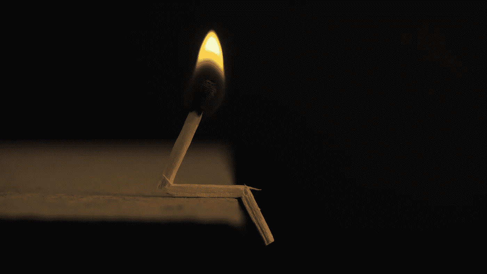

# 从疲惫中恢复过来，发现什么是重要的

> 原文：<https://medium.datadriveninvestor.com/recovering-from-burn-out-and-discovering-what-is-important-b52a2a91fd0f?source=collection_archive---------26----------------------->

> "直到我们迷失，我们才开始了解自己。"——亨利·大卫·梭罗

燃尽就像掉进了一个黑洞，因为感觉世界失去了颜色。当你看不到周围的一切，也失去了尝试的动力时，爬出去是不可能的。我工作的公司出了问题，为了生存，它做出了一些艰难的决定。我将跳过那些细节，因为它在这个故事中不太重要。新的工作环境严重打击了我的士气，以至于我失去了兴趣，不再有乐趣，并开始觉得自己来错了地方。不想放弃，我花了五个月去做积极的改变，但是什么都没有改变，所以精疲力竭是不可避免的。精疲力尽之后，我辞掉了工作，这让我觉得自己很失败，我的信心跌到了谷底。我无法前进，因为我不知道自己想做什么，觉得自己不够好。

所以我坐在黑暗的洞里，没有任何爬出来的动力。

在我离职之前，我读了一篇文章，内容是关于人们在工作间隙抽出一些时间来减压和享受生活。受这篇文章的启发，我认为这是完成我的遗愿清单项目的最佳时机，所以我购买了两个月的欧洲火车票，一张去伦敦的单程票，并在伦敦的一家旅馆预订了五个晚上。我勾画了一条穿越欧洲的路线，途经 10 个不同国家的 21 个城市。除了我在伦敦的第一个星期，没有任何具体的计划或其他预定。这次旅行超出了我的舒适区，因为这是我第一次背包旅行，第一次去欧洲，第一次独自旅行，第一次住在旅馆。

旅行期间，我的生活毫无章法，这让我花了几周时间来适应。我没有我想去的地方，我可以随心所欲地去任何地方。平均而言，我在每个城市住两晚，这意味着我必须每隔一天就计划好下一次的住宿和交通，同时弄清楚我在当前的城市想做什么。最重要的是，我必须快速学习和适应，因为每个地方都有不同的地铁和火车系统。需要适应文化差异，比如意大利，西班牙直到晚上 8 点才吃晚饭。

背着背包生活给我提供了最基本的必需品。由于空间有限，我不得不携带所有东西，所以在决定什么是必需品时，我变得非常自律。我意识到我不需要那个花哨的蓝牙音箱或者我的蓝光电影收藏。我发现，让我分心的事情越少，我就能更好地集中注意力。

住在招待所是一种社交体验，可以有机会结识新朋友并与他们互动。每个人都有自己的故事和不同的生活方式。有些人甚至为了更舒适的生活放弃了高薪工作，这种生活使他们能够旅行几个月。我遇到了一个辞职加入巡回马戏团的人，也遇到了一个已经旅行了七年的人。每个人都有不同的生活动机，他们都在快乐地追求着什么。

一开始是一次远离一切的旅行，结果变成了一次缓慢的自我恢复之旅。每天都有新的挑战要克服，有些挑战以失败告终，但我能从每一个挑战中学习。新的文化价值观让我思考什么对我来说是重要的。每次谈话都包含了我学到的新的生活视角。

它很柔软，但是有什么东西开始在我黑暗的洞里回响。

旅行结束后，我感觉神清气爽，但却面临着一个关于未来该做什么的两难境地。我想弄清楚当我进入软件开发时，我的动机是什么，它是否仍然是我的动机。我想起了我曾经告诉那些问我为什么成为软件开发人员的人的故事。

> “我是谁？询问并开始你的内在旅程。”匿名的

十二岁的时候，我在玩一款基于文字的游戏，名为“M.U.D”，是多用户地下城的简称。这不是游戏的名字，但我早就忘记了我玩过的 M.U.D .的名字。有一天，我想“嘿！如果我自己造呢？”我上网研究如何启动我的 M.U.D。网上有许多关于如何启动自己的 M.U.D 的有用指南和各种代码分叉的解释。我通过使用 M.U.D .代码库和一本二手的《傻瓜 C 语言》自学了 C 语言。有一次，我发誓分号和花括号是我编译代码时遇到的每一个语法错误的根源。

到最后，我意识到我不可能在我的 56k 拨号连接上托管一个 MUD，必须找到主机服务器。在过去的几个月里，我和我玩的 M.U.D .的主人成了朋友。我问他关于主机服务的事情，他向我介绍了他的主机，他也是这个游戏的玩家。我和她谈了关于开始我的医学博士学位并让她为我主持的事。这项服务每年收费 60 美元，这对一个孩子来说是一大笔钱。在我这方面有勇无谋，我最终把现金装在一个信封里寄出去了，但整容大军正确地排好了队，一周后我的托管账户就出现了。一切终于走到了一起，我终于推出了我的游戏。

如果我告诉你这一切都发生在我“我想造一个”之后的六个月内，你会相信吗？一个资源有限的孩子成功推出了他自己的 M.U.D .游戏，并主持了几年。我犯了很多错误，但从每个错误中吸取了教训。人们愿意帮助我实现我想做的事情。最后，我喜欢挑战和克服挑战的感觉。我非常喜欢这种体验，以至于我继续学习 C++。这个古怪有趣的梦是我进入快节奏和混乱的软件工程世界的第一步。

回声不是从黑洞里传出来的。它来自我的内心。

作为一个孩子，我的动机是探索被称为软件的难题和编码，但在我的职业生涯中有一个关键时刻我记得非常清楚。当一个团队领导的职位空缺时，我通过展示我的成就向老板提出申请。他警告我领导团队是不同的，然后给了我这个职位。几个月过去了，我不知所措，努力扮演好自己的角色。我的心态是个人贡献者，我很难转变为领导者。这个项目完成了，但是有很多问题，后来我失去了这个职位。那次失败激发了我从以前的错误中吸取教训。

另一个领导机会来了，我准备好抓住它。我发现了建立一个团队并让他们做他们最擅长的事情的乐趣。一个伟大的团队可以移山。我继续担任技术领导的角色，但是我觉得我的成长已经停滞不前，我从工作中学不到任何东西。我暗示我想和我的老板一起辞职，但是他回来了，给我升职加薪。获得导演头衔让我感觉受到了赏识，因为人们祝贺我这么快就成功了。新的角色给了我更多的自由去改变事物，并允许工程管理成长。由于之前的失败，我开始对产品和工程领导的愿景投入大量资金。虽然我带领产品和团队经历了许多有益于公司的变化，但这是以编写代码为代价的。回想起来，我后悔过早停止编码，因为这是我喜欢做的事情。

*那不是回声。那是一个声音。继续前进。*

我的软件工程师之旅开始时是一种爱好，但随着时间的推移，它变成了一种向上爬的职业。愚蠢的是，我把很多导演头衔的骄傲连同工资一起拿走了，结果是一副手铐。辞职后，我觉得如果找不到另一份导演工作，是一种挫折。我太看重这个头衔了，它既不能定义我是谁，也不能暗示我的价值。然而，我意识到这让我偏离了我想要的东西。

我的另一个疑虑是，我太专注于管理，我的编码技能已经生锈，这也让我不知所措。当我十几岁的时候，我没有任何恐惧感，并跟随我的好奇心到它带我去的任何地方。欧洲证明了我小时候开始这段旅程的意志力和动力并没有消失。我仍然拥有它，它帮助我重拾失去的信心。

我爬出了那个黑暗的洞。它没有我担心的那么深。

走出黑洞的道路需要一些时间让自己恢复，让自己重新聚焦。在这个过程中的某个地方，我忘记了我进入软件开发的原因，并被头衔和公司的晋升转移了注意力。为了前进，我接受了“后退”是可以的，因为我学到的和贡献的更重要。我又找到了动力，拂去了恐惧。对我来说，这是回到基础，然后是我的新挑战。我的下一个冒险将是寻找一家公司和产品，我会喜欢奉献我的时间。

感谢你阅读我关于从疲惫中恢复的长篇故事。这里引用一句话作为结束语:

> “找到你感兴趣的事情，并保持极大的兴趣。”——茱莉亚·切尔德

## 概述:

*   关注你自己，通过改变环境获得一个新的视角，比如一次漫长的独自旅行
*   对你开始职业生涯时的激情和动力做一些反思和评估
*   发现并解决阻碍你前进的疑虑
*   决定什么是重要的，什么是令人分心的，这样你就可以专注于对你重要的事情