# 递归神经网络-RNN

> 原文：<https://medium.datadriveninvestor.com/recurrent-neural-network-rnn-52dd4f01b7e8?source=collection_archive---------1----------------------->

如果你有兴趣知道谷歌语音搜索或亚马逊的 Alexa 或苹果的 Siri 是如何工作的。你需要对神经网络和 CNN 有一个基本的了解，然后继续阅读了解这项技术。

对于[神经网络](https://medium.com/datadriveninvestor/neural-network-simplified-c28b6614add4)的基本了解

对于 [CNN](https://medium.com/@arshren/convolutional-neural-network-cnn-simplified-ecafd4ee52c5) 的基本了解

我们将从

*   递归神经网络帮助解决人工神经网络和卷积神经网络所缺少的问题。
*   我们可以在哪里使用 RNN？
*   什么是 RNN，它是如何工作的？
*   挑战香草 RNN 像消失和爆炸梯度
*   LSTM(长短期记忆)和 GRU(门控循环单元)如何解决这些挑战

*系好安全带，准备在 RNN 开始一段激动人心的旅程*

假设我们正在写一条消息“我们在 __ 见面吧”，我们需要预测下一个单词是什么。下一个词可能是午餐、晚餐、早餐或咖啡。我们更容易根据上下文做出推断。比方说，如果我们知道我们是在下午开会，并且信息一直保存在我们的记忆中，那么我们就可以很容易地预测我们可能是在一起吃午饭。

当我们需要处理需要在几个时间步上持续的顺序数据时，我们使用递归神经网络(RNN)

传统神经网络和 CNN 需要固定的输入向量，在固定的层集合上应用激活函数以产生固定大小的输出。

例如，我们采用 128 乘 128 大小的向量的输入图像来预测狗、猫或汽车的图像。我们不能用可变尺寸的图像来做预测

现在，如果我们需要对依赖于先前输入状态的顺序数据进行操作，比如我们的消息，或者当顺序数据可以是输入或输出，或者同时是输入和输出，这正是我们使用 RNNs 的地方。

在 RNN，我们共享权重，并将输出递归地反馈到输入中。这种循环公式有助于处理顺序数据。

**RNN 利用连续数据进行推断**比如谁在说话，正在说什么，下一个词可能是什么等等。

**RNN 的神经网络具有循环来保存信息**。RNN 被称为**递归，因为它们对序列中的每个元素执行相同的任务，并且输出元素依赖于先前的元素或状态**。这就是 RNN 如何利用上下文来推断信息的。

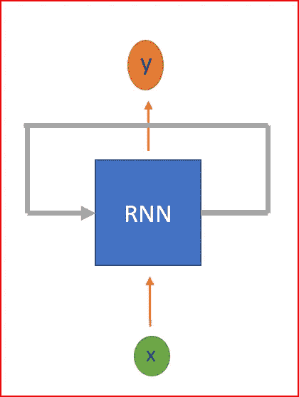

RNN are neural networks with loops to persist information

*RNN 的用在哪里？*

如前所述，RNN 可以有一个或多个输入和一个或多个输出，即可变输入和可变输出。

RNN 是用来

*   图像分类
*   图像字幕
*   机器翻译
*   视频分类
*   情感分析

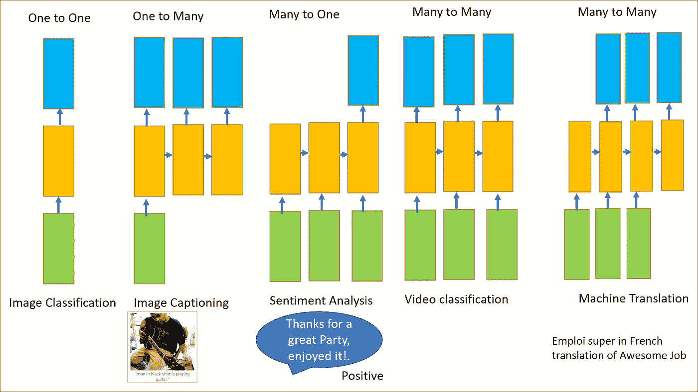

Source:[http://karpathy.github.io/](http://karpathy.github.io/)

RNN 是如何工作的？

慢慢解开 RNN，首先解释符号。

*   h 是隐藏状态
*   x 是输入
*   y 是输出
*   w 是重量
*   t 是时间步长

当我们正在处理顺序数据时，RNN 在时间步长 t 取**输入 x，** RNN 在时间步长 t-1 取**隐藏状态值，以计算时间步长 t** 和**的**隐藏状态 h，应用双曲正切激活函数**。我们使用 tanh 或 ReLU 表示时间 t 时**输出 y 的非线性。****

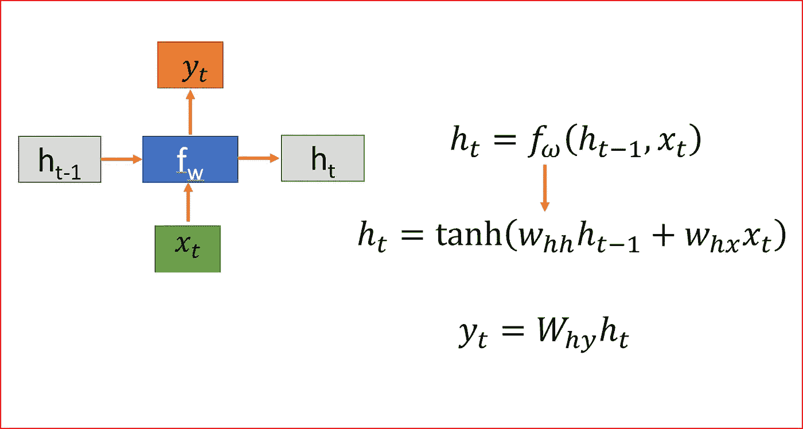

Vanilla RNN at time step t with equations for hidden state and output

将 RNN 展开成 4 层神经网络，其中在每一步共享权重矩阵 W。

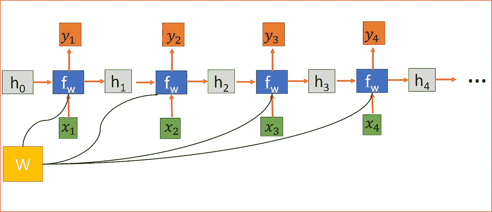

Unrolled RNN

隐藏状态连接前一个状态的信息，因此就像 RNN 的记忆一样。任何时间步长的输出取决于当前输入和先前状态。

不像其他深度神经网络对每个隐藏层使用不同的参数，RNN 在每一步共享相同的权重参数。

我们随机初始化权重矩阵，在训练过程中，我们需要找到矩阵的值来给出我们想要的行为，因此我们计算**损失函数 L。**损失函数 L 通过测量实际输出和预测输出之间的差异来计算..为了计算 L，我们使用交叉熵函数。

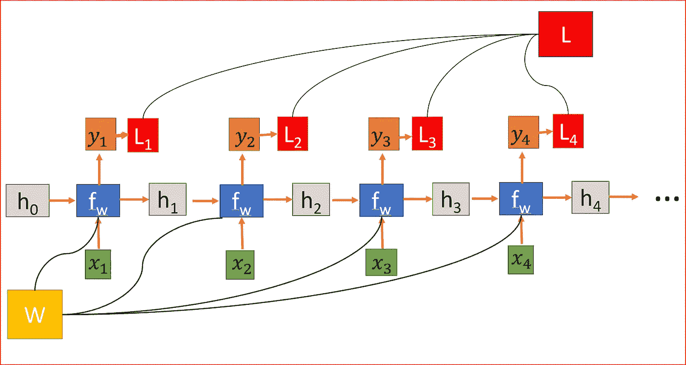

RNN where loss function L is sum of all the loss across layers

为了减少损失，我们使用反向传播，但与传统的神经网络不同，RNN 在多层之间共享权重，或者换句话说，它在所有时间步长上共享权重。这样，每一步的误差梯度也取决于前一步的损耗。

在上面的例子中，为了计算第 4 步的梯度，我们需要将前 3 步的损失与第 4 个时间步的损失相加。这被称为**通过时间 BPPT 的反向传播。**

我们计算误差相对于权重的梯度，以便我们学习正确的权重，从而获得期望的输出。

由于 W 用于每一步，直到我们关心的输出，我们从 t=4 到 t=0 反向传播。在传统的神经网络中，我们不共享权重，因此我们不需要对梯度求和，然而在 RNN 中，我们共享权重，并且我们需要对 W 在每个时间步的梯度求和。

在时间步长 t =0 计算 h 的梯度涉及 W 的许多因素，因为我们需要通过每个 RNN 单元反向传播。即使我们忘记了权重矩阵，一次又一次地乘以相同的标量值，比如说 100 个时间步长，这也是一个挑战。

如果最大奇异值大于 1，则梯度会爆炸，称为**爆炸梯度**。

如果最大奇异值小于 1，则梯度消失，称为**消失梯度。**

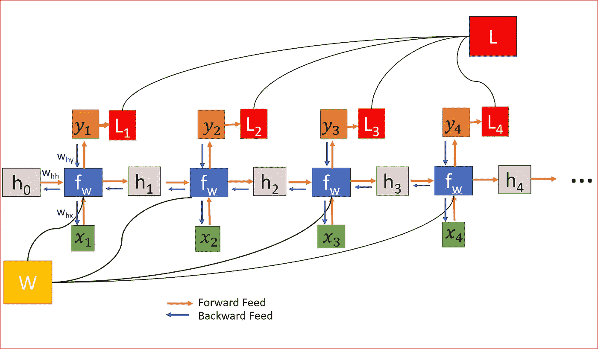

Forward and Backward feed and weights are shared across all layers causing either Exploding or Vanishing gradient

我们可以使用**梯度剪辑来解决爆炸梯度**问题，我们可以预先设置一个阈值，如果梯度值大于阈值，我们可以剪辑它。

对于解决消失梯度流行的方法是使用 LSTM(长短期记忆)或门控循环单元(GRU)。

在我们的消息示例中，为了预测下一个单词，我们需要返回几个时间步骤来了解前面的讨论。我们可能在两个相关信息之间有足够的差距。随着差距的扩大，RNN 学习和联系信息变得越来越困难。这是 LSTM 来拯救我们的时候了。

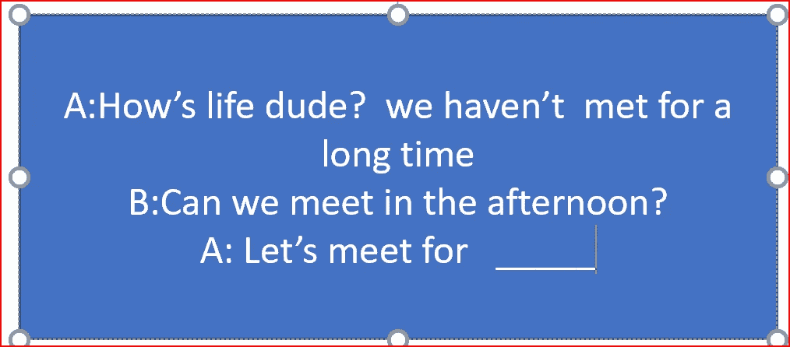

we need to go a few steps back to predict the next word. LSTMs can go back 1000’s of time step

# 长短期记忆(LSTM)

LSTMs 能够更快地学习长期依赖性。LSTMs 可以学习跨越超过 1000 步的时间间隔。这是通过一种有效的、基于梯度的算法来实现的，该算法使用通过内部状态的恒定误差流

为了预测消息中的下一个单词，我们可以将上下文存储到消息的最开始，这样我们就有了正确的上下文。这正是我们的记忆是如何工作的。

*让我们深入 LSTM 的建筑，了解它是如何工作的*

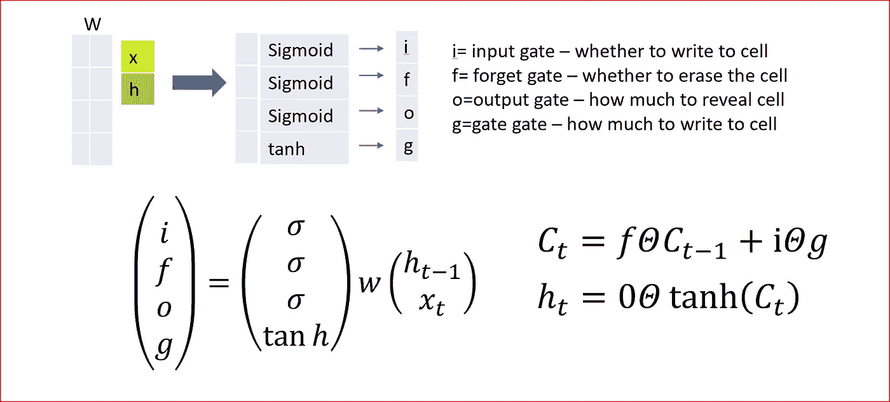

Long Short Term Memory-LSTM

LSTMs 的行为是在长时间内记住信息，因此它需要知道记住什么和忘记什么。

LSTM 使用了 4 个门，你可以把它们记为 ifog，来知道我们是否需要记住之前的状态。细胞状态在 LSTMs 中起着关键作用。LSTM 可以使用 4 个调节门来决定是否要添加或删除单元状态的信息。

这些闸门就像水龙头一样，决定着应该通过多少信息。

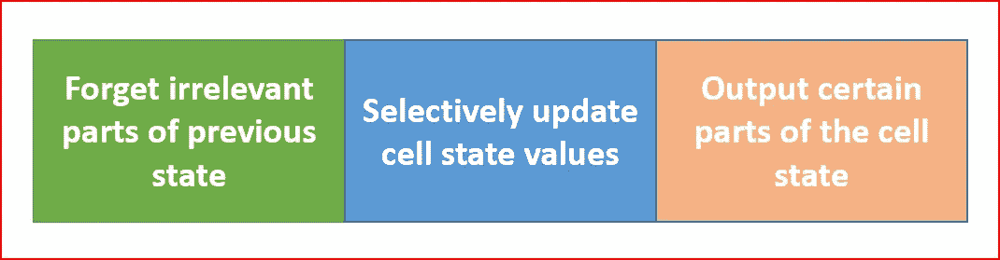

Three steps in LSTM

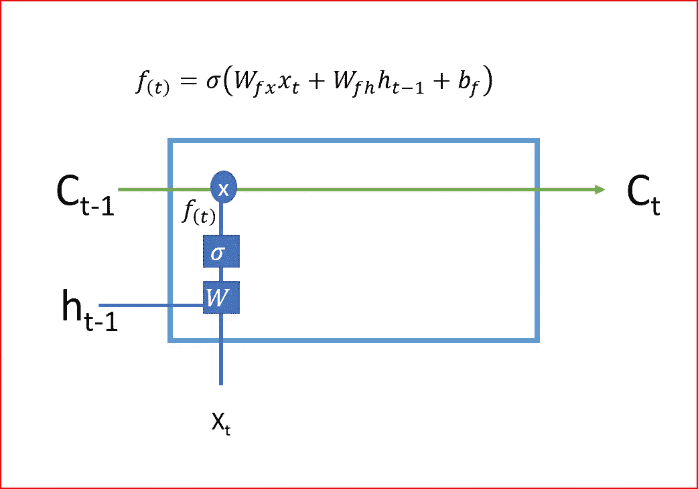

Forget gate uses sigmoid activation to decide whether to forget to remember the value of previous cell state

1.  LSTM 的第一步是决定我们是否需要**记住或忘记**细胞状态。**遗忘门**使用 sigmoid 激活功能，该功能给出 0 或 1 的输出值。“忘记门”的输出 1 告诉我们希望保留该值，而值 0 告诉我们希望忘记该值。

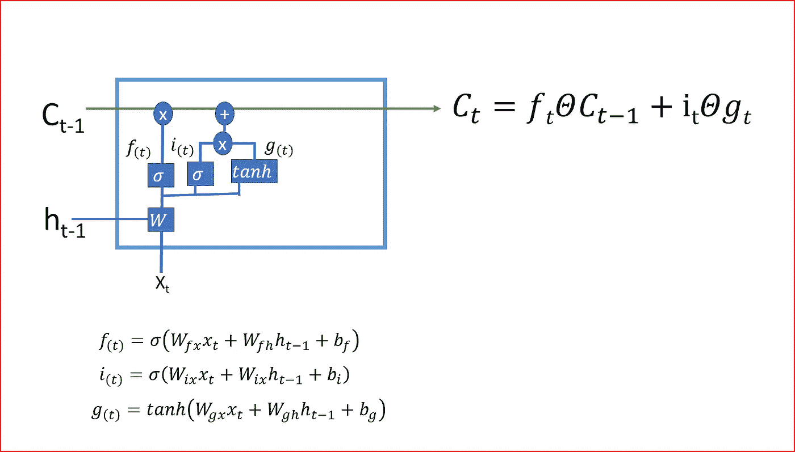

2.第二步是决定在单元状态中存储什么新信息。它由两部分组成，一部分是输入门，决定是否使用 sigmoid 函数写入单元状态，另一部分是门控门，决定使用 tanh 激活函数写入单元状态的量。门控创建可以添加到单元状态的向量或新的候选值

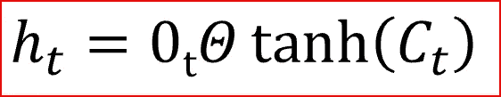

hidden state output

3.在最后一步中，我们通过合并步骤 1 和步骤 2 的输出来创建单元状态，即将当前时间步长应用双曲正切激活函数后的单元状态乘以输出门的输出。Tanh 激活函数给出-1 和+1 之间的输出范围

4.单元状态是单元的内部存储器，它将先前的单元状态乘以遗忘门，然后将 g 中新计算的隐藏状态乘以输入门 I 的输出。

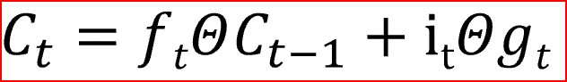

Cell state for current time step

最后，输出将基于单元状态，但将是过滤后的版本。

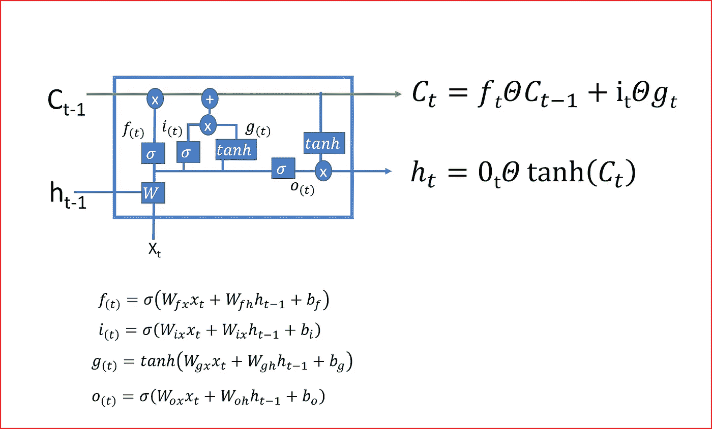

LSTM

从当前单元状态到先前单元状态的反向传播仅具有通过遗忘门的逐元素乘法，没有通过 w 的矩阵乘法。这使用单元状态创建了反向传播高速公路，消除了消失和爆炸梯度问题。

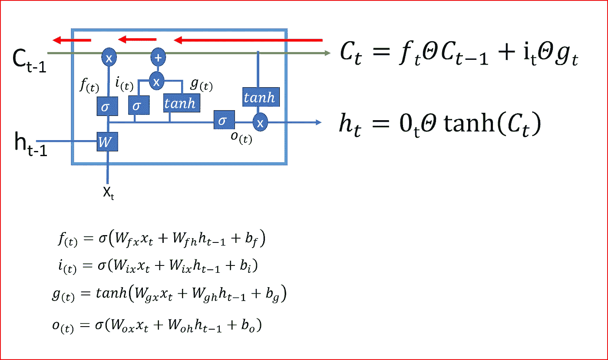

Back propagation super highway using cell states

LSTM 通过决定忘记什么和记住什么，更新哪些信息来决定何时以及如何在每个时间步转换记忆。这就是 LSTMs 帮助储存长期记忆的方式。

一个 LSTM 如何预测我们信息的例子

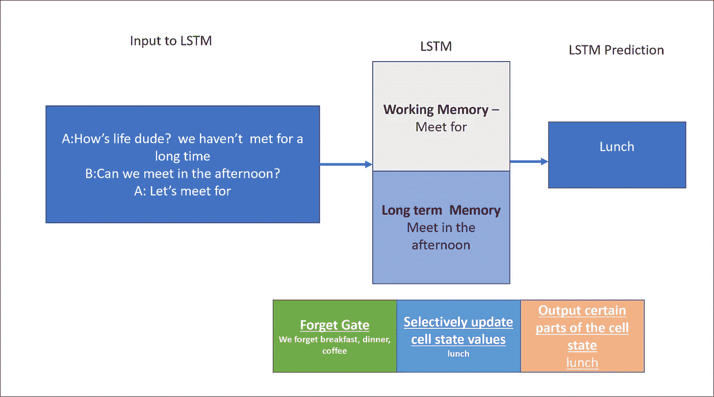

LSTM prediction

# GRU——LSTM 的变体

GRU 使用两个门**复位门和一个更新门**不像 LSTM 的三个步骤。GRU 没有内部记忆

重置门决定如何将新输入与先前时间步长的记忆相结合。

更新门决定应该保留多少先前的内存。更新门是我们在 LSTM 所理解的输入门和遗忘门的组合。

GRU 是 LSTM 解决消失梯度问题的更简单的变体

## 灵感和参考来源

http://karpathy.github.io/2015/05/21/rnn-effectiveness/

【http://cs231n.stanford.edu/ 

[http://colah.github.io/posts/2015-08-Understanding-LSTMs/](http://colah.github.io/posts/2015-08-Understanding-LSTMs/)

## 阅读它，分享它，如果它能帮助你获得更好的理解，请鼓掌。