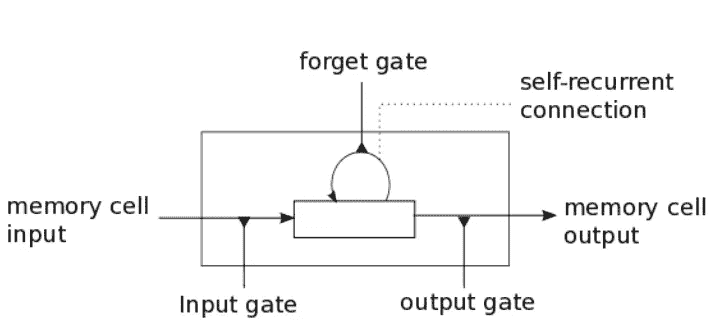

# 递归神经网络与长短期记忆

> 原文：<https://medium.datadriveninvestor.com/recurrent-neural-networks-and-long-short-term-memory-5d17bdbdfc00?source=collection_archive---------6----------------------->

递归神经网络是可以用于序列问题的算法的一个很好的例子。所谓序列问题，我指的是任何附带有*时间因子*的东西。

> 例如:文本、语音、音频、视频或股价预测或任何可以显示为时间因素的内容。为了更好地理解这一点，让我们以言语为例，我接下来要说的话必须依赖于我已经说过的话。我不能断章取义，因为这听起来像胡言乱语。我需要让事情有条不紊，或者需要附加一些时间因素。

为了理解这个问题让我们以晚餐吃什么为例？假设我每天晚上要么得到面包，要么得到*米饭，要么得到*比萨饼。我别无选择，只能每天晚上只吃其中一种。**

> 我想预测一下我今晚会吃什么？我希望我的算法比随机猜测更好，在这种情况下是 33.33%

现在为了预测我今晚会吃什么，我可能会试着建立一个神经网络。我建立的神经网络考虑了许多因素，如“一周中的某一天”、“今天过得怎么样”、“我的能量水平”、“前一天晚上我是否睡得好”等。然而，尽管有这些变量和一些超参数调整，我发现神经网络无法正确预测我那天晚上会吃什么。它做的最好的是 33.33%。

> 准确率 33.33%。我错过了什么？我的神经网络丢失了什么？我总是只按这个顺序吃面包、米饭、披萨！这是序列数据，是我的神经网络遗漏的成分。

这个难题的缺失部分是我没有考虑到我被允许吃的三顿晚餐，即面包、米饭和比萨饼之间的关系。有一种模式: ***我总是只按这个顺序吃面包、米饭、披萨！*** *。*以前的神经网络考虑了一切，但数据之间的内在关系是有序的。顺序数据意味着输入系统的数据模式之间存在某种内在联系，系统需要过滤掉这种内在联系。

现在，如果我按照这个顺序吃*面包-米饭-比萨饼*的标准，作为我们神经网络的特征，这就变成了一个非常简单的问题。我的系统需要关注的唯一变量是我昨天吃了什么来计算我今天会吃什么。

现在困扰我的问题是如何将这些信息输入神经网络。神经网络在计算机中运行，计算机理解的一切都是 1 和 0。为了解决这个问题，我们可以引入向量的概念。

> Vector 是列表的别称。

假设今天的天气是

```
High Temperature : 38 Deg
Low Temperature : 24 Deg
Wind : 13 kmph
precipitation : 0.15 mm
Relative Humidity : 84% , then ,
the weather vector is |38|24|13|0.15|84|.
So Vector is a series of number to represent a phenomena like today's weather.
```

> 任何进入计算机的东西在通过它之前都先被转换成一系列数字。这就是所谓的矢量化。

现在，如果我说今天是星期二:它也可以编码成这样的数字:星期二→0100000 (0 代表一周中的所有日子，1 代表星期二。)这种稀疏矩阵被称为一个热编码向量，虽然它们看起来很麻烦，但对于向计算机表示*分类数据*非常有用。

回到晚餐的概念，我吃的食物面包、米饭、比萨饼都是分类数据，可以进行热编码，以便计算机可以轻松理解。

```
So let Bread be  100
Similarly Rice be 010
and the Pizza be 001
```

现在每当我的神经网络发现我昨天吃了米饭，它就预测我今天会吃披萨。然而，现在让我们考虑一个警告，昨天我不在城里，所以我昨天没有吃通常的食物，那么系统将如何预测我今天会吃什么。下面是*时间步长*标准。

假设我们的情况中的时间步长是 1 天前。所以这意味着我的神经网络不仅记得我昨天吃了什么还记得我前天吃了什么。

所以，如果我昨天没吃晚餐，但是前天吃了披萨，那么它知道我今天应该吃米饭，因为我昨天应该吃面包，我错过了，但是然后我一丝不苟地按照时间表，只吃米饭！

> 这些时间步长或神经网络在固定数量的时间步长内记住过去事情的能力被称为**时间反向传播。**

# 写一本儿童书

假设一本儿童读物有以下几行

道格看到了简。简看见了斑点。斑点看见了道格。

那么形成的字典是

{道格，简，斑点，锯，。}这些是唯一的单词，词典仅由这些单词组成。我们的网络需要*学习*字典中数据的序列模式。*因此，如果我最近的单词是 Doug，那么网络应该推荐最频繁的单词是 saw 或。因为这些是名字后面最常用的词。*

现在让我们假设神经网络预测道格之后的单词是*看见*现在网络需要做出下一个预测，并且它现在是一个名字，因为很显然，在单词*看见*之后，我们通常神经网络给出一个名字，比如说*道格，或者简或者斑点*。但是当我们有一个*道格看见道格*的预测时，问题就出现了。LSTM 允许通过其多个神经网络来防止类似的错误，每个神经网络都有一个特定的任务，比如选择、遗忘或忽略等。防止道格看到道格这种问题。LSTM 神经网络可以保持对未来的预测，如果我的时间步长是 1，那么网络将记住*昨天它预测了道格今天它预测了 saw* 所以明天的预测肯定会包括昨天我预测了 saw 并且在前天(t+1)预测了道格，所以它不应该预测道格或 saw，而是其他名字，如 Spot 或 Jane。

# LSTM 是如何完成上述壮举的？

LSTM 确实有能力删除或添加细胞状态的信息，由称为门的结构仔细调节。门是选择性地让信息通过的一种方式。它们由一个 sigmoid 神经网络层和一个逐点乘法运算组成。递归网络更令人兴奋的核心原因是，它们允许我们对向量序列进行操作:输入序列、输出序列，或者在最一般的情况下两者都有。[一→一]，[一→多]，[多→多]，[多→多]。这克服了普通神经网络的明显限制:它们接受固定大小的向量作为输入(例如，图像)，并产生固定大小的向量作为输出(例如，不同类别的概率)。不仅如此:这些模型使用固定数量的计算步骤(例如，模型中的层数)来执行这种映射。

# 详细列表



LSTM 权重:存储单元具有用于输入、输出的权重参数，以及通过暴露于输入时间步长而建立的内部状态。 **1。输入重量**。用于加权当前时间步长的输入。 **2。输出重量**。用于加权上一时间步的输出。 **3。内部状态**。用于计算该时间步长输出的内部状态。

LSTM 门记忆细胞的钥匙是门。这些也是进一步控制细胞中信息流的加权函数。有三个门: **1。忘记门**:决定从单元格中丢弃什么信息。 **2。输入门:**决定从输入中选择哪些值来更新存储器状态。 **3。输出门:**根据输入和单元的记忆决定输出什么。

> 遗忘门和输入门用于更新内部状态。输出门是细胞实际输出的最终限制器，(并负责防止*道格看到道格*种预测)。