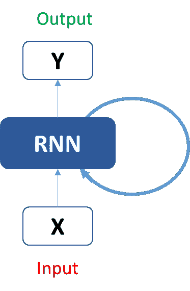
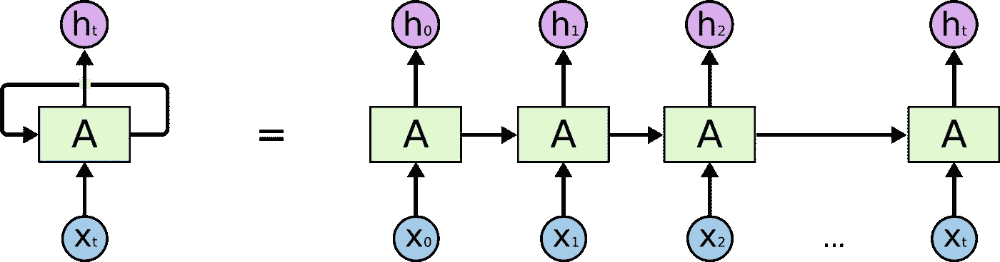
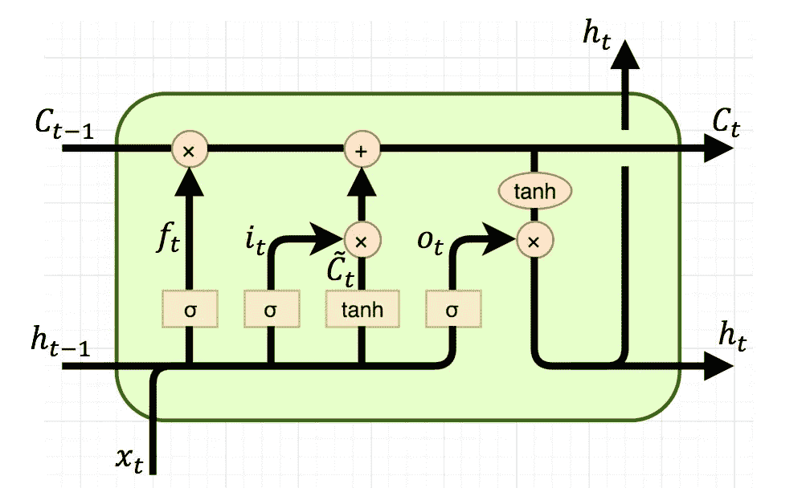

# 初学者用的递归神经网络

> 原文：<https://medium.datadriveninvestor.com/recurrent-neural-networks-for-beginner-471aec9fdeaf?source=collection_archive---------22----------------------->

你好读者，我想分享我关于深度学习中递归神经网络算法的知识。也称为 LSTMS(长短期记忆)。我将尽可能简单地解释这个问题，以便在这篇文章结束时，你能清楚地理解这个话题，并对这个算法有一些直觉。

对于那些不了解递归神经网络的人。

递归神经网络是一种在许多深度学习实践中使用的算法，属于深度学习的监督学习分支。递归神经网络的一些例子有:预测、文本翻译、文本预测、语音识别等。

我们使用递归神经网络进行各种类型的预测。为了进行预测，我们有人工神经网络，这也是另一种进行预测的监督算法。我肯定会说是的，但是如果我们的数据结构随时间变化呢？

# 重点这是关键部分。

如果我们的数据具有随时间变化的结构，这意味着以前的结果将对当前的结果产生影响例如:预测股票市场我们当然可以使用人工神经网络，但是相信我，我们的人工神经网络在做出预测方面表现很差，这没有任何意义，因为我们知道股票是如何工作的股票市场的变化取决于其公司利润、时间、价值等..看，这就像下一盘棋，你需要知道你的前一步棋，以做出最好的下一步棋。

Xo =输入节点，ho =输出节点，A =所有先前输出的数据(h-3、h-2、h-1、ho、h1、h2…)

所以递归神经网络将采用输入(x1)+先前输出(ho)来预测(h1)。这就像一个链式过程，问题就出在这里，连续获取所有数据(A)意味着一大块内存，我们的递归神经网络将有一个庞大的数据网络要处理。

# 人工神经网络中的消失梯度和爆炸梯度问题

所以我们在执行反向传播时，在神经网络中有一个非常普遍的问题。对于那些不了解反向传播的人来说，它是一种算法，可以最小化我们模型中的误差，以进行准确的预测。如果我们的架构非常大，神经网络的第一层将具有被认为是弱学习器的小权重，而神经网络的最后一层将具有大权重。当我们执行反向传播以最小化错误率时，梯度将在神经网络的第一层中非常非常缓慢地移动，这被称为消失梯度问题，而在神经网络的最后一层中，由于它们将具有大的权重，梯度将从局部最优值跳出来，这被称为爆炸梯度。考虑到这些问题，递归神经网络会随着时间而消失，但我们不要放弃希望！！！

# 耶！！lstms

Sepp Hochreiter 在他的毕业论文中提出了解决这个问题的方法。他引入了 lSTM，即所谓的长短期记忆。

Long Short Term Memory

ct-1 =连续存储单元状态，[x，+] =存储流控制门，ct =最终门，sigma =激活函数，tanh =激活函数

简而言之，lstm 由连续的存储流单元状态组成，假设它像一个管道，其中存储连续流动，它有三个门，它们被称为遗忘门、更新门和最终门。

遗忘门将从先前的输出+当前输入中获取数据，并决定需要打开门多少以在单元状态中流动。并且更新状态将用当前存储器更新存储器，并且最终门将决定下一个输出需要多少流量。通过引入这些门，我们将不会拥有大量的内存，我们将获取需要的内存，并移除不必要的内存。这将产生一个最佳网络。并且可以执行反向传播来调整权重以获得更好的预测。

今天就到此为止，感谢您在这里花费宝贵的时间。