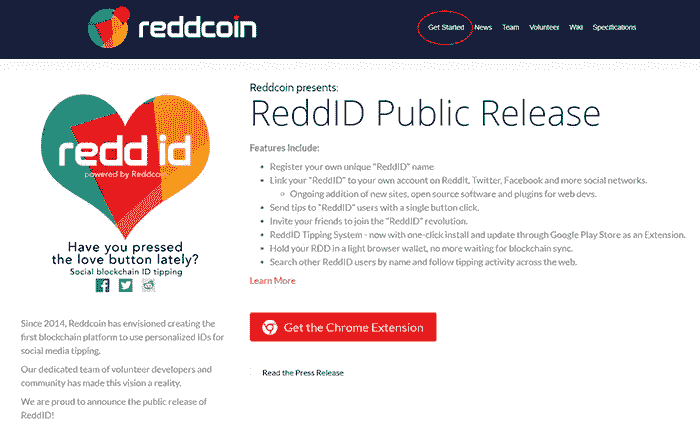
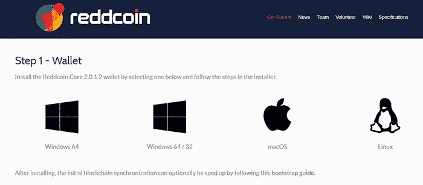
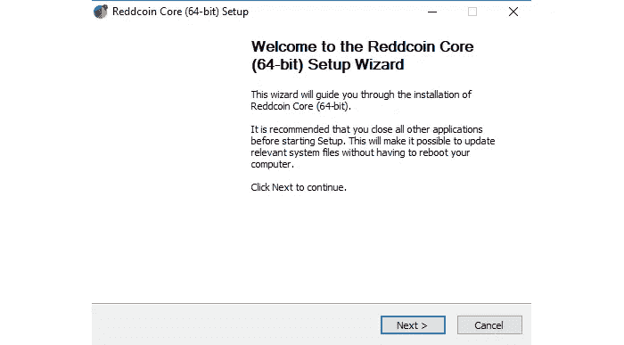
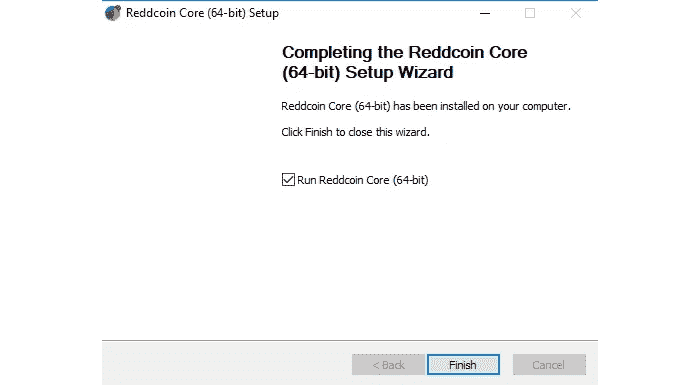
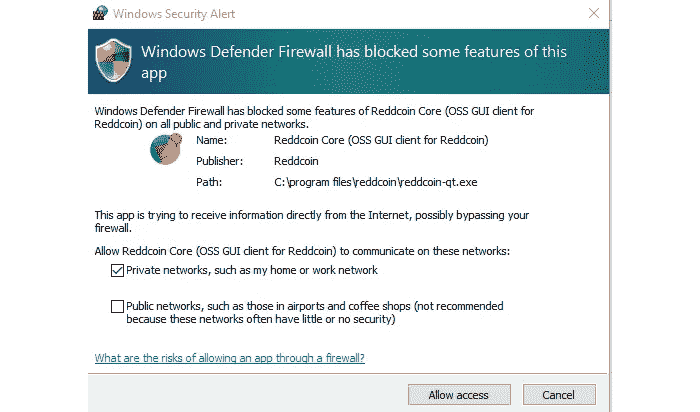
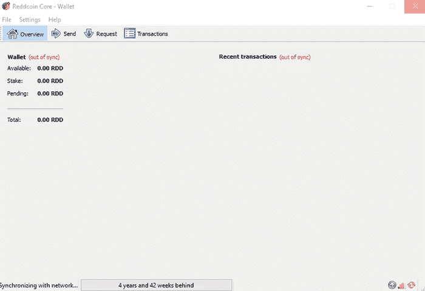
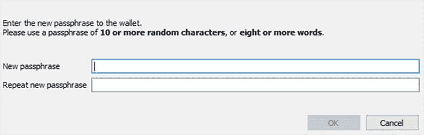
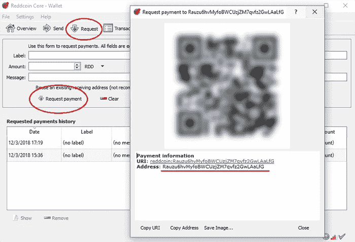
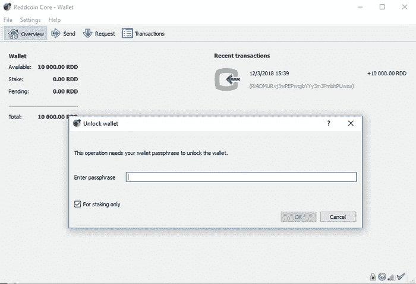

# REDD coin(RDD):2019 年项目概况和收入机会

> 原文：<https://medium.datadriveninvestor.com/reddcoin-rdd-project-overview-and-income-opportunity-in-2019-fa97d9786c52?source=collection_archive---------1----------------------->

## 一枚有赌注机会的社交网络硬币

R **eddcoin** (RDD)是一款成熟的社交网络币。它允许在社交网络上支付小费，以提高公众对加密货币的认识。

众所周知，社交媒体公司如**脸书**和**推特**将你的数据和社交媒体活动货币化。但是对于绝大多数用户来说，你的“**点赞**”和“**转发**”并没有提供任何经济价值。

**Reddcoin 拥有具有实际货币价值的互联网积分。**

> 有了 Reddcoin，你可以在 crypto 中为社交媒体活动(如“赞”和转发)给个人和企业小费。然后，您可以使用他们的 Reddcoins 在线购买物品、免费增值游戏的游戏内点数或奖励和忠诚度积分。

现在，你可以在 Twitter、Twitch 和 Reddit 上用 Reddcoin 支付小费。该项目计划增加脸书、Instagram、YouTube 和其他社交媒体平台的功能。

Reddcoin 的计划是成为互联网的官方按钮。

# 机会

Reddcoin 使用了一个修正的利害关系证明模型。因此，您必须在 Reddcoin Core wallet 中持有或下注您的硬币，才能参与网络并赢得 RDD。

> 使用 Reddcoin，您签署方块的能力是基于累积的币龄。你下注的时间越长，放在钱包里的时间越长，你能赚的 RDD 就越多。

有道理…赌注奖励定期收到。它可能短至一天，也可能是一周或更长。

> 但是每次你赢得赌注奖励时，这些硬币也开始赢得赌注奖励。换句话说，你可以复合你的持有量。

要参与赌注，你必须将你的钱包连接到硬币的网络。通过这种方式，你的“股份”通过竞争签署区块来帮助保护网络。

这意味着你需要保持你的钱包解锁和赌注相当不断。

对一些人来说，这是一个很大的不便。但如果这对你来说不成问题，押注 RDD 至少能获得 5.1%的收益率。经常下注的硬币持有者可以获得高达 6%的利息。

# 消防系统

## **未来潜力**

数字支付市场是一个 8850 亿美元的产业。微信和 Twitch 都在使用小费小额支付，并取得了巨大成功。Reddcoin 已经可以在 Twitch、Twitter 和 Reddit 上使用了。要知道，RDD 的年通货膨胀率为 5%。*(未来潜力:* ***中等*** *)*

## **收入**

通过押注 RDD，你可以获得 5.1%至 6%的收益率。*(收入:* ***中等*** *)*

## **风险**

数字支付的市场非常大，小额支付开辟了新的使用案例。Reddcoin 是加密货币领域社交小费的领导者。请记住，空间竞争异常激烈，因此请确保使用正确的职位规模。*(危险:* ***中等*** *)*

## **努力**

你的大部分时间都需要预先购买你的股份和设置钱包。然而，你有时需要监控你的钱包，以确保它没有上锁。*(努力:* ***中等*** *)*

**Reddcoin (RDD)**

当前价格: $0.001871

市值:53871992 美元(CMC 排名第 100 位)

**当前供应:**28808713174

总供应量:无数据:-(

# 如何从 Reddcoin (RDD)获得收入

以下是从 Reddcoin 赚取收入的基本流程:-

*   第一步:购买 RDD。
*   **第二步:**设置您的 Reddcoin Core 钱包。
*   第三步:把你的 RDD 发到你的钱包里。
*   **第四步:**打开钱包，开始下注。

# 专业提示

## **亲提示 1**

开始下注时没有最低 RDD 金额。

## **专业提示 2**

您的钱包必须持续解锁并连接到网络，才能从赌注中赢取奖励。

## **专业提示 3**

额外的电脑或笔记本电脑可以在需要持续连接的赌注硬币中派上用场。

## **专业提示 4**

请确保您的电脑保持接通电源，并关闭睡眠和关机模式，这样它就不会处于非活动状态。

此外，请注意，您的计算机会不时重启进行升级。虽然您可以将钱包设置为重启后打开，但您仍需要解锁钱包才能再次开始下注。

## **专业提示 5**

Reddcoin 还有一个产品叫做 Reddcoin 赌注箱。这是一种允许你下注 Reddcoin 加密货币的设备。

此外，您可以在电脑上安全地保留您的 Reddcoin，并且仍然可以获得下注奖励。这里可以找到[。](https://www.stakebox.org/collections/stakeboxes/products/reddcoin-stakebox)

**请注意:**这是*而不是*对 StakeBox 的建议，我们也没有使用过该产品。然而，我们想让你知道所有可用的选项。

# 逐步说明

**请注意:**当您阅读下面的说明时，某些屏幕截图可能已经过时。但是，我们指南中的信息仍然有效。许多公司发布他们程序的新版本。始终使用最新版本。

## **第一步:**

*   在 [Bittrex](https://bittrex.com/) 上购买 Reddcoin (RDD)。

## **第二步:**

*   下载 Reddcoin 核心钱包。
*   访问 Reddcoin 网站，点击“开始”见下图。

## **第三步:**

*   单击相应的图片，为您的操作系统选择钱包。

## **第四步:**

*   下载完成后，打开文件夹。
*   将弹出 Reddcoin 核心设置向导。
*   单击“下一步”继续。见下图。

## **第五步:**

*   安装完成后，单击“完成”见下图。

## **第六步:**

*   您可能需要设置网络安全以允许访问专用网络。
*   准备好之后，点按“允许访问”。见下图。

## **第七步:**

*   Reddcoin 核心钱包将打开并开始与网络同步。
*   Reddcoin 区块链已有四年历史，因此这可能需要几个小时。(你可能想在晚上做这个，让它下载一夜。)见下图。

## **第八步:**

*   转到“设置”
*   从下拉菜单中，选择“加密钱包”
*   通过加密您的钱包，您将设置一个唯一的密码或通行短语。这将用于完成钱包中的操作。(见下图。)
*   **确保将这些信息保存在安全的地方。**
*   设置密码后，Reddcoin 核心钱包将关闭。

## 第九步:

*   备份你的钱包。但首先，再次打开钱包。
*   钱包打开后，单击“文件”选项卡，然后单击“备份钱包”
*   这将提示您保存 wallet.dat 文件。
*   将此文件保存在安全的地方。
*   (备份 wallet 时，您会创建一个. dat 文件，通常命名为 wallet.dat。dat 文件将用于在硬件故障的情况下恢复您的钱包。确保保存您的。dat 文件放在安全的位置。确保它和你的钱包放在不同的地方。换句话说，把它放在你放钱包的电脑外面。例如，您可以将其存储在 USB 驱动器上。)

## **第十步:**

*   将您的 RDD 转移到您的钱包中。
*   为此，请点击钱包顶部的“请求”选项卡。
*   然后，点击“请求付款”调出你的钱包地址。
*   将出现一个弹出窗口，显示您的地址。见下图。

## **第十一步:**

*   你现在可以开始下赌注了。
*   为此，请打开您的钱包。你可以点击“设置”,然后从下拉菜单中选择“解锁钱包”。
*   这将打开一个弹出窗口，输入您的密码。见下图。
*   输入您的密码，然后单击“仅用于赌注”框

关于下注 RDD，有几件事你应该知道:

*   你需要解锁你的钱包，如步骤 11 所示。
*   你可以将鼠标移到钱包右下角的箭头符号上，确认你正在下注。
*   你的电脑和钱包必须运行，以赌注和接收硬币。
*   硬币必须成熟后才能开始下注。这需要几个小时。
*   没有最低数量的硬币需要赌注。

感谢阅读！请随意查看我下面的一些类似的加密货币相关帖子。

*   [如何从科莫多(KMD)获得加密收入](https://medium.com/@rastogimanu461/how-to-earn-crypto-income-from-komodo-kmd-5217fd8bc129)
*   [“锁定”您的 BIX 代币，继续获得您的 BIX 奖励](https://medium.com/@rastogimanu461/lock-your-bix-tokens-today-to-continue-receiving-your-bix-incentive-reward-8ee80f4589ba)
*   [如何从本体中获得 ONG(ONT)](https://medium.com/@rastogimanu461/how-to-earn-ong-from-ontology-ont-acd92ffdd318)
*   [Zilliqa:进展和更新，2019 年 6 月](https://medium.com/@rastogimanu461/zilliqa-progress-and-update-june-2019-ec09b0c3cc71)

你可以在 [Medium](https://medium.com/@rastogimanu461) 上关注我更多这样的帖子。