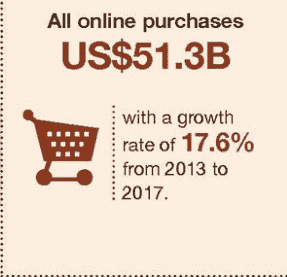
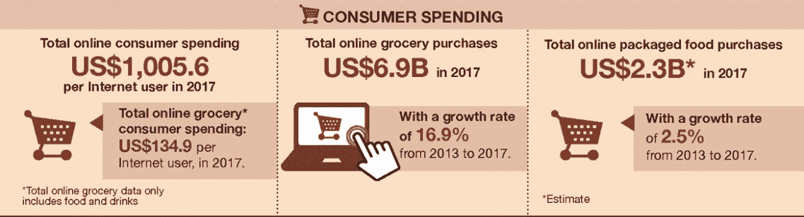

# 降低物流费用:通过区块链技术

> 原文：<https://medium.datadriveninvestor.com/reduce-expenses-in-logistics-by-blockchain-technology-5fe2d4968201?source=collection_archive---------9----------------------->

*“公司去年通过区块链技术降低了 25%的物流费用。区块链解决方案在定价、削减交易费用和消除中介或中间商方面表现突出。”*

最大的物流公司之一 Volt Technology 声称，到 2018 年，他们可以通过实施区块链技术来减少开支。物流公司、供应链公司、第三方物流等。各公司纷纷采用区块链技术，以较低的成本与信息技术发达的公司竞争服务。为什么？

**南韩电子商务统计**

[*http://www.agr.gc.ca/eng/industry-markets-and-trade/international-agri-food-market-intelligence/an-overview-of-e-commerce-trends-in-south-korea/?id=1531159188349*](http://www.agr.gc.ca/eng/industry-markets-and-trade/international-agri-food-market-intelligence/an-overview-of-e-commerce-trends-in-south-korea/?id=1531159188349)

随着电子商务在韩国网上市场的兴起，逆向物流的需求是必要的。

“2017 年，包括个人电脑和手机在内的国内在线购买额达 692 亿美元，高于 2016 年的 559 亿美元。2017 年 12 月，国内电子商务占韩国零售行业总额的 25.3%，”出口政府网页上说。他们继续说道，“智能手机的高普及率是推动市场增长的主要因素。虽然与 2016 年相比，2017 年个人电脑上的购买额仍为 270 亿美元，但手机上的购买额从 2016 年的 310 亿美元增加到 2017 年的 420 亿美元”。

**怎么了？**

物流公司在送货服务中面临的主要问题很少。首先，依赖于中间人，中间人连接信使和客户，并手动处理所有信息以进行交付，此外还增加了交付的价格。第二，大数据的利用。许多送货和物流公司不使用他们拥有的数据，无法为他们的用户设置新的设置和报价。第三，在网上订购的所有产品中，高达 30%成为退货，给逆向物流带来了不可逾越的负担。更多的网上采购给物流公司带来了更多的流动和压力。

**逆向电子商务成本**

2017 年，每位用户的总消费支出为 1005 美元。同年，网上杂货采购总额为 69 亿美元。正如我们所看到的，电子商务是韩国整个消费市场的关键组成部分，这个国家 99.2%的家庭通过 PC、手机或其他设备接入互联网。

[*http://www.agr.gc.ca/eng/industry-markets-and-trade/international-agri-food-market-intelligence/an-overview-of-e-commerce-trends-in-south-korea/?id=1531159188349*](http://www.agr.gc.ca/eng/industry-markets-and-trade/international-agri-food-market-intelligence/an-overview-of-e-commerce-trends-in-south-korea/?id=1531159188349)

随着用户数量的增加，在高需求和提供供应链可持续性的义务以及创造新产品的有效计划中，物流存在风险。公司看到使用新技术，包括区块链技术来解决许多问题。

区块链是物流公司形成综合战略的新工具，可以降低成本、费用和安全性。例如，Volt 基于区块链技术，结合智能合同，将消除参与者之间对集中式系统的依赖，从而显著降低客户的交付价格。因此，伏特技术不仅保证信使获得更高的收入，而且消除了时间和技术的限制，允许任何人使用该系统。

**区块链提供下一代服务**

区块链在新一代消费者中更受欢迎，他们对购买和做出有意识的选择有新的认识。尤其不同的是，在视觉上，他们以环保消费为中心，使用对人类危害较小的材料，他们关心地球上的污染问题。

全球有数百万家公司生产和接收来自其他公司的商品。困扰买卖合同履行至交货的问题之一。在区块链环境中，购买合同、发票以及从货物离开到交付点的整个跟踪都可以被跟踪。对于年轻一代来说，不再需要担心安全、安保和透明度问题。例如，Volt Technologies 是首批分析上述问题并通过区块链技术提出解决方案的物流公司之一。现在，该公司在提供服务和保持工作以使生活更加轻松和安全方面处于领先地位。

**下一步是什么？**

区块链最近开始在全球范围内使用，这就是为什么当局开始发明实施区块链技术的特殊标准。随着政府机构、供应商、贸易和物流公司的诚信，这种转变正在发生。交通运输区块链联盟(BiTA)是一个由各自行业领域的领导者组成的团体，他们共同努力打造一个管理平台，以在区块链实现可验证的加速成果。

最后，区块链技术在数据、信息目录和数据安全等系统中发挥作用。如上所述，越来越多的电子商务将在全球范围内增长，因此需要更安全、成本更低的系统。作为一个解决方案，区块链被证明是有前途的，同时也是最好的 IT 系统的合法化途径。

以下是最好的区块链解决方案:

1.  区块链技术提供了可问责的管理。
2.  消除了对后台员工的需求。
3.  运营商可以获得信息。
4.  按需提供和用于预测的大数据。
5.  区块链电子设备的实现。