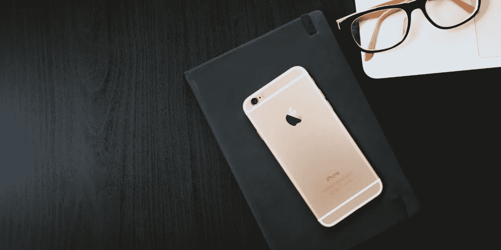
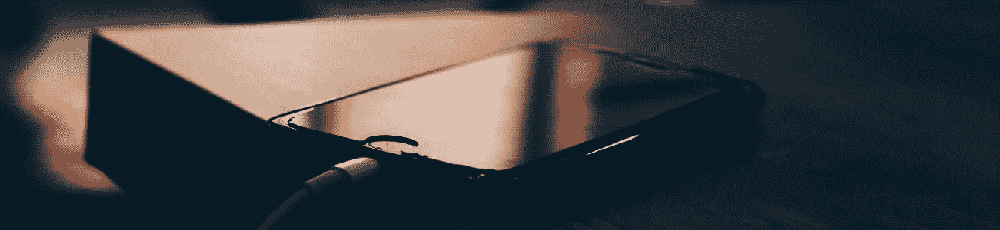

# 进一步降低 iPhone 屏幕亮度

> 原文：<https://medium.datadriveninvestor.com/reduce-iphone-screen-brightness-even-more-d77b0fdbd4d9?source=collection_archive---------12----------------------->

## 在晚上或黑暗中阅读明亮的 iPhone 屏幕会非常不舒服，尤其是当你试图入睡的时候。

*最初发表于*[*【millennialmoderator.com】*](http://millennialmoderator.com/reduce-iphone-screen-brightness-even-more)*。*

如果你像我一样，你是一个绝对的**吸血鬼**，希望你的 iPhone 亮度尽可能低。事实证明，实际上有一种比命令中心更暗的方式(从底部菜单向上滑动)。这只是许多其他酷的，[隐藏的 iPhone 技巧和窍门](http://millennialmoderator.com/5-iphone-tricks-you-didnt-know-about)之一。

# 降低 iPhone 亮度

在您的 iPhone 上执行以下步骤:

*   打开*设置*
*   选择*常规*
*   选择*可访问性*
*   找到*显示住宿*
*   启用*减少白点*
*   根据您的喜好调整滑块

瞧，你的 iPhone 屏幕现在会明显变暗。实际上，我不知道为什么会有人需要这么低的小费，但这仍然是一个不错的小费。如果你正在调整你的 iPhone 亮度以努力节省电池寿命，你应该考虑在 2018 年 12 月前更换电池。

你觉得这个 iPhone 提示有用吗？分享给你的朋友，或者在推特上给我留言！

标记为:[技术电话](http://millennialmoderator.com/reduce-iphone-screen-brightness-even-more#)

*原载于*[*millennialmoderator.com*](http://millennialmoderator.com/reduce-iphone-screen-brightness-even-more)*。*