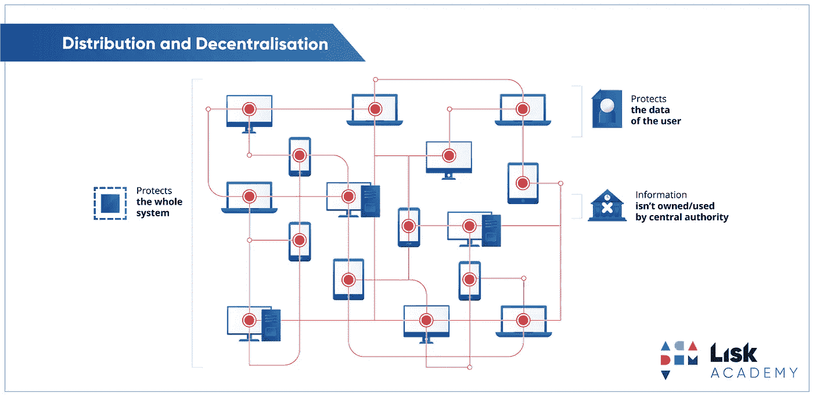

# 减少区块链社区的欺诈:听起来很简单吗？

> 原文：<https://medium.datadriveninvestor.com/reducing-fraud-in-the-blockchain-community-as-simple-as-it-sounds-1352ed818f01?source=collection_archive---------17----------------------->

黑客、恶意软件和陷阱在区块链社区中无处不在。然而，欺诈是由区块链的安全性缺陷造成的。缺陷，如分散的管理不善和安全，以及其他东西，如薄弱的防火墙。但是，如何才能彻底根除区块链开发商存在的欺诈等问题呢？嗯，事情没有看起来那么简单。

区块链应用和系统是去中心化的操作系统，没有具体的或主要的管理系统。区块链开发者遵循审计系统，与交易存储在区块链系统的数据资产中的方式相同。因为他们遵循一个审计系统，所有的编辑都可以通过同意或不同意来改变。审计系统也可以被改变，但仍然不受同一来源或用户的控制。不过，这可能是一个问题，因为交易信息和运输的缘故。对区块链系统实施了不同的攻击，尽管目的不同，但并不都是针对去中心化的管理系统和组织。

图 1.0

区块链社区没有指定的中央管理系统，这是区块链时代出现如此多欺诈和黑客攻击企图和问题的主要原因。在图 1.0 中，它显示并描述了区块链审计和投资组合中不同管理系统和组织之间的关系。没有集中的管理系统，任何一方或数据集都无法跟踪加密审计在何时何地被编辑或操纵。

专业人士试图确保区块链在没有集中监管系统的情况下仍然可行和安全的唯一方法是共享防篡改的文件和区块。这在目前看来可能不可行也不具体，但去中心化是黑客能够篡改文件的主要原因。使用防篡改块意味着该块的创建者以及所有传输的数据库也有限制。一些限制可能包括不能编辑超过特定限制的块，或者不能在大量人群中共享文件和块。

简而言之，减少区块链中的欺诈或黑客行为几乎是不可能的，这给我们留下了不可行的策略和替代方案来解决这个问题。除非我们能够创建一个块，可以限制或防止自己被某些加密代码(如代理)攻击，否则几乎不可能找到彻底根除欺诈的适当方法。