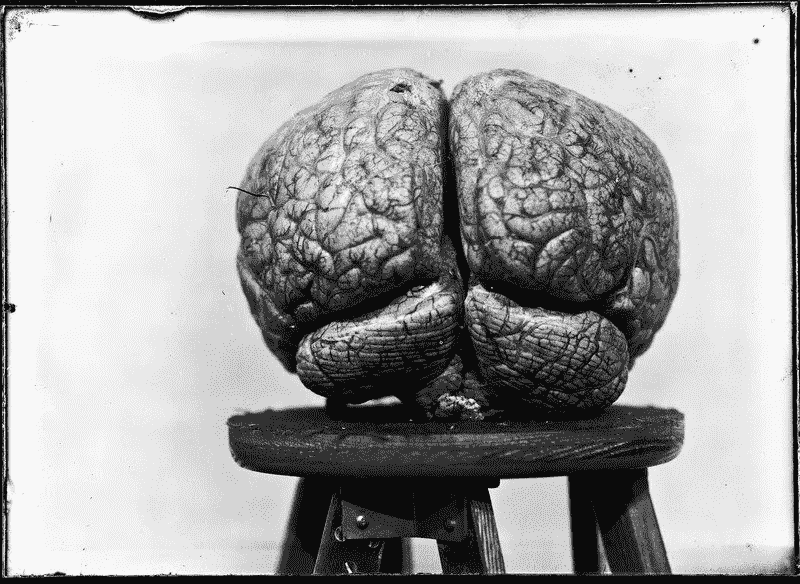

# 年终对人类思想的反思

> 原文：<https://medium.datadriveninvestor.com/reflections-at-year-end-on-the-human-mind-19065de7e710?source=collection_archive---------9----------------------->

这个年末假期提供了急需的休息时间来玩(足球、滑雪)，花额外的宝贵时间陪我的妻子和我们的孩子，睡更多的觉，放松和重置。远离客户工作、为即将到来的业务制定战略、演讲和写作项目的一周，也是听音乐(我本周重新发现了阿斯托尔·皮亚佐拉)的绝佳机会，还可以补上一点没听过的播客和没看过的 Ted 演讲。去思考和反思。当然，还有阅读(第一本书:《生活 3.0:成为人工智能时代的人类》，作者马克斯·泰格马克)。

在我最近浏览的所有内容中，有一小段——“科学家说你的‘思维’并不局限于你的大脑，甚至你的身体”——促使我写了这篇文章。我提出这一点，既是一种总结性陈述，也是未来一年对我经常撰写和谈论的、我每天都投入时间和专业知识的这些主题和问题的进一步评论、观察和见解的前奏。

* * *

机器智能的出现和早期商业应用的一个积极后果是技术专家、数据科学家、商业领袖，甚至是普通公众对所谓“软”科学领域——心理学、社会学、伦理学、语言学、人类学、哲学——的更多信息的日益增长的兴趣。类似地，医疗技术和神经科学研究的进步，部分是由人工智能和其他基于神经结构和大脑功能其他特征的合成认知形式的发展推动的，正在爆炸性地扩大我们对大脑的理解。随之而来的是关于这个非凡而复杂的器官的关键新知识，包括融合人和技术的创新，例如，以新的非凡方式帮助遭受灾难性肢体、感觉器官和大脑损伤的患者。它还带来了关于有机因素的新观点，这些有机因素涉及我们的大脑和思维如何运作和失灵。都很优秀。

但重要的是，利益相关者要认识到，关于大脑的知识和数据体——包括心理架构、情感、主观体验、成熟和发展、心理过程等等——是庞大的、经过深入研究的、严谨阐述的，并且在不断扩展，绝对不是新的。这对于那些在人工智能/人工智能以及自动化认知、技术和网络安全等相关领域工作的人来说尤其相关，他们无论是否有意，都在间接但不可避免地参与人类决策、意识、感知、意识、体验体验、发展学习、想象力、创造力、现象学和存在主义主体性、语言和符号交流、早期依恋和家庭动态、文化、性和性别以及人类其他方面的密集领域。没有一个是纯粹认知的，行为上可量化的，明确可编码的，或者能够通过算法全面呈现的。

脑子很神奇。没有一个会有明显的问题。我一直对我的心存感激，并希望每个人对自己的心有类似的感觉。但是我们不仅仅是我们的大脑。我们不仅仅是思维有机体或认知生物。精神状态可能位于大脑中，由神经元和其他皮质和生化活动执行，但我们所体验和谈论的头脑——你的自我，一个人的自我和其他自我的自我，身份、个性和个体人格的独特特征——不能仅仅理解为大脑功能的工作。作为心理上的人，我们是谁——我们每个人如何感觉、思考、渴望、爱、社交、行为、行为不端，我们的记忆(真实的和想象的)和生活经历(真实的、虚构的、精心设计的、可接近的、遗忘的、压抑的)——是我们作为个人和家庭、企业、社区和社会成员所做的一切事情的中心，无论是建设性的还是破坏性的。

此外:整整一代人正在走向成熟，他们被一场基于表情符号的宣传活动洗脑，这场宣传活动使用了大脑形状的云、覆盖着电路板或旋转电子的大脑、包含计算机而不是大脑的头部、看起来像人一样思考的机器人，以及其他象征人工智能、机器认知和人脑是可互换同义词的象形图。不要！AI ≠大脑。这种关联不仅创造了难以抹去的人工智能卡通，而且更有害的是，巩固了算法嵌入的错误表示，并使早期人工智能迭代变形。正如我在这里所讨论的，它本身反映了一个破坏性的基本误解，即关于我们如何学习、思考和行动的极其复杂的非皮层和超认知维度。在一线运营中越来越依赖机器学习的企业、法院和机构必须警惕训练数据和算法中包含的种族、性别、阶级、社会经济和其他偏见。类似地，但影响更大的是，对人类认知基础的误解以及扭曲、过度简化、贬低或低估心理过程和心理存在的其他关键方面和组成部分的模型，正在大规模地对结果产生负面影响，最终将使所有其他目前已知的偏见和一般智力问题相形见绌。

考虑到这一点，**我们需要多学科的不同专家进行更有效的讨论。**从事网络安全、道德人工智能、高级人工智能和对社会负责的自动认知的每个企业都应该有一个人类思维专家的席位，以帮助开发增强功能，并使用数据科学家、传统学者和认知研究人员范围之外的镜头和工具来缓解和解决问题。

20 年前，加州大学洛杉矶分校医学院的精神病学教授丹·西格尔(Dan Siegel)博士简明扼要地提出将思维定义为:“自发的自我组织过程，包括具体化和关系化，它调节我们内部和我们之间的能量和信息流动。”

例如，从这个角度来看，行为经济学家和社会科学家广泛称之为“非理性”的东西可以部分地理解为“精神混乱”。并且某些精神病理学和心理社会功能障碍可以被视为代表(由器质性和/或心理适应不良原因构成的)无法解决冲突和主观无组织的影响。

从“自我组织过程”的角度来考虑思维似乎是有用的，至少是作为一个临时的世界语短语，它有一个普遍统一的含义，可以被不同的专业人士理解，否则他们会用完全不同的方言交谈。但这仍不可避免地不够。头脑不仅仅是一个处于组织和非组织的间歇性波动状态的系统。1987 年，小说家兼诗人玛格丽特·阿特伍德(可能是当今最著名的《女仆的故事》的作者)写道:“我想成为空气/只在你身上停留一会儿/我想成为不被注意的、必要的人。”我认为这更接近于我们如何看待心灵——心理上的，但不一定是认知上的；以“智能”为标题，但不仅仅涉及逻辑、理性、行为功能和决策；关于并支配我们的内心世界，以及我们如何生活、爱和与他人及我们自己相关。成为人类。那就是:如此不引人注意以至于不被注意。但是，实际上，非常非常必要。

* * *

因此，带着所有这些想法，在我们进入新的一年时，我以一个邀请、一个行动的呼吁和一个希望来结束我的讲话:

(1)我欢迎与商业领袖进行多学科讨论和协作。企业家。技术和网络安全专业人士。数据科学家。我邀请你与我联系。让我们一起喝咖啡或吃午餐，通过 Skype、WebEx 或 Zoom，或者在你或我的办公室。和我谈谈。问我关于心智、心智功能和心理动力学的问题。关于了解和解决业务中人的因素、软件开发周期、网络安全、意识和恶意行为者威胁防御系统、道德、文化、风险和合规计划、董事会会议室、人工智能/人工智能/自动化计划的复杂、多方面且面向可行解决方案的方法。给我机会问你问题，听听你的回答。请帮助我理解您所了解和理解的内容，您不确定或质疑的内容——关于人们的行为方式和原因，在以人们为中心的各种场景中您预期会发生什么，您如何解释和减轻人类风险。

(2)对于那些主要(甚至完全)从行为主义者、功能主义者、机械论者、认知的角度来看待人的人，我强烈敦促你们重新评估自己的思维。修正对许多其他心理动力驱动因素和人类思想、行为和决策构成的任何负面偏见。任何企业或社会机构的方方面面都受到人类的影响。我们惊人地擅长为新问题不断改造旧的解决方案。基于谬误、用词不当、简化、不完整、最小化或完全否认我们实际思考和决策方式的决策、政策和程序只会放大风险和脆弱性，并增加意外后果的可能性。

(3)一些未来的流氓人工智能或奇点事件可能会危及我们的存在，如果我们不能更深思熟虑地考虑我们在做什么以及我们为什么要这样做，并继续将人类问题的解决外包给技术代理人，这是一种可以避免但可悲的可想象的潜力。但是目前，**我们最严重的问题不是非道德或超完美合成认知的威胁；这就是我们**:冷漠，残忍，小气，故意视而不见，偏见，否认主义，原始主义，滥用权力，诋毁尊严，大规模操纵，盲目崇拜种族巴尔干化，合理化的种族灭绝，对儿童的创伤。我的希望，实际上是另一个行动号召:我们能够更好地珍视我们自己和我们的人性。也许到那时，我们会成功开发新技术，让我们真正感到自豪，而不是恐惧。

* * *

我是 [Dolus Advisors](http://www.dolusadvisors.com) 的创始人，这是一家在人类风险方面提供预测性见解和可行解决方案的咨询公司，同时也是心理动力管理咨询公司 [Boswell Group](http://boswellgroup.com/consultants/alexander-stein-ph-d/) 的负责人。

我为高级商业领袖、企业家和董事会提供建议，将临床洞察力与实际商业战略相结合，以解决涉及人员、文化、道德决策以及企业和组织生活中具有复杂心理基础的其他方面的问题。