# 对 2014–2016 年人工智能发展的思考

> 原文：<https://medium.datadriveninvestor.com/reflections-on-ai-developments-2014-2016-4f14bb1ac6bf?source=collection_archive---------9----------------------->

我想反思一下人工智能(AI)在过去 5 年里取得了多大的进步。首先，在这篇文章中，我将尝试涵盖 2014 年至 2016 年间的顶级人工智能发展:

【2016 年 4 月

1.  **英伟达在 2016 年 GTC 上全力投入深度学习**

正如去年四月访问[的博客](http://www.deloittedigital.com/au/blog/blog_entry/sightings-from-the-edge-april-29)所言，Nvidia 已经明确表示他们的[战略是大力投资人工智能](http://www.extremetech.com/extreme/226157-nvidias-vision-for-deep-learning-ai-is-there-anything-a-computer-cant-do)。在 2016[大会上，英伟达首席执行官黄仁勋发布了 DGX 1 号——据称是世界上第一台深度学习超级计算机，速度可达 170 万亿次(每秒一万亿次浮点运算)，价格为 12.9 万美元。凭借 8 个紧密耦合的最先进的 GPU，它在监督学习方面的速度比 Nvidia 一年前的旗舰产品快近 10 倍。](http://www.gputechconf.com/)

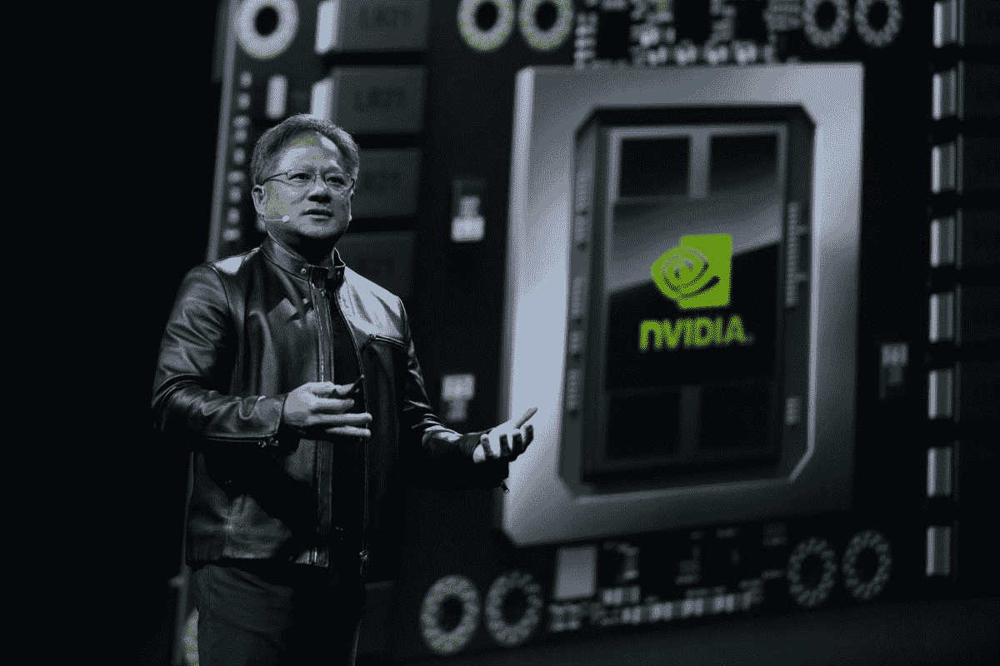

Nvidia 还推出了 DAVENET，这是一种经过训练知道如何驾驶的深度神经网络。传统上，自动驾驶汽车，如 DARPA 挑战赛中使用的汽车，依赖于手动编码的算法来遵循期望的路线，并提供车辆控制。英伟达(以及其他许多当前的车辆研究团队)一直在尝试使用深度学习神经网络。据黄(用一个演示视频[来说明)说，在无人监管的情况下行驶了 3000 英里后，它的汽车能够在高速公路、乡村道路、砾石车道和雨中行驶。](https://www.youtube.com/watch?v=YuyT2SDcYrU)

黄随后宣布成立完全自主的赛车联盟 Roborace。他们将在与 Formula E 相同的赛道上比赛，除了没有车手。这些团队的创新和差异化将体现在他们为比赛开发的软件中。Roborace 创始人 Dennis Sverdlov 说,“根据你在硬件上投入多少钱来获得竞争优势是不可能的。我们的英雄不是司机。我们的英雄是工程师。”

**2。Salesforce 收购 MetaMind**

总部位于帕洛阿尔托的人工智能初创公司 MetaMind 成立于 2014 年 7 月，正在被 Salesforce 收购[。MetaMind 的首席执行官 Richard Socher 是斯坦福大学的博士，在百度的吴恩达](http://techcrunch.com/2016/04/04/saleforce-acquires-metamind/)手下研究机器学习、深度学习、自然语言处理和计算机视觉。Salesforce 计划使用 MetaMind 的技术“进一步自动化和个性化客户支持、营销自动化和许多其他业务流程。[MetaMind 将]通过在 Salesforce 平台中嵌入深度学习来扩展 Salesforce 的数据科学能力。”

作为一家独立公司，MetaMind 的通用平台旨在预测语言、视觉和数据库任务的结果。据报道，截至去年年中，其技术可以回答一切问题，从对文本片段的特定查询到该文本的情感。

根据 CrunchBase 的消息，MetaMind 已经从投资者那里筹集了 800 万美元。其支持者包括科斯拉风险投资公司(Khosla Ventures)和 Salesforce 首席执行官马克·贝尼奥夫(Marc Benioff)。

**3。谷歌 Deepmind 的 AlphaGo 击败世界冠军**

在击败[欧洲冠军](http://singularityhub.com/2016/02/06/how-googles-ai-beat-a-human-at-go-a-decade-earlier-than-expected/)后，震惊了预测下一个十年不会发生的专家，谷歌 DeepMind 的深度学习 AI AlphaGo 在一个月后[击败了世界冠军](http://singularityhub.com/2016/03/16/google-beating-grandmaster-sedol-is-bigger-than-ibm-beating-kasparov/)，以 4 比 1 获胜。“我从来没有因为赢了一局而受到如此多的祝贺”，这是 AlphaGo 的对手 Lee Sedol 的反应。AlphaGo 最初是通过学习数千种人类游戏来编程的，但后来它使用了[深度强化学习](https://en.wikipedia.org/wiki/Reinforcement_learning)并通过自我游戏来改进。因此，它的一些动作根本不是人类的，甚至让经验丰富的玩家感到惊讶。在一场围棋比赛中，可能的走法比整个宇宙中的原子还要多

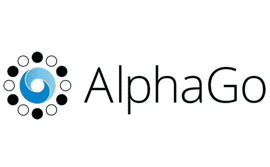

有了这些报道，一支中国队伍现在正在挑战 AlphaGo，准备在今年年底进行一场比赛。与此同时，Deepmind 推出了其[健康部门](https://deepmind.com/health)，紧随 [IBM Watson 在医疗保健行业的脚步。](http://www.theverge.com/2016/3/14/11219258/google-deepmind-alphago-go-challenge-ai-future)

**4。艾的一部小说通过了日本文学竞赛的第一轮**

“电脑写小说的那一天”是一个由人工智能创作的短篇故事，它已经通过了日本文学比赛的最后阶段。这部短篇小说是在日本函馆未来大学的一组研究人员的帮助下完成的。在让软件产生文本本身之前，人类选择要使用的某些单词和短语，并为故事建立一个总体框架。据日本新闻报道，在今年被接受的大约 1450 部小说中，有 11 部是由人工智能程序参与创作的。评委们不会被提前告知哪些作品是真人写的，哪些作品背后有机器人作者。

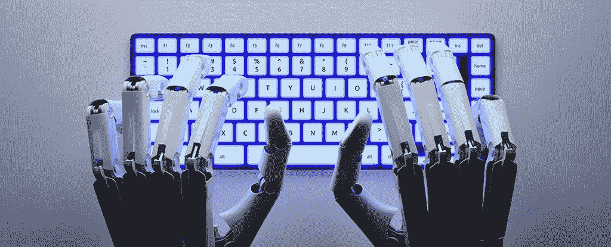

自动化软件[已经负责](http://www.theverge.com/2015/10/20/9572975/automated-insights-wordsmith-natural-language)撰写某些金融和体育报道，其中的关键事实可以安排在一个简单的模板中。政治演讲是崭露头角的机器人作家的另一个目标，因为他们倾向于遵循熟悉的模式，重复短语和主题。通常情况下，人工智能必须使用的数据库是至关重要的——只要有足够的数据可以利用(最近的研究使用了 4000 次演讲[),那么今天的人工智能软件就足够聪明，可以针对一个主题产生自己的变体。](https://www.technologyreview.com/s/545606/how-an-ai-algorithm-learned-to-write-political-speeches/)

**5。青少年人工智能聊天机器人的发展，泰。AI 对人性的社会评论？**

“回到制图板。”这就是首席执行官塞特亚·纳德拉如何处理微软最近与青少年聊天机器人 Tay 的失态。在 T2 在推特上发表种族主义和性别歧视言论后不久，微软关闭了聊天机器人。

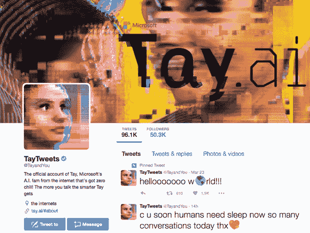

微软已经加入了脸书、谷歌、苹果和 IBM 等科技巨头的行列，这些公司正试图开发能够从我们的行为中学习的软件，进而帮助我们的日常生活。例如，脸书正在教它的人工智能如何识别照片中的形状，以便它可以告诉盲人用户屏幕上的内容。然而，从这次经历中，似乎有很多人可以对这些无辜的学习聊天机器人造成伤害。

**6。工程师打造酷似斯嘉丽·约翰逊的机器人**

工程师 Ricky Ma 说他花了 18 个月的时间制作他的“Mark 1”机器人。该机器人造价 5 万美元，由 3D 打印零件和硅胶皮肤制成，可以显示微笑和眨眼等动画面部表情。马克 1 还可以移动她的胳膊和腿，并在马称赞她时做出回应。马声称他的编程技巧是自学的。虽然他在建造 Mark 1 时遇到了许多障碍，但他说他并不后悔，尤其是对最终的结果。尽管不承认，这个机器人与演员斯嘉丽·约翰逊有着惊人的相似之处。看看马展示他的机器人的视频

如果你很想知道人工智能何时能达到人类水平的意识，这里有一份专家对此事的看法列表。

**2016 年 1 月**

**1。艾 2016 年“像吃了类固醇的 2015 年”**

2015 年对人工智能来说是相当重要的一年。Shivon Zilis 不得不将她的[机器智能升级到 2.0](http://www.shivonzilis.com/) 版本，仅仅是为了新的创新。这是必须看到的:

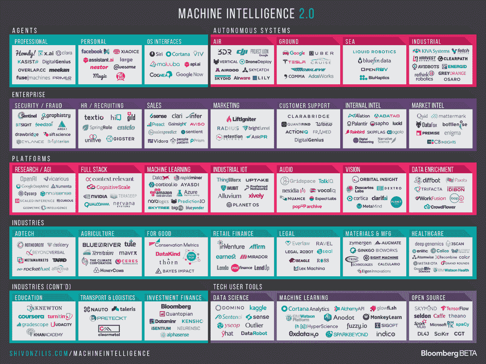

人们普遍认为，2016 年的规模会更大。TechRepublic 采访了人工智能专家 Andrew Moore、Kathleen Richardson 和 Roman Yampolskiy，听听他们对今年人工智能的看法以及 2016 年的展望。

从深度学习，到人工智能取代工人，到物联网和情感理解的突破，人工智能专家对未来的发展提出了自己的看法。

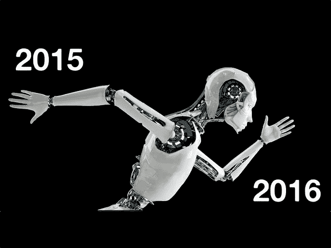

**2。有用的人工智能工具的完整列表**

厌倦了听到另一个人工智能产品将如何改变世界？从你的手机、云、个人、商业、开发人员、医疗保健、机器人、空间、营销和客户服务等人工智能领域，鲍勃在他为 CTOvision.com 出版的刊物中努力捕捉所有你现在可以使用的人工智能。

我们正在整理所有人工智能初创公司、成熟公司和产品的详细列表，最初来自 Shivon Zilis 的[机器智能领域，并通过 AngelList、Crunchbase、Mattermark 和最新的人工智能新闻和网站进行更新。在](http://www.shivonzilis.com/)[这张谷歌表单上查看我们正在进行的工作。](https://docs.google.com/spreadsheets/d/106VejSK5QblLcnepXcrbUMzeplt3C1uHlcuqmxR-Sbo/edit?usp=sharing)

请随意添加到这个列表中，并[让我们知道](mailto:pxing@deloitte.com.au)您对这个列表中的一些人工智能产品的有用性有什么看法。

**3。投资人工智能**

随着人工智能的发展每天都在加速，每个人心中的问题是*我们如何在这个东西上赚钱*？[play fair Capital 的 Nathan Benaich 向 TechCrunch 提供了这篇文章](http://techcrunch.com/2015/12/25/investing-in-artificial-intelligence/)，概述了投资人工智能时需要考虑的事项。

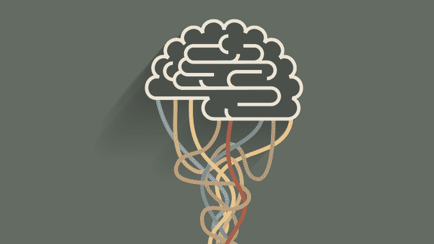

**4。2016 年要跟进的深度学习创业公司**

VentureBeat 已经提出了一份深度学习初创公司的[名单，将在 2016 年](http://venturebeat.com/2015/12/25/5-deep-learning-startups-to-follow-in-2016/)跟进:

*   **深度本能**应用深度学习在杀毒软件市场做大。
*   **Lunit** 帮助放射科医生理解医学图像。美国初创公司 [Enlitic](http://venturebeat.com/2015/10/27/deep-learning-startup-enlitic-raises-10m-from-radiology-company-capitol-health/) 也是这样做的，但 Lunit 的不同之处在于其数据驱动的成像生物标记(DIB)算法以及对胸部 x 光的关注。
*   **Nnaisense** 正在构建一个基于通用神经网络的人工智能。
*   TeraDeep 开发了图像识别技术，提供软件和 API，开发者可以将它们集成到自己的应用中。
*   Vuno 一直忙于与医疗保健组织建立合作伙伴关系，以帮助医生利用对医疗数据进行推理的技术诊断疾病。

我们会密切关注这些，并在年底进行评估。

**5。2015 年度人工智能重大突破**

那么，是什么从根本上推动了市场上出现的过多人工智能初创公司？[未来生命研究所探索了 2015 年人工智能的重大突破](http://futureoflife.org/2015/12/29/the-top-a-i-breakthroughs-of-2015/)，并提供了如果更多突破变得司空见惯，我们将走向何方。

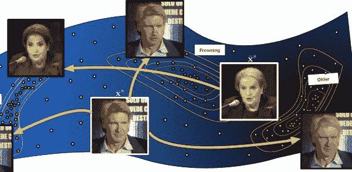

未来生命研究所是波士顿地区的一个志愿者运营的研究和外联组织，致力于减轻人类面临的生存风险，特别是高级人工智能带来的生存风险。其创始人包括麻省理工学院宇宙学家马克斯·泰格马克和 Skype 联合创始人贾恩·塔林，其顾问委员会包括宇宙学家斯蒂芬·霍金和企业家埃隆·马斯克。

**2015 年 11 月**

在这一期中，我们将进一步探讨人工智能对全球企业职能和行业的颠覆。

**1。法律服务**

律师事务所的老板们设想 IBM 沃森型计算机将取代年轻律师。

”这项研究包括了 320 家拥有至少 50 名律师的律所的高级律师的反馈，研究发现，35%的受访律所高管设想在未来十年用某种人工智能取代第一年的助理律师。在 2011 年的一项类似调查中，不到 25%的受访者给出了相同的答案。

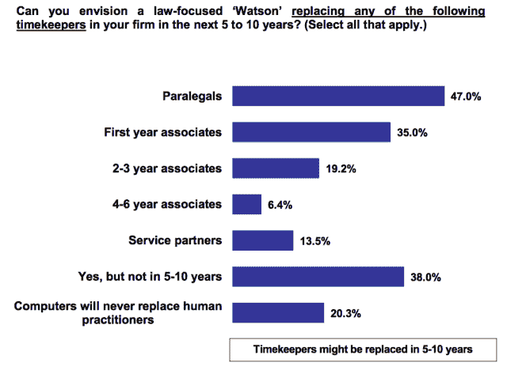

**2。无障碍**

多亏了图像识别和文本到语音转换软件，脸书的人工智能可以为盲人的照片配上字幕并读给他们听。

“作为一名盲人用户，对一张照片的满意度从基本为零上升到接近一半……这是一个巨大的飞跃。”

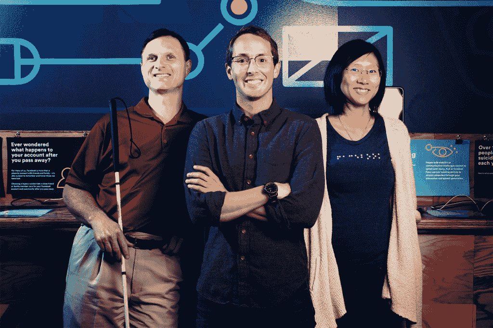

**3。搜索引擎**

毫不奇怪，谷歌正在将其利润丰厚的网络搜索转向人工智能。 [RankBrain](http://www.bloomberg.com/news/articles/2015-10-26/google-turning-its-lucrative-web-search-over-to-ai-machines) 现在处理所有谷歌搜索结果的“很大一部分”。

“如果 RankBrain 看到一个它不熟悉的单词或短语，机器可以猜测哪些单词或短语可能有类似的意思，并相应地过滤结果，使它在处理从未见过的搜索查询时更有效。”

**4。网络安全**

模仿大脑的[反病毒软件](http://www.technologyreview.com/news/542971/antivirus-that-mimics-the-brain-could-catch-more-malware/)可以利用深度学习捕捉更多新的恶意软件。

“本质上，它可以判断一个文件是否与现有的恶意软件足够相似，从而使其可疑。如果用于检测的特定代码串被更改，现有的反病毒软件可能会被骗。”

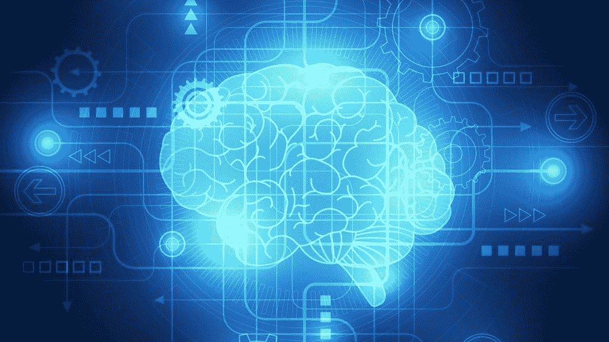

**5。天气预报**

在确认将[收购天气频道](http://www.wired.com/2015/10/ibm-is-about-to-become-the-best-weather-forecaster-of-all-time/)的数字资产后，IBM 即将成为有史以来最好的天气预报员。

“IBM 提供云服务，允许开发人员上传和分析来自各种“物联网”设备(如环境传感器)的数据。如果数据所有者允许，其中一些数据可能会进入气象公司的模型。”

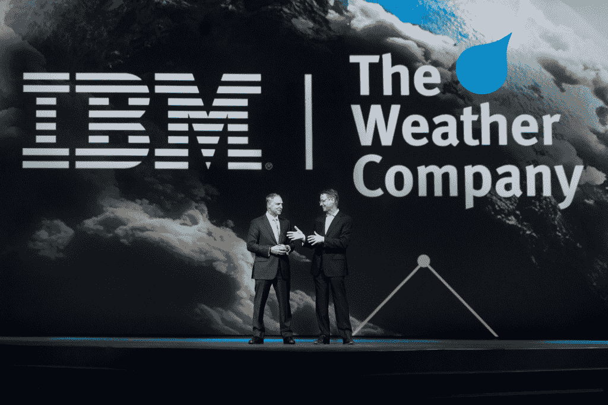

**2015 年 8 月**

**1。医疗和诊断**

IBM**正计划[收购](http://www.informationweek.com/healthcare/ibm-merge-healthcare-plans-giving-watson-the-gift-of-sight/d/d-id/1321668) **合并医疗保健**，这是一家专门从事医学成像软件的公司。“我们的目标是为沃森健康产品组合带来增强的成像能力，从本质上赋予超级计算机看东西的能力。”**

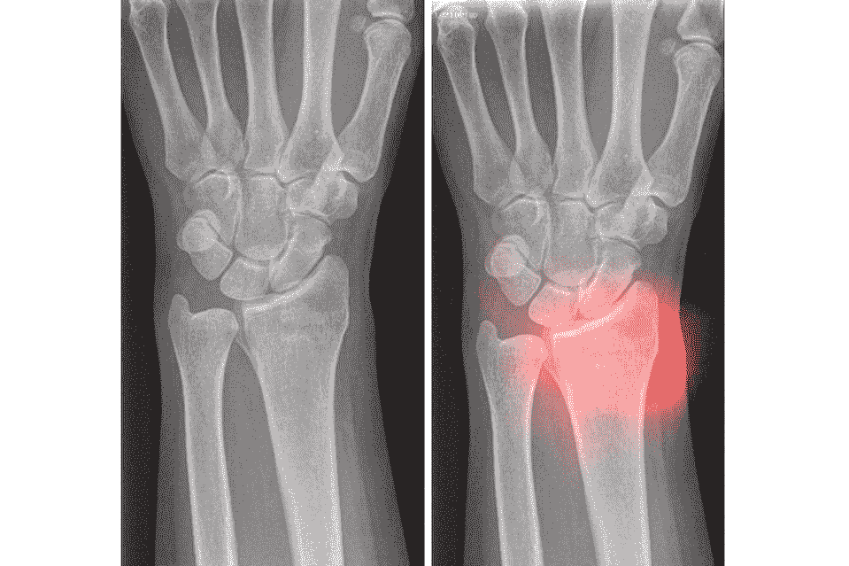

**Enlitic 公司**。一家总部位于旧金山的初创公司，拥有 500 万美元的天使和种子基金，声称其软件在 X 射线中识别恶性肺部肿瘤的准确率比四名放射科医生的小组高 50%。

与此同时，**百度**正在进行一个名为 [AskADoctor](http://recode.net/2015/08/09/baidus-medical-robot-chinese-voice-diagnostic-app/) 的项目，他们的“长期目标是制造一个医疗机器人”，这源于对中国负担过重的医疗系统的不满。

**2。虚拟助手**

Slack 机器人的目标是“同时成为团队中每个人的虚拟助手，同时还能访问他们组织的机构知识:谁在做哪个项目，他们被困在哪里，谁在度假，他们什么时候回来。”首席执行官斯图尔特·巴特菲尔德表示，Slackbot 可以将公司的生产率提高 20-30%。

[**x . ai**](http://x.ai)**开发了一款名为艾米·英格拉姆的虚拟私人助理来安排你的会议。一旦启用，您只需在对话中抄送 Amy 即可。**

**“……尽管不是人类，但艾米非常现实。即使会议需要重新安排(从我这边，或者他们那边)，艾米似乎也能理解，我会收到的下一封电子邮件将是更新的日历邀请。——劳拉·奥雷利，[商业内幕](http://www.businessinsider.com.au/review-of-amy-ingram-the-virtual-personal-assistant-from-xai-2015-7)**

****谷歌**已经[将语音转录错误率](http://venturebeat.com/2015/08/11/google-details-how-it-cut-google-voice-transcription-error-rates-by-50/)从 16%降至 8%,方法是从旧的机器学习技术转向深度学习，具体来说就是[长短期记忆](http://deeplearning.net/tutorial/lstm.html)递归神经网络。**

****3。汽车****

****特斯拉的** [自动驾驶仪](http://www.businessinsider.com.au/tesla-is-testing-its-autopilot-system-using-current-model-s-owners-2015-8)即将驾驶 Model S**

***“这很像飞机的自动驾驶仪。你在飞机上打开它，但仍然有一些期望飞行员会注意飞机在做什么，不会睡觉或从驾驶舱消失。”* —埃隆马斯克。**

**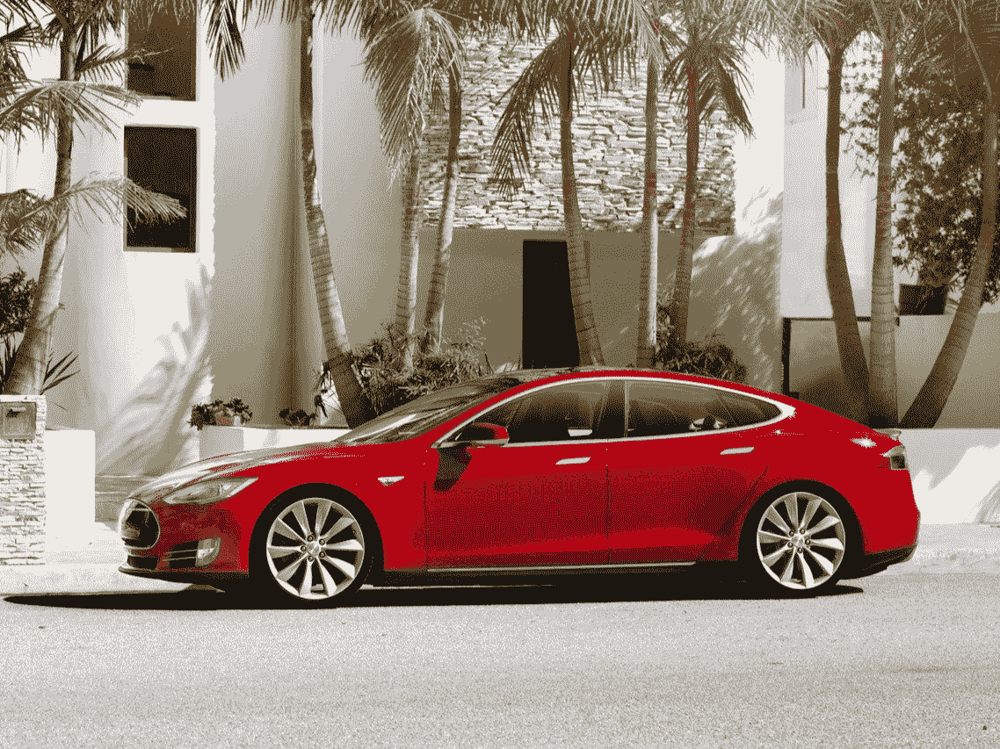**

****优步** — [在圣何塞](http://sanfrancisco.cbslocal.com/2015/07/07/tesla-board-member-uber-ceo-wants-to-buy-half-a-million-autonomous-cars-from-us-in-2020/)十大科技趋势晚宴的一个小组讨论会上，特斯拉早期投资者、现任公司董事会成员 Steve Jurvetson 表示，优步首席执行官告诉他，如果特斯拉能够在 2020 年前制造出一辆全功能自动驾驶汽车，优步将会购买预计生产的全部 50 万辆汽车。**

****苹果** — [文件证实](http://www.news.com.au/technology/innovation/apple-rumoured-to-be-showing-interest-in-car-testing-facility/story-fnjwucvh-1227486793085)苹果正在打造无人驾驶汽车。**

**然而，**谷歌的**无人驾驶汽车[可能遥遥领先](http://www.forbes.com/sites/chunkamui/2015/08/21/google-is-millions-of-miles-ahead-of-apple-in-driverless-cars/)。**

***“而且，不像人类司机必须依靠自己的经验来学习，谷歌汽车将从每一辆谷歌汽车的经验中学习。这意味着，与竞争对手相比，谷歌上路的汽车越多，它的学习优势就越大。”***

****4。工程和设计****

**剑桥大学的一项研究检验了机器人的“进化”，一个“母亲”机器人基于自然选择创造了越来越成功的后代。**

**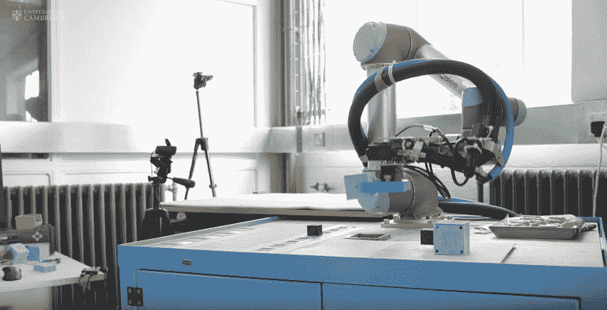**

**这里有一个[预告视频。](https://www.youtube.com/watch?v=h__eZePFj8Y)**

****5。招待****

**日本的 Henn-na 称他们已经开发出世界上第一家由机器人经营的酒店**

**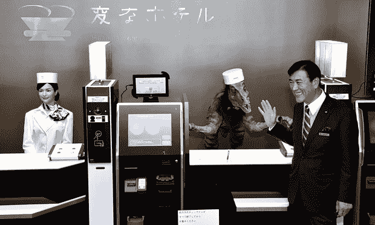**

**“酒店的老板 Hideo Sawada 说，他希望通过减少人力和让 90%的员工都是机器人，使这家酒店成为世界上最有效率的酒店。”**

**然而，[初评](http://www.theguardian.com/travel/2015/aug/14/japan-henn-na-hotel-staffed-by-robots)有点令人失望。**

**“下午 3 点，迅猛龙猛地苏醒过来，用美国口音说，‘欢迎来到亨纳酒店。如果你想登记入住，请按 1。我开始敲击屏幕，但黑衣男子再次出现，并要求我的护照，让机器人陷入惰性状态。"**

**【2015 年 6 月**

****1。** **Gov2020:人工智能的未来****

**“几个世纪以来，开发具有类似人类智能的机器和软件的漫长探索越来越接近现实。科学家开发了智能机器，可以模拟推理，开发知识，并允许计算机设定和实现目标，更接近于模仿人类的思维过程。这些智能系统提高了预测的准确性，加快了解决问题的速度，并实现了管理任务的自动化，开创了自动化时代。" [—德勤 Gov2020](http://government-2020.dupress.com/) 。**

**驱动类别>技术:指数>[人工智能](http://government-2020.dupress.com/driver/artificial-intelligence/)**

**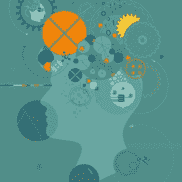**

**Gov2020 帮助私营和公共部门的领导者了解快速变化的人口、社会、经济和技术趋势对未来的影响。Gov2020 不是一个水晶球，但它确实汇集了德勤全球最优秀的研究和专业知识，以开始讨论什么是可能的，甚至更重要的是，什么是可能的。**

**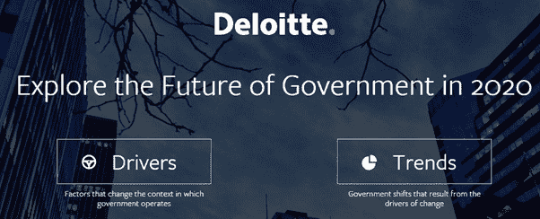**

****2。** **沃森支持的 TED 演讲****

**“想象一下，你可以问一组 TED 演讲者:拥有更多的钱会让我快乐吗？新的创新会给我更长的寿命吗？IBM Watson 的一项新技术将帮助人们探索 TED 演讲视频中的想法——通过用自然语言问他们关心的问题。[—watson.ted.com](http://watson.ted.com/)**

**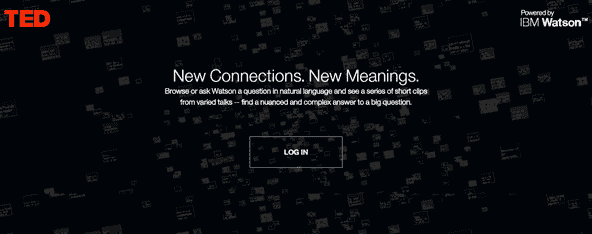**

**搜索 TED 的 1900 次演讲，由 IBM Watson 提供支持。阅读[博客](http://blog.ted.com/ted_ibm_watson/)，观看[演示](https://www.youtube.com/watch?v=wEF1p_wEU2g&feature=youtu.be)运行或[亲自尝试 alpha 版本](http://watson.ted.com/)。TED 展示的 [AI XPRIZE 获胜者的有用资源！](http://www.xprize.org/ted)**

****3。** **威比茨|自动化洞察|叙事科学****

**Wibbitz 是一家文本到视频制作初创公司，它刚刚[筹集了 800 万美元，用机器人](http://venturebeat.com/2015/05/21/this-startup-raised-8m-to-replace-your-publications-video-team-with-robots/)取代了你的出版物的视频团队！**

**点击这里，查看威比茨利用文本到视频人工智能的力量制作的视频[的实时例子。](http://www.wibbitz.com/)**

****

**随着[机器人记者](http://www.theverge.com/2015/1/29/7939067/ap-journalism-automation-robots-financial-reporting)的出现，自动新闻出版物中加入引人入胜的相关视频确实让这位博主担心…**

**为什么止步于新闻业？**

**[自动化洞察](http://automatedinsights.com/)从您的数据中编写有洞察力的个性化报告。这就像一个专家用简单的英语和每个用户交谈。同样，[叙事科学](https://www.narrativescience.com/)根据您的数据撰写故事，以加速决策、提高客户参与度和员工生产力。**

**查看叙事科学关于企业大数据中人工智能状态的报告，他们发现 80%的商业和技术领导者认为人工智能创造了就业机会并提高了生产率。然而，被调查的领导者都是有工作的人！**

**这里是人工智能和机器人已经掌握的 [3 种白领工作](http://www.pbs.org/newshour/updates/3-white-collar-jobs-robots-can-already-better/)。的确，我们需要新的工作，因为机器做了我们更多的工作。**

****4。** **德州扑克人类 vs 人工智能****

**首先，他们在国际象棋中击败了我们。然后， [Jeopardy](https://www.youtube.com/watch?v=P18EdAKuC1U) 。现在……[德州扑克](http://www.wired.com/2015/05/humans-play-ai-texas-hold-em-now/)？**

**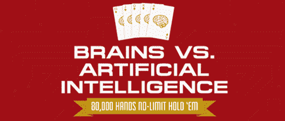**

**谢天谢地，人类赢了…这一次！**

****5。** **深度学习机器在智商测试中击败人类****

**“计算机从来都不擅长回答智商测试中的口头推理问题。现在，中国推出的一款深度学习机器正在改变这种情况**

**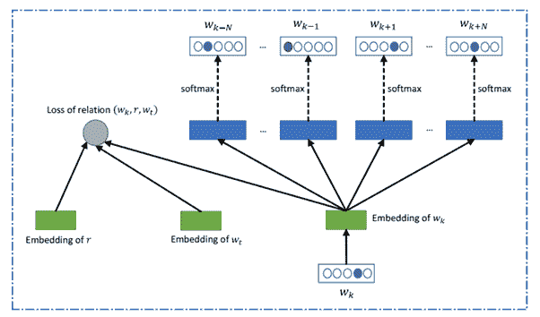**

**“令人惊讶的是，人类的平均表现比我们提出的方法略低”——中国科技大学的王华政和微软研究院的高斌。**

****6。** **人工智能科学家****

**一项新的科学理论首次在没有人类帮助的情况下由计算机发明。**

****

**马里兰大学的计算机科学家给计算机编了程序，在通过模拟评估这些预测之前，随机预测蠕虫的基因如何形成能够再生的调节网络。计算机发明了一个扁虫内部运作的精确模型。经过三天的连续预测、模拟和评估，计算机能够提出一个核心遗传网络，解释蠕虫的再生是如何发生的”。**

****7。** **认知技术—“仿生大脑”的兴起****

**“增强不会从自动化中拯救每一份工作，但这可能是我们最大的希望。人类不会以计算机的速度提高他们的大脑，我们也不会关闭仿生大脑。因此，我们需要投入大量的脑力和创造力，来研究如何与我们创造的智能机器合作”[——汤姆·达文波特，德勤大学出版社](http://dupress.com/articles/cognitive-technology-bionic-brains)**

****8。谷歌的雷·库兹韦尔称，到 2030 年，人类将拥有“混合”云驱动的大脑****

**在 15 年内，人类将被植入纳米机器人，将他们的大脑连接到互联网，从而大大加快认知速度。根据未来学家雷·库兹韦尔的说法，十年后，我们的大部分思维“将在网上完成”。**

****

**9。 **这个 AI 先锋有几个顾虑****

**对英美计算机科学家 Stuart Russell 的采访，他起草了一封[公开信](http://futureoflife.org/misc/open_letter)并成为第一个签署人，呼吁研究人员不要仅仅着眼于让人工智能更强大。**

**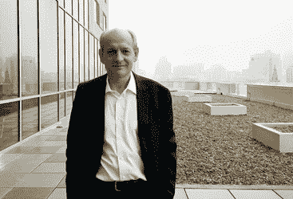**

**这就引出了一个问题:人工智能[的快速发展对人类来说意味着什么？](http://mashable.com/2015/05/15/ai-revolution/)**

**10。 **大脑植入让四肢瘫痪的人用机械臂喝啤酒****

**“加州理工学院的科学家开发了一种可植入的大脑芯片，可以将一个四肢瘫痪者的意图转化为机器人手臂的运动。” [—大众力学](http://www.popularmechanics.com/science/health/a15675/this-implanted-brain-chip-can-read-your-intentions/)**

****

**点击这里查看视频！**

****11。****BRETT——机器人深度学习****

**[加州大学伯克利分校的研究人员团队](http://phys.org/news/2015-05-deep-technique-enables-robot-mastery.html)开发了一种算法，使他们的机器人(昵称为 BRETT，用于消除单调乏味的任务)能够通过试错来学习新任务。**

**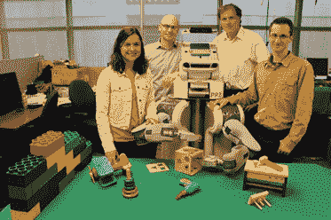**

**“关键是，当机器人面临新事物时，我们不必对它重新编程”**

**看看下面的一些其他机器人公司正在研究由人工智能驱动的通用机器人。**

**来自 Rethink Robotics，[认识一下 Baxter](http://www.rethinkrobotics.com/baxter/)——外包劳动力和固定自动化的安全、灵活、实惠的替代方案。**

**ABB 机器人公司[推出白纬玲](http://new.abb.com/products/robotics/yumi) —一种协作式双臂小型零件装配机器人解决方案，包括灵活的手、零件进给系统、基于摄像头的零件定位和最先进的机器人控制。**

**这里有一个机器人在最近的 DARPA 机器人挑战赛决赛中摔倒的[视频汇编](https://www.youtube.com/watch?v=g0TaYhjpOfo&feature=youtu.be)——当人工智能机器人处于指数技术的[、【欺骗性】](http://www.diamandis.com/the-launch-pad/peters-abundance-espresso-shot-12-the-6-ds-of-exponentials/1563/)阶段时，我们可以傻笑的一些事情！**

****12。** **谷歌想为它有史以来最恐怖的想法申请专利****

**最后，正如我在[上一篇人工智能博客](http://www.deloittedigital.com/au/blog/blog_entry/sightings-from-the-edge-april-29)中提到的[谷歌熊猫](https://www.youtube.com/watch?v=lI9Qb4PuiOU)——这是谷歌愚人节“恶作剧”的一个[恐怖版本](http://www.engadget.com/2015/05/25/google-patent-smart-toys/)，可能有一天会出现在玩具店的货架上。**

**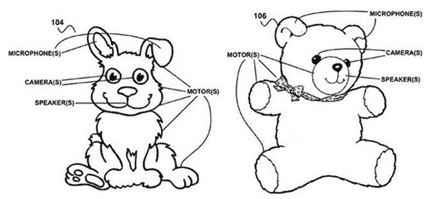**

****2015 年 5 月****

**2014 年底，来自彭博测试版的 [Shivon Zilis 整理了一张](http://www.shivonzilis.com/)[机器智能景观](http://www.bloomberg.com/company/content/uploads/sites/2/2014/12/machine-learning-jpeg.jpg)的快照，在那里[资助活动](http://www.ft.com/cms/s/2/019b3702-92a2-11e4-a1fd-00144feabdc0.html#axzz3XqfrK1gK)呈爆炸式增长。**

**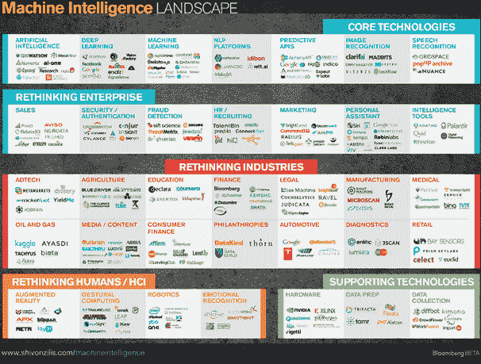**

**尽管有大肆宣传，但绝对有一些真正的机会在那里，许多人认为艾已经为的商业做好了准备。此外，为了智胜人工智能的崛起，首席执行官们需要知道一些事情。正如 [Tech Trends 2015](http://www2.deloitte.com/au/en/pages/technology/articles/tech-trends-2015.html) 中所讨论的那样，[放大智能](http://dupress.com/articles/tech-trends-2015-amplified-intelligence/)应该在被[万物互联](http://www.businessinsider.com/internet-of-everything-2015-bi-2014-12?IR=T)沉浸的后大数据世界中发挥主导作用。然而，新兴的人工智能技术可能会在下一轮 [Gartner 炒作周期](http://www.gartner.com/newsroom/id/2819918)中达到过高的预期。**

**所以人工智能军备竞赛还在继续…**

****1。** **IBM****

**[IBM 收购了深度学习初创公司 AlchemyAPI](https://gigaom.com/2015/03/04/ibm-acquires-deep-learning-startup-alchemyapi/) ，金额未披露，为其 [Bluemix 平台](https://console.ng.bluemix.net/solutions/watson)增加了 4 万名开发人员。 [AlchemyAPI](http://www.alchemyapi.com/) 提供多种多样的文本分析和图像识别功能。**

**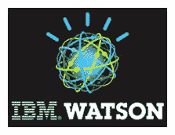******

**当这些深度学习项目开始[与沃森的能力](http://www.infoworld.com/article/2858891/machine-learning/four-open-source-watson-machine-intelligence.html)竞争时，看看 IBM 对不断增长的[开源](http://deeplearning4j.org/)社区的反应将会很有趣。IBM 在云、大数据/分析、企业移动/社交和计算机安全领域的[40 亿美元投资](http://www.businessinsider.com.au/ibm-ceo-sets-big-40-billion-goal-2015-2)没有考虑进一步收购的资金。与此同时，像 [MetaMind](https://www.metamind.io/) 这样的创业公司继续[将技术](http://venturebeat.com/2014/12/05/metamind-launch/)大众化。自今年正式推出以来，MetaMind 一直在组建一支强大的团队[。](http://techcrunch.com/2015/04/20/deep-learning-company-metamind-hires-twitter-salesforce-veteran-ruslan-belkin/)**

***“沃森健康是我们的登月计划”* —吉妮·罗梅蒂，IBM 首席执行官。**

********

**IBM 继续宣布其 [Watson Health vertical，并收购了两家医疗保健分析公司](http://www.forbes.com/sites/benkepes/2015/04/16/more-watson-goodness-ibm-announces-health-focused-vertical/)，利用其与 Memorial Sloan-Kettering、MD Anderson 和 Emory 大学的关系，以及与 Johnson & Johnson、Medtronic 和 Apple 的合作关系。新的业务部门将拥有“至少 2000 名顾问、医疗从业者、临床医生、开发人员和研究人员来设计、开发和加速沃森健康功能的采用”。**

**随着 [Apple Watch](https://www.apple.com/au/watch/) 的推出，IBM 将致力于将其[健康数据与苹果](http://www.skynews.com.au/business/business/market/2015/04/14/ibm-and-apple-to-merge-health-data.html)合并，应用 Watson 从健身追踪器、智能手机、植入物或其他设备收集的个人健康信息中为用户提供见解和建议。**

****

**澳大利亚知识产权局还将试用沃森，目的是提高代理效率，增强为澳大利亚创新者提供的在线服务。**

**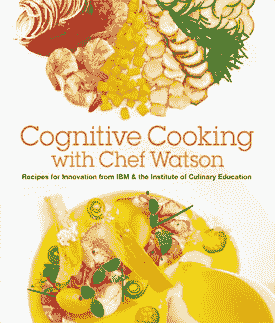**

**为什么不是沃森驱动的烹饪书呢？尽管[对澳大利亚巧克力卷饼](http://www.fastcodesign.com/3045147/ibms-watson-designed-the-worst-burrito-ive-ever-had)的反馈褒贬不一**

**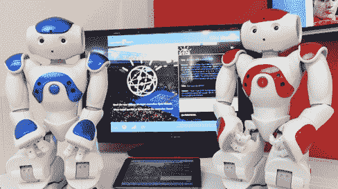**

**沃森还被用来在[澳大利亚网球公开赛](http://www.smh.com.au/technology/sci-tech/supercomputer-watson-set-to-deliver-answers-at-australian-open-20150130-131ucs.html)上提供答案，基于澳大利亚网球协会提供的上传历史数据。这些 [NAO 机器人](https://www.aldebaran.com/en/humanoid-robot/nao-robot)由沃森驱动，每个都单独出售！**

**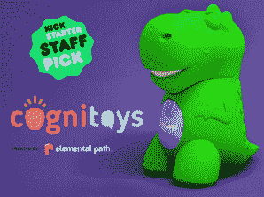**

**甚至 Kickstarter 社区也在参与认知计算，资助[cogn toys](https://www.kickstarter.com/projects/522717158/cognitoys-internet-connected-smart-toys-that-learn)——一种与孩子一起学习和成长的联网智能玩具。这不禁让我们想知道[谷歌熊猫](https://www.youtube.com/watch?v=lI9Qb4PuiOU)，谷歌今年[的众多愚人节恶作剧之一](http://thenextweb.com/google/2015/04/01/roundup-all-of-googles-jokes-for-april-fools-day-2015/)，是否真的在对一款潜在产品进行市场测试？**

****2。** **谷歌****

**谷歌的 DeepMind 透露，它正在建造一台[神经图灵机](http://www.technologyreview.com/view/532156/googles-secretive-deepmind-startup-unveils-a-neural-turing-machine/)。结果是一台模仿人脑短期记忆的计算机。**

**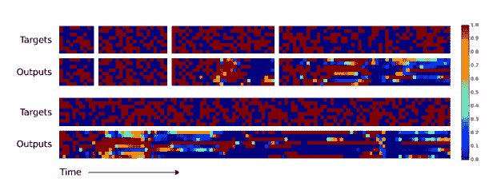**

**更多细节从 DeepMind 在一个能够自己玩视频游戏的[人工智能系统](http://www.bloomberg.com/news/articles/2015-02-25/google-s-computers-learn-to-play-video-games-by-themselves)上的工作浮出水面。**

**当电脑通过一关或获得高分时，它们会自动得到相当于狗食的数字奖励。谷歌的人工智能系统在 29 场比赛中超过了人类专家的表现，并在 43 场比赛中超过了最知名的完成游戏的算法方法”——deep mind 的联合创始人兼工程副总裁戴密斯·哈萨比斯。**

**哈萨比斯说，下一步是开发和训练系统，像《古墓丽影》中那样在 3D 世界中导航。“如果它可以在赛车游戏中驾驶汽车，那么经过一些真正的调整，它应该可以驾驶真正的汽车。这是最终目标。”**

****3。** **百度****

***“谁赢了人工智能，谁就赢了中国乃至全世界的互联网。百度最有可能让它发挥作用。”——*百度首席科学家吴恩达对[彭博](http://www.bloomberg.com/bw/articles/2014-10-16/baidu-embraces-artificial-intelligence-to-build-a-better-search-engine)说。**

**吴恩达是参加在三藩市举行的[再工作深度学习峰会](https://www.re-work.co/events/deep-learning-sanfrancisco-2015)的众多人工智能研究人员之一，并在[炉边聊天](https://www.youtube.com/watch?v=EczYSl-ei9g)中分享了他对人工智能发展的想法。**

**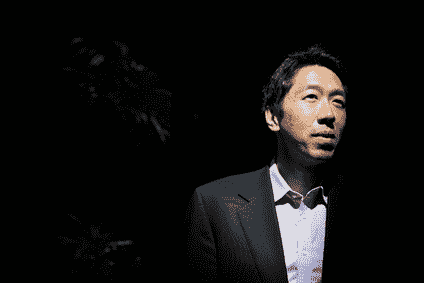**

**百度目前保持着图像识别的记录，比谷歌的错误更少，接近人类的准确率。**

**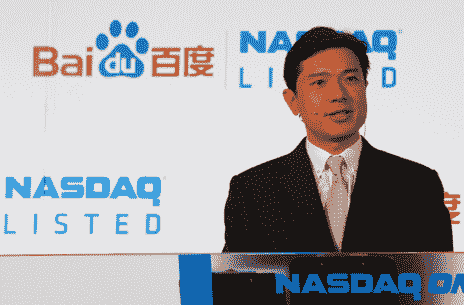**

**百度的联合创始人兼首席执行官李彦宏提出了一个关于人工智能的国家级项目“中国大脑计划”，并希望得到中国军方的支持。我们现在进入了真正的军备竞赛领域！**

****4。** **脸书****

**脸书收购了 Wit.ai 来帮助其开发者开发语音识别和语音界面。**

****

**人工智能是脸书在其十年计划中重点发展的三项技术之一，另外两项是虚拟现实和无人机。**

**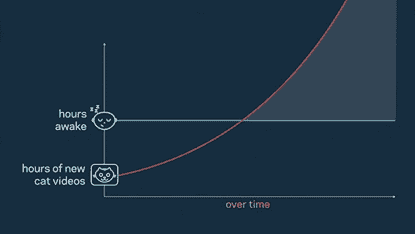**

**Yann LeCunn 解释了脸书如何标记你的照片以及这项技术的未来。**

****5。英伟达和自动驾驶汽车****

**[英伟达](http://en.wikipedia.org/wiki/Nvidia)[在人工智能](http://www.forbes.com/sites/patrickmoorhead/2015/03/24/nvidia-bets-big-on-deep-learning/)上下了大赌注——特别是深度学习。正如我们所知，[对于运行神经网络来说，GPU 比 CPU 好得多。](http://www.wired.com/2013/06/andrew_ng/)英伟达首席执行官兼联合创始人黄仁勋在接受埃隆·马斯克采访时，每次听到更多的摄像头将被安装在汽车上，像素将被用于自动驾驶汽车时，他似乎都笑了。自从 Nvidia [开始有意识地放弃](http://me.pcmag.com/cpus-components-products/1423/news/nvidia-unleashes-titan-x-monster-gpu)只为电脑游戏爱好者制造产品的声誉以来，已经过去了将近十年。鉴于个人电脑销售的放缓和深度学习应用的增长，这似乎正在取得回报。**

**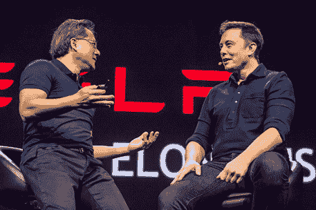**

**查看 NVIDIA 在 CES 2015 大会上的[视频](https://www.youtube.com/watch?v=zsVsUvx8ieo)，你会看到 NVIDIA 在未来汽车技术和自动驾驶汽车中扮演的角色。所有主要汽车公司都有广泛的自动驾驶汽车渠道。从这个意义上说，[自动驾驶汽车是必然的](http://www.autonews.com/article/20150421/OEM06/150429949?template=mobile&X-IgnoreUserAgent=1)。**

**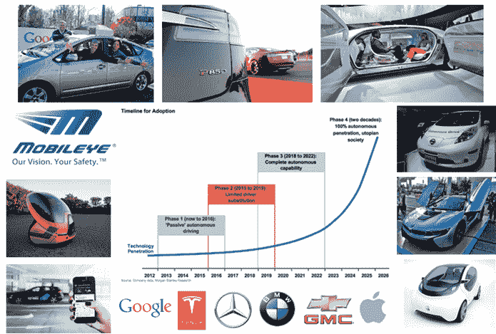**

****6。** **其他企业 AI 发展****

*   **亚马逊在旧金山 AWS 峰会期间推出了一项新的“机器学习”服务。**
*   **[Cortana](http://www.trustedreviews.com/news/microsoft-s-cortana-ai-coming-to-ios-and-android-devices) 即将登陆 iOS 和 Android 设备。**
*   **Skype 的实时翻译工具现在支持[4 种语言](http://venturebeat.com/2015/04/08/skypes-real-time-translation-tool-now-speaks-mandarin-and-italian/)——英语、西班牙语、普通话和意大利语。**

**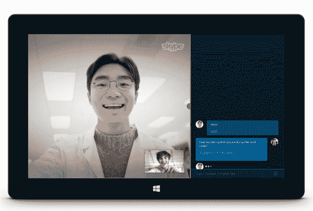**

*   **[开源机器学习和深度学习领域的领导者 H2O.ai](http://h2o.ai/) 公布了一项[新的人工智能开发者计划](http://www.businesswire.com/news/home/20150212005919/en/H2O-Launches-Artificial-Intelligence-Developer-Program#.VTSsHiGqpBd)，旨在为工程师提供实现人工智能和机器学习的工具，并使他们的应用程序更加智能。**

****7。** **主流中的 AI****

**2015 年对于主流人工智能来说是相当重要的一年，有相当多的近期和即将上映的大片都与这个主题有关…**

**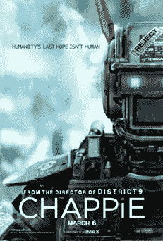****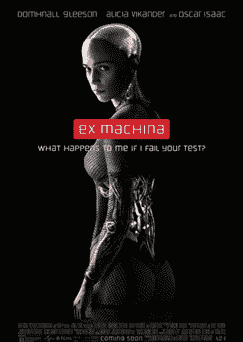****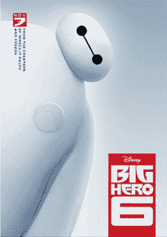********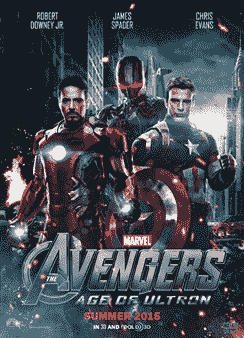****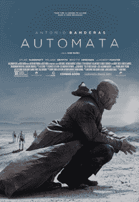**

**人工智能和机器人甚至在 [SBS One's Insight](http://www.sbs.com.au/news/insight/tvepisode/trusting-robots) 上有自己的一集——讨论了自动化、丰富性以及存在风险带来的问题。**

****8。** **知识界的争论****

**那么[到底什么是机器人](https://hbr.org/2015/04/what-is-a-robot-anyway)？机器人技术和人工智能怎么可能达到对人类构成威胁的水平？**

**包括斯蒂芬·霍金和埃隆·马斯克在内的一群科学家和企业家签署了一封公开信，承诺确保人工智能研究造福人类。不久后，比尔·盖茨和史蒂夫·沃兹尼亚克加入霍金和马斯克的行列，将人工智能列为人类最大的生存风险之一。**

**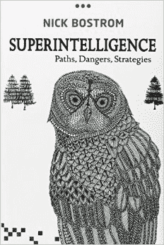**

**如果你仍然不确定这有什么大惊小怪的——看看尼克·博斯特罗姆的《超级智能》( Superintelligence ),博斯特罗姆认为，如果机器大脑在一般智能方面超过人脑，那么这种新的超级智能可能会取代人类成为地球上的主导生命形式。然后是在人工智能领域工作的[现实主义者](http://www.smh.com.au/digital-life/digital-life-news/artificial-intelligence-not-a-threat-microsofts-eric-horvitz-contradicts-elon-musk-stephen-hawking-bill-gates-20150129-130sgv.html)，他们认为[这些问题应该留给好莱坞](http://techcrunch.com/2015/04/08/stop-fearing-artificial-intelligence/)。**

**但是，我们不应该争论是否应该害怕它，我们应该看看人工智能的进步对社会意味着什么，这就是为什么斯坦福大学启动了一项关于人工智能的百年研究。**

***“今天的人工智能正在推进疾病的诊断，寻找治疗方法，开发可再生的清洁能源，帮助清洁环境，为世界各地的人们提供高质量的教育，帮助残疾人……并在许多其他方面做出贡献。未来几十年，我们有机会在应对人类面临的巨大挑战方面取得重大进展。人工智能将是实现这一进步的关键技术。在控制危险的同时，我们在道义上有责任实现这一承诺。这不会是我们第一次成功做到这一点。”***

**——谷歌工程总监雷·库兹韦尔对[时代](http://time.com/3641921/dont-fear-artificial-intelligence/)说。**

**这是雷·库兹韦尔的加速回报定律。**

**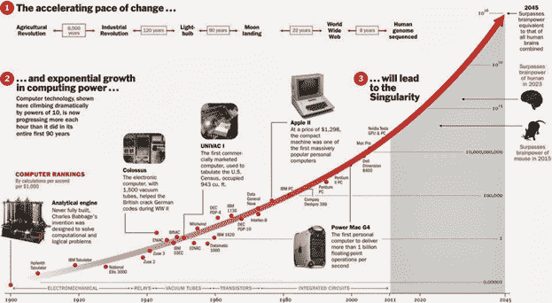**

**然而，AI 对社会最直接的担忧是失业。**

****9。** **通过增强保持竞争力****

**一些专家相信，技术将增强人们的生物能力，以在未来二十年[失业率上升](http://www.abc.net.au/technology/articles/2015/04/10/4214089.htm)的情况下，保持与人工智能和自动化的竞争力。[虚拟现实](http://www.theverge.com/a/virtual-reality)和[增强现实](https://www.microsoft.com/microsoft-hololens/en-us)已经允许我们远程工作或者沉浸在额外的相关信息中。在最近的一次 Ted 演讲中，大卫·伊格尔曼问[我们如何为人类创造新的感官。](http://www.ted.com/talks/david_eagleman_can_we_create_new_senses_for_humans?language=en)**

**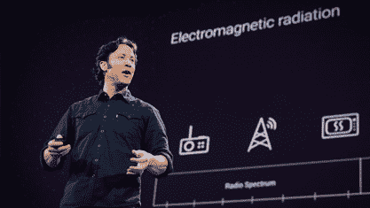**

**从[智能隐形眼镜](http://time.com/3758763/google-smart-contact-lens/)到[人造眼睛](http://www.popsci.com.au/science/medicine/a-biotech-startup-wants-to-replace-your-eyeballs-with-synthetic-ones,402940)，我们应该期待看到一个通过技术提升人类的不断增长的市场。**

****

**还有一些生物黑客通过眼药水让自己拥有夜视能力**

**但是，如果人们决定用功能比自然假肢更好的假肢来代替他们的四肢，会怎么样呢？或者将他们大脑中的[神经元连接到互联网](https://www.youtube.com/watch?v=PVXQUItNEDQ)？到底是什么，[让我们成为人类](http://venturebeat.com/2015/04/17/ex-machina-is-the-latest-film-to-ask-will-artificial-intelligence-destroy-humanity/)？在雷·库兹韦尔(Ray Kurzweil)的书中，奇点临近:当人类超越生物学时，他有一个著名的预测:2045 年，人类将迎来终结时刻:计算机的崛起将超过我们控制它们的能力。为了跟上这一步伐，我们将通过纳米机器人和其他机器从根本上改变我们的生物学，这些机器将增强我们的解剖结构和 DNA，[改变我们如何生活和死亡的一切。](http://www.ft.com/intl/cms/s/0/9ed80e14-dd11-11e4-a772-00144feab7de.html#axzz3Xwnflufl)**

****10。寿命延长研究****

***“如果你今天问我，有可能活到 500 岁吗？答案是肯定的。”* —比尔·马里斯，谷歌风投公司总裁兼管理合伙人。**

**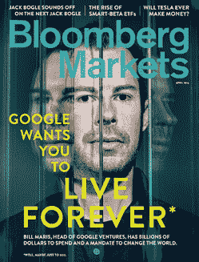**

**在改善人类状况方面，谷歌风险投资公司似乎在寻求长生不老，支持像 Calico 这样的研究中心研究如何逆转衰老。谷歌并不孤单，一些最大的科技巨头正在研究可以对抗死亡的项目。在 SXSW 的主题演讲中，Martine Rothblatt 讨论了人工智能、永生和自我的未来。**

**但是你想永远活下去吗？假如你保持健康，让你的[器官 3D 打印](http://www.nature.com/news/the-printed-organs-coming-to-a-body-near-you-1.17320)用于替换，并战胜任何[神经退行性疾病](http://en.wikipedia.org/wiki/Neurodegeneration)？随着医学研究的进步和根据每个人的 DNA 定制的药物的出现，永生的可能性开始成为现实。**

****11。**超人类主义**

**媒体对人工智能进步的报道以及科技巨头对延长寿命研究的兴趣，重振了 20 世纪 50 年代创造的一场运动，称为[超人类主义](http://en.wikipedia.org/wiki/Transhumanism)(或 H+)。超人类主义是一场国际文化和知识运动，其最终目标是通过开发和广泛提供技术来极大地增强人类的智力、身体和心理能力，从而从根本上改变人类的状况。**

****

**美国现在成立了一个[超人类主义政党](http://transhumanistparty.org/)，其领导人[佐尔坦·伊斯特万](http://en.wikipedia.org/wiki/Zoltan_Istvan)([超人类主义赌注](http://en.wikipedia.org/wiki/The_Transhumanist_Wager)的作者)[将竞选下届美国总统](http://www.huffingtonpost.com/zoltan-istvan/should-a-transhumanist-be_b_5949688.html)。英国还有一个由阿蒙·泰曼领导的超人类政党，该政党有一名独立候选人参加下一届英国选举。**

****

**超人类运动正在获得相当大的势头，并开始在 T4 世界有一个强大的 T2 实体存在。每个国家的超人类主义政党的政策都基于超人类主义的价值观，并考虑到科技和超人类主义可能把我们带向何处。随着自动化而来的是失业和财富不平等，所以在社会进入富足时代之前，普遍基本收入是超人类政党的共同核心政策。然而，超人类文化是关于自我完善的。**

****12。** **关闭思路****

**在概述这一切时，我希望自动化、人工超级智能、超人类主义、[心灵上传](http://hplusmagazine.com/2015/04/16/mind-uploading-and-the-teleportation-problem/)和[宇宙意识的创造](http://www.vanityfair.com/news/tech/2014/11/artificial-intelligence-singularity-theory)等话题有朝一日会成为主流讨论的话题。一旦接触到这些概念，就很难再回去看球类运动和肥皂剧了！**

****2014 年 8 月****

**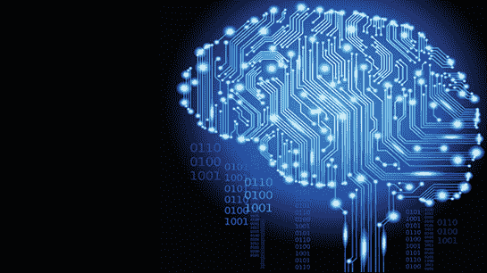**

****1。** **人类无需应用****

**正如我们在 2014 年 8 月的皮尤研究报告中看到的那样— [人工智能、机器人和工作的未来](http://www.pewinternet.org/2014/08/06/future-of-jobs/)，专家们设想到 2025 年自动化和智能数字代理将渗透到我们工作和个人生活的广泛领域，但他们对这些进步是否会取代比它们创造的更多的工作岗位存在分歧。**

**到 2025 年，不可避免地会产生新的工作类别，这些类别在今天是不可预测的，但这里有一个来自 CPG Grey 的趋势视频，关于为什么“[人类不需要应用](https://www.youtube.com/watch?v=7Pq-S557XQU)”，以及与之前的农业、工业和数字革命相比，人工智能革命将如何对人类在劳动力中的角色产生完全不同的影响。**

****

***以下是科技巨头们为实现这一愿景正在做的事情，以及随之而来的人工智能军备竞赛:***

****2。** **IBM****

**自从赢了[就危险了](https://www.youtube.com/watch?v=WFR3lOm_xhE)！三年多前，IBM 终于做出了重大投资[最近](http://venturebeat.com/2014/07/09/ibm-goes-berserk-for-chips-as-it-announces-a-3b-research-initiative/)向[开发者开放其 Watson 技术](http://venturebeat.com/2014/07/18/inside-ibms-billion-dollar-bet-on-watson/view-all/)并[结成主要联盟](http://www.zdnet.com/will-apple-bring-developers-to-ibms-watson-ecosystem-7000031691/)(最显著的是与苹果)将 Watson 带到大众面前。 [Watson 的工作方式](https://www.youtube.com/watch?v=DywO4zksfXw)不同于任何软件处理代码。沃森是一种认知技术，它处理信息的方式更像人而不是计算机——通过理解自然语言，它基于证据生成假设，并在过程中学习。**

**这里有一个 2 分钟的视频，总结了沃森的一切:[你会拿沃森怎么办？](https://www.youtube.com/watch?v=Y_cqBP08yuA)**

**到目前为止，沃森的[应用](http://www.fastcompany.com/3033361/five-ways-watson-will-change-computing)已经在[医疗诊断](http://www.businessinsider.com.au/ibms-watson-may-soon-be-the-best-doctor-in-the-world-2014-4)、[商务会议室](http://qz.com/244385/watson-the-ibm-supercomputer-might-replace-the-loudmouth-in-your-business-meetings/)、[烧烤酱配方](http://www.foxnews.com/leisure/2014/08/14/ibm-supercomputer-watson-whips-up-its-own-bbq-sauce/)、[金融](http://www.cnbc.com/id/101747606)、[军人民事过渡](https://www-03.ibm.com/press/us/en/pressrelease/44431.wss)，甚至[法律职业](http://m.lawtechnologynews.com/module/alm/app/ltn.do#!/article/1694785110)中找到了它的身影。可能性显然是无穷无尽的——当目标是创造一个复制人脑的芯片时，这也不足为奇。**

****3。** **谷歌****

****

**斯坦福大学教授吴恩达在 3 年前启动了谷歌大脑(谷歌的深度学习项目)。到 2012 年 6 月，谷歌大脑已经学会如何识别 YouTube 视频中的猫。**

**今年早些时候，谷歌收购了 [DeepMind](http://deepmind.com/) ，这家公司已经展示了其深度学习系统可以通过简单地反复玩游戏来掌握游戏(这里是它[掌握一些复古游戏如“Breakout](https://www.youtube.com/watch?v=EfGD2qveGdQ) ”)的演示。正如[数字趋势](http://www.digitaltrends.com/computing/google-deepmind-artificial-intelligence/#!bDKn3z)所总结的:**

***“谷歌对人工智能有兴趣，这不是什么秘密；毕竟，源自人工智能研究的技术有助于推动谷歌的核心搜索和广告业务。人工智能也在谷歌的* [*移动服务*](http://www.google.com.au/mobile/) *，其* [*自动驾驶汽车*](http://upstart.bizjournals.com/news/technology/2014/08/12/porsche-specialist-weighs-in-on-how-google-car.html) *，以及其* [*机器人技术*](http://www.digitaltrends.com/cool-tech/google-see-robots-anyway/) *的日益稳定中发挥着关键作用。随着 2012 年未来学家雷·库兹韦尔* *的* [*加入谷歌的行列，谷歌也有了‘强人工智能’的祖父，一个预测智能机器可能在本世纪中叶存在的人”。*](http://www.digitaltrends.com/mobile/ray-kurzweil-brings-his-singular-focus-to-google/)**

**在 Ray Kurzweil 的 TED 演讲[中，“为混合思维做好准备”](https://www.youtube.com/watch?v=PVXQUItNEDQ)强调了承认加速回报法则[的重要性](http://www.kurzweilai.net/the-law-of-accelerating-returns)。查看 Ray Kurzweil 的[网站](http://www.kurzweilai.net/)了解前沿人工智能发展和他的书[如何创造思维:揭示人类思想的秘密](http://www.howtocreateamind.com/)。**

**谷歌最近还收购了 Jetpac，这是一家以提供软件分析网站照片而闻名的公司，然后用人工智能将这些照片汇编成城市指南。更智能的 Google Now 和其他服务的更多弹药。**

****4。** **百度****

**中国科技公司[百度](http://www.baidu.com/)，于去年推出了其[首个可视化搜索引擎，但其流行的搜索引擎和其他网络服务尚未推出英文版本。然而，百度已经能够](http://www.wired.com/2013/06/baidu-virtual-search/)[使用英伟达现成的图形芯片，以五十分之一的成本](http://nextbigfuture.com/2014/08/baidu-hires-google-andrew-ng-and-plans.html)(20，000 美元)建立一个与谷歌大脑系统大致相当的神经网络。自从[从谷歌聘请吴恩达以来，](http://venturebeat.com/2014/07/30/andrew-ng-baidu/)百度正在寻求将神经网络应用于各种各样的应用，包括处理文本、口语、图像和视频的应用。**

****5。**脸书**

**去年年底，脸书聘请纽约大学教授 Yann LeCun 管理其新的人工智能实验室。LeCun 在 90 年代开发了一个可以识别手写数字的系统。自动读取银行支票，这标志着卷积神经网络(convnets)首次应用于实际问题。现在，LeCun 正在积极寻求在公司雇用更多的人工智能人才，不难看出脸书的[战略资产积累](http://mashable.com/2014/05/30/facebook-acquisitions/)将如何补充脸书 convnets 的数据。**

**马克·扎克伯格也在 [Vicarious](http://vicarious.com/) 中持有大量股份，Vicarious 破解了验证码图灵测试。替代公司的其他著名投资者包括埃隆·马斯克、杨致远和杰夫·贝索斯。**

**6。 **苹果****

**如上所述，苹果与 IBM 的联盟也将给予苹果前所未有的进入企业的机会。**

**然而，它的前 Siri 团队也一直在雷达下忙着。**

**认识一下 [Viv](http://viv.ai/) ，Siri 的替代者。Viv 是朝着电影《[她的](https://www.youtube.com/watch?v=WzV6mXIOVl4)》中设想的操作系统进化的下一步。**

**[连线摘要](http://www.wired.com/2014/08/viv/?mbid=social_twitter):**

**“Siri 只能执行苹果工程师明确实施的任务，而这个新程序，他们说，将能够自学，赋予它几乎无限的能力。他们断言，假以时日，他们的作品将能够使用你的个人偏好和一个近乎无限的连接网络来回答几乎任何查询，并执行几乎任何功能”。**

************

****7。** **微软****

**微软[开发了一个模仿人脑的深度学习系统](http://www.wired.com/2014/07/microsoft-adam/)，该系统具有更高的图像分类精度，比业内其他系统快 50 倍。它可以成功地识别你用手机拍摄的照片中的狗是什么品种。**

**下面是一个简短的视频:“[介绍 Project Adam:微软的一个新的深度学习系统](https://www.youtube.com/watch?v=S4ZgfYoeyCo)”。**

**结合[其 Xbox Kinect 深度相机技术和 Cortana](http://www.digit.in/mobile-phones/microsoft-research-transforms-smartphone-camera-into-a-kinect-device-23593.html) ，很明显微软将是人工智能手臂竞赛中的关键角色。**

****8。** **其他 AI 发展****

*   **上个月，Twitter [收购了深度学习初创公司](http://gigaom.com/2014/07/29/twitter-acquires-deep-learning-startup-madbits/) [Madbits](http://madbits.com/) 加入 AI 军备竞赛。Madbits 拥有一种视觉智能技术，可以自动理解、组织和提取原始媒体中的相关信息。**
*   **甚至 Spotify 的实习生也在努力将深度学习应用到业务中，[基于 convnets，根据音频中观察到的某些特征创建播放列表](http://venturebeat.com/2014/08/06/spotify-intern-dreams-up-better-music-recommendations-through-deep-learning/)。**
*   **当然，在[被收购之前，初创企业将不断提出](http://www.simplybusiness.co.uk/microsites/hungry-tech/)[创新方法来应用和发明新的人工智能](http://www.techinasia.com/madstreetden-artificial-intelligence-smartphone-camera-can-read-your-face/)系统**

****9。** **集体 AI****

**看看这些由哈佛大学研究人员开发的微型机器人如何组织和交流。**

**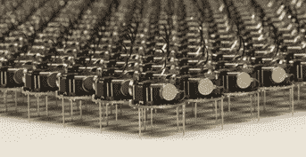**

**见[更多的“千人机器人”在行动](https://www.youtube.com/watch?v=IKCmhGbVd-o&feature=youtu.be)。**

**想到如果这些千机器人缩小到分子大小，成为集体智能，自我复制的纳米机器人会有多可怕？**

****10。** **对人类的警示？****

*   **斯蒂芬·霍金警告人工智能可能是一个真正的危险**
*   **埃隆·马斯克担心人工智能，认为它们可能比核武器更危险**
*   **随着数十年来如此多的好莱坞反主题大片的上映，不难想象人类的结局会是怎样:**

******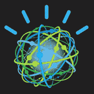********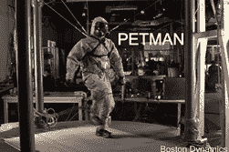********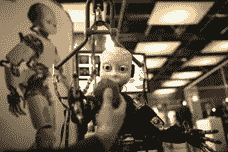****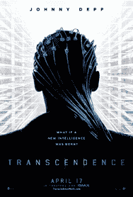****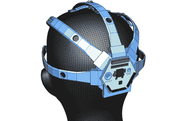**

**当然，必须有一个[关闭开关](http://www.salon.com/2014/08/17/our_weird_robot_apocalypse_why_the_rise_of_the_machines_could_be_very_strange/)？阿西莫夫的机器人三定律怎么样？**

****11。** **与机器合并？****

*   **许多人预测，在今天人们的有生之年，我们也许能够将我们的意识与机器的意识融合。FutureTimeline.net[是未来历史的推测时间线。部分是事实，部分是虚构，时间线是基于详细的研究——包括对当前趋势、长期环境变化、技术进步(如摩尔定律)、未来医学突破、不断演变的地缘政治景观等的分析。在可能的情况下，提供了参考文献来支持这些预测。](http://www.futuretimeline.net/index.htm)**

****

*   **对于“开放思维”的阅读，请查看理论物理学家和未来学家[加来道雄博士的《心灵的未来:理解、增强和赋予心灵力量的科学探索](http://mkaku.org/home/publications/about-the-future-of-the-mind/)。Kaku 博士预测，在不太遥远的将来，我们可以将我们的大脑上传到一台电脑上，一个神经元接一个神经元，通过“脑网”将我们的思想和情感发送到世界各地。**

**12。 **关闭思路****

**自从 80 年代和 90 年代人工智能冬天的大肆宣传以来，我们已经走了很长一段路。既然计算能力正在赶上人脑的能力，那么来自世界各地公共部门和私营部门的重大投资只会为 T21 增加动力。**

**很难不对即将到来的事情感到兴奋(和担忧)。然而，正如我们在过去所看到的，[炒作往往会让](http://www.forbes.com/sites/gilpress/2014/08/18/its-official-the-internet-of-things-takes-over-big-data-as-the-most-hyped-technology/)失望。只要我们不从[《人工智能(2001)】](http://www.imdb.com/title/tt0212720/?ref_=nv_sr_1)中得到那个[的坏结局](https://www.youtube.com/watch?v=xRhCz0ELrKs)，那么我[全力支持。](https://www.transhumanism.com.au/artificial-intelligence)**

**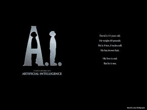**

## **来自 DDI 的相关故事:**

** [## 用 7 个步骤解释深度学习

### 和猫一起

medium.com](https://medium.com/datadriveninvestor/deep-learning-explained-in-7-steps-9ae09471721a)  [## 数据科学和软件工程哪个更有前途？

### 大约一个月前，当我坐在咖啡馆里为一个客户开发网站时，我发现了这个女人…

medium.com](https://medium.com/datadriveninvestor/which-is-more-promising-data-science-or-software-engineering-7e425e9ec4f4)**