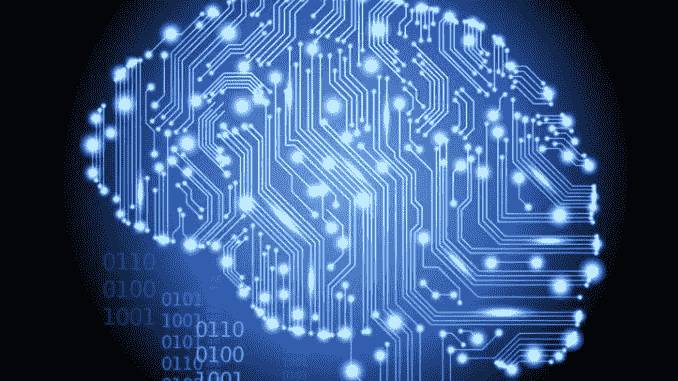

# 关于人工智能的思考

> 原文：<https://medium.datadriveninvestor.com/reflections-on-artificial-intelligence-88bfec076f08?source=collection_archive---------3----------------------->

AI(人工智能)的历史相当短，并且表明该领域在大约六十年内进展良好。事实上，我们已经从第一台进行一些计算的计算机发展到像沃森、深蓝和 AlphaGo 这样的机器，能够与世界上最好的国际象棋选手和最好的围棋选手竞争并获胜。虽然人工智能领域经历了高潮和低谷，但这并没有阻止人工智能在全球范围内的进步。算法的进步增加了计算机的计算能力，数据科学近年来帮助推进了人工智能。

谷歌、脸书、IBM、微软和亚马逊等网络巨头都在这一领域进行投资，并建立人工智能专家团队来进行研发。例如，脸书已经看到了人工智能的潜力，它最近开设了一个人工智能研究中心，主要用于 Oculus VR 耳机周围的虚拟现实，并开发语音和图像识别工具。

最近一段时间，我们听到很多关于机器学习(AI 的一个分支)和深度学习(一种使用人工神经网络的机器学习技术)的 AI(人工智能)。深度学习接近“强”AI，因为它基于学习，即它存储新数据并修改自己的功能。AlphaGo 证明了这一技术，alpha Go 是一种基于深度学习的计算机程序，由谷歌 DeepMind 开发，并击败了世界上最好的围棋选手之一。围棋选手的编程比国际象棋选手要困难得多，因为围棋比国际象棋呈现出更多可能的组合。IBM 的超级计算机“深蓝”击败了世界象棋冠军，它使用了一个穷举搜索程序，换句话说，就是测试所有可能的解决方案。穷举搜索是一种具有高计算能力的好方法，超级计算机就是这种情况，但这种技术有一个缺陷，即要测试的解的数量和巨大的计算能力。如果这个解的数量非常大，比如围棋，穷举搜索是低效的，因为需要太多的计算能力和随之而来的执行时间。因此，改进和创造新算法的兴趣在于用更少的计算能力做得更好。深度学习暂时是解决一些问题的好办法，正在向强 AI 靠近。

然而，强人工智能的主要目标是创造一个能够思考、有感情的机器，它与人类认知系统的功能相同。我认为我们还有很长的路要走，尽管人工智能已经取得了很大的进步。也许有必要回到人工智能的基础，以达到一个真正强大的人工智能，或者也许是不可能达到一个真正强大的人工智能。弱人工智能与强人工智能的不同之处在于，计算机程序模拟智能。例如，Watson 是一个接近弱人工智能的人工智能计算机程序，因为它模拟智能，它不是一个学习的程序，而是基于文本搜索算法的程序，它找到文本但不理解它。Watson 实际上是 IBM 开发的一个计算机程序，它使用 Hadoop 框架，允许程序非常快速地(不到 3 秒)浏览非常大量的本地可用数据(约 2 亿页)。沃森在一个游戏节目“危险边缘”中面对两个人类对手并通过回答用自然语言公式化的问题赢得了游戏节目。由于沃森能够理解自然语言并能够快速找到答案，它已经通过辅助医生而被用于医疗领域。例如，东京大学和他的医学系的一名医生使用沃森程序帮助他诊断了一种罕见的白血病，几分钟后，该程序就找到了真正的原因。医生估计他们需要两周时间才能找到病因。

在机器中创造意识的可能性还不确定。这些机器以二进制工作，它们只计算 1 和 0，而人脑要复杂得多，并且与神经元一起工作。今天，我们无法建造一个人造大脑。一些专家提出了一些限制条件，例如意识对于活的有机体是适当的，机器没有适当的语言来具有类似于人的智能，或者机器只能计算而不能思考。然而，我认为现在肯定人工智能的这些限制还为时过早，还不清楚什么是意识，人类技术的历史经常表明，被认为不可能解决的技术问题后来得到了解决。

今天，一些具有可扩展算法的软件非常复杂，因为它们可以分析和处理大量数据(大数据)。例如，在医疗部门，该软件可以研究患者记录，并得出有时比医生更好的诊断结果。在这些软件中，没有意识，没有自主智能，这是更好的编程。一些专家说，当机器的计算能力超过人脑的复杂程度时，机器就会产生意识。我一直想知道这种说法是基于什么，在我看来，这是一种假设，而不是一种断言，目前更多的是一个理论问题。就我个人而言，如果有可能把一种意识放入一台机器，如果这台机器连接到网络上，那就显得危险了。我认为它将控制这台机器，只允许机器访问一个封闭的、由人类控制的网络，并创建一个简单的系统，能够迅速禁用这个强大的人工智能。其实我担心的是，如果你把一个强 AI 放到全球网络上，也就是一个能够思考，能够自主的 AI，就是她变得不可控，可以在世界上造成严重的伤害。

人工智能能够快速学习，比人类快得多，许多实验表明，直升机机器人能够利用其进化算法在半小时内学习，做出完美的循环，这是飞行员做不到的。事实上，当我们推出这些基于机器学习的算法时，我们知道机器会学习，但在细节上，我们并不真正知道发生了什么。最近，作为谷歌大脑人工智能研究计划的一部分，两台计算机能够创建自己的算法，以人类未知的语言相互交流。人工智能学习速度非常快并超过人类的能力，以及对人工智能的不完全理解，往往表明一个完整和自主的人工智能如果启动将是不可控的。

许多从事人工智能工作的人已经发出了一些关于完整和自主人工智能的警告。埃隆·马斯克、比尔·盖茨和斯蒂芬·霍金发出了警告，并谴责强人工智能的潜在风险。对他们来说，创造和部署一个强大的人工智能将意味着人类物种的终结。很多人也希望禁止自主武器，即能够杀死人类的自主机器人。

我经常听说阿西莫夫的三大定律，它们保护人类免受机器的伤害，但在现实中，这些定律没有一个在机器人身上得到实施。

面对 AI 的进步，伦理方面是不可避免的。我将用一个智能汽车的具体例子来说明我的观点。事实上，联网、智能和自动驾驶汽车肯定会在不久的将来出现。然而，正如在任何交通中一样，可能会有不可避免的事故，我想问的问题是，智能汽车将如何应对不可避免的事故，它是否必须牺牲汽车的乘客或保护行人？

因此，在所有这一切中的道德问题，汽车将如何被编程来处理这种类型的情况？

总之，我认为一个没有控制的完全自主的人工智能对人类来说是危险的。我认为人工智能是一个帮助我们解决问题和帮助人们的系统。