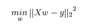
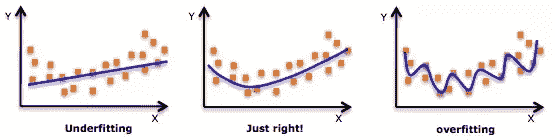
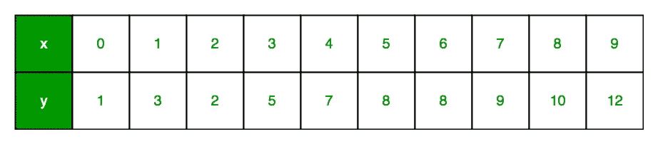
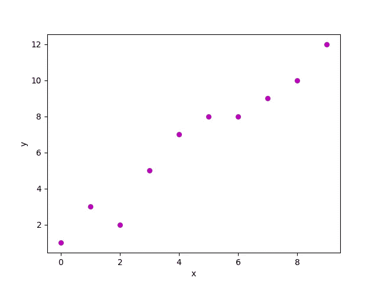
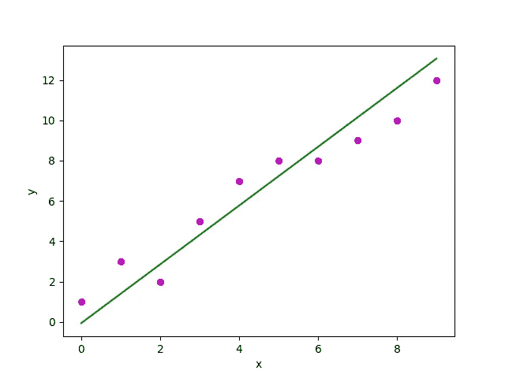
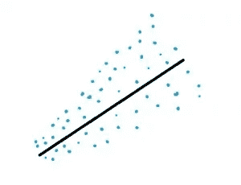

# 回归

> 原文：<https://medium.datadriveninvestor.com/regression-d25a0d50915?source=collection_archive---------18----------------------->

[](http://www.track.datadriveninvestor.com/1B9E)

回归是一种机器学习技术，属于监督 ML 技术的范畴，用于预测连续的输出。它是一种分析因变量和自变量之间关系的技术。它通常用于预测、时间序列建模等

因此，回归分析基本上用于展示两类变量之间的关系，即因变量和自变量，其次，它用于评估多个自变量对因变量的影响。


**source : wikipedia**

**回归技术的类型:**

1.  线性回归
2.  逻辑回归
3.  多项式回归
4.  套索回归
5.  里脊回归

还有其他技术，我们将在后面讨论。在本帖中，我们将介绍多项式回归的基础知识，并深入探讨线性回归。

***线性回归:*** 它试图通过对观测数据拟合线性方程来建立两个变量之间的关系。一个变量被认为是自变量或解释变量，另一个被认为是因变量。

```
**Y = a + bX**
```

这里 Y 是因变量，b 是变量 Y 和 X 之间形成的直线的斜率，a 是截距，X 是解释变量。

因变量总是连续的，自变量可以是离散的也可以是连续的。这两个变量之间形成的线的性质总是线性的。

我们必须记住，我们需要始终获得最佳拟合线，这一概念应用于每一种回归技术。这个任务是通过最小二乘法来完成的，这是众所周知的拟合回归线的方法。



**source : analyticsvidhya.com**

我们将回到这一类型，但让我们首先得到，一些多项式回归的基础知识。

***多项式回归*** :这与多元线性回归非常相似，在这种技术中，通过取变量 x 的第 k 次幂来获得关系，自变量的幂大于 1。

```
**Y = a + b * X^2**
```

在这种技术中，最佳拟合线是在数据点上拟合的曲线，这是区别于线性回归的条件，因为在线性回归中，最佳拟合线是直线。

使用这种技术时，我们必须记住，不会出现过拟合和欠拟合的情况。应该是最合适的。



**source : quora.com**

我们之前学习的线性回归模型是简单线性回归模型，现在我们将寻找多元线性回归模型。

***多元线性回归*** :线性技术中有一个解释变量，但该技术包含两个或两个以上解释变量。

由于我们的自变量多于两个，因此我们可以更有效地使用矩阵来定义回归模型并进行后续分析。在简单线性回归中，误差是在单个预测因子的固定值上计算的，但是在多元线性回归中，我们必须找到所有预测因子的固定值的误差。

这里进行了一些假设检验，以检查方程形成中涉及的不同斜率参数的值，并检查其性质。

***python 中简单线性回归的实现:***

现在我们将检查线性回归模型的 python 实现，



**source : geeksforgeeks.org**

这里 x 是自变量，y 是因变量或解释变量。总共有 10 个观察值。

下面是这两个变量之间的散点图。我们必须以这样的方式工作，以便我们可以为这个分散的图找到最佳拟合线，这样我们就可以为新值预测最准确的结果。



**source : geeksforgeeks.org**

```
import pandas as pd
import numpy as np
import matplotlib.pyplot as plt
def estimate_coefficient(x,y):
        n = np.size(x) #number of observations
        mean_x = np.mean(x) #mean of x vector
        mean_y = np.mean(y) #mean of y vector
        #cross deviation about x
        cross = np.sum(y*x) - n*mean_x*mean_y
        #deviation about x
        dev = np.sum(x*x) - n*mean_x*mean_x
        #calculating regression coefficients
        b = cross / dev
        a = mean_y - b*mean_x return(a,b)def regression_line(x, y, b):
        plt.scatter(x, y, color = "m", marker = "o", s = 30)
        #now comes the predicted response vector
        y_pred = a + b*x
        #plotting regression line
        plt.plot(x, y_pred, color = "g")
        #labels
        plt.xlabel('x')
        plt.ylabel('y')
        #function to show the graph
        plt.show()def main():
        x = np.array([0, 1, 2, 3, 4, 5, 6, 7, 8, 9])
        y = np.array([1, 3, 2, 5, 7, 8, 9, 10, 12])
        #estimation of coefficients
        b = estimate_coefficient(x,y)
        #plot regression line
        regression_line(x,y,b)if __name__ == "__main__":
        main()
```

现在将出现的图像或图表看起来像这样



**source : geeksforgeeks.org**

现在让我们检查一下 ***曲线拟合过程中的*** 线性回归:

回归就是在数据上拟合模型或曲线，这样我们就可以预测那些没有被数据覆盖的点的输出。我们有关于数据和模型的全部信息，但是我们需要根据我们的数据得到最合适的模型。在回归分析中，大量数据被简化成几个参数。

曲线拟合是指定模型的过程，该模型为数据集中的特定曲线提供最佳拟合。变量之间的曲线关系并不容易直线拟合和解释为线性关系。

在线性关系中，如果我们将自变量的值改变一个单位，那么因变量的平均值也会改变一个单位。

但在曲线关系中，因变量的变化不仅取决于自变量的变化，还取决于观察空间中的位置。因此，自变量的作用是，而不是一个常数值。

***线性回归的假设和条件:***

构建或处理线性回归模型时，有一些假设和条件:

1.  我们一直在说回归模型是线性的，线性回归等等，但这里有一个假设要记住，模型在参数方面是线性的。
2.  我们只能对数量值应用回归模型，如果我们的数据不是数字的集合，那么应用回归是不可取的。
3.  将数字分配给分类变量，然后对它们进行回归，这种方式行不通，结果也不会像预期的那样。
4.  如果我们的点是在一个模式中，那么很明显这些值受到误差的影响，而什么是误差，它们只不过是观察值与真实值的偏差。
5.  当我们希望我们的点看起来像一个管而不是一个圆锥。异方差就像误差的独立性，我们看到的是点的趋势，但这里的趋势是增加或减少。



**source : staticshowto.datasciencecentral.com**

回归的应用:

1.  可以用于市场调研分析。
2.  它可以实现为*预测分析*的模型，用于预测未来的机会。
3.  回归可以用来优化业务流程。
4.  通过将大量的原始数据转化为可操作的信息，回归分析引导我们做出更明智、更准确的决策，并为企业管理提供一些科学的角度。
5.  这对于识别判断错误是非常有用的。

*今天就到这里，编码快乐！！*