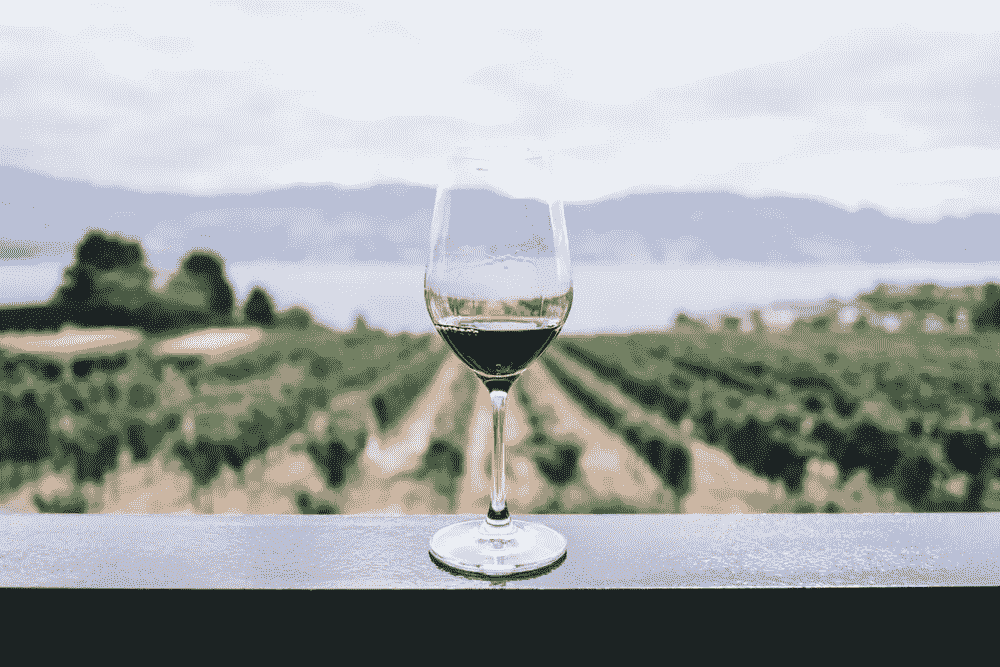
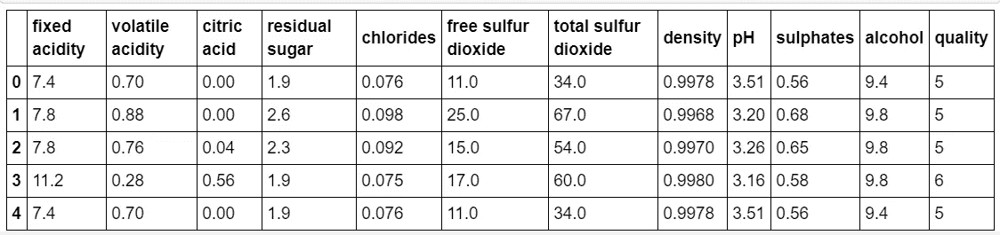
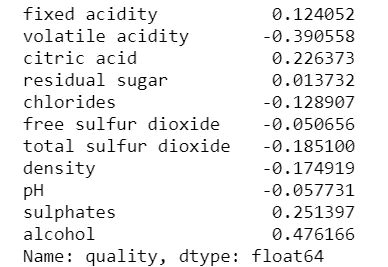
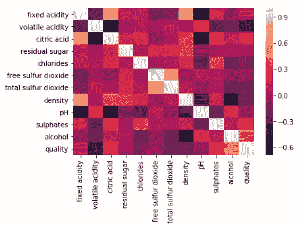
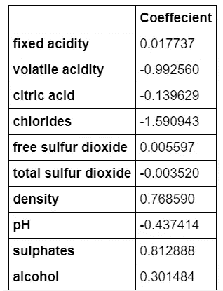

# 从零开始回归——葡萄酒质量预测

> 原文：<https://medium.datadriveninvestor.com/regression-from-scratch-wine-quality-prediction-d61195cb91c8?source=collection_archive---------0----------------------->

[](http://www.track.datadriveninvestor.com/1B9E)

Photo by [Ryan Hutton](https://unsplash.com/photos/Jztmx9yqjBw?utm_source=unsplash&utm_medium=referral&utm_content=creditCopyText) on [Unsplash](https://unsplash.com/?utm_source=unsplash&utm_medium=referral&utm_content=creditCopyText)

这篇文章是我之前关于机器学习的三篇文章的系列，在那三篇文章中我们讨论了基础知识、回归和分类。在这里，我们将研究一个关于回归的小项目，它将帮助初学者开始机器学习。你需要一个小时来设置、理解和编码。所以让我们开始吧😃

[](https://medium.com/datadriveninvestor/beginning-with-machine-learning-56b076aace1e) [## 从机器学习开始

### 几乎每个想玩这项新技术的人都会想到这个问题。我自己也想知道…

medium.com](https://medium.com/datadriveninvestor/beginning-with-machine-learning-56b076aace1e) [](https://medium.com/datadriveninvestor/regression-in-machine-learning-296caae933ec) [## 机器学习中的回归

### 回归模型用于预测连续值。给定房子的特征，预测房子的价格，如…

medium.com](https://medium.com/datadriveninvestor/regression-in-machine-learning-296caae933ec) [](https://medium.com/datadriveninvestor/classification-in-machine-learning-db33514c77ad) [## 机器学习中的分类

### 分类用于对不同的对象进行分类。是机器学习中的监督问题(就像…

medium.com](https://medium.com/datadriveninvestor/classification-in-machine-learning-db33514c77ad) 

# 葡萄酒质量预测



这里的任务是*给定一组特征作为输入，在 0-10 的范围内预测红酒*的质量。我已经用 ***线性回归解决了它作为一个回归问题。***

使用的数据集是来自 UCI 机器学习知识库的葡萄酒质量数据集。[https://archive.ics.uci.edu/ml/datasets/Wine+Quality](https://archive.ics.uci.edu/ml/datasets/Wine+Quality)

输入变量为固定酸度、挥发性酸度、柠檬酸、残糖、氯化物、游离二氧化硫、总二氧化硫、密度、pH、硫酸盐、酒精。并且输出变量(基于感官数据)是质量(得分在 0 到 10 之间)。下面是数据集前 5 行的屏幕截图。



Top 5 rows of Wine Quality dataset

# 属国

代码是用 python 写的。除此之外，请使用 pip 安装以下库。

1.  熊猫:pip 安装熊猫
2.  matplotlib: pip 安装 matplotlib
3.  安装
4.  scikit-learn: pip 安装 scikit-learn

就是这样！你已经完成一半了😄。接下来，按照下面的步骤，以建立一个线性回归模型在任何时候！

# 方法

创建一个新的 IPython 笔记本，插入下面的代码来导入必要的模块。如果您遇到任何错误，请使用 pip 安装必要的软件包。

```
import pandas as pd 
from sklearn.model_selection import train_test_split 
from sklearn.linear_model import LinearRegression 
from sklearn import metrics 
import matplotlib.pyplot as plt 
import numpy as np 
import seaborn as sns
```

使用 pandas 将数据读入数据帧。要检查数据集的前 5 行，使用`df.head()`

```
df = pd.read_csv('winequality-red.csv')
df.head()
```

使用`corr()`查找数据集每个属性之间的相关性

```
***# there are no categorical variables. each feature is a number. Regression problem.* 
*# Given the set of values for features, we have to predict the quality of wine. finding correlation of each feature with our target variable - quality***
correlations = df.corr()['quality'].drop('quality')
print(correlations)
```



Correlations between each attribute and target variable — quality

要绘制热图并获得详细的关联图，请插入以下代码。

```
sns.heatmap(df.corr())
plt.show()
```



Heatmap

定义一个函数`get_features()`，该函数只输出那些相关性高于阈值的特征(作为输入参数传递给函数)。

```
**def** get_features(correlation_threshold):
    abs_corrs = correlations.abs()
    high_correlations = abs_corrs
    [abs_corrs > correlation_threshold].index.values.tolist()
    **return** high_correlations
```

创建包含输入特征的向量`x`和包含质量变量的向量`y`。在`x`我们得到了除残糖以外的所有特征。如果你愿意，阈值可以增加。

```
***#******taking features with correlation more than 0.05 as input x and quality as target variable y*** 
features = get_features(0.05) 
print(features) 
x = df[features] 
y = df['quality']
```

使用`train_test_split`创建训练和测试集。25%的数据用于测试，75%用于训练。您可以使用`x_train.shape`检查数据集的大小

```
x_train,x_test,y_train,y_test=train_test_split(x,y,random_state=3)
```

创建数据集后，就该构建线性回归模型了。您可以简单地使用内置函数来创建模型，然后根据训练数据进行拟合。一旦训练完毕，`coef_`给出每个特征的系数值。

```
***# fitting linear regression to training data***
regressor = LinearRegression()
regressor.fit(x_train,y_train)
  ***# this gives the coefficients of the 10 features selected above. *** print(regressor.coef_)
```

用这个模型预测葡萄酒的质量，用`predict()`。

```
train_pred = regressor.predict(x_train)
print(train_pred)
test_pred = regressor.predict(x_test) 
print(test_pred)
```

计算训练集和测试集的均方根误差。*均方根误差(RMSE)是模型预测值(样本值和总体值)与实际观察值之间差异的常用度量。如果我们构建了一个好的模型，那么训练集和测试集的 RMSE 应该非常相似。如果测试集的 RMSE 比训练集的高得多，很可能我们严重地过度拟合了数据。*

```
**# calculating rmse**
train_rmse = mean_squared_error(train_pred, y_train) ** 0.5
print(train_rmse)
test_rmse = mean_squared_error(test_pred, y_test) ** 0.5
print(test_rmse)***# rounding off the predicted values for test set***
predicted_data = np.round_(test_pred)
print(predicted_data)print('Mean Absolute Error:', metrics.mean_absolute_error(y_test, test_pred))
print('Mean Squared Error:', metrics.mean_squared_error(y_test, test_pred))
print('Root Mean Squared Error:', np.sqrt(metrics.mean_squared_error(y_test, test_pred)))**# displaying coefficients of each feature**
coeffecients = pd.DataFrame(regressor.coef_,features) coeffecients.columns = ['Coeffecient'] 
print(coeffecients)
```



Coefficients of each feature

***这些数字意味着在所有其他特征不变的情况下，硫酸盐每增加 1 个单位，葡萄酒的质量就会增加 0.8，其他特征也是如此。*
*同样在其他所有特征不变的情况下，挥发性酸度增加 1 个单位会导致葡萄酒质量下降 0.99，其他特征也是如此。***

因此，通过几行代码，我们能够构建一个线性回归模型来预测葡萄酒的质量，对于训练集 ***和测试集*** 来说，RMSE 分数分别为 0.65 和 0.63。这只是一个帮助你开始回归的想法。您可以尝试阈值、其他回归模型，也可以尝试特征工程😍。

要获得完整的代码，请使用下面的链接到我的仓库。数据集也被上传:)克隆存储库并运行笔记本来查看结果。

[](https://github.com/apoorva-dave/WineQualityPrediction) [## apoorva-Dave/葡萄酒质量预测

### 预测葡萄酒的质量。通过在以下网站创建账户，为 apoorva-Dave/wine quality prediction 的发展做出贡献

github.com](https://github.com/apoorva-dave/WineQualityPrediction) 

下一篇文章将是一个类似的关于分类的小项目。如果你喜欢这篇文章，一定要展示一些❤，请继续关注！在那之前，祝你学习愉快😸