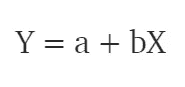
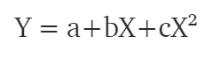
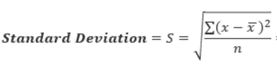
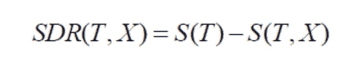

# 机器学习中的回归

> 原文：<https://medium.datadriveninvestor.com/regression-in-machine-learning-296caae933ec?source=collection_archive---------0----------------------->

回归模型用于预测连续值。给定房子的尺寸、价格等特征来预测房子的价格是回归的常见例子之一。这是一种受监督的技术。关于机器学习的类型和一些重要概念的详细解释在我以前的文章中已经给出。

 [## 从机器学习开始

### 几乎每个想玩这项新技术的人都会想到这个问题。我自己也想知道…

medium.com](https://medium.com/@apoorvadave1995/beginning-with-machine-learning-56b076aace1e) 

**回归类型**

1.  简单线性回归
2.  多项式回归
3.  支持向量回归
4.  决策树回归
5.  随机森林回归

**简单线性回归**

这是一种最常见和最有趣的回归技术。这里，我们根据输入变量 x 预测目标变量 Y。目标变量和预测变量之间应该存在线性关系，因此称为线性回归。

考虑根据雇员的年龄来预测他/她的工资。我们可以很容易地发现，员工的年龄和工资之间似乎存在相关性(年龄越大，工资越高)。线性回归的假设是

y 代表薪水，X 是雇员的年龄，a 和 b 是等式的系数。所以为了在给定 X(年龄)的情况下预测 Y(工资)，我们需要知道 a 和 b(模型的系数)的值。

*在训练和建立回归模型时，正是这些系数被学习并适合训练数据。训练的目的是找到最佳拟合线，使得成本函数最小化。成本函数有助于测量误差。在训练过程中，我们试图最小化实际值和预测值之间的误差，从而最小化成本函数。*

在该图中，红色点是数据点，蓝色线是训练数据的预测线。为了得到预测值，这些数据点被投影到直线上。

总之，我们的目标是找到使成本函数最小的系数值。最常见的成本函数是**均方误差** (MSE)，它等于观测值的实际值和预测值之间的均方差。可以使用**梯度下降**方法计算系数值，这将在后面的文章中详细讨论。为了给出简单的理解，在梯度下降中，我们从系数的一些随机值开始，在这些值上计算成本函数的梯度，更新系数并再次计算成本函数。重复这个过程，直到我们找到成本函数的最小值。

**多项式回归**

在多项式回归中，我们将原始特征转换成给定次数的多项式特征，然后对其应用线性回归。考虑上面的线性模型 Y = a+bX 被转换成类似于

它仍然是一个线性模型，但曲线现在是二次曲线，而不是直线。Scikit-Learn 提供了多项式特征类来转换特征。

如果我们将程度增加到一个非常高的值，曲线会变得过度拟合，因为它也会学习数据中的噪声。

**支持向量回归**

在 SVR 中，我们确定一个具有最大边缘的超平面，使得最大数量的数据点在该边缘内。支持向量回归机几乎类似于 SVM 分类算法。我们将在我的下一篇文章中详细讨论 SVM 算法。

我们不是像简单的线性回归那样最小化误差率，而是试图将误差拟合在某个阈值内。我们在 SVR 中的目标是基本上考虑在边界内的点。**我们的最佳拟合线是具有最多点数的超平面。**

Data points within the boundary line

**决策树回归**

决策树可以用于分类和回归。在决策树中，在每一层，我们需要识别分裂属性。在回归的情况下，ID3 算法可用于通过*减少标准偏差(使用分类信息增益)*来识别分裂节点。

决策树是通过将数据划分为包含具有相似值(同质)的实例的子集来构建的。标准差用于计算数字样本的同质性。如果数字样本是完全同质的，那么它的标准差为零。

寻找分割节点的步骤简述如下:

1.  使用以下公式计算目标变量的标准偏差。

2.根据不同属性分割数据集，并计算每个分支的标准差(目标和预测值的标准差)。分割前，从标准偏差中减去该值。结果是标准偏差减少。

3.选择具有最大标准偏差减少的属性作为分裂节点。

4.数据集根据所选属性的值进行划分。这个过程在非叶分支上递归运行，直到所有数据都被处理。

为了避免过度拟合，使用偏差系数( **CV** )来决定何时停止分支。**最后，将每个分支的平均值分配给相关的叶节点(在回归模式中取平均值，而在分类模式中取叶节点)。**

**随机森林回归**

随机森林是一种集成方法，其中我们考虑了几个决策回归树的预测。

1.  选择 K 个随机点
2.  确定 n，其中 n 是要创建的决策树回归数。重复步骤 1 和 2，创建几个回归树。
3.  每个分支的平均值被分配给每个决策树中的叶节点。
4.  为了预测变量的输出，考虑所有决策树的所有预测的平均值。

随机森林通过创建特征的随机子集并使用这些子集构建更小的树来防止过度拟合(这在决策树中很常见)。

以上解释是对每种回归类型的简要概述。可能要深究一下才能搞清楚:)

以下是一些对进一步阅读有用的链接:

 [## 决策树回归

### 决策节点和叶节点。决策节点(例如，Outlook)有两个或更多分支(例如，晴天、阴天和…

www.saedsayad.com](https://www.saedsayad.com/decision_tree_reg.htm)  [## 支持向量回归

### 编辑描述

www.saedsayad.com](https://www.saedsayad.com/support_vector_machine_reg.htm)  [## 随机森林回归:何时失败，为什么？- neptune.ai

### 在本文中，我们将探讨使用随机森林进行回归的一个主要问题，即外推。我们会…

bit.ly](https://bit.ly/309pVdF) 

我的下一篇文章将概述不同的分类算法。敬请期待:)

在那之前，祝你学习愉快！！