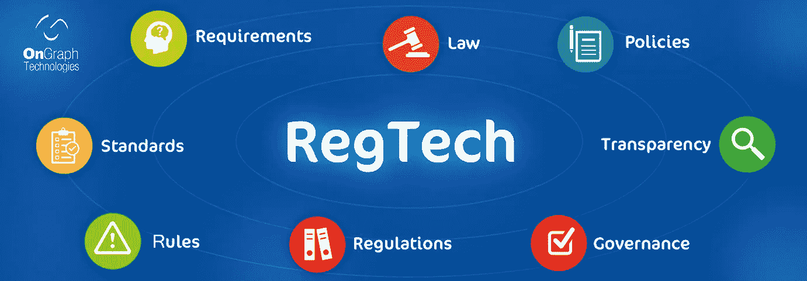
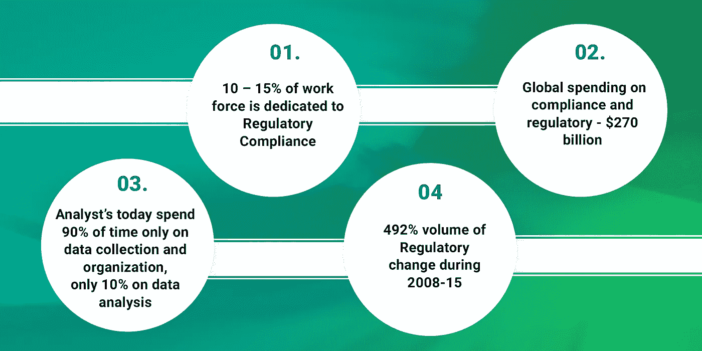
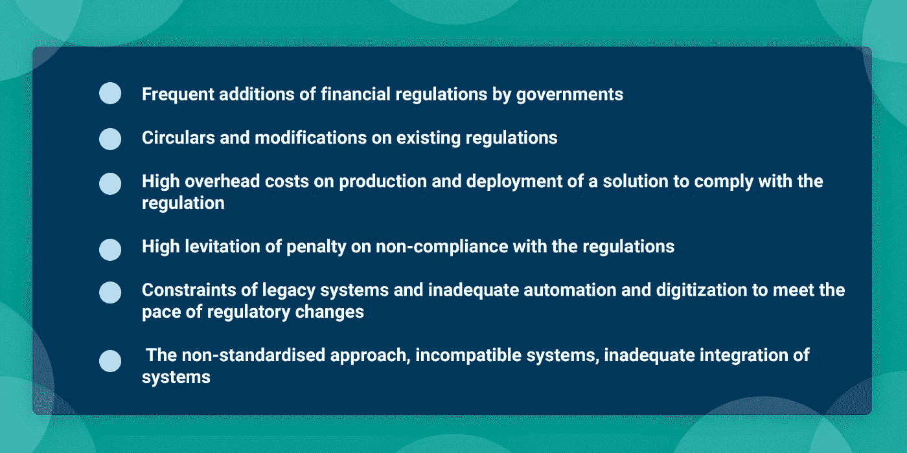
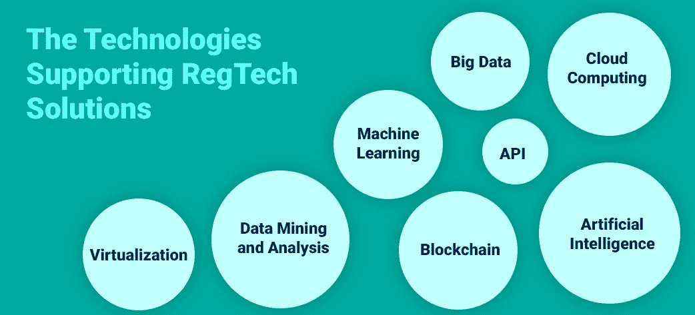

# reg tech——金融科技领域的下一个“大事件”

> 原文：<https://medium.datadriveninvestor.com/regtech-the-next-big-thing-in-fintech-92901dd7b695?source=collection_archive---------9----------------------->

source

金融科技生态系统尚未扎根，但 RegTech 已经开始在金融科技的茧下站稳脚跟。

根据“金融科技”报告，“RegTech”被认为是“20 个金融科技趋势中的第一名”。参与者对这一趋势反应强烈；然而，美国在 reg 技术初创企业和采用方面落后。而且 RegTech 之后还有 AI、[区块链](https://www.ongraph.com/blockchain/)、游戏化、AR、移动开户、[聊天机器人](https://www.ongraph.com/chatbot/)等。，作为金融科技创新的另一个 20 大趋势。(据 [Finovate](https://www.bankingtech.com/2017/09/whats-hot-and-whats-not-in-us-fintech/) 联合 FinTech Cocktail Club 发起的 FinTech Tinder 游戏报道。)

金融服务行业充满了法规和合规性。随着数字数据的不断增长，监管机构面临着维护数据合规性和良好 it 治理的压力。在金融科技生态系统中，RegTech 是一个越来越重要的细分市场。FinTech 发现 RegTech 是一种技术解决方案，可以减轻未来监管条款的巨大且不断增加的负担。

*由*[*Mathieu Maurier*](https://www.securities-services.societegenerale.com/en/insights/expert-views/regtech-fintech-the-intersection-regulation-and-disruption-securities-services/)*全球销售负责人&负责 SGSS 的关系管理*

市场参与者面临的问题是，他们如何将监管约束转化为优势。可以部署技术为资产服务提供商及其客户创造更多价值，带来更多以智能方式利用数据的可能性。”

*Frost & Sullivan 表示，到 2020 年，全球 RegTech 市场可能会达到*[*【64.5 亿美元*](http://www.frost.com/sublib/display-report.do?searchQuery=the+global+RegTech+market+could+reach+%246.45+billion+by+2020&ctxixpLink=FcmCtx1&ctxixpLabel=FcmCtx2&id=MCB0-01-00-00-00&bdata=aHR0cHM6Ly93d3cuZnJvc3QuY29tL3NyY2gvY2F0YWxvZy1zZWFyY2guZG8%2FcGFnZVNpemU9MTImcXVlcnlUZXh0PXRoZStnbG9iYWwrUmVnVGVjaCttYXJrZXQrY291bGQrcmVhY2grJTI0Ni40NStiaWxsaW9uK2J5KzIwMjAmeD0yOSZ5PTE0QH5AU2VhcmNoIFJlc3VsdHNAfkAxNTQ2NTg2NDQ0Njk4) *。*

现在，让我们看看几十年来监管体系所采用的现有遗留系统。

source

# **金融机构面临的挑战**

source

当务之急是开发稳健的金融科技解决方案，利用 RegTech 创新，开发具有安全自动化和监管流程的可持续金融产品。大数据、区块链、机器学习、人工智能等赋能技术。正在帮助金融机构窥探复杂的法律实体结构。金融机构也越来越能够执行内部控制，并对风险数据、分析、合规评估和有效的政策和程序管理负责。

# **监管技术的潜在好处**

**1。保持符合法规**

RegTech 将使从事金融服务的机构能够更加有效和高效地遵守监管要求。在 FinTech 部署 RegTech 系统将使他们能够积极主动地适应和配合新的和不断发展的法规。他们还将准备好“情况如何”。稳健的金融科技系统中的 RegTech 创新，可以帮助改善数据收集和数据分析，使识别欺诈变得容易，并减少客户入职所需的时间。

**2。数据分析和决策制定**

RegTech 在风险管理方面的另一个关键领域是预测分析。在不久的将来，基于技术的系统将能够评估违反法规的问题，并使用它来预测合规性问题。云计算和人工智能领域不断增长的创新可以增加 RegTech 解决方案的实用性。

**3。简化数据管理和报告**

过去几年，金融机构见证了结构化和非结构化格式的指数级数据增长。金融机构正在寻找从大数据中收集更好见解的方法。然而，新法规正在推动金融机构和银行全面审视数据基础架构。在数据的支持下，行业专家认为 RegTech 解决方案可以轻松地帮助进行战略性数据管理。这将有助于使监管填写更加高效、透明，并对生成、收集和消费数据的每个人都有用。

**4。实时报告**

RegTech 拥有彻底改变法规遵从性工作的动力，以帮助金融机构实时分析数据。高级数据分析允许 RegTech 以各种方式进行分析，如场景分析、监管生态系统分析和全球实时用户参与度分析，从而帮助公司主动识别风险、问题和机会。

**5。规则重构**

需要 RegTech 系统来监控当前的合规状态，同时将其与即将出台的法规进行比较。企业需要先进的以技术为动力的监管系统来计划和执行业务流程，并时刻关注未来的监管。RegTech 解决方案支持快速、准确、端到端的自动化法规合规性解决方案，以及灵活、经得起未来考验的解决方案，可轻松符合当今和未来的标准。

**带走**:随着银行和金融机构法规的不断变化，任何企业都不能不遵守法规。这些机构向客户承诺高水平的安全性和客户体验，这需要对数据基础架构进行彻底改造。RegTech 承诺比以往任何时候都更有效的控制和监督。因此，RegTech 有望实现可观的增长。