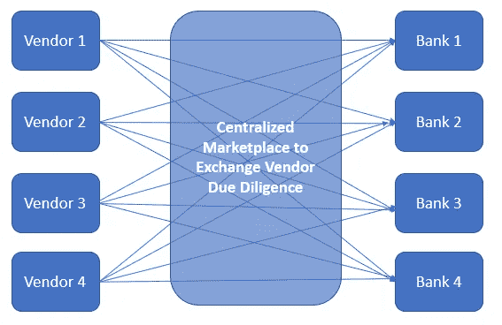

# RegTech:它是什么，你应该关注哪里？

> 原文：<https://medium.datadriveninvestor.com/regtech-what-is-it-and-where-should-you-focus-e5962057ed77?source=collection_archive---------6----------------------->

监管技术(RegTech)广泛涵盖帮助公司确定监管要求或协助公司遵守上述要求的软件解决方案。虽然 RegTech 解决方案存在于多个行业(如医疗保健、制药、交通运输)，但由于金融服务行业复杂的监管环境和不断增长的监管要求列表，它们对该行业的益处最大**。**[【1】](#_ftn1)本帖将进一步探讨金融服务行业中已经成熟的特定领域，以及最有可能在该领域取得成功的相应类型的 RegTech 解决方案。

面向金融机构的 RegTech 解决方案的范围是多样的，并且不断增长，从消费者合规到压力测试和资本要求。在 RegTech 中，投资者应关注的三个子类别是反洗钱(“AML”)/制裁合规、了解客户(“KYC”)以及第三方和供应商管理。选择这些子类别有两个主要驱动因素。首先，每个子类别对应于大型法规遵从性/风险管理团队和高度手工、低附加值的流程和程序。其次，根据 Bank Director 进行的 2018 年风险调查，银行高管将反洗钱/制裁、KYC 和供应商管理确定为银行部署技术以改善合规职能的首要领域。

在定义了 RegTech 中投资者应该关注的具体子类别之后，本文的最后一部分考察了最具颠覆性的技术解决方案的具体类型。具体来说，投资者应该瞄准提供以下产品的 RegTech 初创公司:

*   补充(即，不取代)现有技术堆栈的可扩展人工智能(“AI”)和机器学习(“ML”)解决方案；
*   工作自动化(“AoW”)软件，增强或自动化桌面分析师的职责；和
*   第三方和供应商管理市场

**补充现有技术堆栈的可扩展 AI/ML 解决方案**

众所周知，银行业在投资新技术方面行动迟缓，而且投资决策过程零散而繁琐。银行业的销售周期从 10 个月到 18 个月不等并不少见(这还不包括最初的概念验证)。此外，后台和中间办公室充斥着遗留的技术系统，需要银行投入大量的时间和资金来实施。因此，银行不愿意用更新、更复杂的技术平台替换遗留系统，即使最新的解决方案能提供有意义的运营效率或成本降低。一个例子是银行遗留的反洗钱交易监控系统。提供下一代交易监控平台以取代现有技术的初创公司可能会发现客户的兴趣不高，因为 1)现有系统的高转换成本/粘性；以及 2)投资最新技术的激励有限，尤其是在没有监管压力的情况下(即，如果它没有坏，就不要修复它)。

投资者不应该追逐寻求大型 ACV 合同来取代现有银行系统的初创公司，而是应该支持提供可扩展、易于实施的 SaaS 解决方案的初创公司，这些解决方案是对现有技术的补充或补充。 **Intelligo** 是一家 RegTech 初创公司，其位于 SaaS 的客户尽职调查产品(Clarity)是一种低成本、可扩展的产品，补充了现有技术，并以更低的误报警报形式提供了有意义的运营效率。

**工作自动化软件**

AoW 软件指的是使桌面分析人员能够更有效地完成给定的过程/程序，或者使过程/程序完全自动化的技术解决方案。这种应用通常结合有监督的机器学习技术来自动化或复制分析师采取的动作(例如，如果 A 做 B，如果 C 做 D)。由于基于纸张的记录/交易的流行、系统间通信的缺乏以及顺序的、定义明确的工作程序，AoW 软件在 RegTech 领域(以及更广泛的银行后台/中台)的可能应用有很多。

RegTech 领域最成功的 AoW 公司将是那些专注于特定行业解决方案的公司，这些解决方案在专有数据集(例如，银行交易数据、客户资料、贸易融资文档)上训练其机器学习模型。这些公司通过提高其模型的准确性和开发复杂的特定行业流程领域的专业知识来构建天然的护城河。 **TraydStream** 是 AoW 软件特定行业应用的一个典型例子，它为银行的后台/中台交易部门提供了有意义的运营效率。TraydStream 自动将贸易融资文档(如信用证、提单、商业发票)数字化，自动对交易各方进行制裁和出口控制检查，并通过识别文档的类型/性质来管理内部流程中的文档分发。

**第三方和供应商管理市场解决方案**

监管期望要求银行对其第三方服务提供商和供应商进行广泛的尽职调查和持续监控，特别是那些向银行提供“关键”产品/服务的提供商和供应商。在当前环境下，银行供应商需要为每家银行完成冗长的尽职调查问卷和文档请求(例如，信息安全政策、合规性政策、数据保护政策的证明)。尽职调查问卷和文档请求通常相似，但不完全相同，这要求供应商为每家银行重复这项耗时的任务。

利用通用尽职调查问卷的市场解决方案将解决当前供应商尽职调查环境中的严重低效问题(见附件 1)。与其完成多余的尽职调查问卷，供应商还不如上传一份尽职调查问卷到中央市场，并控制哪些银行可以访问这些信息。银行也有很大的动力采用市场方法，因为它们可以缩短采购周期，同时保持对其供应商的有力监督。 **Centrl** 是一家初创公司通过单一平台解决供应商尽职调查效率低下的例子，银行/供应商可以在该平台上创建、分发和完成调查问卷。然而，Centrl 缺乏跨银行共享结果的市场功能。迄今为止，不存在这样的市场解决方案，供应商可以在多方之间交换/共享尽职调查结果。

*附件 1:供应商尽职调查环境和市场解决方案*

[【1】](#_ftnref1)此后，所有提及 RegTech 的内容都是针对其在金融服务行业中的应用。