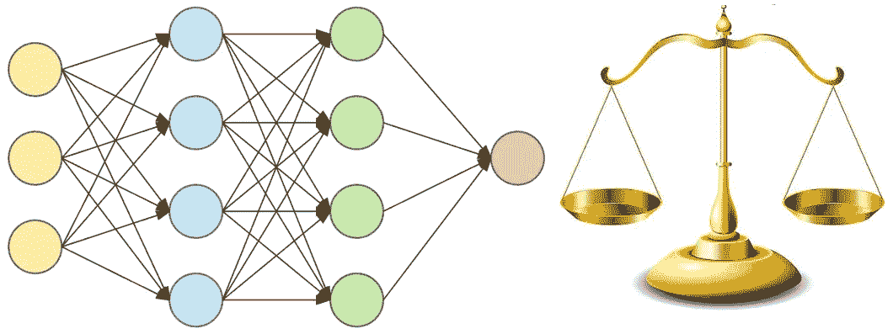
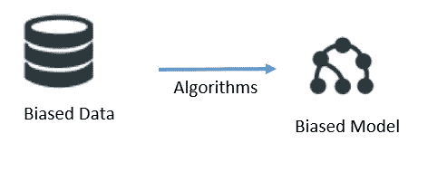
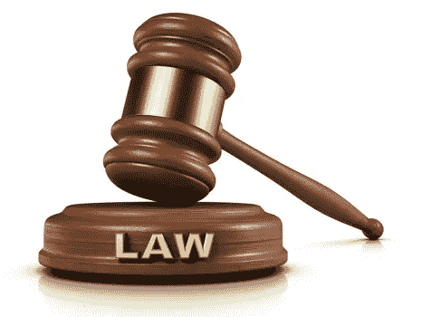

# 调节 ML/AI 供电系统的偏差

> 原文：<https://medium.datadriveninvestor.com/regulating-ml-ai-powered-systems-for-bias-759e99593e2a?source=collection_archive---------5----------------------->

Siri 和 Alexa 是人工智能的很好例子，因为它可以听人说话，识别单词，执行搜索，并将文本结果翻译成语音。麦当劳最近收购了一家名为 Dynamic Yield 的人工智能公司，以分析客户的消费/饮食习惯，并向他们推荐其他食物来购买，这已经进入了人工智能的下一步使用。人工智能技术提出了一些重要的问题，比如个人隐私权，以及机器是否能够做出公平的决定。

监管有助于两个主要领域。

 [## 人工智能与创造力:作为创意引擎的比根——数据驱动的投资者

### 的确，2018 年可以被视为人工智能创造的创造力全盛时期的开始。当然可以…

www.datadriveninvestor.com](https://www.datadriveninvestor.com/2019/02/13/ai-creativity-biggan-as-a-creative-engine/) 

**1。防止滥用技术**

这方面的一个很好的例子是使用人工智能来读唇。典型的人类唇读器可以具有 15%到 50%之间的准确率。最近，牛津[大学](https://www.technologyreview.com/s/602949/ai-has-beaten-humans-at-lip-reading/)开发的人工智能唇读程序达到了 90%以上的准确率。

这项技术非常适合听力受损的人，是帮助他们交流的好方法。但是从另一方面来说，同样的东西也可能被滥用来监视人们。

**2。防止决策偏差**

算法学习从历史数据中预测模式。人类的决定天生就有偏见。本质上，[算法被训练从不完美的数据中学习，以做出反映人类偏见的决策](https://productcoalition.com/identifying-unconscious-bias-in-predictive-models-febc81674a8f)。

算法开始不仅用于过滤数据，还用于推荐，在某些情况下还用于外包决策过程。例如，算法可以决定

*   哪一个人应该或不应该得到贷款？
*   哪个被告应该获得保释
*   这个人到底该不该录用？
*   我们应该把这个公寓租给这个人吗？
*   下一次犯罪活动会发生在哪里？

解决歧视问题的责任

这些算法都使用现有的数据进行学习和预测。这意味着它只是加强了数据中所有的电流偏差。

例如，假设一家公司去年在销售部门雇佣的所有人都是年龄在 25 到 35 岁之间的男性。你将这些数据输入到算法中，算法开始学习公司招聘的理想年龄是 25 到 35 岁年龄段的男性。这也意味着女性或老年人不会得到好成绩。如果雇主适用的规则只雇用 25 至 35 岁年龄组的男性候选人，那就是非法歧视。但是，如果同一个雇主将数据输入一个算法，而该算法学会了歧视女性或 35 岁以上的人，那么谁应该为这种歧视负责？

**一项新法律被提出**

国会正在提出一项名为[算法问责法案](https://www.wyden.senate.gov/imo/media/doc/Algorithmic%20Accountability%20Act%20of%202019%20Bill%20Text.pdf)的新法案，并试图通过迫使大公司审计其机器学习算法驱动的系统(如面部识别或广告定位算法)来解决(第二)偏见。该法案针对的是收入超过 5000 万美元并拥有超过 100 万人数据的大公司。

关键是这些公司要审查它们对影响消费者合法权利的算法的使用，比如预测消费者行为&涉及大量敏感数据。如果这样的审计发现了歧视的证据，公司必须立即解决。

**总结**

这些都是朝着正确方向迈出的步伐。这可能会导致“算法合规办公室”的成立，并可能成为现有合规部门的一部分，将有技术和法律人员管理和审查调查结果。首席风险官或首席合规官可能会在遵守即将出台的法律方面发挥更大的作用。