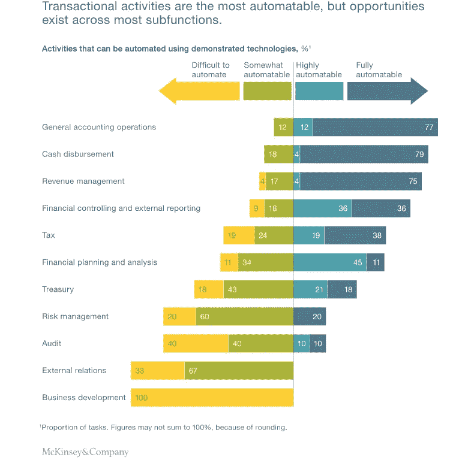

# 使用 RPA-Cygnet 重新想象金融流程

> 原文：<https://medium.datadriveninvestor.com/reimagining-processes-in-finance-using-rpa-cygnet-15e700b53a03?source=collection_archive---------17----------------------->

RPA-Solutions

由于技术的快速发展，全行业的颠覆无处不在，金融业也不例外。行业领导者都准备好利用尖端技术起飞和重塑金融功能。利用技术有望在新时代实现前所未有的增长，从而提高生产率和性能。

几十年来，金融和银行业务主要依靠离岸、外包和集中化来提高绩效。但是，这些也带来了独特的挑战，总拥有成本更高，而随着时间的推移，投资回报会随着维护成本的不断增加而显著降低。

 [## 不管准备好了没有，革命就在我们面前|数据驱动的投资者

### “对于技术如何影响我们的生活和重塑经济，我们必须形成全面的全球共识……

www.datadriveninvestor.com](https://www.datadriveninvestor.com/2019/02/12/ready-or-not-the-revolution-is-upon-us/) 

金融行业面临着严峻的挑战，包括成本缩减、利润率下降、复杂性增加、流程速度降低、交付延迟等等。在动态环境中保持相关性的需求是推动此类企业和机构采用 RPA 等微创技术的原因。

机器人流程自动化(RPA)的实施，通过自动化重复的、基于规则的、普通的和技术性的任务，使数字劳动力能够支持您现有的劳动力。RPA 是作为现有 IT 基础架构和框架之上的附加层实施的，这就是为什么它的破坏性最小，并且是在企业内启动数字化转型的最简单的选项之一。

明智实施 RPA 后，它可以轻松成为一种有效的区分因素和竞争优势，从单调耗时的运营转变为高效的高绩效企业。

**RPA 的基础知识**

机器人流程自动化，RPA，机器人流程自动化通常缩写为 RPA，代表由运营经理管理的虚拟工作场所。RPA 通过自动化普通的基于规则的任务来模拟人类行为。

业务流程的单调要求软件或处理过的机器人使重复出现的任务更简单。RPA 智能地采用和整合来自现有应用程序的信息，同时操纵数据并触发对其他系统的响应，而不会影响当前的 IT 环境。

**把事情做好**

经常发生的情况是，某些业务职能被外包或委托给离岸机构，以便快速、准确地执行多个并发活动，并与内部执行的其他重要任务保持同步。让流程清晰到最后的细节变得非常必要，此外，了解自动化如何改变这些流程的功能及其效果也非常重要。

审核您的流程以及如何使其更有效。从业务功能中可以自动化的较小任务集开始试验。然而，在你到达那里之前，你需要了解什么是可以自动化的。

什么可以自动化？

我们在学校里对一个句子写 100 遍进行惩罚是有原因的。没有人喜欢做单调乏味的自动化任务；这感觉更像是导致企业生产力下降的惩罚。因此，为了抓住时间并将其投入到富有成效的活动中，了解什么需要自动化是至关重要的。在金融领域，额外需要实现流程自动化，但问题是哪一个。

并非每个业务流程都适合 RPA，这就是为什么确定哪些流程需要自动化，哪些流程留给人工处理非常重要。

企业需要从全面评估其战略和运营驱动因素开始。如果提高利润率是战略驱动因素，那么可以使用 RPA 来控制成本，同时缩短上市时间，从而节约整个供应链的运营成本。一般来说，企业更喜欢自动化耗时、资源密集且容易出现人为错误的流程。

**任何过程都可以自动化，如果它:**

*   是基于规则的
*   定期重复
*   处理预定义的输入和输出

**下面是可以自动化的财务操作的快速列表:**

1.  银行对账流程
2.  开具发票和订购
3.  客户通过 KYC 入职
4.  固定资产管理
5.  财务和外部报告
6.  存货管理
7.  应收账款管理
8.  应付款管理
9.  财务报表结算
10.  税务规划和会计

财务运作需要清晰细致的预算。管理日常重复性任务，如计费、工资单管理、手动交易日志条目等，可能会导致整体工作效率下降，直接影响业务底线。RPA 通过自动化此类繁琐的日常任务来简化业务流程，同时将任务关键型数据与业务应用程序相集成，从而简化工作流执行。

**为企业文化转型做准备**

近年来，金融业的发展目标是成为“战略商业伙伴”，而不仅仅是“数据生产者”。通过合适的人员实施合适的 RPA 技术，错误率大幅降低(两位数),数据录入成本大幅增加约 70%。围绕人员和流程构建技术非常重要。

这是一个基于真实生活的假想场景，描述了人员、流程和技术如何很好地同步，从而为企业带来卓越的成果。

让我们快速浏览一个场景，Grace 在一家金融公司工作，每天在 SharePoint 上上传发票。

**RPA 前情景**

*   使用 SAP，每个客户的发票分别存储在一个公共的网络文件夹中。
*   Grace 打开资源管理器并导航到 web 上的当前日期文件夹。
*   她忽略了 excel 文件，将所有 xml 文件累积在一个文件夹中，然后压缩。
*   Windows 在等待的时候也会压缩文件夹。
*   登录到要上传这些文件的网站
*   在网上创建一个新文件夹，并手动委托这些发票付款

**RPA 后结果**

*   使用 SAP，每个客户的发票分别存储在一个公共的网络文件夹中。
*   格蕾丝取用小天鹅的 [**RPA 解**](https://www.cygnet-infotech.com/robotic-process-automation-solutions)
*   它要求 Grace 选择正确的文件夹，自己获取所有 xml 文件并压缩它们
*   流程完成后，它会将 Grace 导航到要支付发票的网站，自动输入用户 id 和密码。
*   成功上传后，从系统中删除 zip 文件以避免系统歧义。

整个端到端流程每天大约需要 20 分钟，在实施 RPA 后，由 Grace 执行的整个流程大约在 5 分钟内结束。

如果企业了解 RPA 的巨大潜力，您能看到 RPA 的有效实施如何转变生产力吗？

**有效 RPA 实施的要点**

RPA 的巨大潜力使其成为成功的金融企业和苦苦挣扎的金融企业之间的关键区别。可以说，大多数企业要么正在评估从 RPA 获得援助的可能性，要么已经成功地处于实施的初级阶段。

1.  短暂是甜蜜和可持续的
2.  企业范围的 RPA 实施是一项长期工作，在一定程度上需要对现有业务流程进行彻底检查。从任一财务职能部门的短期流程开始，监控和分析试点项目，以便您可以获得其他职能部门的准确实施模型。
3.  RPA 导致成本和时间优化
4.  金融自动化扩大了战略发展和执行援助的范围。RPA 使多个功能保持同步，并保持时钟机制顺畅运行。即使单个财务职能部门持续交付延迟的数据，活动的整体定位也会受到影响，最终导致时间、资源和资本投入的增加。
5.  易于操作和管理
6.  RPA 在多个方面达到并超过预期，包括改进的法规遵从性(92%)、改进的质量/准确性(90%)、改进的生产效率(86%)、成本降低(59%)。— [德勤](https://www2.deloitte.com/bg/en/pages/technology/articles/deloitte-global-rpa-survey-2018.html)
7.  RPA 实施可确保通过数据控制顺利管理生产效率。此外，它还简化了整体流程，同时满足最后期限，并同时为整体财务业务提供咨询支持，包括控制、税务、财务和公司财务。

根据这份最新报告，在 2019 年至 2024 年的预测期内，机器人过程自动化市场的 CAGR 预计将达到 26.34%。金融领域的自动化确实有望赚大钱。

Cygnet 的行业专家可以在智能机器人和自动化流程的帮助下，帮助你发展业务。有关 RPA 及其实施的更多信息，请致电 inquiry@cygnetinfotech.com 联系我们，或致电+1–609–245–0971。

***原载*** *于***。**