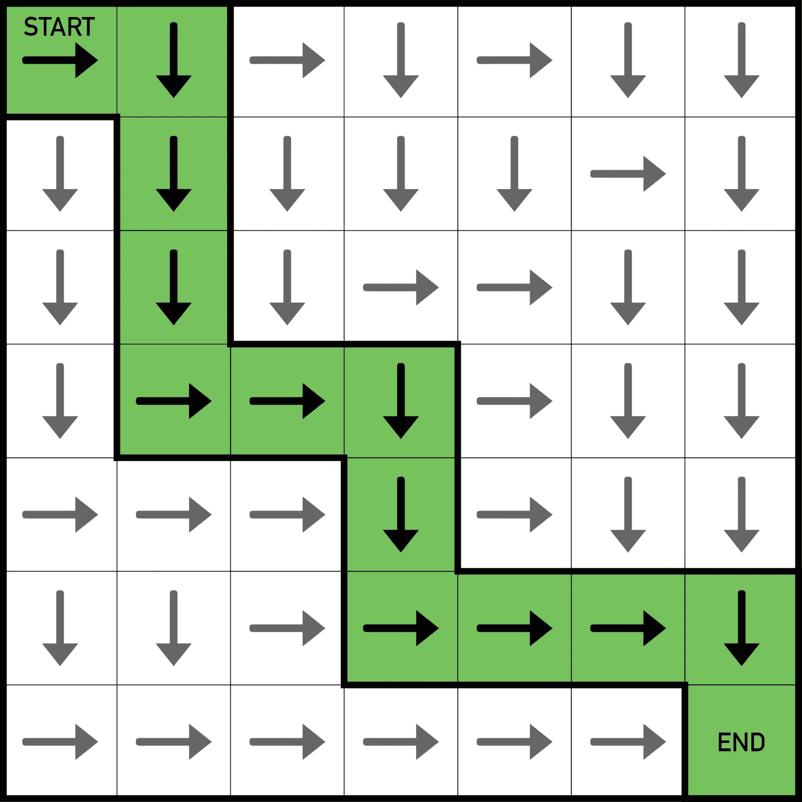
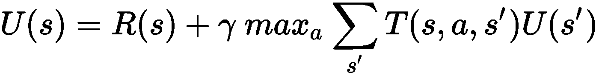
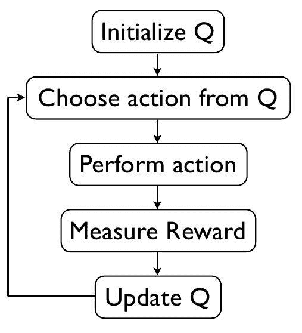
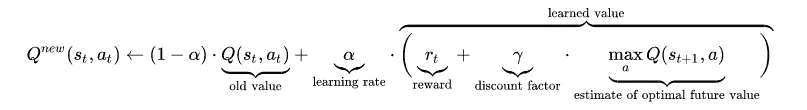
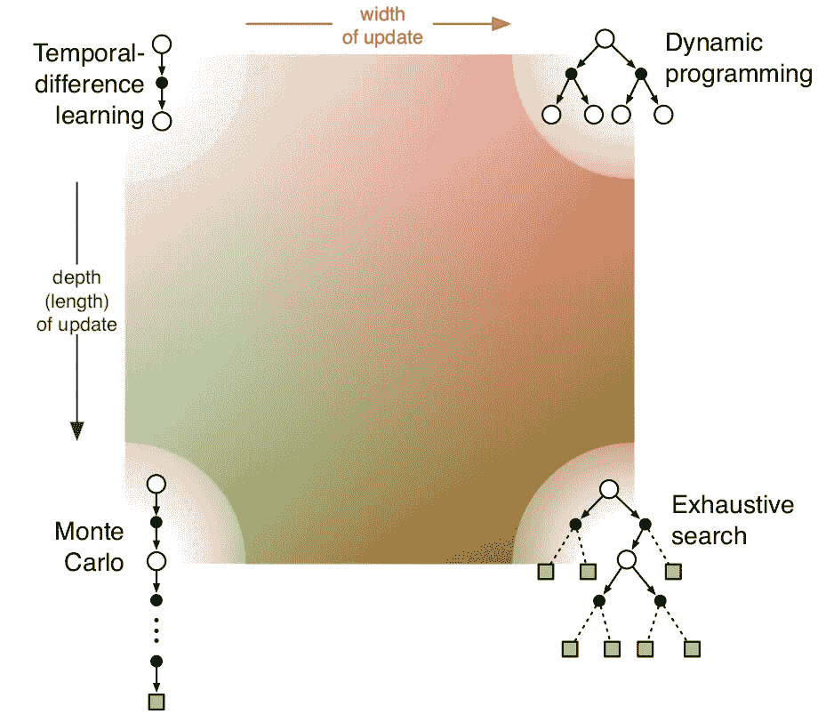

# 强化学习就是图形搜索

> 原文：<https://medium.datadriveninvestor.com/reinforcement-learning-as-heuristic-search-analogy-31d92b06dadd?source=collection_archive---------1----------------------->

正如 [CMU 七大学习原则所述，](https://www.cmu.edu/teaching/principles/learning.html)将想法与先前的知识联系起来，并拥有一个广泛的、有组织的特定领域知识的数据库，这是一个领域的专家与众不同的地方。这里的关键是要有条理，因为记忆无条理的事实信息对解决难题或学习新材料没有用处。这篇文章希望帮助你发展经典强化学习算法的专业知识，并掌握这个领域。我不会讨论所有的 RL 算法，只讨论适合我的类比的一部分，也不会给出示例代码。这篇文章是一个纯理论的观点，假设你可以在以后将伪代码翻译成实际代码。如果你有一些基本的 RL 算法的知识(TD 学习，动态编程等)，这篇文章会做得最好，虽然我会尝试从零开始。那些以前有强化学习知识的人将从这篇文章中受益最大。另一方面，读完这篇文章后，我希望你能比平时更快地吸收所有实际的强化学习算法，因为这篇文章会给你一个更大的画面和组织，你可以在那里添加新的信息。这篇文章主要归功于萨顿和巴尔托的《T2 强化学习导论》这本书，这是该领域最好的书。

大量的人工智能属于通过动作列表进行搜索的范式。这基本上意味着智能代理知道它有一组动作，然后继续寻找那一刻的最佳动作。对此有一个简单的直觉方法，那就是想一想你的生活。在每一个瞬间，你都知道你可以做某些事情，你不断地寻找能让你更快乐的事情。在这个模型中，人工智能代理本身并不发现新的动作。它不是创造性的，它只是最优的。它总是试图从它拥有的动作集合中选择最佳动作。强化学习算法本质上试图表现得像最优代理。当你计划你的生活时，有两种方法可以使用，一种是搜索一组计划，另一种是搜索一组未来状态。例如，你可以根据行动的未来走向来评估行动。一种行为可能让你成为百万富翁，而另一种行为可能让你破产。在大多数情况下，让你成为百万富翁的行动是更好的，所以一个聪明的代理人可以选择这样的行动。或者您可以评估隐含包含一组操作的计划。你可能有一个在学术上努力的计划，一个在舞蹈上努力的计划。第一个计划将引导你学习的动作，而第二个计划将引导你练习舞蹈的动作。哪个计划更好取决于你的具体情况，算法必须评估。在这个框架中，你可能已经知道，大多数强化学习算法都是通过未来状态进行搜索的。这类算法将是本文的重点。本质上，一个 RL 代理将学习哪些行为导致成为百万富翁，并且成为百万富翁是一件好事，基于它从环境中获得的回报。

在进一步讨论之前，先介绍一些基于图的算法的基础知识是很有用的。这将有助于你有一个有组织的知识集，给 RL 算法所需的上下文。我们可以将图抽象为一组节点和从一个节点到另一个节点的动作。这非常类似于马尔可夫决策过程。(我这里不是数学上的严谨)。

两个最基本的图搜索算法是[宽度优先搜索](https://en.wikipedia.org/wiki/Breadth-first_search)和[深度优先搜索](https://en.wikipedia.org/wiki/Depth-first_search)。这些名字不言自明，但我确实有一些有用的类比。广度优先搜索是每个大公司的决策方式。他们首先查看所有选项，评估所有选项的直接回报，然后对所有选项进行进一步评估，以此类推。你很少看到一家公司在每一步都没有如此广泛的计划。如果它决定增加一个新产品，你可以肯定它已经评估了至少 10 个原型。另一方面，深度优先搜索有点像初创公司的运作方式。他们只是选择一条路，沿着它走到底，只有当它失败/终止时，他们才会去寻找他们的选择。(这可能不是你的创业公司的运作方式，这只是一个类比)。本质上，只要你认为广度优先搜索是一种保守的方法，深度优先搜索是一种高风险的方法，就可以用任何对你有意义的东西来代替上面的类比。现在让我们来看看 Dijkstra 算法。 [Dijkstra](https://en.wikipedia.org/wiki/Dijkstra%27s_algorithm) 基本上是一个聪明的计划者。它不是在每一步评估每一个选项，而是只评估它知道最有可能使它达到目标的选项(这是基于它当前对状态的了解)。本质上，Dijkstra 计划者会跟随一个分支直到一个深度，直到另一个分支成为一个更有吸引力的选择。你可以认为这是一个聪明的开始。他们承担最初的风险，走上一条特定的道路，但是当他们确信另一条道路比他们正在做的更好的时候，他们就放下这根树枝，沿着那条道路走下去。万一结果不佳，他们准备让它悬着，回到原来的路径或尝试另一个分支。现在我给出了一个基本的直观解释，请在[维基百科](https://en.wikipedia.org/wiki/Dijkstra%27s_algorithm)中查看他们的伪代码，并尝试将其与对您最有帮助的类比联系起来。现在让我们在图搜索算法中为我们的代理添加直觉。这体现在 [A*算法](https://en.wikipedia.org/wiki/A*)中。 [A*算法](https://en.wikipedia.org/wiki/A*)可以被认为是一位才华横溢的 CEO 在其领域内做出的决策。他很聪明，只选择他认为能引导他达到目标的最佳选择，迅速放弃不会引导他达到目标的路径，而且他有很好的直觉。有些路一开始看起来并不好，他确信它们实际上是好的，他继续走下去并取得成功。这种 A*也称为启发式搜索。已经证明，如果启发式算法(基本上是特定领域的知识)满足某些条件，那么 A*保证给出正确的解决方案。普通 CEO 的直觉可能经常出错，但高度成功的 CEO 的直觉几乎总是正确的。在 gridworld 中有一个简单的例子

在这里，我们可以添加特定领域的知识，即朝着缩短目标距离的方向前进几乎总是更好。因此，每个块可以根据它到终点的距离赋予一个权重，A*搜索最小的总和。传统的启发式搜索需要一个人手工设计一个启发式搜索，然后将其应用到他的代码中。强化学习可以被认为是试图学习给定环境下最有效的启发式方法。如果你有一些强化学习的知识，这可能不会立即显现出来，所以请耐心听我说，稍后它将开始变得有意义。我强烈建议在继续下一步之前先浏览一下 A*算法的伪代码。在继续之前，在一张纸上写下你获得的信息作为地图/类比也是有帮助的。你当前的知识越有条理，就越容易与新材料建立联系，你学习的速度也就越快。

所以我称强化学习为试图学习最有效的启发式。看到这一点的第一个方法是通过强化学习中的动态编程算法。在此之前，我将解释一个 RL 算法试图搜索的图。RL 图的本质区别在于它们是随机的。换句话说，从一个节点跳到另一个节点是一个随机的过程，而不是确定的过程。例如，想象一个图形来模拟你抛硬币。开始状态将是无，那么有 0.5 的概率到达状态头，有 0.5 的概率到达尾部，即使您使用完全相同的动作(抛硬币)到达任一状态。本质上，一个动作可以导致由概率定义的许多其他状态。现在，动态规划算法可以被认为完全像 A*搜索，它试图学习适当的启发式函数。看看贝尔曼方程:

这里的 R(s)是选择该行动的直接回报。本质上，贝尔曼最优方程说要选择最大化 R(s) +(一些启发)的行动。这里的启发是在选择你的行动(a)时你的未来状态的值，它也被称为价值函数，用 v 表示。本质上，启发随着你所处的每个状态和行动而变化。这样，RL 算法实质上可以模拟 A*算法中存在的大多数任意启发式函数。那么它是如何学习这种启发式的？我会告诉你许多方法中的一种，我告诉你的是大多数 RL 算法的通用方法，所以我认为最好是广义地理解 RL。一种方法是尝试一些随机的启发值，然后通过将你的实际启发值移向引导你达到目标的启发值，而远离引导你远离目标的启发值，来反复改进它。对于那些知道 RL 的人来说，这是[值迭代](https://www.cs.cmu.edu/afs/cs/project/jair/pub/volume4/kaelbling96a-html/node19.html)，其中你从某个随机值开始，然后继续向你的目标前进，直到你任意接近你停止的那个点。上面的方法也意味着你的 RL 代理在学习一个有用的启发式算法之前必须经历多次失败和成功。这基本上就是高度成功的首席执行官在形成强烈的直觉之前经历了许多失败的原因。RL 算法也通过选择随机试探法，必须足够频繁地达到它的目标，以便它学习任何有用的东西。从数学上来说，这意味着图必须是有限的，这样它才是完全可搜索的，而且你可以肯定 RL 算法会多次偶然发现它的目标。当图是无限的时候，我们有许多其他的解决方案和问题，这些都建立在我在这里提到的概念之上。在这篇文章中，我不会深入探讨这些问题。

现在我们可以问，我们需要通过多次失败来学习我们的启发法吗？例如，我们为什么不遍历所有可能的路径和可能性，直到终止，然后基于这种彻底的搜索来设计我们的启发式算法。这种方法叫做穷举搜索，我们并不感兴趣，因为在大多数情况下它是不切实际的。不可能搜索每一条路径直到它的终止深度来确定它的启发性。相反，像广度优先搜索那样只向前搜索一步，然后假设一个启发式算法，并根据我们的结果稍微修改我们的启发式算法，这样计算效率要高得多。这基本上就是随着时间的推移增量学习启发式和一次完美学习启发式的区别。当你学习一门课程时，每天增量学习和考试前一天死记硬背哪个更好？至此，我希望我对强化学习的动态编程给出了一个很好的直觉，并让你相信它本质上是试图学习一个任意的启发式函数。如果你以前从未经历过 RL，最好现在就经历一下[值迭代算法](https://www.cs.cmu.edu/afs/cs/project/jair/pub/volume4/kaelbling96a-html/node19.html)，这样你就可以理解我在这种方法中忽略的细节。

在动态编程中，我们搜索特定状态下的所有动作，同时学习每种动作的启发式函数。这被称为同步动态编程。它是当你一次学习所有动作、每个状态的所有启发式函数。本质上，我们为每个动作的启发式算法赋予一些随机值，然后我们一次将所有这些启发式算法移向它们的最优值。它可以被认为是基于批处理的更新。我发现把启发式算法想象成给每个状态动作对给出一个确定值 V 的函数是很有帮助的。然后同步动态规划，将我们当前的启发式函数逼近最优启发式函数。本质上，当整个函数被移动时，在一个特定的 V 被再次更新之前，a(状态，动作)的每个 V 被更新。这有点像一只鸟先给它的每一个孩子一条虫子，然后再给一个孩子第二条虫子。但是我们不需要这样做。当我们不这么做的时候，就叫做异步动态编程。在异步动态编程中，我们可以更新一个特定的 V，直到它近似匹配它的实际值，而不更新任何其他的 V。本质上，我们的近似只适用于单个(状态、动作)对。你可以看到这是如何更好，类似于 Djikstra 如何更好。只更新对实现目标真正重要的 V。对于一条不会通向任何地方的路，你不需要最优启发式。在选择首先更新哪个 V(状态，动作)时，有许多策略，我鼓励你稍后阅读。

在动态编程中，你可以访问图形。你知道这个行动会导致这个或这些状态，你会得到这个奖励。但是你真的不需要知道你的行为会导致什么状态。记住你的启发只取决于你当前的(状态，动作)对。一个有良好直觉的 CEO 知道某个行动是好的，但并不知道它会把他引向何方。例如，想想那些利用网络繁荣的人。我敢肯定，他们不知道选择建立一个网站会把他们引向何方，但他们可能有一种直觉，引导他们评估这是最适合他们的行动。因此，当我们不向我们的代理提供模型时，我们需要无模型算法。老实说，它们实现起来非常简单和直观。由于他们无法接触到模型，他们实际上是在尝试一个动作，并记录他们得到的奖励。基于这个奖励，他们可以开始学习这个(状态，动作)对的启发法。(在 Q 学习中，它实际上只是试图学习它从这个案例中获得的平均回报)。本质上，现在他们不需要搜索所有可能的操作，他们可以只选择 1，这就像你在减少搜索的宽度。这就是以前我们所说的时间差异学习。我特别要说的是 TD 算法的一个变种，叫做 [Q 学习](https://en.wikipedia.org/wiki/Q-learning)。在 Q 学习中，我们可以随机选择任何行动(因为没有模型，搜索行动空间就没有任何意义)，然后根据我们得到的回报，我们开始学习我们的启发式函数。最后，在访问每个(状态，动作)对足够的次数之后，我们可能已经学会了我们的启发法，并且我们可以基于对于(状态，动作)对具有最高值(启发值)V 的一个来选择我们的动作。q 学习是最流行的强化学习算法之一。

正如你在上面看到的，我们并没有搜索所有的动作，我们只是选择了所有的动作并更新了我们的启发式函数。在上面的流程图中，我们“从 Q 中选择行动”意味着我们正在根据当前的启发选择最佳行动，但我们不必这样做。事实上，不这样做是明智的，这样才不会因为最初的预测启发性较低而错过某些操作。通常在实现中，我们随机选择每个动作，直到我们确信它已经学习了 Q 函数。(在 RL 文献中，Q 函数通常用于表示启发法，我使用 V 是因为它对应于值)。推动启发式算法每一步的更新是:

现在，如果不只是测量当前的奖励和更新启发，如果我们跟踪行动到它的深度，然后根据我们得到的净奖励更新启发，会怎么样？这有点类似于我们之前讨论的穷举搜索，只是我们只进行深度搜索。我们正试图一次塞进一个特定的话题。这非常类似于深度优先搜索。这样做的普遍问题是效率低，因为它要求你跟随你的行动直到最后才能学到任何东西。对于 Q 学习和深度优先搜索的一个简单直觉是，让我们假设你是玩生命游戏的代理人。在经历过几次之后，你知道成为百万富翁是很棒的，所以现在如果一些行动让你成为百万富翁，你知道这些行动是好的。但是在这种深度优先的方法中，你会一直坚持到你死，直到你知道这个行为是好的。事实上，你知道百万富翁是好的前几轮并不重要。这些深度方法被称为蒙特卡罗学习。现在总结一下，我将使用萨顿和巴尔托的图表:

This sums up Classical RL.

希望现在有了这个更大图景的想法，你可以继续自己处理这些算法。希望这篇帖子能加快你的学习。如果你想学好 RL，我怎么推荐萨顿和巴尔托都不为过。

我将以此结束这篇文章，快乐学习！(将会有更多关于 RL 细节的帖子)

# DDI 特色数据科学课程:

*   [**用于数据科学的 Python**](http://go.datadriveninvestor.com/intro-python/mb)
*   [**深度学习**](http://go.datadriveninvestor.com/deeplearningpython/mb)
*   [**数据可视化**](http://go.datadriveninvestor.com/datavisualization/mb)

**DDI 可能会从这些链接中收取会员佣金。我们感谢你一直以来的支持。*