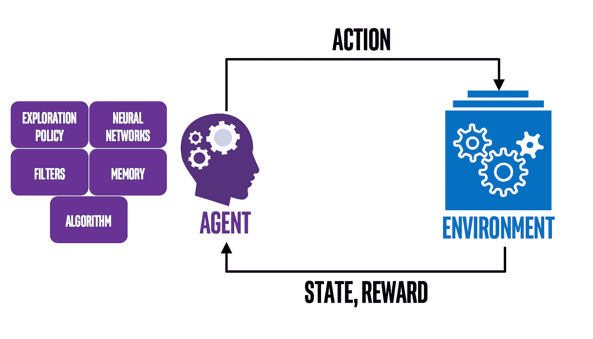

# 假期旅行和计划的强化学习

> 原文：<https://medium.datadriveninvestor.com/reinforcement-learning-for-vacation-travel-and-planning-234408335e76?source=collection_archive---------4----------------------->

Valley of the Ten Peaks, Lake Louise, Alberta ([http://mountainsoftravelphotos.com](http://mountainsoftravelphotos.com/index.htm))

想象一下，只需按下一个按钮，你就能计划一个你可能拥有的最好的假期？按下一个按钮，所有的细节，如航班，住宿，一日游和吃饭的地方都会为你预订。你所需要做的就是付钱然后出现。当然，这种乌托邦式的度假愿景可能并不适合所有人，但请记住，这种特殊的度假计划是专为你设计的。这意味着所有那些你拥有或喜欢的怪癖，我们都有，都会被考虑进去。更重要的是，这个按钮不仅可以计划个人度假，也可以为团体或家庭度假。考虑到所有个人的综合需求，规划最佳的集体度假。虽然这一切在 10 年前可能需要一群度假规划者，但由于最近人工智能技术的爆炸，我们称之为强化学习的机器学习可能很快就会在一台计算机上完成。

Reinforcement Learning ( [https://nervanasystems.github.io/coach/](https://nervanasystems.github.io/coach/))

# 时间信用分配问题

强化学习是一类解决时间信用分配问题的机器学习算法。这本质上是我们都面临的问题，这就是我们需要加班加点做出什么样的选择才能给我们最好的回报(幸福)。随着时间的推移，我们都知道，我们白天所做的选择最终会影响我们的幸福。这与强化学习的工作原理没有什么不同。

 [## DDI 编辑推荐:5 本让你从新手变成专家的机器学习书籍|数据驱动…

### 机器学习行业的蓬勃发展重新引起了人们对人工智能的兴趣

www.datadriveninvestor.com](https://www.datadriveninvestor.com/2019/03/03/editors-pick-5-machine-learning-books/) 

在 RL 中，我们训练一个代理去探索一个环境，以学习如何最大化它的回报。代理只有在做出正确的选择或行动后才会得到奖励。将这一点放在我们的旅行问题的背景下，我们将培训一名代理，让他以你和/或你的团队的身份进行虚拟旅行。比较所有这些旅行的结果，并决定哪个假期提供了最好的回报。

A button ( [https://www.springwise.com/big-button-programmed/](https://www.springwise.com/big-button-programmed/))

# 按钮在哪里？

虽然这一切听起来像科幻小说，但它不是。现在已经存在能够解决这些问题的强化学习算法。但是，它确实需要度假区有更多的数据和自动化平台(大数据捕获)。当然，大数据现在无处不在，那些传统上缓慢赶上度假区的人现在正在拥抱技术。单按钮概念可能还需要一些时间，但在不久的将来，我们可能会有更多或更好的基于 RL 的度假选项推荐。当然，基于深度学习系统的某种组合，还会有其他推荐选项。但是这些真的比得上知道你或你的家人实际上已经去过所有那些目的地并且旅行社为你确定了最好的吗？是啊，想象一下…