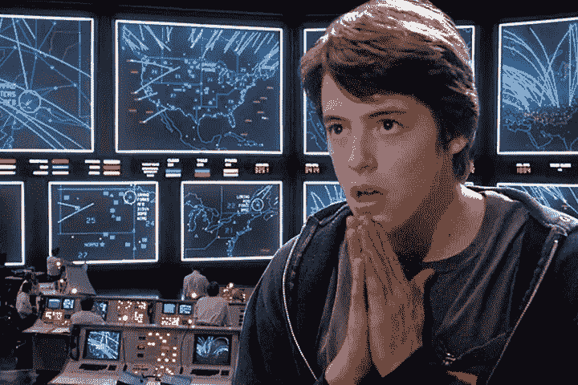
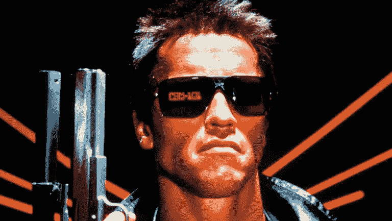
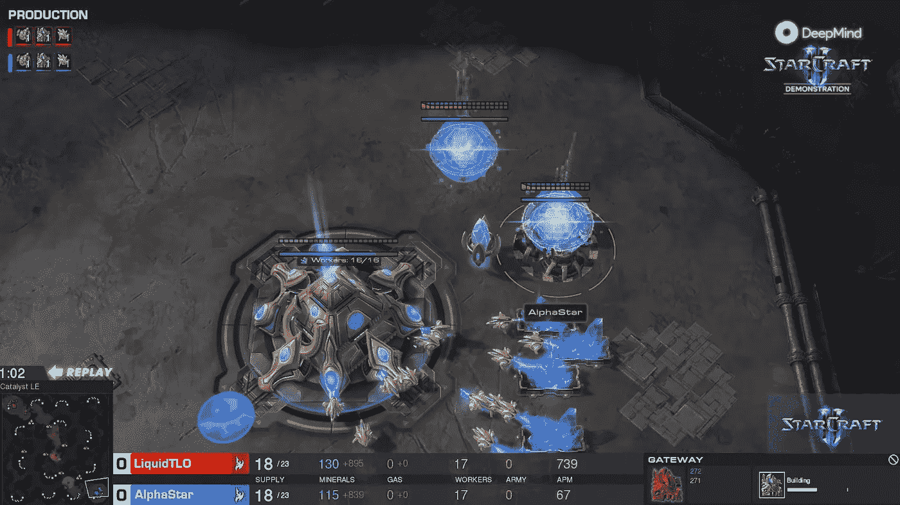
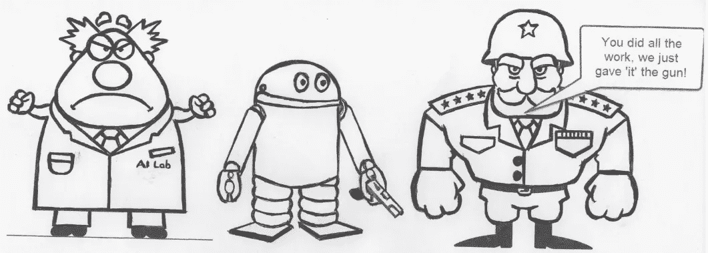

# 战争游戏中的强化学习

> 原文：<https://medium.datadriveninvestor.com/reinforcement-learning-for-war-games-5ea51c7207ec?source=collection_archive---------1----------------------->

War Games (1983)

1983 年 6 月，电影《战争游戏》上映，它吓得世界相信核世界末日的可能性是可能的，并且可以想象是由一个错误的人工智能带来的。虽然这部电影大多是虚构的，人工智能描绘的至少比它本身超前 50 年，但它对流行文化、技术和全球政治产生了直接影响。这是第一部在某种程度上逼真地描绘计算机和黑客的电影。年轻的马修·布罗德里克的角色需要几天甚至几周的时间才能黑进程序员的后门。虽然这部电影的流行让布罗德里克一举成名，但它也被归因于冷战的结束和提供了一个完整的技术时代。其中包括人工智能本身。

Ronald Regan at Berlin Wall, June 12, 1987 — “Tear down this wall” speech

1983 年 6 月，罗纳德·里根总统与作者的家人成为朋友，得以在戴维营观看这部电影的私人放映。据说，里根对这部电影如此着迷，以至于在下一次核谈判会谈中，他停止了会谈，讨论潜在的威胁。

 [## 人工智能和虚拟现实的融合-您能期待什么|数据驱动型投资者

### 在技术世界里，融合是合乎逻辑的一步。就在几十年前，您还需要一个专门的…

www.datadriveninvestor.com](https://www.datadriveninvestor.com/2018/08/30/the-convergence-of-ai-rv-what-you-can-expect/) 

由此产生了一个关于网络安全的完整指令，与苏联的新的通信渠道，以及一个明白技术明显好处的总统。里根还负责 80 年代早期的战略防御计划或“星球大战”计划。由此诞生了全球定位系统网络，它已经成为所有交通技术的主要驱动力。总统后来将部分原因归结于电影《战争游戏》是推动他改变的催化剂。

# 存在威胁

回到 80 年代，人们很清楚电影中的人工智能完全是虚构的。然而，不到几年后，一部名为《终结者》的电影将会上映，这部电影讲述了一个相似但更具不祥预感的故事。在《终结者》中，一个名为天网的人工智能网络已经控制了所有的机器，并试图将人类从这个星球上抹去。虽然这个故事是虚构的，但许多人，我确实是指许多人，认为这是一个真实的可能性。以至于他们把人工智能贴上了人类生存威胁的标签。甚至承诺永远不会在任何有军事应用的人工智能应用上工作。来自谷歌、微软、IBM 等公司的人工智能研究人员拒绝从事军事合同工作。让这些大公司以任何方式拒绝军事合同或交战。

AlphaStar (Google, DeepMind) Playing StarCraft II

# 大赦国际人道组织

相反，像谷歌这样的公司正在追求他们认为是对人性的提升。你知道，比如自动驾驶汽车和其他自动化设备和代理。这一愿景的很大一部分是强化学习。RL 目前被认为是下一个大的人工智能/自动化工具，这是有充分理由的。使用 RL 的代理已经演示了比人类更好地玩国际象棋、围棋、经典 Atari 游戏和现在的星际争霸。除此之外,《星际争霸》是一款模仿经典纸笔游戏的战争游戏，这些游戏本身就是为了模拟真实的军事战斗。事实上，仅仅通过开发一个 RL 代理来玩一个战争游戏，研究人员事实上不是在构建或者至少证明一个军事应用吗？请记住，这是同一批发誓绝不从事军事项目的研究人员。除了，这真的重要吗？毕竟，自动驾驶汽车目前比训练来玩星际争霸的 RL 代理更有可能被武器化。

# 真正的生存威胁？

在电影和许多其他电影中，因为真正的威胁总是在人工智能获得意识并决定做出自己的决定时。虽然这种高级人工智能可能还需要几年时间，但我们很快意识到，人工智能的真正威胁是我们自己潜在的滥用。在这个充斥着错误信息和假新闻的日子里，对先进人工智能的潜在滥用可能导致潜在的全球战争，甚至只是一两个股票市场的崩溃，这被认为是一个真实有效的威胁。那么答案是什么，停止所有的人工智能研究？这不太可能发生，也不应该发生，但同时埋头说你不从事任何军事应用显然也没有用。毕竟，AlphaStar 的 DeepMind 确实清楚地证明了使用 RL 的人工智能比人类更有能力控制战术战场。人们不禁会想，某个地方的某个将军也没有引起人们的注意。