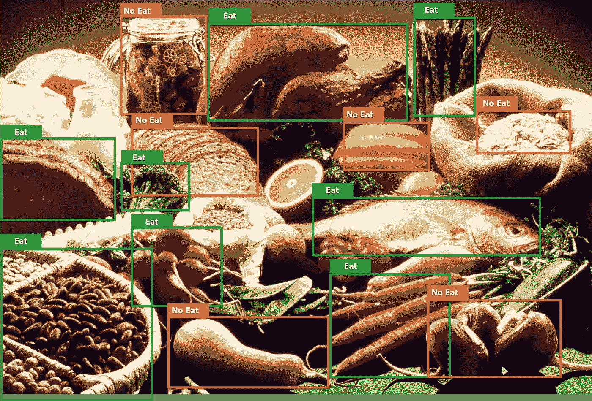
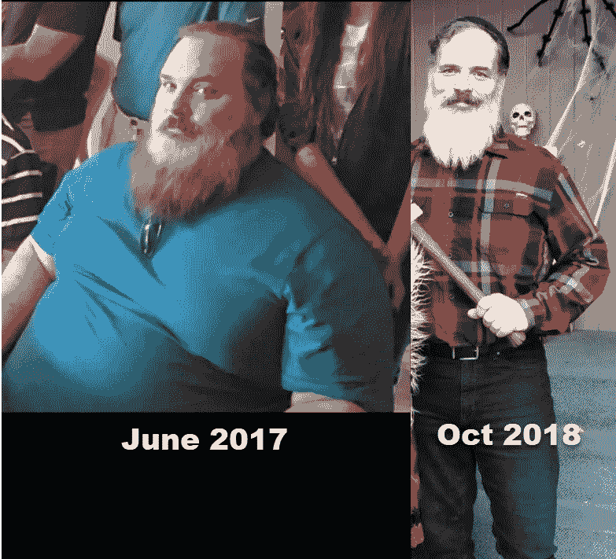
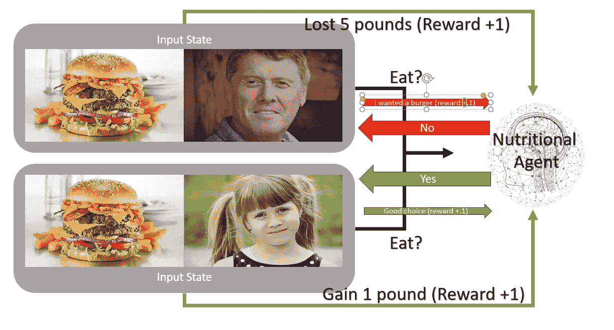

# 减肥和营养强化学习

> 原文：<https://medium.datadriveninvestor.com/reinforcement-learning-for-weight-loss-and-nutrition-c37bb906924a?source=collection_archive---------1----------------------->

想象一下上面的图片来自一个可以告诉你哪些食物该吃或不该吃的应用程序。该应用程序将学习你需要吃哪些食物来保持健康，并保持或减肥。如果你再次仔细观察上面的图像，你可能会注意到它为酮饮食的人选择了食物，尽管它确实选择了一些根类蔬菜。酮饮食碳水化合物含量很低，脂肪和蛋白质含量很高，胡萝卜等块根类蔬菜碳水化合物含量过高。除此之外，酮饮食书籍没有告诉你的是，这种形式的极端节食可能是相当危险的，不是你可以或想全职生活的事情。想象一下，假装应用程序使用强化学习(一种先进的人工智能技术)开发了一种减肥监护人代理，它可以跟踪你的饮食习惯，并让你知道当天你可以或不可以吃哪些食物。

一些背景知识，以及我为什么对这个领域感兴趣。几年前，当我接近 50 岁时，我决定重温我的青春，并为健美比赛而训练。在这个愚蠢的过程中，我的背部严重受伤，并在接下来的几年里忍受着严重的慢性疼痛。这次受伤对我的精神和身体都造成了伤害。没过多久，我就达到了将近 400 磅(181 公斤或 28 英石)，这只会让事情变得更糟。最后，我使用了一些非传统药物(医生处方)得到了一些缓解，并开始使用生酮饮食减肥(约 60 磅)。认为 Keto 但更糟。除此之外，我没有摄入正确的食物，我的钾含量不足导致我的心脏出现房颤，最后我住进了医院。我的心脏可能停止跳动了很短一段时间。

 [## 2019 年深度学习的终极学习路径及更多...-数据驱动型投资者

### 又一个美好的一周，一些好的教育内容将会到来。我最喜欢的&最受欢迎的帖子之一…

www.datadriveninvestor.com](https://www.datadriveninvestor.com/2019/01/07/the-ultimate-learning-path-for-deep-learning-in-2019-more/) 

正是在医院里，我知道了酮饮食的危害。事实上，直到我吃了一些碳水化合物，医生才会让我出院。我后来发现，由于我新的心脏状况，我不能安全地维持酮饮食。我的生活支离破碎，我想我肯定会回到 400 岁以上。希望我下一次出门不需要一队钢琴搬运工。除了我通过各种尝试和错误发现了一种平衡蛋白质和碳水化合物的方法。我用这个方法又减掉了 105 磅，而且还在继续。

老实说，我的饮食仍然很有条理，并承认酮饮食确实帮助我学会了更好的方法来管理碳水化合物的摄入。我几乎每天都吃同样的食物，我经常发现自己渴望不同的东西。除此之外，当我决定尝试将不同的食物融入我的饮食时，这就变成了一个数学练习。我总是试图平衡我每天的碳水化合物，这样我就可以保持平衡的饮食，保持体重。这是我想出的减肥或代理营养师的主意，他们可以通过推荐你能吃或不能吃的食物来帮助你。代理学习你的饮食习惯和什么习惯对你是健康的，现在将知道你何时和是否可以偏离你的正常选择的食物。也许甚至允许你偶尔偷吃一顿饭或食物。如果你偏离了轨道，代理总是在那里，没有判断，推荐你需要的食物，以保持你的减肥目标。这种营养剂的概念也可以扩展到其他个人应用程序，从训练(行走、跑步)到扩展学习。

# 技术

强化学习是机器学习的一个分支，其特点是基于自我学习奖励的过程，让代理探索自己的环境并从这些经验中学习。这是一个学习的过程，就像训练一只狗为了得到奖励而吠叫或者去拿一根棍子。这个基本过程有许多变化，其中一些包括模仿和多主体迁移学习。这些后来的技术将很好地用于构建一个有效的饮食代理。代理可以同时从多个用户那里学习，比如所有的用户都给它食物和他们自己的图像。下面是代理输入和流程的一个示例:

在上面的例子中，营养强化学习代理将拍摄与消费者配对的食物的照片作为输入。代理人的游戏是建议消费者是否应该吃这种食物。在使用该应用程序一个小时后，消费者会告知代理它做出了好或坏的选择。当然，消费者可能会对选择不满，可能不会给出最好的反馈。这没什么，因为这只是一个小奖励，只是一种鼓励我们的代理人想吃东西并做出决定的方式。然后一周后，双方消费者根据他们的营养目标，进入一个长期的、更大的奖励。也许他们体重增加或减少了。这些长期奖励对未来的营养决策有更大的影响，并能做出艰难的选择。

# 该项目

如果这一切听起来像科幻小说，它不是。深度强化学习的力量将允许我们构建一个完全按照我描述的方式工作的应用程序。然而，为了提高效率，营养学家需要接触大量展示食物和消费者的图片。此外，这些消费者需要勤奋，并坚持使用该应用程序，基本上是在每一餐。同样，这款应用也需要广泛的用户基础。一群有不同体重或营养目标的用户。考虑到所有这些，以及我议程上的许多其他事情，我认为最好只是把这个想法放在那里。毕竟，几乎每天都有人问我，刚接触 ML 或 RL 的人可以做什么项目来改变现状。好吧，这里有一个想法可以帮助许多努力保持健康体重的人。

如果你需要我的帮助，请随时通过 LinkedIn 联系我，或者给我一份免费的营养师应用程序。感谢阅读。