# 强化学习基础

> 原文：<https://medium.datadriveninvestor.com/reinforcement-learning-fundamentals-469a91e40fce?source=collection_archive---------6----------------------->

故事内容:

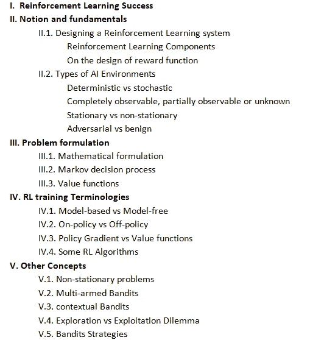

深度学习爱好者在处理他脑海中重叠的许多概念时可能会遇到一些模糊性，而没有理解它们的具体用例，并分离多个强化学习问题。

这篇文章旨在减轻强化学习的模糊性，并在不引入大量数学细节的情况下给出一个完整的概述。

这也是理解 RL 背后的直觉的指南，并有助于将现实世界的问题形式化为强化学习模型。

**一、强化学习成功:**

强化学习是一个 ML 概念，它学习代理在给定的情况下自动选择最佳决策，通过试错法随着时间的推移进行改进，以实现最大的长期回报。

特别是，它在自动游戏方面取得了显著的成功；AlphaGo 是一种深度强化学习算法，能够击败人类围棋世界冠军。

Alpha Zero 在 24 小时内就在国际象棋和日本象棋以及围棋比赛中达到了超人的水平。

它通过基于手工规则的国际象棋游戏取得优势，跳过监督学习步骤，通过与自己对弈来学习下棋，完全从随机游戏开始。

它用于自然语言处理，以执行翻译和摘要任务(结合预训练的监督学习)，在机器人学中，机器人学习在其传感器和摄像头的输入下进行控制，自动驾驶汽车也是强化学习最突出的挑战之一。

它被部署来近似优化问题；它是替代依赖于穷举搜索并可能陷入局部极小值的组合优化算法的合适候选算法。

或者，RL 可以帮助将搜索引向给定问题输入的最优解的方向，并在几个步骤中找到它。

类似地，它是替代和提高一些监督学习任务(分类、翻译、摘要)的性能的候选者

**二世。观念和基础:**

这一部分旨在定义与强化学习相关的基本关键概念，如组件及其相关属性以及特定情况下的一些数学形式。

典型地，强化学习设置有两个组件:代理和环境。

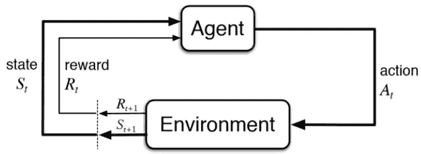

一个智能体从他的外部世界(环境)获取信息信号，并试图选择最佳行动以实现特定目标或最大化收益。

如果在称为瞬时 ***状态*** St 的时刻 t，关于环境的特定信息是可用的(或可从代理侧测量的)，则代理在时刻 t 传递 ***动作*** ，并且环境以特定反馈进行响应，该反馈包括下一状态和关于给定状态的所执行动作的回报。

**二。1.设计强化学习系统**

**二。1.1.强化学习组件**

在设计一个 RL 系统时，必须首先定义环境的类型(在下一部分解释)、主体类型(在后面解释)、状态集、行为以及奖励功能。

**S** 这组状态指的是特定的信息(在 Atari 游戏中:像素，在机器人技术中:从不同传感器(如摄像机、温度等)收集的信号可以转换成更相关的信息，如障碍物、位置、速度……在国际象棋中，棋盘上棋子的排列)。以一种简化的方式，它等同于监督学习中的输入特征，唯一的区别是状态在这里通常是时变的。[在实际系统中，我们可以有固定状态的子集(表征系统的不变值)以及时变状态的子集]

**答**:动作集合定义了可能要执行的动作(在 Atari 中可能是玩家的动作:上移、下移、后移、前移、跳起等)。

动作和状态可以取离散值或连续值。

奖励集合 R 指的是可能的奖励

在奖励(让一个机器人尝试目标位置)中，奖励在游戏过程中根据我们称之为奖励函数的规则进行分配。

**二。1.2.关于奖励函数的设计:**

在机器人方面，如果机器人避开了障碍物但没有接近目标，我们可以给它 1 分奖励，如果它避开了障碍物并接近了目标，我们可以给它 10 分奖励，如果它碰到了障碍物，我们可以给它-10 分奖励。

这种转换规则将有助于代理人找到到达目标位置的最佳路径，而不会因奖励理想行为和惩罚不理想行为而遇到障碍。

在这种情况下，即时奖励将取决于当前和以前的行动，因为如果代理接近目标，我们将给予奖励(比较以前和当前状态下与目标的距离)

我们可以想象另一个奖励函数，其中我们用-10 惩罚障碍冲突，用 10 奖励发现目标，并认为正常移动是中性的(奖励= 0)。因此，奖励将只取决于行动和当前状态。

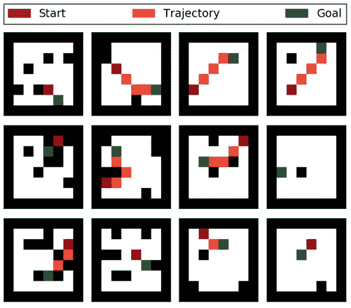

在一些问题中，代理人的目标是强制性的(例如在机器人学中，我们可以训练代理人如何达到特定的目标)，而在其他一些问题中，代理人的目标是可选的(在 RecSys 中，代理人的目标是在没有特定目标的情况下最大化他的报酬)。

**二、2 .环境类型:**

设计强化学习模型的一个关键步骤是通过识别环境是确定性的还是随机的**、**对抗性的还是 Begenin **、**来识别环境的性质，代理可以观察到的信息是什么，回报是否取决于代理或环境的历史。

**1。** **确定性和随机性**:如果环境的下一个状态完全由代理的当前状态和动作决定，那么环境就是确定性的，因此，我们可以定义转换规则；否则它是不确定的。

它也可以是半确定性的，其中代理可以影响环境的一部分。

**2。** **完全可观察、部分可观察或未知:**

在一些问题中，环境的状态是完全可以观察到的(国际象棋:我们可以观察所有的棋步，蛇的游戏)。

部分可观察的:可用的状态没有完全定义环境的行为(在拉米纸牌戏中:已经打出的牌是已知的，而正在进行的牌是不可观察的)

未知:用户与发布的广告的交互。

Ps:如果一个环境是确定性的= >可观测的(因为 P(st+1 | at，st))是已知的，直观上 s(t)应该是已知的)

这意味着，如果一个环境是不可观测的或部分可观测的，则必然是不确定的(行动不会改变环境状态)

倒数不成立；我们可以有一个可观察的环境，但不是确定性的(棋盘是可观察的，但代理人的行动不能预见不利的行为)

**3。** **静止，非静止:**

如果一个环境的当前状态和报酬只取决于它的短期变化，那么它就被认为是稳定的；如果一个环境的状态可能受到它的历史变化的影响，那么它就是不稳定的。

**4。** **对抗性 vs 良性:**

在良性环境中，环境没有要实现的目标(天气是良性环境),无论它负面地还是正面地影响代理人报酬，而不利环境的特征是不利的代理人，他将反对试图最大化他的报酬而最小化玩家代理人。(例如:围棋|象棋等竞技游戏)。

为了优化特定的结果，环境与人工智能代理相互对抗。围棋或国际象棋等游戏是竞争性人工智能环境的例子

PS:逆境环境是随机的。

**三。问题表述**

这里，我们考虑状态对代理可用的情况。

设{(s0，a0，r0)，(s1，a1，r1)，(s2，a2，r2)，…，(st，at，rt)，…，(sTmax，aTmax，rTmax) }为每个时间步的元组(s，r，a)序列:这个序列称为情节或轨迹。

我们将代理人的回报定义为从 t 时刻开始的长期累积回报。

Tmax 是指剧集的最大长度(Tmax 可以是无穷大)

通常，策略π是从状态到动作概率分布的映射:

π : S →p(A = a|S)。

强化学习的目的是建立一个能够在给定情况下选择最佳行动的代理，目标是最大化长期回报:

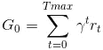

从数学上来说，找到一个策略π*，它能实现所有状态的最大预期回报:

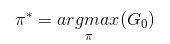

π*称为最优策略。

γ是[0，1]中的贴现因子，引入它是为了惩罚没有提供直接收益的未来奖励。(例如，我们更喜欢用 20 步而不是 100 步到达机器人的目标)

另外；保证了无限集情况下返回值的收敛性。

三. 2\. MDP

考虑一个静止的、可观察的环境；我们通常用二阶马尔可夫决策过程来描述这种类型，而当前状态只依赖于先前的状态-动作对。

转移函数 P 记录在采取行动 a 后从状态 s 转移到 s’的概率，同时获得奖励 r:

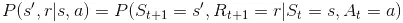

给定这个概率，我们可以完全定义有限的 MDP 特征，因为我们可以推导出一个概率的函数表达式。

将时间 t 处状态动作对映射到时间 t + 1 处的状态分布的状态转移概率被定义为:

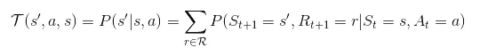

作为双参数函数的状态-行动对的预期回报 r:

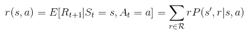

状态—行动—下一个状态三元组的期望回报是一个树型自变量函数 r:

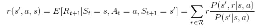

**三、3 .价值函数:**

我们将状态值函数 V 定义为采用策略π从状态 s 开始时的期望收益:

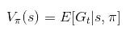

根据定义，最优策略是使预期收益最大化的策略。因此，找到最优 p 指的是找到最优 V:

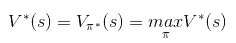

类似地，我们定义状态-动作值或质量函数 Q(s，a ),其被定义为从给定状态开始并在策略π下执行动作 a 的期望回报。

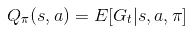

对于每个状态，我们贪婪地更新动作以找到:

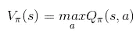

此外，我们还有:

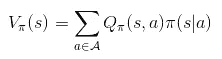

最后，我们将状态-动作对的优势函数定义为质量-值和状态-值之差。

Aπ(s，a)=Qπ(s，a)-vπ(s)

**四世。培训术语:**

培训术语可以根据几个标准进行分类，这些标准将在下一部分重点介绍。

**四. 1 .基于模型与无模型**

基于模型的算法依赖于对每个元组(s '，a，s)的转移概率 P(s'|s，a)的值的经验估计，因为它可以完全定义马尔可夫过程，从而能够求解方程以找到最佳行为。

存储所有这些值，尤其是当一组动作和状态增加时，变得内存不足，甚至不切实际。

或者，通常采用的是无模型算法，该算法使用试错法从学习片段中更新其值。

**四. 2 .政策内与政策外**

它是关于指定更新规则的动态性。

使用由当前策略生成的样本的策略学习值。

同时，非策略通过贪婪地搜索给定的状态来探索环境，即最大化结果的行动(探索将在文章的下一部分进一步解释)

**四、3 .政策梯度与价值函数算法:**

我们可以将 RL 算法分为两大类:基于值的算法，旨在通过寻找最优值函数来寻找最优策略。

当状态和动作的数量有限时，它们可以很好地工作，但是当状态或动作空间连续时，它们就变得不够了。

因此，一些基于值的算法特别是深度 Q 学习算法试图在引入网络参数θ的同时用神经网络来逼近 Q 值。

这些方法(近似值函数)的主要缺点是缺乏通用性。换句话说；对于看不见的状态，这种方法不太适用。

因此，基于策略方法的目的在于通过引入可训练参数π(a | s；θ)并使用关于损失最小化标准的策略梯度来更新θ参数。

**演员评论家**是结合政策梯度和价值函数逼近的 RL 变体；

价值函数估计的引入显示了它们稳定策略熵估计的能力，这使得大多数策略梯度算法使用这个概念。

因此，在一些研究论文中，它被认为是政策梯度类的一个子变量。

Critic:更新值函数参数 w，根据算法，它可以是动作值 Q(a | s；w)或状态值 V(s；w)或优势 A(s；w)

Actor:按照评论家建议的方向更新策略参数θ，π(a | s；θ).

由于基于价值的解决方案更稳定，Actor critic 添加了一个价值估计，以便稳定策略近似值。

**深度强化学习:**

如前所述，由于神经网络逼近连续函数的能力，我们使用深度架构来逼近策略π和值函数。
此外，使用神经架构能够使架构适应输入性质(例如，CNN 减少原始图像的大小，递归模型利用数据(感知)的顺序性)。
在实践中，在设计奖励函数时，我们保持数据的显式形式(例如:目标在网格上的位置、障碍物的位置等)，而；近似策略或价值函数的输入可以被编码(例如:用 CNN 编码状态(当前视觉图像))

**四、4 .强化学习算法:**

直观的强化学习算法是动态规划，它是基于模型的算法，包括通过一系列策略评估和贪婪改进(策略改进)来解决 MDP

蒙特卡罗和时间微分法；

蒙特卡罗方法包括从状态 s(首次访问)开始根据经验估计预期收益，即(经验 V(s))

预期回报的估算在事件结束后进行

时间差也类似于 MC，唯一的区别是它从经验中学习，并且更新函数值只需要立即的回报。

这里提供了数学描述:

[https://lilian Weng . github . io/lil-log/2018/02/19/a-long-peek-into-reinforcement-learning . html](https://lilianweng.github.io/lil-log/2018/02/19/a-long-peek-into-reinforcement-learning.html)

[https://lilian Weng . github . io/lil-log/2018/04/08/Policy-gradient-Algorithms . html](https://lilianweng.github.io/lil-log/2018/04/08/policy-gradient-algorithms.html)(基于策略的算法)

[http://incompleteideas.net/book/bookdraft2017nov5.pdf](http://incompleteideas.net/book/bookdraft2017nov5.pdf)

实际上有两种 TD 控制算法(Q-Learning:非策略 TD 控制和 SARSA:策略 TD 控制)

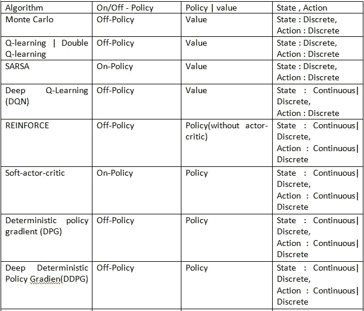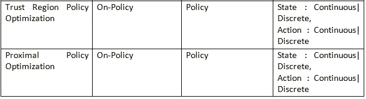

**五、其他概念:**

**五、1 .非平稳问题:**

在 MDP 一阶中，我们假设下一个状态旁边的奖励函数所获得的奖励可能只取决于前一个状态。

然而，在一些现实世界的问题中，这种假设可能会由于历史行为信息的丢失而导致性能下降。

或者，为了建立长期非平稳模型，我们训练一个有记忆的代理，它考虑了 n 个先前的状态。

如果报酬函数得到的报酬依赖于历史，我们通常将变量的显式值叠加。

然而，在估计策略π时，我们用序列神经网络对历史序列中存在的信息进行编码。(RNNs)

π(at | x_encoded)

**五、二、多武装匪徒:**

多臂强盗问题被设计来处理未知的环境，其中奖励只取决于行动。
通常在我们对环境没有任何先验知识，想探究环境反应时使用。

(在广告推荐中:在不知道新访问者偏好的任何信息的情况下发布页面内容:如果访问者与推荐的内容进行交互，则会获得奖励)

**V.3 .语境强盗:**在其他问题中，我们谈论语境强盗——当有某种信号可以与正确的行动相关联时。

对于广告推荐，知道一些历史用户偏好，我们可以调整动作(发布内容)。

值得注意的是，动作对下一个状态没有影响。背景强盗有状态、行动和奖励，但没有转换规则，它们可以被视为一组完全独立的事件

**五、四、勘探与开采的困境**

几种强化学习训练算法的权衡与探索。

利用是指在训练期间利用当前策略来生成代理的下一个动作。

而探索的目的是通过改变给定状态下的行为来探索环境反馈。

一个贪心动作的生成过程叫做**土匪策略**。

**五、土匪策略:**

常见的探索土匪是ε-贪婪的探索是由政策参数摄动捕获的。

我们可以通过在最大化回报的方向上建立一个策略(给定状态，如果代理可以观察到的话)，以更智能的方式生成邻居动作(相应的策略)

UCB1 是ε-greedy 的改进版本，其中阈值ε是时变的。

在探索中取得巨大成功的著名例子有:

*   UCB1
*   贝叶斯 UCB
*   森普森抽样

这里提供了数学解释:

[https://lilian Weng . github . io/lil-log/2018/01/23/the-multi-armed-bandit-problem-and-its-solutions . html # exploitation-vs-exploration](https://lilianweng.github.io/lil-log/2018/01/23/the-multi-armed-bandit-problem-and-its-solutions.html#exploitation-vs-exploration)

此处提供了代码示例:

[https://github . com/NarjesKar/Advanced-Machine-Learning _ coursera/blob/master/Practical % 20 reinforcement % 20 Learning/week-6/bandits . ipynb](https://github.com/NarjesKar/Advanced-Machine-Learning_coursera/blob/master/Practical%20Reinforcement%20Learning/week-6/bandits.ipynb)

另一个众所周知的基于动作邻居的穷举搜索的探索策略是蒙特卡罗树搜索(MCTS)。

它在 AlphaGo 算法上表现得尤为突出。

后悔损失函数是用来比较不同盗匪表现的指标**。**

**使用 tensorflow(从零开始)进行小批量软演员-评论家培训的示例**

[https://github . com/NarjesKar/Advanced-Machine-Learning _ coursera/blob/master/Practical % 20 reinforcement % 20 Learning/week-5/soft _ actor _ critic . ipynb](https://github.com/NarjesKar/Advanced-Machine-Learning_coursera/blob/master/Practical%20Reinforcement%20Learning/week-5/soft_actor_critic.ipynb)

**用 RNN 记忆张量流训练代理的例子(从头开始):**

[https://github . com/dalmia/Coursera-Specializations/blob/master/Practical % 20 reinforcement % 20 learning/week 7 _ % 5br cap % 5D _ rnn/seminar _ TF . ipynb](https://github.com/dalmia/Coursera-Specializations/blob/master/Practical%20Reinforcement%20Learning/week7_%5Brecap%5D_rnn/seminar_tf.ipynb)

**用迷你剧培养优势演员评论家:**

[https://github . com/dalmia/Coursera-Specializations/blob/master/Practical % 20 reinforcement % 20 learning/week 6 _ policy _ based/job _ tensor flow . ipynb](https://github.com/dalmia/Coursera-Specializations/blob/master/Practical%20Reinforcement%20Learning/week6_policy_based/homework_tensorflow.ipynb)

如果你有具体的澄清，请告诉我，并在 linkedin 上关注我:
[https://www.linkedin.com/in/narjes-karmani-63b76492/](https://www.linkedin.com/in/narjes-karmani-63b76492/)