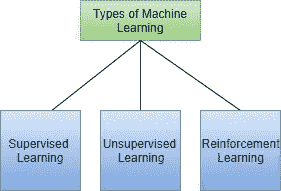
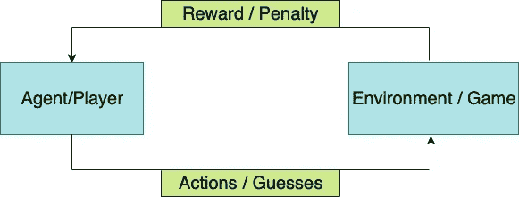
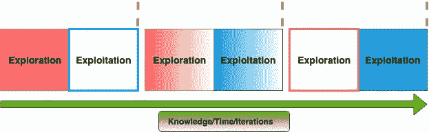
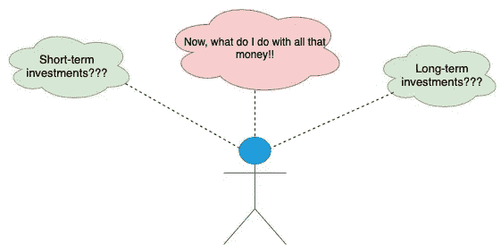

# 外行人强化学习介绍

> 原文：<https://medium.datadriveninvestor.com/reinforcement-learning-introduction-for-a-layman-8e89383cb212?source=collection_archive---------6----------------------->

Photo by [David Straight](https://unsplash.com/@davidstraight?utm_source=medium&utm_medium=referral) on [Unsplash](https://unsplash.com?utm_source=medium&utm_medium=referral)

我们玩个游戏怎么样？一个视频游戏或者只是一个纸牌游戏。这里还有一个命题——我们玩一个游戏，通过游戏学习强化学习(RL)背后的基本思想，怎么样？我将试着用简单的英语来解释 RL 的核心，用例子和单词来代替方程式和数字，更重要的是不用任何与 RL 相关的数学。因此，如果您正在寻找 RL 的一瞥，而不必为方程式绞尽脑汁，这篇文章正适合您。

**到底什么是强化学习？**

让我们先简单介绍一下 RL，以及一些你看到人们谈论 RL 时很可能会听到的重要术语。**强化学习**是机器学习(ML)的一个分支，其中**代理/算法**学习最佳可能的一组**动作**或在**环境中采取的一系列动作**，以便以最大可能的性能和效率完成任务。代理采用试错法&并在环境中采取不同的行动。环境通过**奖励或惩罚**向代理反馈每次尝试&错误的效果如何。这个流程构成了学习过程的基础。

学习还受你在试错过程中愿意探索的程度以及你想要重复成功行动的程度的影响，因为代理人试图积累尽可能多的奖励。这就是**勘探**和**开采**之间的权衡。最后，**折扣系数**定义了你愿意做多少长期规划，以便最终在任务中表现出色，或者你只是关心眼前的结果而不担心长期规划。

 [## DDI 编辑推荐:5 本让你从新手变成专家的机器学习书籍|数据驱动…

### 机器学习行业的蓬勃发展重新引起了人们对人工智能的兴趣

www.datadriveninvestor.com](https://www.datadriveninvestor.com/2019/03/03/editors-pick-5-machine-learning-books/) 

RL 既不属于监督学习，也不属于非监督学习，而是形成了机器学习的一个独立分支。Alpha GO 和其他著名的人工智能(AI)算法在自己的游戏中击败人类冠军的例子，会告诉你 ML 的这个分支在最近的过去变得多么重要，尽管这些概念已经存在了相当一段时间。如果标记的目标值在训练期间可用，则属于监督学习，如果它们根本不可用，则称为无监督学习。在 RL 中，代理在运行中生成自己的数据，因为它试图通过试错法执行动作来学习任务，因此形成了 ML 的一个独立分支。

Branches of Machine Learning

让我们玩一个游戏

现在让我们开始游戏——一个简单的猜谜游戏。告诉我一个城市的名字，我会给你**奖励**或**惩罚**。我不会告诉你游戏规则，除此之外，你需要尽可能多地得分。让我们假设你说巴黎。我给你+1 的奖励。现在你说，新德里，罚分是-1。假设接下来的答案是华盛顿特区、慕尼黑、伦敦、北京和开普敦，奖励/惩罚分别是-1、+1、-1、-1。从目前的结果来看，你会注意到慕尼黑、巴黎和伦敦等城市得到了积极的奖励，而其他城市得到了消极的奖励或惩罚。现在你在回顾到目前为止的结果后制定一个理论或政策。理论可能是，游戏是关于欧洲城市的，当你从欧洲命名一个城市时，你会得到奖励。你继续测试理论，说贝尔格莱德、布拉格、阿姆斯特丹、堪培拉。我给你的对应奖励分别是+0.5，+0.5，+1，-1。这个理论似乎是正确的，你的思路是正确的，因为除了堪培拉，所有其他城市都得到了积极的回报。但是，您会注意到贝尔格莱德和布拉格获得了+0.5 的奖励，低于其他欧洲城市的奖励。在这里，你提出了一个新的理论，这个游戏是关于欧洲城市的，他们更喜欢西欧城市。你可以继续玩这个游戏，直到你不想再玩了，在这个过程中通过改进之前的游戏来制定更好的理论或政策。

**代理、环境&动作**

现在让我们通过将游戏与 RL 相关联来学习 RL 基础知识。就 RL 而言,**代理**将是你——学习游戏或学习执行任务的那个人。**环境**就是我——为你采取的每一个行动(在这种情况下是说出一个城市)提供反馈的人。你的猜测是 RL 术语中的**动作**。

Agent/Player interaction with environment/game through actions and rewards received from environment for the action

**勘探&开采**

一开始，你的答案只是瞎猜，没有任何理论支持。这在 RL 中被称为**探索**，代理最初采取行动只是为了探索和了解环境。在游戏过程中，随着你对游戏规则理解的加深，你开始命名欧洲的城市以获得更多的奖励，从而开发你对游戏的新理解。这在 RL 中被称为**剥削**，你重复成功的行为。在游戏中，最初的理论只是欧洲城市，而不是仅仅利用这些知识，你探索了一点点，得出了西欧城市的新理论。这表明你慢慢过渡到利用新发现的知识来收集更多的分数，但仍然准备做一些偶尔的探索。就 RL 而言，这是勘探和开采之间的权衡。这有助于代理更好地完成任务，因为它可能会遇到一些以前从未见过的新结果，并进一步改进其策略。像 **epsilon greedy** 这样的算法被广泛用于设计这种权衡。

Exploration slowly decreases as exploitation increases when agent gains more knowledge about the environment

**折扣系数**

想象一下这样一个场景，猜对的奖励是+0.2 而不是+1，当你在 15 次中猜对了 12 次时，我给了你更大的奖励+10。现在，你可以选择满足于每一步获得+0.2 的奖励，而不是考虑长远，或者你可以为更高的长期奖励而战，即使这意味着牺牲眼前的奖励。这在 RL 中被称为**贴现因子**，其值在 0 和 1 之间，1 表示绝对关注长期回报，0 表示完全相反，您只关注下一步会发生什么。通常，决定取决于手头的任务。投资爱好者会发现这并不难理解。想象一下，你有一桶钱，必须决定是长期投资还是短期投资。

Discount Factor — Decides how much agent learns with long-term view

最终，你会在游戏中变得更好，这样你就很少失败。从对游戏一无所知开始，仅仅通过与游戏环境的互动，你最终会学会游戏并掌握它。这就像学习骑自行车或游泳，甚至走路，你从错误中学习，并根据你从尝试中获得的积极或消极的强化不断变得更好。这也像是学习玩你最近买的电子游戏。

当你更详细地理解这些概念时，你也许可以尝试让 AI 在 RL 的帮助下玩一个简单的游戏，比如井字游戏。经过几个月的练习，更简单的视频游戏也是很有可能训练出来的，只要你超越这篇文章，学习更多关于 RL 的本质细节，尤其是深度强化学习。如果这篇文章激起了你对 RL 的兴趣，接下来你可以看看马尔可夫决策过程、动态规划和 Q-Learning。

希望这篇文章能帮助你对 RL 世界有所了解。如果你已经读到这里，这意味着我至少有一个理由写更多关于强化学习的东西。